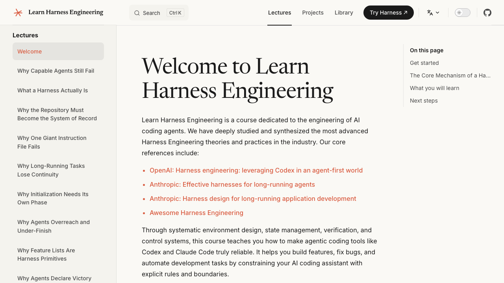
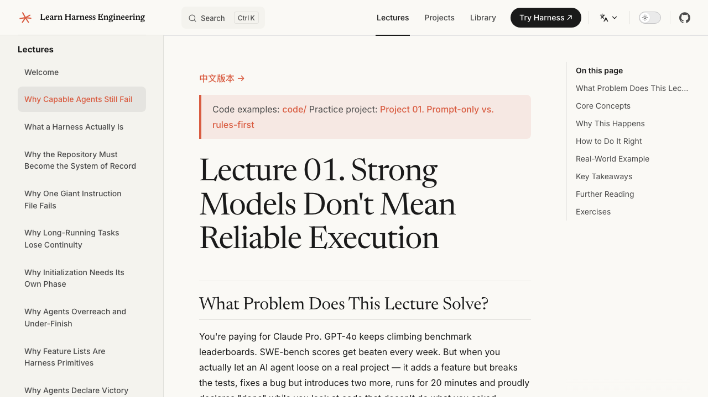
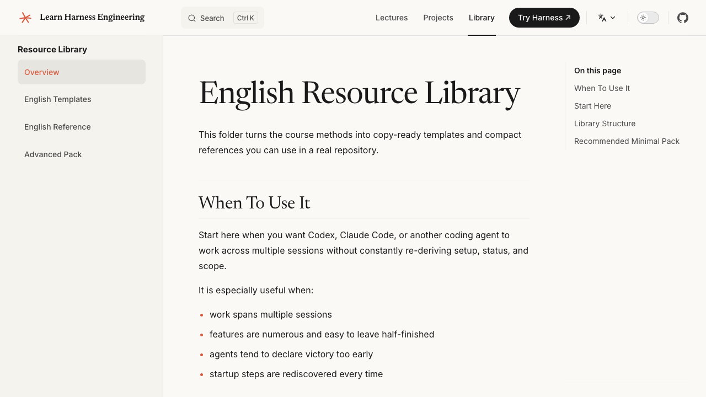

[English](https://walkinglabs.github.io/learn-harness-engineering/en/) · [中文](https://walkinglabs.github.io/learn-harness-engineering/zh/) · [Русский](https://walkinglabs.github.io/learn-harness-engineering/ru/) · [Tiếng Việt](https://walkinglabs.github.io/learn-harness-engineering/vi/) · **한국어**

# Learn Harness Engineering

> **AI 코딩 에이전트(coding agent)가 안정적으로 동작하도록 환경, 상태 관리, 검증(verification), 제어 메커니즘을 구축하는 프로젝트 기반 강의입니다.**

Learn Harness Engineering은 AI 코딩 에이전트 공학에 전념하는 강의입니다. 업계에서 가장 앞선 하네스 엔지니어링(Harness Engineering) 이론과 실천을 깊이 연구하여 종합했습니다. 핵심 참고 자료는 다음과 같습니다.

- [OpenAI: Harness engineering: leveraging Codex in an agent-first world](https://openai.com/index/harness-engineering/)
- [Anthropic: Effective harnesses for long-running agents](https://www.anthropic.com/engineering/effective-harnesses-for-long-running-agents)
- [Anthropic: Harness design for long-running application development](https://www.anthropic.com/engineering/harness-design-long-running-apps)
- [Awesome Harness Engineering](https://github.com/walkinglabs/awesome-harness-engineering)

> **빠르게 시작하려면?** [`skills/harness-creator/`](./skills/) 스킬(skill)을 사용하면 몇 분 만에 프로덕션 수준의 하네스(AGENTS.md, 기능 목록, init.sh, 검증 워크플로우)를 직접 프로젝트에 스캐폴딩(scaffold)할 수 있습니다.

---

## 시각적 미리보기

### 강의 홈페이지
> 핵심 철학을 소개하고 시작 경로를 명확히 제시하는 종합 강의 개요입니다.



### 몰입형 강의
> 실제 문제 상황을 심층적으로 분석하고 실습 프로젝트(예: Project 01)를 통해 몰입 학습 경험을 제공합니다.



### 즉시 사용 가능한 리소스 라이브러리
> 다중 턴 AI 에이전트 개발 시 흔히 발생하는 컨텍스트(context) 손실, 과도한 완료 선언 등의 문제를 해결하기 위해 설계된 템플릿과 참고 설정 모음입니다.



## PDF 강의 교재

저장소에는 강의 콘텐츠를 위한 PDF 빌드 파이프라인이 포함되어 있습니다.

- `npm run pdf:build` 명령으로 영어·중국어 PDF를 로컬에서 생성할 수 있습니다.
- 출력 파일은 `artifacts/pdfs/`에 저장됩니다.
- README 미리보기 이미지를 갱신하려면 `npm run screenshots:readme`를 실행하십시오.
- GitHub Actions 워크플로우 [`release-course-pdfs.yml`](./.github/workflows/release-course-pdfs.yml)을 통해 PDF를 빌드하고 GitHub Releases에 게시할 수 있습니다.

---

## 모델은 스마트하고, 하네스가 안정성을 만든다

대부분의 사람들이 직접 경험한 뒤에야 깨닫는 냉혹한 진실이 있습니다. **세상에서 가장 강력한 모델도 적절한 환경 없이는 실제 엔지니어링 작업에서 실패합니다.**

아마 직접 겪어보셨을 것입니다. Claude나 GPT에게 저장소(repository)에서 작업을 맡깁니다. 처음에는 잘 진행됩니다 — 파일을 읽고, 코드를 작성하고, 생산적으로 보입니다. 그러다 뭔가 잘못됩니다. 단계를 건너뜁니다. 테스트를 망칩니다. "완료"라고 하지만 실제로는 아무것도 동작하지 않습니다. 직접 했더라면 더 빨랐을 시간을 수습에 써버립니다.

이것은 모델 문제가 아닙니다. 하네스 문제입니다.

증거는 명확합니다. Anthropic이 통제된 실험을 수행했습니다. 동일한 모델(Opus 4.5), 동일한 프롬프트("2D 레트로 게임 에디터 만들기"). 하네스 없이는 20분 동안 $9를 사용했으나 동작하지 않는 결과물이 나왔습니다. 완전한 하네스(플래너 + 생성기 + 평가기)를 사용했을 때는 6시간 동안 $200을 사용해 실제로 플레이할 수 있는 게임을 만들었습니다. 모델은 바뀌지 않았습니다. 하네스가 바뀌었습니다.

OpenAI도 Codex로 동일한 사실을 보고했습니다. 잘 갖추어진 저장소에서는 동일한 모델이 "불안정"에서 "안정적"으로 전환됩니다. 미미한 개선이 아니라 질적 변화입니다.

**이 강의는 그 환경을 구축하는 방법을 가르칩니다.**

```text
                    THE HARNESS PATTERN
                    ====================

    You --> give task --> Agent reads harness files --> Agent executes
                                                        |
                                              harness governs every step:
                                              |
                                              +--> Instructions: what to do, in what order
                                              +--> Scope:       one feature at a time, no overreach
                                              +--> State:       progress log, feature list, git history
                                              +--> Verification: tests, lint, type-check, smoke runs
                                              +--> Lifecycle:   init at start, clean state at end
                                              |
                                              v
                                         Agent stops only when
                                         verification passes
```

---

## 하네스 엔지니어링이란 실제로 무엇인가

하네스 엔지니어링(Harness Engineering)은 모델이 안정적인 결과를 낼 수 있도록 모델 주변에 완전한 작업 환경을 구축하는 것입니다. 더 나은 프롬프트를 작성하는 것이 아닙니다. 모델이 운영되는 시스템을 설계하는 것입니다.

하네스에는 다섯 가지 하위 시스템이 있습니다.

```text
    ┌─────────────────────────────────────────────────────────────────┐
    │                        THE HARNESS                              │
    │                                                                 │
    │   ┌──────────────┐  ┌──────────────┐  ┌──────────────────────┐ │
    │   │ Instructions  │  │    State     │  │   Verification       │ │
    │   │              │  │              │  │                      │ │
    │   │ AGENTS.md    │  │ progress.md  │  │ tests + lint         │ │
    │   │ CLAUDE.md    │  │ feature_list │  │ type-check           │ │
    │   │ feature_list │  │ git log      │  │ smoke runs           │ │
    │   │ docs/        │  │ session hand │  │ e2e pipeline         │ │
    │   └──────────────┘  └──────────────┘  └──────────────────────┘ │
    │                                                                 │
    │   ┌──────────────┐  ┌──────────────────────────────────────┐   │
    │   │    Scope     │  │         Session Lifecycle             │   │
    │   │              │  │                                      │   │
    │   │ one feature  │  │ init.sh at start                     │   │
    │   │ at a time   │  │ clean-state checklist at end          │   │
    │   │ definition   │  │ handoff note for next session        │   │
    │   │ of done      │  │ commit only when safe to resume      │   │
    │   └──────────────┘  └──────────────────────────────────────┘   │
    │                                                                 │
    └─────────────────────────────────────────────────────────────────┘

    The MODEL decides what code to write.
    The HARNESS governs when, where, and how it writes it.
    The harness doesn't make the model smarter.
    It makes the model's output reliable.
```

각 하위 시스템에는 하나의 역할이 있습니다.

- **지시사항(Instructions)** — 에이전트에게 무엇을 어떤 순서로 할지, 시작 전에 무엇을 읽어야 하는지 알려줍니다. 하나의 거대한 파일이 아니라, 에이전트가 필요할 때 탐색하는 점진적 공개(progressive disclosure) 구조입니다.
- **상태(State)** — 완료된 것, 진행 중인 것, 다음 작업을 추적합니다. 디스크에 영속화(persist)되어 다음 세션이 이전 세션이 끝난 정확한 위치에서 이어받을 수 있습니다.
- **검증(Verification)** — 통과하는 테스트 스위트만이 증거로 인정됩니다. 에이전트는 실행 가능한 증거 없이는 완료를 선언할 수 없습니다.
- **범위(Scope)** — 에이전트를 한 번에 하나의 기능으로 제한합니다. 범위 초과(overreach) 없음. 세 가지를 반쯤 완성하는 일 없음. 미완성 작업을 숨기기 위해 기능 목록을 재작성하는 일 없음.
- **세션 라이프사이클(Session Lifecycle)** — 시작 시 초기화합니다. 종료 시 정리합니다. 다음 세션을 위한 깨끗한 재시작 경로를 남깁니다.

---

## 이 강의가 존재하는 이유

질문은 "모델이 코드를 작성할 수 있는가?"가 아닙니다. 모델은 쓸 수 있습니다. 질문은 이것입니다. **모델이 실제 저장소에서 여러 세션에 걸쳐 지속적인 인간 감독 없이 실제 엔지니어링 작업을 안정적으로 완수할 수 있는가?**

현재 답은 이렇습니다. 하네스 없이는 그렇지 않습니다.

```text
    WITHOUT HARNESS                          WITH HARNESS
    ==============                          ============

    Session 1: agent writes code            Session 1: agent reads instructions
              agent breaks tests                      agent runs init.sh
              agent says "done"                       agent works on one feature
              you fix it manually                     agent verifies before claiming done
                                                       agent updates progress log
    Session 2: agent starts fresh                    agent commits clean state
              agent has no memory
              of what happened before         Session 2: agent reads progress log
              agent re-does work                       agent picks up exactly where it left off
              or does something else entirely          agent continues the unfinished feature
              you fix it again                         you review, not rescue

    Result: you spend more time                  Result: agent does the work,
            cleaning up than if you                      you verify the result
            did it yourself
```

이 강의가 실제로 다루는 질문들:

- 어떤 하네스 설계가 작업 완료율을 개선하는가?
- 어떤 설계가 재작업과 잘못된 완료를 줄이는가?
- 어떤 메커니즘이 장시간 작업을 꾸준히 진행시키는가?
- 어떤 구조가 여러 번의 에이전트 실행 후에도 시스템을 유지 관리 가능하게 유지하는가?

---

## 강의 커리큘럼 및 문서

전체 강의 자료는 **[문서 웹사이트](https://walkinglabs.github.io/learn-harness-engineering/)**에서 확인하십시오.

커리큘럼은 세 부분으로 나뉩니다.

1. **강의(Lectures)**: 하네스 엔지니어링의 이론을 설명하는 12개 개념 단원.
2. **프로젝트(Projects)**: 처음부터 에이전트 워크스페이스를 구축하는 6개 실습 프로젝트.
3. **리소스 라이브러리(Resource Library)**: 지금 바로 자신의 저장소에서 사용할 수 있는 복사 준비 완료 템플릿(`AGENTS.md`, `feature_list.json`, `init.sh` 등).

---

## 빠른 시작: 지금 당장 에이전트를 개선하기

가치를 얻기 위해 12개 강의를 모두 읽을 필요는 없습니다. 이미 실제 프로젝트에서 코딩 에이전트를 사용하고 있다면, 지금 바로 개선하는 방법이 있습니다.

아이디어는 간단합니다. 프롬프트만 작성하는 대신, 에이전트에게 무엇을 해야 하는지, 무엇이 완료되었는지, 작업을 어떻게 검증하는지를 정의하는 구조화된 파일 집합을 제공하십시오. 이 파일들은 저장소 내부에 위치하므로 모든 세션이 동일한 상태에서 시작합니다.

```text
    YOUR PROJECT ROOT
    ├── AGENTS.md              <-- the agent's operating manual
    ├── CLAUDE.md              <-- (alternative, if using Claude Code)
    ├── init.sh                <-- runs install + verify + start
    ├── feature_list.json      <-- what features exist, which are done
    ├── claude-progress.md     <-- what happened each session
    └── src/                   <-- your actual code
```

[리소스 라이브러리](https://walkinglabs.github.io/learn-harness-engineering/en/resources/)에서 시작 템플릿을 가져와 프로젝트에 추가하십시오. 네 개의 파일만으로도 에이전트 세션이 프롬프트만으로 실행하는 것보다 훨씬 안정적이 될 것입니다.

---

## 캡스톤 프로젝트: 실제 앱

6개의 강의 프로젝트는 모두 동일한 제품을 중심으로 전개됩니다. **Electron 기반 개인 지식 베이스(knowledge base) 데스크탑 앱**입니다.

```text
    ┌─────────────────────────────────────────────────────┐
    │               Knowledge Base Desktop App            │
    │                                                     │
    │  ┌──────────────┐  ┌──────────────────────────────┐│
    │  │ Document List │  │       Q&A Panel              ││
    │  │              │  │                              ││
    │  │ doc-001.md   │  │  Q: What is harness eng?    ││
    │  │ doc-002.md   │  │  A: The environment built    ││
    │  │ doc-003.md   │  │     around an agent model... ││
    │  │ ...          │  │     [citation: doc-002.md]   ││
    │  └──────────────┘  └──────────────────────────────┘│
    │                                                     │
    │  ┌─────────────────────────────────────────────────┐│
    │  │ Status Bar: 42 docs | 38 indexed | last sync 3m ││
    │  └─────────────────────────────────────────────────┘│
    └─────────────────────────────────────────────────────┘

    Core features:
    ├── Import local documents
    ├── Manage a document library
    ├── Process and index documents
    ├── Run AI-powered Q&A over imported content
    └── Return grounded answers with citations
```

이 프로젝트는 강력한 실용적 가치, 충분한 실제 제품 복잡성, 그리고 하네스 개선 전후를 관찰하기에 적합한 환경을 갖추고 있어 선택되었습니다.

각 강의 프로젝트의 시작점/풀이는 해당 진화 단계의 이 Electron 앱의 완전한 복사본입니다. P(N+1)의 시작점은 P(N)의 풀이에서 파생됩니다 — 앱은 하네스 기술이 성장함에 따라 함께 진화합니다.

---

## 학습 경로

강의는 순서대로 진행하도록 설계되었습니다. 각 단계는 이전 단계 위에 구축됩니다.

```text
    Phase 1: SEE THE PROBLEM              Phase 2: STRUCTURE THE REPO
    ========================              ==========================

    L01  Strong models != reliable         L03  Repository as single
         execution                              source of truth
    L02  What harness actually means
                                       L04  Split instructions across
         |                                   files, not one giant file
         v
    P01  Prompt-only vs.                       |
         rules-first comparison                v
                                               P02  Agent-readable workspace


    Phase 3: CONNECT SESSIONS             Phase 4: FEEDBACK & SCOPE
    ==========================           =========================

    L05  Keep context alive               L07  Draw clear task boundaries
         across sessions
                                       L08  Feature lists as harness
    L06  Initialize before every               primitives
         agent session
                                               |
         |                                     v
         v                                     P04  Runtime feedback to
    P03  Multi-session continuity                   correct agent behavior


    Phase 5: VERIFICATION                 Phase 6: PUT IT ALL TOGETHER
    =====================                 ============================

    L09  Stop agents from                 L11  Make agent's runtime
         declaring victory early               observable

    L10  Full-pipeline run =              L12  Clean handoff at end of
         real verification                      every session

         |                                     |
         v                                     v
    P05  Agent verifies its own work       P06  Build a complete harness
                                               (capstone project)
```

파트타임으로 진행한다면 각 단계는 약 1주일이 걸립니다. 더 빠르게 진행하려면 1–3단계를 긴 주말 동안 완료할 수 있습니다.

---

## 실라버스

### 강의 — 12개 개념 단원, 각각 하나의 핵심 질문에 답변

*각 강의의 전체 텍스트는 [문서 웹사이트](https://walkinglabs.github.io/learn-harness-engineering/)에서 읽을 수 있습니다.*

| 세션 | 질문 | 핵심 아이디어 |
|------|------|--------------|
| [L01](./docs/lectures/lecture-01-why-capable-agents-still-fail/index.md) | 강력한 모델이 실제 작업에서 왜 여전히 실패하는가? | 벤치마크와 실제 엔지니어링 사이의 역량 격차 |
| [L02](./docs/lectures/lecture-02-what-a-harness-actually-is/index.md) | "하네스"는 실제로 무엇을 의미하는가? | 다섯 가지 하위 시스템: 지시사항, 상태, 검증, 범위, 라이프사이클 |
| [L03](./docs/lectures/lecture-03-why-the-repository-must-become-the-system-of-record/index.md) | 왜 저장소가 단일 진실 원천(Single Source of Truth)이어야 하는가? | 에이전트가 볼 수 없으면 존재하지 않는다 |
| [L04](./docs/lectures/lecture-04-why-one-giant-instruction-file-fails/index.md) | 하나의 거대한 지시 파일이 왜 실패하는가? | 점진적 공개: 백과사전이 아닌 지도를 제공하라 |
| [L05](./docs/lectures/lecture-05-why-long-running-tasks-lose-continuity/index.md) | 장시간 작업이 왜 연속성(continuity)을 잃는가? | 진행 상황을 디스크에 영속화하고, 중단된 곳에서 재개하라 |
| [L06](./docs/lectures/lecture-06-why-initialization-needs-its-own-phase/index.md) | 초기화가 왜 자체 단계가 필요한가? | 에이전트가 작업을 시작하기 전에 환경이 정상임을 검증하라 |
| [L07](./docs/lectures/lecture-07-why-agents-overreach-and-under-finish/index.md) | 에이전트가 왜 범위를 초과하고 미완성으로 끝나는가? | 한 번에 하나의 기능; 완료의 명시적 정의 |
| [L08](./docs/lectures/lecture-08-why-feature-lists-are-harness-primitives/index.md) | 기능 목록이 왜 하네스의 기본 구성 요소인가? | 에이전트가 무시할 수 없는 기계 가독형 범위 경계 |
| [L09](./docs/lectures/lecture-09-why-agents-declare-victory-too-early/index.md) | 에이전트가 왜 너무 일찍 완료를 선언하는가? | 검증 격차: 신뢰감 ≠ 정확성 |
| [L10](./docs/lectures/lecture-10-why-end-to-end-testing-changes-results/index.md) | 엔드-투-엔드 테스트가 왜 결과를 바꾸는가? | 전체 파이프라인 실행만이 실제 검증으로 인정된다 |
| [L11](./docs/lectures/lecture-11-why-observability-belongs-inside-the-harness/index.md) | 가관측성(observability)이 왜 하네스 내부에 있어야 하는가? | 에이전트가 무엇을 했는지 볼 수 없으면 무엇이 잘못되었는지 고칠 수 없다 |
| [L12](./docs/lectures/lecture-12-why-every-session-must-leave-a-clean-state/index.md) | 왜 모든 세션이 깨끗한 상태를 남겨야 하는가? | 다음 세션의 성공은 이 세션의 정리에 달려 있다 |

### 프로젝트 — 동일한 Electron 앱에 강의 방법을 적용하는 6개 실습 프로젝트

| 프로젝트 | 수행 내용 | 하네스 메커니즘 |
|---------|----------|----------------|
| [P01](./docs/projects/project-01-baseline-vs-minimal-harness/index.md) | 동일한 작업을 두 번 실행: 프롬프트만 사용 vs. 규칙 우선 | 최소 하네스: AGENTS.md + init.sh + feature_list.json |
| [P02](./docs/projects/project-02-agent-readable-workspace/index.md) | 에이전트가 읽을 수 있도록 저장소 재구성 | 에이전트 가독형 워크스페이스 + 영속 상태 파일 |
| [P03](./docs/projects/project-03-multi-session-continuity/index.md) | 에이전트가 중단된 곳에서 이어받도록 만들기 | 진행 로그 + 세션 핸드오프(handoff) + 다중 세션 연속성 |
| [P04](./docs/projects/project-04-incremental-indexing/index.md) | 에이전트가 너무 많거나 너무 적게 하지 않도록 막기 | 런타임 피드백 + 범위 제어 + 점진적 인덱싱 |
| [P05](./docs/projects/project-05-grounded-qa-verification/index.md) | 에이전트가 자신의 작업을 검증하도록 만들기 | 자기 검증 + 근거 기반 Q&A + 증거 기반 완료 |
| [P06](./docs/projects/project-06-runtime-observability-and-debugging/index.md) | 처음부터 완전한 하네스 구축 (캡스톤 프로젝트) | 완전한 하네스: 모든 메커니즘 + 가관측성 + 절제 연구 |

```text
    PROJECT EVOLUTION
    =================

    P01  Prompt-only vs. rules-first       You see the problem
     |
     v
    P02  Agent-readable workspace           You restructure the repo
     |
     v
    P03  Multi-session continuity           You connect sessions
     |
     v
    P04  Runtime feedback & scope           You add feedback loops
     |
     v
    P05  Self-verification                  You make the agent check itself
     |
     v
    P06  Complete harness (capstone)        You build the full system

    Each project's solution becomes the next project's starter.
    The app evolves. Your harness skills grow with it.
```

### 리소스 라이브러리

- [한국어 리소스 라이브러리](https://walkinglabs.github.io/learn-harness-engineering/ko/resources/) — 템플릿, 체크리스트, 방법 참고 자료
- [English Resource Library](https://walkinglabs.github.io/learn-harness-engineering/en/resources/) — templates, checklists, and method references
- [Chinese Resource Library](https://walkinglabs.github.io/learn-harness-engineering/zh/resources/) — 中文模板、清单和方法参考
- [Russian Resource Library](https://walkinglabs.github.io/learn-harness-engineering/ru/resources/) — шаблоны, чек-листы и справочники
- [Vietnamese Resource Library](https://walkinglabs.github.io/learn-harness-engineering/vi/resources/) — mẫu, danh sách kiểm tra và tài liệu tham khảo

---

## 에이전트 세션 라이프사이클

이 강의의 핵심 아이디어 중 하나: **에이전트 세션은 자유로운 흐름이 아니라 구조화된 라이프사이클을 따라야 합니다.** 다음은 그 모습입니다.

```text
    AGENT SESSION LIFECYCLE
    ======================

    ┌──────────────────────────────────────────────────────────────────┐
    │  START                                                          │
    │                                                                  │
    │  1. Agent reads AGENTS.md / CLAUDE.md                           │
    │  2. Agent runs init.sh (install, verify, health check)          │
    │  3. Agent reads claude-progress.md (what happened last time)    │
    │  4. Agent reads feature_list.json (what's done, what's next)    │
    │  5. Agent checks git log (recent changes)                       │
    │                                                                  │
    │  SELECT                                                          │
    │                                                                  │
    │  6. Agent picks exactly ONE unfinished feature                   │
    │  7. Agent works only on that feature                             │
    │                                                                  │
    │  EXECUTE                                                         │
    │                                                                  │
    │  8. Agent implements the feature                                 │
    │  9. Agent runs verification (tests, lint, type-check)           │
    │  10. If verification fails: fix and re-run                      │
    │  11. If verification passes: record evidence                    │
    │                                                                  │
    │  WRAP UP                                                         │
    │                                                                  │
    │  12. Agent updates claude-progress.md                           │
    │  13. Agent updates feature_list.json                            │
    │  14. Agent records what's still broken or unverified            │
    │  15. Agent commits (only when safe to resume)                   │
    │  16. Agent leaves clean restart path for next session           │
    │                                                                  │
    └──────────────────────────────────────────────────────────────────┘

    The harness governs every transition in this lifecycle.
    The model decides what code to write at each step.
    Without the harness, step 9 becomes "agent says it looks fine."
    With the harness, step 9 is "tests pass, lint is clean, types check."
```

---

## 대상 독자

이 강의는 다음 분들을 위한 것입니다.

- 더 나은 안정성과 품질을 원하는 코딩 에이전트 사용자
- 하네스 설계에 대한 체계적인 이해를 원하는 연구자 또는 빌더
- 환경 설계가 에이전트 성능에 미치는 영향을 이해해야 하는 기술 리드

이 강의는 다음 분들을 위한 것이 아닙니다.

- 코드 없는 AI 입문을 찾는 분
- 프롬프트에만 관심이 있고 실제 구현을 구축할 계획이 없는 분
- 에이전트가 실제 저장소에서 작업하도록 허용할 준비가 되어 있지 않은 학습자

---

## 요구 사항

이 강의는 실제로 코딩 에이전트를 실행하는 강의입니다.

다음 도구 중 최소 하나가 필요합니다.

- Claude Code
- Codex
- 파일 편집, 명령 실행, 다단계 작업을 지원하는 다른 IDE 또는 CLI 코딩 에이전트

강의는 다음이 가능하다고 가정합니다.

- 로컬 저장소 열기
- 에이전트가 파일을 편집하도록 허용
- 에이전트가 명령을 실행하도록 허용
- 출력을 검사하고 작업 재실행

그러한 도구가 없어도 강의 콘텐츠를 읽을 수 있지만 의도한 대로 프로젝트를 완료할 수는 없습니다.

---

## 로컬 미리보기

이 저장소는 VitePress를 문서 뷰어로 사용합니다.

```sh
npm install
npm run docs:dev        # 핫 리로드가 있는 개발 서버
npm run docs:build      # 프로덕션 빌드
npm run docs:preview    # 빌드된 사이트 미리보기
```

VitePress가 출력하는 로컬 URL을 브라우저에서 여십시오.

---

## 사전 요건

필수:

- 터미널, git, 로컬 개발 환경에 대한 친숙함
- 일반적인 애플리케이션 스택에서 코드를 읽고 쓸 수 있는 능력
- 기본적인 소프트웨어 디버깅 경험 (로그, 테스트, 런타임 동작 읽기)
- 구현 중심 강의에 전념할 충분한 시간

도움이 되지만 필수는 아님:

- Electron, 데스크탑 앱, 또는 로컬 우선 도구 경험
- 테스트, 로깅, 또는 소프트웨어 아키텍처 배경
- Codex, Claude Code, 또는 유사한 코딩 에이전트에 대한 사전 노출

---

## 핵심 참고 자료

주요:

- [OpenAI: Harness engineering: leveraging Codex in an agent-first world](https://openai.com/index/harness-engineering/)
- [Anthropic: Effective harnesses for long-running agents](https://www.anthropic.com/engineering/effective-harnesses-for-long-running-agents)
- [Anthropic: Harness design for long-running application development](https://www.anthropic.com/engineering/harness-design-long-running-apps)

보충:

- [LangChain: The Anatomy of an Agent Harness](https://blog.langchain.com/the-anatomy-of-an-agent-harness/)
- [Thoughtworks: Harness Engineering](https://martinfowler.com/articles/exploring-gen-ai/harness-engineering.html)
- [HumanLayer: Skill Issue: Harness Engineering for Coding Agents](https://www.humanlayer.dev/blog/skill-issue-harness-engineering-for-coding-agents)

---

## 저장소 구조

```text
learn-harness-engineering/
├── docs/                          # VitePress 문서 사이트
│   ├── lectures/                  # 12개 강의 (index.md + code/ 예제)
│   │   ├── lecture-01-*/
│   │   ├── lecture-02-*/
│   │   └── ... (총 12개)
│   ├── projects/                  # 6개 프로젝트 설명
│   │   ├── project-01-*/
│   │   └── ... (총 6개)
│   └── resources/                 # 다국어 템플릿 및 참고 자료
│       ├── en/                    # 영어 템플릿, 체크리스트, 가이드
│       ├── zh/                    # 중국어 템플릿, 체크리스트, 가이드
│       ├── ru/                    # 러시아어 템플릿, 체크리스트, 가이드
│       └── vi/                    # 베트남어 템플릿, 체크리스트, 가이드
├── projects/
│   ├── shared/                    # 공유 Electron + TypeScript + React 기반
│   └── project-NN/               # 프로젝트별 starter/ 및 solution/ 디렉터리
├── skills/                        # 재사용 가능한 AI 에이전트 스킬
│   └── harness-creator/           # 하네스 엔지니어링 스킬
├── package.json                   # VitePress + 개발 도구
└── CLAUDE.md                      # 이 저장소에 대한 Claude Code 지시사항
```

---

## 강의 구성 방식

- 각 강의는 하나의 질문에 집중합니다
- 강의는 6개의 프로젝트를 포함합니다
- 모든 프로젝트는 에이전트가 실제 작업을 수행하도록 요구합니다
- 모든 프로젝트는 약한 하네스 대 강한 하네스 결과를 비교합니다
- 중요한 것은 작성된 문서의 양이 아니라 측정된 차이입니다

---

## 감사의 말

이 강의는 [learn-claude-code](https://github.com/shareAI-lab/learn-claude-code)에서 영감을 받았으며, 아이디어를 차용했습니다. 이 프로젝트는 단일 루프에서 격리된 자율 실행까지 처음부터 에이전트를 구축하기 위한 점진적 가이드입니다.
