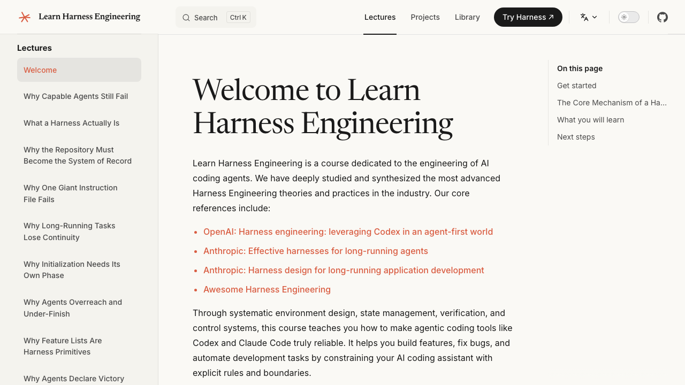
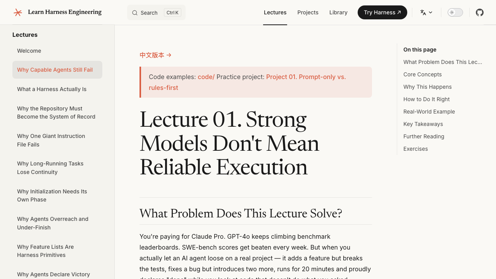
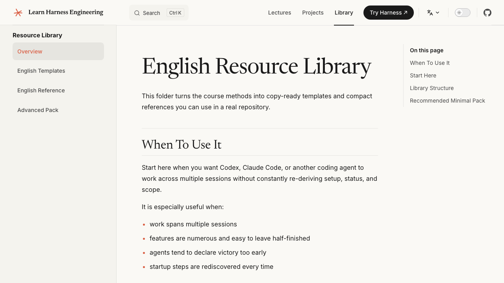

<p align="center">
  <a href="../../README.md"></a>
  <a href="../zh-CN/README.md"></a>
  <a href="../zh-TW/README.md"></a>
  <a href="../ja-JP/README.md"></a>
  <a href="../ko-KR/README.md"></a>
  <a href="../es-ES/README.md"></a>
  <a href="../fr-FR/README.md"></a>
  <a href="../ru-RU/README.md"></a>
  <a href="../de-DE/README.md"></a>
  <a href="../ar-SA/README.md"></a>
  <a href="../vi-VN/README.md"></a>
  <a href="../uz-UZ/README.md"></a>
  <a href="../tr-TR/README.md"></a>
  <a href="../pt-BR/README.md"></a>
  <a href="../uk-UA/README.md"></a>
</p>

# Learn Harness Engineering

> **Yapay zeka kod yazma ajanlarının güvenilir biçimde çalışmasını sağlayan ortamı, durum yönetimini, doğrulamayı ve kontrol mekanizmalarını kurmaya odaklanan, proje tabanlı bir kurs.**

Learn Harness Engineering, yapay zeka kod yazma ajanlarının mühendisliğine adanmış bir kurstur. Sektördeki en gelişmiş Harness Engineering teorilerini ve uygulamalarını derinlemesine inceleyip sentezledik. Temel referanslarımız:

> **🆕 2026 Ağustos Güncellemesi: Öncü Harness Tasarımı İncelemeleri** — 4 inceleme içeren yeni bölüm:
>
> - **Yeni bölüm** [Öncü Harness Tasarımı İncelemeleri](../../docs/tr/harness-designs/index.md) — Dört öncü ürünün gerçek harness'ları nasıl oluşturduğunu tersine mühendislikle çözümlemek için kursun beş alt sistemli çerçevesini (talimatlar, araçlar, ortam, durum, geri bildirim) uygulayın.
> - **Pi** [Pi harness'ını nasıl oluşturuyor](../../docs/tr/harness-designs/pi/index.md) — minimal bir çekirdek, programlanabilir genişleme ve “Pi'den istediğinizi oluşturmasını isteyin” yaklaşımının arkasındaki bağlam mühendisliği.
> - **Claude Code** [Claude Code harness'ını nasıl oluşturuyor](../../docs/tr/harness-designs/claude-code/index.md) — dört katmanlı bellek, beş seviyeli sıkıştırma, hook'lar ve alt ajan izolasyonu.
> - **Codex** [Codex harness'ını nasıl oluşturuyor](../../docs/tr/harness-designs/codex/index.md) — tek doğruluk kaynağı olarak kod deposu, bir dizin sayfası olarak AGENTS.md ve worktree izolasyonu.
> - **DeepSeek** [DeepSeek harness'ını nasıl oluşturuyor](../../docs/tr/harness-designs/deepseek/index.md) — “her şey bir eklentidir”, yetenek sınırları ve bir olay işlem hattı.
> - **15 dilin tamamı** — desteklenen tüm dillerde eksiksiz çeviri kapsamı.
>
> **Ana fikir:** Kurs size bir çerçeve sunar; bu incelemeler, aynı ilkelerin üretimdeki harness'larda gerçekte nasıl uygulandığını gösterir.
>
> **🆕 2026 Ağustos Güncellemesi: Graph Engineering (Graf Mühendisliği)** — 1 ders + 1 proje eklendi:
>
> - **Ders 14** [Tek Döngülerden Graf Mühendisliğine](../../docs/tr/lectures/lecture-14-graph-engineering/index.md): tek bir loop'un neden kaçınılmaz olarak bir grafa dönüştüğü — dört katmanlı yığın (prompt → context → loop → graph) ve harness'ın buradaki yeri, graf'ın dört parçası (düğümler, kenarlar, paylaşılan durum, yönlendirme), ayrıca loop içindeki kontrol noktalarının ölçekteki üç yapısal başarısızlığı (Goodhart, yukarıya körlük, çatışma) neden kurtaramadığı, framework'ten bağımsız ilk graf'ınızı kurmanın altı adımı, Graph ile Workflow arasındaki fark, çapalar, isimden önce ve sonra açık kaynak proje durumu, orkestrasyon vergisi ve ne zaman gerçekten graf çizmeye değer olduğu.
> - **Proje 08** [İş Akışınızı Bir Graf Olarak Çizin](../../docs/tr/projects/project-08-graph-engineering-first-graph/index.md): üç aşamalı deney — maker-checker loop'unu açık bir graf olarak çizmek, paralel fan-out/fan-in düğümü eklemek, koşullu geri alma kenarı ve insan onayı düğümü eklemek.
>
> **Ana fikir:** Loop, tek düğümlü bir graftır. Bir görev iş bölümü, paralellik, paylaşılan durum, doğrulama ve kurtarma gerektirdiğinde — artık bir loop değil, bir graftır.
>
> **🆕 2026 Temmuz Güncellemesi: Loop Engineering (Loop Mühendisliği)** — 1 ders + 1 proje + kod şablonları eklendi:
>
> - **Ders 13** [Ajanınızı prompt etmeyi neden bırakmanız gerekir](../../docs/tr/lectures/lecture-13-loop-engineering/index.md): `/goal`'dan loop mühendisliğinin altı ilkesine (automations, worktrees, skills, connectors, sub-agents, external state), üretici/değerlendirici ayrımı, dört sessiz maliyet ve ilk loop'unuzu adım adım kurma.
> - **Proje 07** [İlk Otomatik Loop'unuzu Oluşturun](../../docs/tr/projects/project-07-loop-engineering-first-loop/index.md): üç aşamalı deney — hedef loop'u, zamanlanmış loop, maker-checker loop. Manuel vs. otomatik karşılaştırması, müdahale azalmasını ölçme, loop'un dışına çıkmayı öğrenme.
> - **Kod şablonları**: `goal-template.md`, `loop-state-template.md`, `maker-prompt.md`, `checker-prompt.md` — tak-çalıştır loop oluşturma şablonları.
>
> **Ana fikir:** Harness mühendisliği arabayı inşa eder. Loop mühendisliği, o arabaya gideceği yolu tasarlar — ve siz o yolu aracın dışından tasarlarsınız.

- [OpenAI: Harness engineering: leveraging Codex in an agent-first world](https://openai.com/index/harness-engineering/)
- [Anthropic: Effective harnesses for long-running agents](https://www.anthropic.com/engineering/effective-harnesses-for-long-running-agents)
- [Anthropic: Harness design for long-running application development](https://www.anthropic.com/engineering/harness-design-long-running-apps)
- [Awesome Harness Engineering](https://github.com/walkinglabs/awesome-harness-engineering)

> **Hızlı başlangıç mı?** [`skills/harness-creator/`](../../skills/harness-creator/) skill'i, kendi projeniz için üretim kalitesinde bir harness (AGENTS.md, özellik listeleri, init.sh, doğrulama iş akışları) iskeletini dakikalar içinde oluşturmanıza yardımcı olabilir.

---

## İçindekiler

- [Görsel önizleme](#görsel-önizleme)
- [Harness engineering aslında ne demek](#harness-engineering-aslında-ne-demek)
- [Hızlı başlangıç: Ajanınızı bugün geliştirin](#hızlı-başlangıç-ajanınızı-bugün-geliştirin)
- [Bitirme projesi: Gerçek bir uygulama](#bitirme-projesi-gerçek-bir-uygulama)
- [Öğrenme yolu](#öğrenme-yolu)
- [Müfredat](#müfredat)
- [Skills](#skills)
- [Diğer kurslar](#diğer-kurslar)

---

## Görsel önizleme

### Kurs ana sayfası
> Başlamak için net bir yol sunan kapsamlı bir kurs özeti ve temel felsefelere giriş.



### Sürükleyici dersler
> Sürükleyici bir öğrenme deneyimi için gerçek dünya sorunlarına ve uygulamalı projelere (Proje 01 gibi) derinlemesine inişler.



### Kullanıma hazır Kaynak Kütüphanesi
> Çok adımlı yapay zeka ajanı geliştirmedeki bağlam kaybı ve görevin erken tamamlandığının ilan edilmesi gibi yaygın tuzakları çözmek için tasarlanmış şablonlar ve referans yapılandırmalar.



## PDF Ders Kitapları

Depo artık kurs içeriği için bir PDF üretim hattı içermektedir.

- Şu anda yapılandırılmış PDF ders kitaplarını yerel olarak oluşturmak için `npm run pdf:build` komutunu çalıştırın.
- Çıktı dosyaları `artifacts/pdfs/` dizinine yazılır.
- README önizleme görsellerini yenilemek istiyorsanız `npm run screenshots:readme` komutunu çalıştırın.
- [`release-course-pdfs.yml`](../../.github/workflows/release-course-pdfs.yml) GitHub Actions iş akışı PDF'leri oluşturup GitHub Releases'a yayınlayabilir.

---

## Model akıllıdır, harness onu güvenilir kılar

Çoğu insanın zor yoldan öğrendiği acı bir gerçek var: **Dünyanın en güçlü modeli bile, etrafına uygun bir ortam kurmazsanız gerçek mühendislik görevlerinde başarısız olacaktır.**

Muhtemelen bunu kendiniz de yaşamışsınızdır. Claude veya GPT'ye deponuzda bir görev verirsiniz. İyi başlar — dosyaları okur, kod yazar, üretken görünür. Sonra bir şeyler ters gider. Bir adımı atlar. Bir testi bozar. "Tamamlandı" der ama hiçbir şey gerçekten çalışmaz. Kendiniz yapsanız harcayacağınızdan daha fazla zamanı temizlik yaparak harcarsınız.

Bu bir model sorunu değildir. Bir harness sorunudur.

Kanıtlar açık. Anthropic kontrollü bir deney yürüttü: aynı model (Opus 4.5), aynı prompt ("bir 2D retro oyun editörü oluştur"). Harness olmadan 20 dakikada 9 $ harcadı ve çalışmayan bir şey üretti. Tam bir harness ile (planlayıcı + üretici + değerlendirici) 6 saatte 200 $ harcadı ve gerçekten oynayabileceğiniz bir oyun yaptı. Model değişmedi. Harness değişti.

OpenAI Codex ile aynı şeyi bildirdi: iyi harness'lanmış bir depoda aynı model "güvenilmez"den "güvenilir"e geçer. Marjinal bir iyileşme değil — niteliksel bir sıçrama.

**Bu kurs size o ortamı nasıl kuracağınızı öğretir.**

```text
                    HARNESS DESENİ
                    ==============

    Siz --> görev verirsiniz --> Ajan harness dosyalarını okur --> Ajan yürütür
                                                                    |
                                                          harness her adımı yönetir:
                                                          |
                                                          +--> Talimatlar: ne yapılacak, hangi sırada
                                                          +--> Kapsam:     bir seferde tek özellik, sınırı aşma yok
                                                          +--> Durum:      ilerleme günlüğü, özellik listesi, git geçmişi
                                                          +--> Doğrulama:  testler, lint, tip kontrolü, smoke koşuları
                                                          +--> Yaşam döngüsü: başta init, sonda temiz durum
                                                          |
                                                          v
                                                     Ajan yalnızca doğrulama
                                                     başarılı olduğunda durur
```

---

## Harness engineering aslında ne demek

Harness engineering, modelin güvenilir sonuçlar üretmesi için etrafına eksiksiz bir çalışma ortamı kurmakla ilgilidir. Daha iyi prompt yazmakla ilgili değildir. Modelin içinde çalıştığı sistemi tasarlamakla ilgilidir.

Bir harness'ın beş alt sistemi vardır:

```text
    ┌─────────────────────────────────────────────────────────────────┐
    │                          HARNESS                                │
    │                                                                 │
    │   ┌──────────────┐  ┌──────────────┐  ┌──────────────────────┐ │
    │   │  Talimatlar  │  │    Durum     │  │     Doğrulama        │ │
    │   │              │  │              │  │                      │ │
    │   │ AGENTS.md    │  │ progress.md  │  │ testler + lint       │ │
    │   │ CLAUDE.md    │  │ feature_list │  │ tip kontrolü         │ │
    │   │ feature_list │  │ git log      │  │ smoke koşuları       │ │
    │   │ docs/        │  │ oturum devri │  │ e2e hattı            │ │
    │   └──────────────┘  └──────────────┘  └──────────────────────┘ │
    │                                                                 │
    │   ┌──────────────┐  ┌──────────────────────────────────────┐   │
    │   │   Kapsam     │  │       Oturum yaşam döngüsü            │   │
    │   │              │  │                                      │   │
    │   │ bir seferde  │  │ başta init.sh                        │   │
    │   │ tek özellik  │  │ sonda temiz-durum listesi            │   │
    │   │ bitti        │  │ sonraki oturum için devir notu       │   │
    │   │ tanımı       │  │ yalnızca sürdürmek güvenli ise commit│   │
    │   └──────────────┘  └──────────────────────────────────────┘   │
    │                                                                 │
    └─────────────────────────────────────────────────────────────────┘

    MODEL hangi kodun yazılacağına karar verir.
    HARNESS ne zaman, nerede ve nasıl yazıldığını yönetir.
    Harness modeli daha akıllı yapmaz.
    Modelin çıktısını güvenilir yapar.
```

Her alt sistemin bir görevi vardır:

- **Talimatlar (Instructions)** — Ajana ne yapacağını, hangi sırada yapacağını ve başlamadan önce ne okuyacağını söyler. Tek bir dev dosya değil; ajanın ihtiyaca göre gezdiği aşamalı bir açılım yapısı.
- **Durum (State)** — Yapılanı, devam edeni ve sıradakini takip eder. Diske kalıcı olarak yazılır, böylece sonraki oturum tam olarak öncekinin bıraktığı yerden devam eder.
- **Doğrulama (Verification)** — Yalnızca geçen bir test paketi kanıt sayılır. Ajan, çalıştırılabilir kanıt olmadan zafer ilan edemez.
- **Kapsam (Scope)** — Ajanı bir seferde tek bir özelliğe sınırlar. Sınırı aşma yok. Üç şeyi yarım bırakma yok. Yarım kalan işi gizlemek için özellik listesini yeniden yazma yok.
- **Oturum yaşam döngüsü (Session Lifecycle)** — Başta başlat. Sonda temizle. Sonraki oturum için temiz bir yeniden başlatma yolu bırak.

---

## Bu kurs neden var

Soru "modeller kod yazabilir mi?" değil. Yazabilirler. Soru şu: **Gerçek depolarda, birden fazla oturum boyunca, sürekli insan denetimi olmadan gerçek mühendislik görevlerini güvenilir biçimde tamamlayabilirler mi?**

Şu an için cevap: bir harness olmadan, hayır.

```text
    HARNESS OLMADAN                          HARNESS İLE
    ===============                          ===========

    Oturum 1: ajan kod yazar                 Oturum 1: ajan talimatları okur
              ajan testleri bozar                       ajan init.sh çalıştırır
              ajan "tamam" der                          ajan tek bir özellik üzerinde çalışır
              siz elle düzeltirsiniz                    ajan "tamam" demeden önce doğrular
                                                          ajan ilerleme günlüğünü günceller
    Oturum 2: ajan sıfırdan başlar                    ajan temiz durumu commit'ler
              ajanın daha önce ne
              olduğuna dair belleği yok          Oturum 2: ajan ilerleme günlüğünü okur
              ajan işi tekrar yapar                     ajan tam bıraktığı yerden devam eder
              ya da tamamen başka bir şey yapar         ajan yarım kalan özelliği sürdürür
              siz yine düzeltirsiniz                    siz inceler, kurtarmazsınız

    Sonuç: kendiniz yapsanız harcayacağınızdan   Sonuç: ajan işi yapar,
           daha fazla zamanı temizlik                   siz sonucu doğrularsınız
           yaparak harcarsınız
```

Bu kursun gerçekten önemsediği sorular:

- Hangi harness tasarımları görev tamamlama oranlarını artırır?
- Hangi tasarımlar yeniden yapım ve hatalı tamamlamaları azaltır?
- Hangi mekanizmalar uzun süren görevlerin istikrarlı ilerlemesini sağlar?
- Hangi yapılar sistemi birden fazla ajan koşusundan sonra bakım yapılabilir tutar?

---

## Kurs Müfredatı ve Dokümantasyon

Tüm kurs materyalleri için lütfen **[Dokümantasyon Sitesi](https://walkinglabs.github.io/learn-harness-engineering/)**'ni ziyaret edin.

Müfredat üç bölüme ayrılmıştır:

1. **Dersler**: Harness engineering'in arkasındaki teoriyi açıklayan 14 kavramsal birim.
2. **Projeler**: Ajansal bir çalışma alanını sıfırdan inşa ettiğiniz 8 uygulamalı proje.
3. **Kaynak Kütüphanesi**: Kendi depolarınızda bugün kullanabileceğiniz kopya-yapıştır şablonlar (`AGENTS.md`, `feature_list.json`, `init.sh` vb.).

---

## Hızlı başlangıç: Ajanınızı bugün geliştirin

Değer elde etmeye başlamadan önce 14 dersin tamamını okumanıza gerek yok. Gerçek bir projede zaten bir kod yazma ajanı kullanıyorsanız, onu şu anda nasıl iyileştirebileceğiniz aşağıda.

Fikir basit: yalnızca prompt yazmak yerine, ajanınıza ne yapacağını, ne yapıldığını ve işin nasıl doğrulanacağını tanımlayan bir dizi yapılandırılmış dosya verin. Bu dosyalar deponuzun içinde yaşar, böylece her oturum aynı durumdan başlar.

```text
    PROJENİZİN KÖK DİZİNİ
    ├── AGENTS.md              <-- ajanın çalıştırma kılavuzu
    ├── CLAUDE.md              <-- (Claude Code kullanıyorsanız alternatif)
    ├── init.sh                <-- install + verify + start çalıştırır
    ├── feature_list.json      <-- hangi özellikler var, hangileri bitti
    ├── claude-progress.md     <-- her oturumda ne oldu
    └── src/                   <-- gerçek kodunuz
```

Başlangıç şablonlarını [Kaynak Kütüphanesi](https://walkinglabs.github.io/learn-harness-engineering/en/resources/)'nden alıp projenize bırakın. Hepsi bu. Dört dosya ve ajan oturumlarınız yalnızca prompt'larla çalıştırmaya kıyasla zaten belirgin şekilde daha kararlı olacak.

---

## Bitirme projesi: Gerçek bir uygulama

Altı kurs projesinin tamamı aynı ürün etrafında döner: **Electron tabanlı kişisel bir bilgi tabanı masaüstü uygulaması**.

```text
    ┌─────────────────────────────────────────────────────┐
    │           Bilgi Tabanı Masaüstü Uygulaması          │
    │                                                     │
    │  ┌──────────────┐  ┌──────────────────────────────┐│
    │  │ Belge Listesi│  │       Soru-Cevap Paneli      ││
    │  │              │  │                              ││
    │  │ doc-001.md   │  │  S: Harness eng. nedir?     ││
    │  │ doc-002.md   │  │  C: Bir ajan modelinin       ││
    │  │ doc-003.md   │  │     etrafında kurulan...     ││
    │  │ ...          │  │     [kaynak: doc-002.md]     ││
    │  └──────────────┘  └──────────────────────────────┘│
    │                                                     │
    │  ┌─────────────────────────────────────────────────┐│
    │  │ Durum Çubuğu: 42 belge | 38 indekslendi | son sync 3d ││
    │  └─────────────────────────────────────────────────┘│
    └─────────────────────────────────────────────────────┘

    Temel özellikler:
    ├── Yerel belgeleri içe aktarma
    ├── Bir belge kütüphanesi yönetme
    ├── Belgeleri işleme ve dizinleme
    ├── İçe aktarılan içerik üzerinde yapay zeka destekli Soru-Cevap çalıştırma
    └── Kaynak gösterimleri ile dayanaklı yanıtlar döndürme
```

Bu proje, güçlü pratik değer, yeterli gerçek dünya ürün karmaşıklığı ve harness iyileştirmelerinin öncesi/sonrası gözlemlemek için iyi bir ortamı bir araya getirdiği için seçildi.

Her kurs projesinin starter/solution'ı, bu Electron uygulamasının o evrimsel aşamadaki eksiksiz bir kopyasıdır. P(N+1)'in starter'ı P(N)'in solution'ından türetilir — uygulama, harness yetenekleriniz geliştikçe evrilir.

---

## Öğrenme yolu

Kurs sırayla yapılacak şekilde tasarlanmıştır. Her aşama bir öncekinin üzerine inşa edilir.

```text
    Aşama 1: PROBLEMİ GÖR                  Aşama 2: DEPOYU YAPILANDIR
    =====================                  ===========================

    L01  Güçlü modeller ≠ güvenilir        L03  Tek kayıt sistemi
         yürütme                                 olarak depo
    L02  Harness aslında ne demek
                                       L04  Talimatları tek bir dev dosya
         |                                   yerine birden fazla dosyaya böl
         v
    P01  Yalnızca prompt vs.                   |
         önce kurallar karşılaştırması          v
                                               P02  Ajanın okuyabildiği çalışma alanı


    Aşama 3: OTURUMLARI BAĞLA              Aşama 4: GERİ BİLDİRİM VE KAPSAM
    ==========================             =================================

    L05  Bağlamı oturumlar                 L07  Net görev sınırları çiz
         arasında canlı tut
                                       L08  Özellik listeleri harness
    L06  Her ajan oturumundan                   yapı taşı olarak
         önce başlat
                                               |
         |                                     v
         v                                     P04  Ajan davranışını düzeltmek için
    P03  Çok oturumlu süreklilik                    runtime geri bildirimi


    Aşama 5: DOĞRULAMA                     Aşama 6: HEPSİNİ BİR ARAYA GETİR
    ==================                     ================================

    L09  Ajanların zaferi çok               L11  Ajanın runtime'ını
         erken ilan etmesini engelle             gözlemlenebilir kıl

    L10  Tam hat koşusu =                   L12  Her oturumun sonunda
         gerçek doğrulama                        temiz devir

         |                                     |
         v                                     v
    P05  Ajan kendi işini doğrular         P06  Eksiksiz bir harness kur
                                               (bitirme projesi)

    Aşama 7: LOOP'U OTOMATİKLEŞTİR
    =================================
    L13  Ajanınızı prompt etmeyi bırakın —
         loop tasarlayın
         |
         v
    P07  İlk otomatik loop'unuzu oluşturun
         (hedef loop'u, zamanlanmış loop, maker-checker)

    Aşama 8: SİSTEMİ YAPILANDIR
    =============================
    L14  Sistemi bir graf olarak çizin —
         düğümler, kenarlar, paylaşılan durum, yönlendirme
         |
         v
    P08  İş akışınızı bir graf olarak çizin
         (açık graf, paralel fan-out/fan-in,
          geri alma kenarı, insan-ortada)
```

Yarı zamanlı ilerliyorsanız her aşama yaklaşık bir hafta sürer. Daha hızlı gitmek istiyorsanız 1-3. aşamalar uzun bir hafta sonunda tamamlanabilir.

---

## Müfredat

### Dersler — her biri tek bir temel soruya yanıt veren 14 kavramsal birim

*Her dersin tam metnini [Dokümantasyon Sitesi](https://walkinglabs.github.io/learn-harness-engineering/)'nde okuyun.*

| Oturum | Soru | Temel Fikir |
|---------|------|-------------|
| [L01](../../docs/tr/lectures/lecture-01-why-capable-agents-still-fail/index.md) | Güçlü modeller gerçek görevlerde neden hâlâ başarısız olur? | Benchmark'lar ile gerçek mühendislik arasındaki yetenek boşluğu |
| [L02](../../docs/tr/lectures/lecture-02-what-a-harness-actually-is/index.md) | "Harness" aslında ne demek? | Beş alt sistem: talimatlar, durum, doğrulama, kapsam, yaşam döngüsü |
| [L03](../../docs/tr/lectures/lecture-03-why-the-repository-must-become-the-system-of-record/index.md) | Depo neden tek kayıt sistemi olmalı? | Ajan göremiyorsa, o şey yok demektir |
| [L04](../../docs/tr/lectures/lecture-04-why-one-giant-instruction-file-fails/index.md) | Tek bir dev talimat dosyası neden yetmez? | Aşamalı açılım: bir harita verin, ansiklopedi değil |
| [L05](../../docs/tr/lectures/lecture-05-why-long-running-tasks-lose-continuity/index.md) | Uzun süren görevler neden sürekliliği kaybeder? | İlerlemeyi diske yaz; kaldığın yerden devam et |
| [L06](../../docs/tr/lectures/lecture-06-why-initialization-needs-its-own-phase/index.md) | Başlatma neden kendine ait bir aşama olmalı? | Ajan işe başlamadan önce ortamın sağlıklı olduğunu doğrula |
| [L07](../../docs/tr/lectures/lecture-07-why-agents-overreach-and-under-finish/index.md) | Ajanlar neden sınırı aşar ve yarım bırakır? | Bir seferde tek özellik; bittinin açık tanımı |
| [L08](../../docs/tr/lectures/lecture-08-why-feature-lists-are-harness-primitives/index.md) | Özellik listeleri neden harness'ın temel yapı taşı? | Ajanın görmezden gelemeyeceği, makine okur kapsam sınırları |
| [L09](../../docs/tr/lectures/lecture-09-why-agents-declare-victory-too-early/index.md) | Ajanlar neden zaferi çok erken ilan eder? | Doğrulama boşlukları: güven ≠ doğruluk |
| [L10](../../docs/tr/lectures/lecture-10-why-end-to-end-testing-changes-results/index.md) | Uçtan uca test sonuçları neden değiştirir? | Yalnızca tam hat koşusu gerçek doğrulama sayılır |
| [L11](../../docs/tr/lectures/lecture-11-why-observability-belongs-inside-the-harness/index.md) | Gözlemlenebilirlik neden harness'ın içinde olmalı? | Ajanın ne yaptığını göremiyorsanız, bozduğunu da düzeltemezsiniz |
| [L12](../../docs/tr/lectures/lecture-12-why-every-session-must-leave-a-clean-state/index.md) | Her oturum neden temiz bir durumla bitmeli? | Sonraki oturumun başarısı bu oturumun temizliğine bağlıdır |
| [L13](../../docs/tr/lectures/lecture-13-loop-engineering/index.md) | Ajanınızı prompt etmeyi neden bırakmanız gerekir? | Manuel sürüşten otomatik loop'lara — hedef loop'u, zamanlanmış loop, maker-checker ayrımı |
| [L14](../../docs/tr/lectures/lecture-14-graph-engineering/index.md) | Tek bir loop neden bir grafa evrilir? | Tek döngüden graf mühendisliğine — düğümler, kenarlar, paylaşılan durum, yönlendirme ve ne zaman gerçekten graf çizmeye değer olduğu |

### Projeler — ders yöntemlerini aynı Electron uygulamasına uygulayan 8 uygulamalı proje

| Proje | Ne yaparsınız | Harness Mekanizması |
|---------|---------------|----------------------|
| [P01](../../docs/tr/projects/project-01-baseline-vs-minimal-harness/index.md) | Aynı görevi iki kez çalıştırın: yalnızca prompt vs. önce kurallar | Minimal harness: AGENTS.md + init.sh + feature_list.json |
| [P02](../../docs/tr/projects/project-02-agent-readable-workspace/index.md) | Depoyu ajanın okuyabileceği şekilde yeniden yapılandırın | Ajanın okuyabildiği çalışma alanı + kalıcı durum dosyaları |
| [P03](../../docs/tr/projects/project-03-multi-session-continuity/index.md) | Ajanın kaldığı yerden devam etmesini sağlayın | İlerleme günlüğü + oturum devri + çok oturumlu süreklilik |
| [P04](../../docs/tr/projects/project-04-incremental-indexing/index.md) | Ajanın çok fazla ya da çok az iş yapmasını engelleyin | Runtime geri bildirimi + kapsam kontrolü + artımlı dizinleme |
| [P05](../../docs/tr/projects/project-05-grounded-qa-verification/index.md) | Ajanın kendi işini doğrulamasını sağlayın | Öz-doğrulama + dayanaklı Soru-Cevap + kanıta dayalı tamamlama |
| [P06](../../docs/tr/projects/project-06-runtime-observability-and-debugging/index.md) | Eksiksiz bir harness'ı sıfırdan kurun (bitirme projesi) | Tam harness: tüm mekanizmalar + gözlemlenebilirlik + ablasyon çalışması |
| [P07](../../docs/tr/projects/project-07-loop-engineering-first-loop/index.md) | İlk otomatik loop'unuzu oluşturun | Hedef loop'u, zamanlanmış loop, maker-checker ayrımı, loop durum yönetimi |
| [P08](../../docs/tr/projects/project-08-graph-engineering-first-graph/index.md) | İş akışınızı bir graf olarak çizin | Açık düğüm/kenar/durum/yönlendirme, paralel fan-out/fan-in, geri alma kenarı, insan-ortada onay |

```text
    PROJE EVRİMİ
    ============

    P01  Yalnızca prompt vs. önce kurallar    Sorunu görürsünüz
     |
     v
    P02  Ajanın okuyabildiği çalışma alanı   Depoyu yeniden yapılandırırsınız
     |
     v
    P03  Çok oturumlu süreklilik             Oturumları birbirine bağlarsınız
     |
     v
    P04  Runtime geri bildirimi ve kapsam    Geri bildirim döngüleri eklersiniz
     |
     v
    P05  Öz-doğrulama                        Ajanın kendini denetlemesini sağlarsınız
     |
     v
    P06  Eksiksiz harness (bitirme)          Tam sistemi inşa edersiniz
     |
     v
    P07  İlk otomatik loop'unuz               Loop'un dışına çıkarsınız
     |
     v
    P08  İş akışınızı bir graf olarak çizin   Sistemi graf olarak çizersiniz

    Her projenin solution'ı bir sonraki projenin starter'ı olur.
    Uygulama evrilir. Harness yetenekleriniz onunla birlikte büyür.
```

### Kaynak Kütüphanesi

- [English](https://walkinglabs.github.io/learn-harness-engineering/en/resources/) — templates, checklists, and method references
- [简体中文](https://walkinglabs.github.io/learn-harness-engineering/zh/resources/) — 中文模板、清单和方法参考
- [繁體中文](https://walkinglabs.github.io/learn-harness-engineering/zh-TW/resources/) — 繁體中文範本、清單和方法參考
- [日本語](https://walkinglabs.github.io/learn-harness-engineering/ja/resources/) — テンプレート、チェックリスト、方法リファレンス
- [한국어](https://walkinglabs.github.io/learn-harness-engineering/ko/resources/) — 템플릿, 체크리스트, 방법 참고 자료
- [Español](https://walkinglabs.github.io/learn-harness-engineering/es/resources/) — plantillas, listas de verificación y referencias
- [Français](https://walkinglabs.github.io/learn-harness-engineering/fr/resources/) — modèles, listes de contrôle et références
- [Русский](https://walkinglabs.github.io/learn-harness-engineering/ru/resources/) — шаблоны, чек-листы и справочники
- [Deutsch](https://walkinglabs.github.io/learn-harness-engineering/de/resources/) — Vorlagen, Checklisten und Referenzen
- [العربية](https://walkinglabs.github.io/learn-harness-engineering/ar/resources/) — قوالب، قوائم تحقق ومراجع
- [Tiếng Việt](https://walkinglabs.github.io/learn-harness-engineering/vi/resources/) — mẫu, danh sách kiểm tra và tài liệu tham khảo
- [Oʻzbekcha](https://walkinglabs.github.io/learn-harness-engineering/uz/resources/) — andozalar, tekshiruv roʻyxatlari va maʼlumotnomalar
- [Türkçe](https://walkinglabs.github.io/learn-harness-engineering/tr/resources/) — şablonlar, kontrol listeleri ve referanslar
- [Português (BR)](https://walkinglabs.github.io/learn-harness-engineering/pt-BR/resources/) — modelos, listas de verificação e referências de métodos

---

## Ajan oturumunun yaşam döngüsü

Bu kursun temel fikirlerinden biri: **ajanın oturumu serbest takılma değil, yapılandırılmış bir yaşam döngüsünü izlemelidir.** İşte bunun nasıl göründüğü:

```text
    AJAN OTURUMU YAŞAM DÖNGÜSÜ
    ==========================

    ┌──────────────────────────────────────────────────────────────────┐
    │  BAŞLAT                                                         │
    │                                                                  │
    │  1. Ajan AGENTS.md / CLAUDE.md okur                             │
    │  2. Ajan init.sh çalıştırır (install, verify, health check)     │
    │  3. Ajan claude-progress.md okur (geçen sefer ne oldu)          │
    │  4. Ajan feature_list.json okur (ne bitti, sırada ne var)       │
    │  5. Ajan git log kontrol eder (son değişiklikler)               │
    │                                                                  │
    │  SEÇ                                                            │
    │                                                                  │
    │  6. Ajan tam olarak BİR yarım kalmış özellik seçer              │
    │  7. Ajan yalnızca o özellik üzerinde çalışır                    │
    │                                                                  │
    │  YÜRÜT                                                          │
    │                                                                  │
    │  8. Ajan özelliği uygular                                       │
    │  9. Ajan doğrulamayı çalıştırır (testler, lint, tip kontrolü)  │
    │  10. Doğrulama başarısızsa: düzelt ve yeniden çalıştır          │
    │  11. Doğrulama başarılıysa: kanıtı kayıt altına al              │
    │                                                                  │
    │  KAPATIŞ                                                        │
    │                                                                  │
    │  12. Ajan claude-progress.md günceller                          │
    │  13. Ajan feature_list.json günceller                           │
    │  14. Ajan hâlâ bozuk ya da doğrulanmamış olanı kaydeder         │
    │  15. Ajan commit yapar (yalnızca sürdürmesi güvenli olduğunda)  │
    │  16. Ajan sonraki oturum için temiz bir başlama yolu bırakır    │
    │                                                                  │
    └──────────────────────────────────────────────────────────────────┘

    Harness bu yaşam döngüsündeki her geçişi yönetir.
    Model her adımda hangi kodun yazılacağına karar verir.
    Harness olmadan 9. adım "ajan iyi görünüyor diyor" olur.
    Harness ile 9. adım "testler geçiyor, lint temiz, tipler kontrol edildi" olur.
```

---

## Bu kurs kimler içindir

Bu kurs şunlar için:

- Daha fazla kararlılık ve kalite isteyen, halihazırda kod yazma ajanı kullanan mühendisler
- Harness tasarımını sistematik biçimde anlamak isteyen araştırmacılar veya geliştiriciler
- Ortam tasarımının ajan performansını nasıl etkilediğini anlaması gereken tech lead'ler

Bu kurs şunlar için değil:

- Kod yazmadan bir yapay zeka girişi arayanlar
- Yalnızca prompt'larla ilgilenen ve gerçek uygulamalar geliştirmeyi planlamayanlar
- Ajanların gerçek depolarda çalışmasına izin vermeye hazır olmayan öğrenenler

---

## Gereksinimler

Bu, gerçekten kod yazma ajanları çalıştıracağınız bir kurstur.

Şu araçlardan en az birine ihtiyacınız var:

- Claude Code
- Codex
- Dosya düzenleme, komut yürütme ve çok adımlı görevleri destekleyen başka bir IDE veya CLI kod yazma ajanı

Kurs şunları yapabildiğinizi varsayar:

- Yerel bir depo açabilmek
- Ajanın dosyaları düzenlemesine izin vermek
- Ajanın komut çalıştırmasına izin vermek
- Çıktıyı incelemek ve görevleri yeniden çalıştırmak

Bu tür bir aracınız yoksa kurs içeriğini yine de okuyabilirsiniz ama projeleri tasarlandığı gibi tamamlayamazsınız.

---

## Yerel önizleme

Bu depo, dokümantasyon görüntüleyici olarak VitePress kullanır.

```sh
npm install
npm run docs:dev        # Hot reload ile dev sunucusu
npm run docs:build      # Üretim build'i
npm run docs:preview    # Build edilmiş siteyi önizle
```

Ardından VitePress'in çıktıladığı yerel URL'yi tarayıcınızda açın.

---

## Ön koşullar

Gerekli:

- Terminal, git ve yerel geliştirme ortamlarına aşinalık
- En az bir yaygın uygulama stack'inde kod okuma ve yazma becerisi
- Temel yazılım hata ayıklama deneyimi (log, test ve runtime davranışını okuma)
- Uygulama odaklı kurs çalışmasına ayırabilecek kadar zaman

Yardımcı olur ama gerekli değildir:

- Electron, masaüstü uygulamalar veya local-first araçlarla deneyim
- Test, log veya yazılım mimarisi geçmişi
- Codex, Claude Code veya benzeri kod yazma ajanlarıyla önceki deneyim

---

## Temel Referanslar

Birincil:

- [OpenAI: Harness engineering: leveraging Codex in an agent-first world](https://openai.com/index/harness-engineering/)
- [Anthropic: Effective harnesses for long-running agents](https://www.anthropic.com/engineering/effective-harnesses-for-long-running-agents)
- [Anthropic: Harness design for long-running application development](https://www.anthropic.com/engineering/harness-design-long-running-apps)
- [OpenAI: Unrolling the Codex agent loop](https://openai.com/index/unrolling-the-codex-agent-loop/)
- [Anthropic: Demystifying evals for AI agents](https://www.anthropic.com/engineering/demystifying-evals-for-ai-agents)
- [LangChain: Improving Deep Agents with harness engineering](https://www.langchain.com/blog/improving-deep-agents-with-harness-engineering)
- [Thoughtworks / Martin Fowler: Harness engineering for coding agent users](https://martinfowler.com/articles/harness-engineering.html)
- [Cursor: Continually improving our agent harness](https://cursor.com/blog/continually-improving-agent-harness)

Tam katmanlı referans listesini [`docs/tr/resources/reference/`](../../docs/tr/resources/reference/index.md) içinde bulabilirsiniz.

---

## Depo Yapısı

```text
learn-harness-engineering/
├── docs/                          # VitePress dokümantasyon sitesi
│   ├── lectures/                  # 14 ders (index.md + code/ örnekleri)
│   │   ├── lecture-01-*/
│   │   ├── lecture-02-*/
│   │   └── ... (toplam 14)
│   ├── projects/                  # 8 proje açıklaması
│   │   ├── project-01-*/
│   │   └── ... (toplam 8)
│   └── resources/                 # Çok dilli şablonlar ve referanslar
│       ├── en/                    # İngilizce şablonlar, kontrol listeleri, rehberler
│       ├── zh/                    # Çince şablonlar, kontrol listeleri, rehberler
│       ├── ru/                    # Rusça şablonlar, kontrol listeleri, rehberler
│       └── vi/                    # Vietnamca şablonlar, kontrol listeleri, rehberler
├── projects/
│   ├── shared/                    # Ortak Electron + TypeScript + React temeli
│   └── project-NN/               # Proje bazlı starter/ ve solution/ dizinleri
├── skills/                        # Yeniden kullanılabilir yapay zeka ajan skill'leri
│   └── harness-creator/           # Harness engineering skill'i
├── package.json                   # VitePress + dev araçları
└── CLAUDE.md                      # Bu depo için Claude Code talimatları
```

---

## Kurs nasıl organize edilmiş

- Her ders tek bir soruya odaklanır
- Kurs 8 proje içerir
- Her proje ajanın gerçek iş yapmasını gerektirir
- Her proje zayıf vs. güçlü harness sonuçlarını karşılaştırır
- Önemli olan, kaç doküman yazıldığı değil, ölçülen farktır

---

## Skills

Bu depo ayrıca IDE'nize veya ajan çalışma alanınıza doğrudan kurabileceğiniz yeniden kullanılabilir yapay zeka ajan skill'leri de içerir.

- [**harness-creator**](../../skills/harness-creator/): Kendi projeniz için dakikalar içinde üretim kalitesinde bir harness iskeletini oluşturmanıza yardımcı olan bir skill.

---

## Diğer kurslar

Ekibimiz başka kurslar da hazırladı! Göz atın:

[](https://github.com/walkinglabs/hands-on-modern-rl)

**Hands-on Modern RL**: Temel RL kavramlarından LLM hizalamasına, RLVR'ye ve ileri ajansal sistemlere uzanan boşluğu kapatan, açık kaynaklı, uygulamalı bir müfredat.

---

## Yıldız Geçmişi

[](https://star-history.dera.page/#walkinglabs/learn-harness-engineering&type=date&legend=top-left)

---

## Teşekkürler

Bu kurs, [learn-claude-code](https://github.com/shareAI-lab/learn-claude-code)'dan ilham aldı ve fikirler ödünç aldı — tek bir döngüden izole özerk yürütmeye, bir ajanı sıfırdan inşa etmeye yönelik aşamalı bir rehber.
