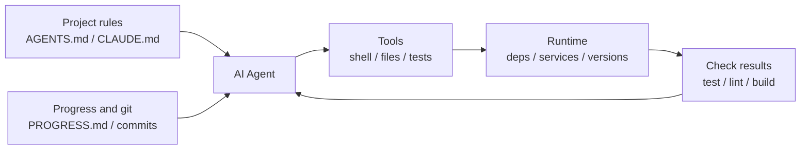

[中文版本 →](../../../zh/lectures/lecture-02-what-a-harness-actually-is/)

> Code examples: [code/](https://github.com/walkinglabs/learn-harness-engineering/blob/main/docs/en/lectures/lecture-02-what-a-harness-actually-is/code/)
> Practice project: [Project 01. Prompt-only vs. rules-first](./../../projects/project-01-baseline-vs-minimal-harness/index.md)

# Lecture 02. What Harness Actually Means

The word "harness" gets thrown around a lot in AI coding agent circles, but honestly, most people mean "a prompt file" when they say harness. That's not a harness. It's like opening a restaurant with nothing but ingredients — no stove, no knives, no recipes, no plating workflow. That's not a restaurant. That's a refrigerator.

This lecture gives you a precise, actionable harness definition. Not an academic abstraction, but a framework you can use today: a harness consists of five subsystems, each with clear responsibilities and evaluation criteria.

## Start with an Analogy

Imagine you're a newly hired engineer dropped into a project with zero documentation. No README, no comments in the code, nobody tells you how to run tests, CI config is buried somewhere. Can you write good code? Maybe — if you're smart enough and patient enough. But you'll spend enormous time on "figuring out what this project is about" rather than "solving the problem."

An AI agent faces the exact same situation. And it's worse — you can at least ask a colleague. The agent can only see files you put in front of it and commands it can execute. It can't tap someone on the shoulder and ask "hey, which version of the ORM does this project use?"

OpenAI frames the core principle as "the repo IS the spec" — all necessary context should be in the repository, delivered through structured instruction files, explicit verification commands, and clear directory organization. Anthropic's long-running agents documentation emphasizes state persistence, explicit recovery paths, and structured progress tracking. The two companies focus on different aspects, but they're saying the same thing: **everything in the engineering infrastructure outside the model determines how much of the model's capability actually gets realized.**

Look at some tools you already know:

**Claude Code** embodies harness thinking. It reads `CLAUDE.md` from your repo (recipe shelf), can run shell commands (knife rack), executes in your local environment (stove), maintains session history (prep station), and can run tests and see results (quality check window). But if you don't tell it how to run tests, the quality check window is broken — nobody knows whether the dish is fully cooked.

**Cursor** follows similar logic. Its `.cursorrules` file is the recipe shelf, the terminal is the knife rack, it reads your project structure and lint config for the stove. But Cursor's state management is relatively weak — close the IDE and reopen it, and the previous context is gone.

**Codex** (OpenAI's coding agent) uses git worktrees to isolate each task's runtime environment, paired with a local observability stack (logs, metrics, traces), so every change is verified in an independent environment. In repos with `AGENTS.md` and clear verification commands, it performs far better than in "bare" repos.

**AutoGPT** is the cautionary tale — lack of structured state management leads to context accumulation in long tasks, and lack of precise feedback mechanisms causes the agent to loop. Many people say AutoGPT "doesn't work," but really it's AutoGPT's harness that doesn't work — give a chef a broken stove and even the best ingredients won't produce a meal.

## Core Concepts

- **What is a harness**: Everything in the engineering infrastructure outside the model weights. OpenAI distills the engineer's core job into three things: designing environments, expressing intent, and building feedback loops. Anthropic calls their Claude Agent SDK a "general-purpose agent harness."
- **The repo is the single source of truth**: Anything the agent can't see, for all practical purposes, doesn't exist. OpenAI treats the repo as the "system of record" — all necessary context must live there, through structured files and clear directory organization.
- **Give a map, not a manual**: OpenAI's experience — `AGENTS.md` should be a directory page, not an encyclopedia. Around 100 lines is enough. If it doesn't fit, split it into the `docs/` directory and let the agent read on demand.
- **Constrain, don't micromanage**: A good harness uses executable rules to constrain the agent, rather than enumerating instructions one by one. OpenAI says "enforce invariants, don't micromanage implementation"; Anthropic found that agents confidently praise their own work, and the solution is to separate "the person who does the work" from "the person who checks the work."
- **Remove components one at a time**: To quantify the value of each harness component, remove them one at a time and see which removal causes the biggest performance drop. Anthropic used this method and found that as models get stronger, some components stop being critical — but new ones always emerge.

## The Five-Subsystem Harness Model

Back to the kitchen analogy. A complete kitchen has five functional areas, and a harness has five subsystems:



**Instruction subsystem (recipe shelf)**: Create `AGENTS.md` (or `CLAUDE.md`) containing a project overview and purpose (one sentence), tech stack and versions (Python 3.11, FastAPI 0.100+, PostgreSQL 15), first-run commands (`make setup`, `make test`), non-negotiable hard constraints ("All APIs must use OAuth 2.0"), and links to more detailed documentation.

**Tool subsystem (knife rack)**: Ensure the agent has sufficient tool access. Don't disable shell for "security" — if the agent can't even run `pip install`, how is it supposed to work? But don't open everything either — follow least-privilege principles.

**Environment subsystem (stove)**: Make the environment state self-describing. Use `pyproject.toml` or `package.json` to lock dependencies, `.nvmrc` or `.python-version` for runtime versions, Docker or devcontainers for reproducibility.

**State subsystem (prep station)**: Long tasks need progress tracking. Use a simple `PROGRESS.md` file recording: what's done, what's in progress, what's blocked. Update before each session ends, read when the next session starts.

**Feedback subsystem (quality check window)**: This is the highest-ROI subsystem. Explicitly list verification commands in `AGENTS.md`:
```
Verification commands:
- Tests: pytest tests/ -x
- Type check: mypy src/ --strict
- Lint: ruff check src/
- Full verification: make check (includes all above)
```

Missing any subsystem is like missing a functional area in the kitchen — you can still cook, but it's always awkward.

**Diagnosing harness quality**: Use "isometric model control." Keep the model fixed, remove subsystems one at a time, measure which removal causes the biggest performance drop. That's your bottleneck — focus your effort there. Like finding the bottleneck in a kitchen: take away the recipe shelf and see how much slower things get, shut off the stove and see the impact.

## A Team's Real Story

A team used GPT-4o on a TypeScript + React frontend app (~20,000 lines of code). They went through four stages — essentially adding kitchen equipment one piece at a time:

**Stage 1 — Empty kitchen**: Only a basic project description in README. 1 out of 5 runs succeeded (20%). Main failures: chose wrong package manager (npm vs yarn), didn't follow component naming conventions, couldn't run tests.

**Stage 2 — Recipe shelf installed**: Added `AGENTS.md` with tech stack versions, naming conventions, key architecture decisions. Success rate rose to 60%. Remaining failures were mainly environment issues and missing verification.

**Stage 3 — Quality check window opened**: Listed verification commands in `AGENTS.md`: `yarn test && yarn lint && yarn build`. Success rate rose to 80%.

**Stage 4 — Prep station ready**: Introduced progress file templates where agents recorded completed and incomplete work each run. Success rate stabilized at 80-100%.

Four iterations, the model didn't change at all, success rate went from 20% to near 100%. That's the power of harness engineering. You didn't buy more expensive ingredients — you just organized the kitchen properly.

## Key Takeaways

- Harness = Instructions + Tools + Environment + State + Feedback. Five subsystems, like a kitchen's five functional areas — all essential.
- If it's not model weights, it's harness. Your harness determines how much model capability gets realized.
- Among the five subsystems, the feedback subsystem usually has the lowest investment and highest return. Get your verification commands right first — the quality check window is the most worthwhile upgrade.
- Use "isometric model control" to quantify each subsystem's marginal contribution — don't go by gut feeling.
- Harness rots like code does. Audit regularly, pay down harness debt like you pay down technical debt.

## Further Reading

- [OpenAI: Harness Engineering](https://openai.com/index/harness-engineering/)
- [Anthropic: Effective Harnesses for Long-Running Agents](https://www.anthropic.com/engineering/effective-harnesses-for-long-running-agents)
- [HumanLayer: Harness Engineering for Coding Agents](https://humanlayer.dev/articles/harness-engineering-for-coding-agents/)
- [SWE-agent: Agent-Computer Interfaces](https://github.com/princeton-nlp/SWE-agent)
- [Thoughtworks: Harness Engineering on Technology Radar](https://www.thoughtworks.com/radar)

## Exercises

1. **Five-tuple harness audit**: Take a project where you use an AI agent and do a complete audit using the five-tuple framework. Score each subsystem 1-5. Find the lowest-scoring subsystem, spend 30 minutes improving it, then observe the change in agent performance.

2. **Isometric model control experiment**: Pick one model and one challenging task. Sequentially remove instructions (delete AGENTS.md), remove feedback (don't provide verification commands), remove state (no progress files) — remove only one at a time and measure the performance drop. Based on results, rank subsystem importance for your project.

3. **Affordance analysis**: Find a scenario where the agent in your project "wants to do something but can't" (e.g., knows it should use parameterized queries but doesn't know your project's ORM patterns). Analyze whether this is a Gulf of Execution (doesn't know how) or Gulf of Evaluation (doesn't know if it's right), then design a harness improvement to bridge it.
