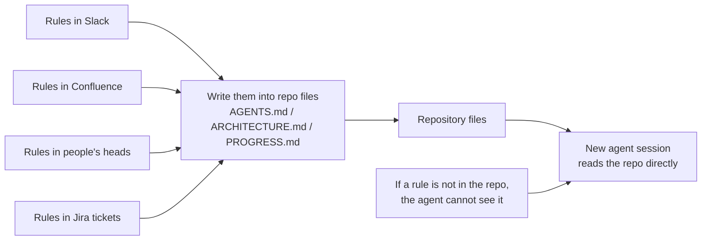
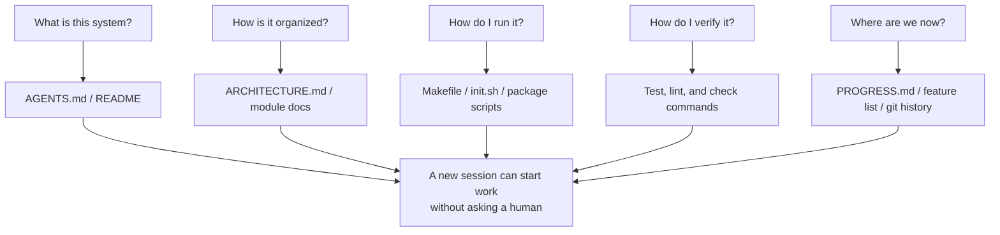

[中文版本 →](../../../zh/lectures/lecture-03-why-the-repository-must-become-the-system-of-record/)

> Code examples: [code/](https://github.com/walkinglabs/learn-harness-engineering/blob/main/docs/en/lectures/lecture-03-why-the-repository-must-become-the-system-of-record/code/)
> Practice project: [Project 02. Agent-readable workspace](./../../projects/project-02-agent-readable-workspace/index.md)

# Lecture 03. Make the Repository Your Single Source of Truth

Your team's architecture decisions are scattered across Confluence, Slack, Jira, and a few senior engineers' heads. For humans this barely works — you can ask a colleague, search chat history, dig through docs. If all else fails, you can corner someone in the break room. But for an AI agent, information that's not in the repository simply does not exist.

This isn't an exaggeration. Think about what an agent's inputs actually are: system prompts and task descriptions, file contents from the repository, and tool execution output. That's it. Your Slack history, Jira tickets, Confluence pages, and that architecture decision you discussed with a colleague over coffee on Friday afternoon — the agent can't see any of it. It can't "go ask someone" or "search the chat history." It's an engineer locked inside the repository — everything outside, it knows nothing about.

So the question becomes: are you going to give this engineer a good map?

## What Belongs on the Map

OpenAI states this bluntly: **information that doesn't exist in the repo, doesn't exist for the agent.** They call this the "repo as spec" principle — the repository itself is the highest-authority specification document.

Anthropic's long-running agents documentation echoes this: persistent state is a necessary condition for long-task continuity. Cross-session knowledge recoverability directly determines task success rates. And this state must exist in the repository — because that's the only stable, accessible storage the agent has.

You might think: "Our team is small, knowledge is in everyone's heads, and it works fine." Sure, for humans. But if you're using an agent, accept this fact: the agent can't ask people. Everything it needs to know must be written down and placed where it can find it.

This isn't about "writing more documentation." It's about "putting decision information in the right place." A 50-line `ARCHITECTURE.md` in the `src/api/` directory is ten thousand times more useful than a 500-page design document in Confluence that nobody maintains. It's like a hand-drawn office map taped to your desk versus a beautiful architectural blueprint locked in a filing cabinet — the former is right there when you need it; the latter is technically superior but useless in the moment.

## Knowledge Visibility



How do you test whether your map is good enough? Run a "cold-start test": open a brand new agent session using only repo contents, and see if it can answer five basic questions:



If it can't answer, the map has blank spots. Where the map is blank, the agent guesses — wrong guesses become bugs, excessive guessing wastes context. And every new session guesses all over again. The cost of guessing is always higher than the cost of drawing the map properly in the first place.

## Core Concepts

- **Knowledge Visibility Gap**: The proportion of total project knowledge that's NOT in the repository. The bigger the gap, the higher the agent's failure rate. How much implicit knowledge about this project lives in your head? Count it all, then see how much made it into the repo — the difference is your visibility gap.
- **System of Record**: The code repository as the authoritative source for project decisions, architecture constraints, execution state, and verification standards. The repo has the final word, nowhere else counts. Like a map that marks "road closed" — you won't go down that road. But if that information only exists in Old Zhang's head, you have to ask Old Zhang every time.
- **Cold-Start Test**: The five questions above. How many it can answer is how complete your map is.
- **Discovery Cost**: How much context budget the agent burns to find a key piece of information in the repo. The more hidden the information, the higher the discovery cost, and the less budget left for the actual task. Hiding critical information in a README ten directory levels deep is like locking the fire extinguisher in a basement safe — it exists, but you can't find it when you need it.
- **Knowledge Decay Rate**: The proportion of knowledge entries that become stale per unit of time. Documentation going out of sync with code is the biggest enemy — worse than no documentation at all.
- **ACID Analogy**: Applying database transaction principles (Atomicity, Consistency, Isolation, Durability) to agent state management. We'll expand on this below.

## How to Draw a Good Map

**Principle 1: Knowledge lives next to code.** A rule about API endpoint authentication belongs next to the API code, not buried in a giant global document. Put a short doc in each module directory explaining that module's responsibilities, interfaces, and special constraints. Like library shelf labels — you want history books, go straight to the shelf marked "History." No need to search the entire library.

**Principle 2: Use a standardized entry file.** `AGENTS.md` (or `CLAUDE.md`) is the agent's "landing page." It doesn't need to contain all information, but it must let the agent quickly answer three questions: "What is this project," "How do I run it," and "How do I verify it." 50-100 lines is enough.

**Principle 3: Minimal but complete.** Every piece of knowledge should have a clear use case. If removing a rule doesn't affect the agent's decision quality, that rule shouldn't exist. But every question from the cold-start test must have an answer. This is a delicate balance — not too much, not too little, just enough.

**Principle 4: Update with code.** Bind knowledge updates to code changes. The simplest approach: put architecture docs in the corresponding module directory. When you modify code, you naturally see the doc. After code changes, CI can remind you to check if docs need updating.

**Concrete repo structure**:

```
project/
├── AGENTS.md              # Entry: project overview, run commands, hard constraints
├── src/
│   ├── api/
│   │   ├── ARCHITECTURE.md  # API layer architecture decisions
│   │   └── ...
│   ├── db/
│   │   ├── CONSTRAINTS.md   # Database operation hard constraints
│   │   └── ...
│   └── ...
├── PROGRESS.md             # Current progress: done, in-progress, blocked
└── Makefile                # Standardized commands: setup, test, lint, check
```

## Managing Agent State with ACID Principles

This analogy comes from database transaction management — you might think it's overcomplicating things, but it actually gives you a very practical framework:

- **Atomicity**: Each "logical operation" (e.g., "add new endpoint and update tests") gets one git commit. If it fails midway, `git stash` to roll back. All or nothing — no "half done."
- **Consistency**: Define "consistent state" verification predicates — all tests pass, lint reports zero errors. The agent runs verification after each operation; inconsistent intermediate states don't get committed. Like a bank transfer — you can't debit without crediting.
- **Isolation**: When multiple agents work concurrently, design state files to avoid race conditions. Simple approach: each agent uses its own progress file, or use git branches for isolation. Two chefs can't season the same pot simultaneously — who takes responsibility when it's over-salted?
- **Durability**: Critical project knowledge lives in git-tracked files. Temporary state can stay in session memory, but cross-session knowledge must be persisted to files. What's in your head doesn't count — only what's on paper counts.

## A Real Transformation Story

A team maintained an e-commerce platform with ~30 microservices. Architecture decisions (inter-service communication protocols, data consistency strategies, API versioning rules) were scattered across: Confluence (partially outdated), Slack (hard to search), a few senior engineers' heads (not scalable), and sporadic code comments (not systematic).

After introducing AI agents, 70% of tasks required human intervention. Nearly every failure involved the agent violating some "everyone knows but nobody wrote down" implicit constraint. It's like a new employee whom nobody told "you need to post your lunch order in the group chat" — they guess wrong, get scolded, but after the scolding still nobody tells them the rule.

The team executed a transformation:
1. Created `AGENTS.md` in the repo root with project overview, tech stack versions, and global hard constraints
2. Added `ARCHITECTURE.md` in each microservice directory describing responsibilities, interfaces, and dependencies
3. Created a centralized `CONSTRAINTS.md` with hard constraints in explicit "MUST/MUST NOT" language
4. Added `PROGRESS.md` in each service directory tracking current work status

After transformation: the same agent could answer all key project questions on cold start, and task completion quality improved significantly.

## Key Takeaways

- Knowledge not in the repo doesn't exist for the agent. Putting critical decisions in the repo is the most basic harness investment — draw a good map so you don't get lost.
- Use the "cold-start test" to evaluate repo quality: can a fresh session answer five basic questions using only repo contents?
- Knowledge should be near code, minimal but complete, and updated with code. It's not about writing more docs — it's about putting information in the right place.
- Use ACID principles for agent state: atomic commits, consistency verification, concurrency isolation, durable critical knowledge.
- Knowledge decay is the biggest enemy. Documentation out of sync with code is more dangerous than no documentation — it sends the agent in the wrong direction while they think they're right.

## Further Reading

- [OpenAI: Harness Engineering](https://openai.com/index/harness-engineering/)
- [Anthropic: Effective Harnesses for Long-Running Agents](https://www.anthropic.com/engineering/effective-harnesses-for-long-running-agents)
- [Infrastructure as Code — Martin Fowler](https://martinfowler.com/bliki/InfrastructureAsCode.html)
- [ADR: Architecture Decision Records](https://adr.github.io/)
- [The Twelve-Factor App](https://12factor.net/)

## Exercises

1. **Cold-start test**: Open a completely fresh agent session in your project (no verbal context, repo contents only). Ask it five questions: What is this system? How is it organized? How do I run it? How do I verify it? What's the current progress? Record what it can't answer, then improve the repo until it can.

2. **Knowledge externalization quantification**: List all decisions and constraints important for development work in your project. Mark each as inside or outside the repo. Calculate your knowledge visibility gap (proportion outside repo). Make a plan to get it below 10%.

3. **ACID assessment**: Evaluate your project's state management using this lecture's ACID analogy. Atomicity — can agent operations be cleanly rolled back? Consistency — is there "consistent state" verification? Isolation — do concurrent agents step on each other? Durability — is all cross-session knowledge persisted?
