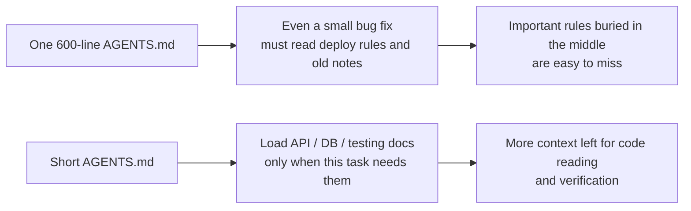
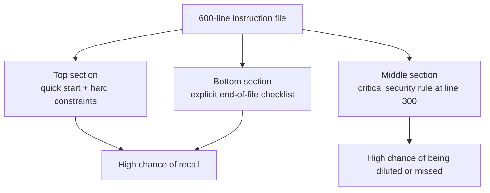

[中文版本 →](../../../zh/lectures/lecture-04-why-one-giant-instruction-file-fails/)

> Code examples: [code/](https://github.com/walkinglabs/learn-harness-engineering/blob/main/docs/en/lectures/lecture-04-why-one-giant-instruction-file-fails/code/)
> Practice project: [Project 02. Agent-readable workspace](./../../projects/project-02-agent-readable-workspace/index.md)

# Lecture 04. Split Instructions Across Files

You got serious about harness engineering — good for you. You created an `AGENTS.md` and packed every rule, constraint, and lesson learned you could think of into it. One month later the file bloated to 300 lines, two months 450 lines, three months 600 lines. Then you notice the agent's performance is actually getting worse — on a simple bug fix, the agent burns tons of context processing irrelevant deployment instructions; a critical security constraint buried at line 300 gets ignored outright; three contradictory code style rules mean the agent picks one at random each time.

This is the "giant instruction file" trap. It's like overpacking a suitcase — everything seems useful, so you cram it all in until the zipper is about to burst. Finding your change of underwear means emptying the entire bag. You carried a full suitcase, but you actually used maybe a third of what's inside.

## The Vicious Cycle at the Root

The most common vicious cycle goes like this: agent makes a mistake, you say "add a rule to prevent this," add it to AGENTS.md, it works temporarily, agent makes a different mistake, add another rule, repeat, file bloats out of control.

This isn't your fault. It's a very natural reaction — "add a rule" each time something goes wrong feels reasonable, like tossing one more thing into your bag every time you leave the house "just in case." But the cumulative effect is disastrous. Let's look at what goes wrong specifically.

**Context budget gets eaten alive.** The agent's context window is finite. Say your agent has a 200K token window (Claude's standard). A bloated instruction file might eat 10-20K tokens. Seems like there's still plenty of room? But a complex task might need to read dozens of source files, tool execution output also takes context, and conversation history accumulates. By the time the agent needs to understand the code, the budget is already tight — like a suitcase so full of "just in case" items that there's no room for your laptop.

**Lost in the middle.** The "Lost in the Middle" paper (Liu et al., 2023) clearly demonstrated that LLMs utilize information in the middle of long texts significantly less effectively than at the beginning or end. Your AGENTS.md is 600 lines, and line 300 says "all database queries must use parameterized queries" — that's a security hard constraint. But it's buried in the middle, and the agent will almost certainly ignore it. Like that bottle of sunscreen at the bottom of your overstuffed suitcase — you know it's there, you dig three times, can't find it, end up buying another one.

**Priority conflicts.** The file mixes non-negotiable hard constraints ("never use eval()"), important design guidelines ("prefer functional style"), and a specific historical lesson ("fixed a WebSocket memory leak last week, watch for similar patterns"). These three rules have completely different importance levels, but they look identical in the file. The agent has no reliable signal to distinguish — like your passport and charging cable jumbled together in the suitcase, no way to tell which is more urgent.

**Maintenance decay.** Large files are inherently hard to maintain. Outdated instructions rarely get deleted — because the consequences of deletion are uncertain ("maybe something else depends on this rule?"), while adding new instructions feels free. The result: the file only grows, never shrinks, and signal-to-noise ratio continuously declines. This is exactly like technical debt accumulation in software.

**Contradiction accumulation.** Instructions added at different times start contradicting each other — one says "use TypeScript strict mode," another says "some legacy files allow any types." The agent randomly picks one to follow each time. Like your mom saying "dress warm" and your dad saying "don't wear too much," and you standing at the door not knowing who to listen to.

## Core Concepts

- **Instruction Bloat**: When an instruction file occupies more than 10-15% of the context window, it starts crowding out budget for code reading and task reasoning. A 600-line `AGENTS.md` might consume 10,000-20,000 tokens — that's 8-15% of a 128K window eaten before the agent even starts.
- **Lost in the Middle Effect**: Liu et al.'s 2023 research proved that LLMs use information in the middle of long texts significantly less effectively than information at the beginning or end. A critical constraint buried at line 300 of a 600-line file has a very high probability of being effectively ignored.
- **Instruction Signal-to-Noise Ratio (SNR)**: The proportion of instructions in a file that are relevant to the current task. Being forced to read 50 lines of deployment instructions during a bug fix — that's low SNR.
- **Routing File**: A short entry file whose core function is pointing the agent to more detailed docs, not containing everything itself. 50-200 lines is plenty.
- **Progressive Disclosure**: Give overview information first, detailed information when needed. Good harness design is like good UI design — don't dump all options on the user at once.
- **Priority Ambiguity**: When all instructions appear in the same format and location, the agent can't distinguish non-negotiable hard constraints from suggestive soft guidelines.

## Instruction Architecture





## How to Split

Core principle: keep frequently-needed information at hand, tuck away occasionally-needed information, and leave behind what you'll never use.

The entry file `AGENTS.md` stays at 50-200 lines, containing only the most frequently used items — project overview (one or two sentences), first-run commands (`make setup && make test`), global hard constraints (no more than 15 non-negotiable rules), and links to topic documents (one-line description + applicability condition).

```markdown
# AGENTS.md

## Project Overview
Python 3.11 FastAPI backend, PostgreSQL 15 database.

## Quick Start
- Install: `make setup`
- Test: `make test`
- Full verification: `make check`

## Hard Constraints
- All APIs must use OAuth 2.0 authentication
- All database queries must use SQLAlchemy 2.0 syntax
- All PRs must pass pytest + mypy --strict + ruff check

## Topic Docs
- [API Design Patterns](docs/api-patterns.md) — Required reading when adding endpoints
- [Database Rules](docs/database-rules.md) — Required when modifying database operations
- [Testing Standards](docs/testing-standards.md) — Reference when writing tests
```

Each topic document is 50-150 lines, organized by subject in the `docs/` directory or next to the corresponding module. The agent only reads them when needed. Like packing cubes in a suitcase — underwear in one cube, toiletries in another, chargers in a third. Finding things doesn't require emptying the whole bag.

Some information is better placed directly in the code — type definitions, interface comments, explanations in config files. The agent naturally sees these when reading code, no need to duplicate in instructions.

Every instruction should have a source ("why was this rule added?"), an applicability condition ("when is this rule needed?"), and an expiry condition ("under what circumstances can this rule be removed?"). Audit regularly, remove outdated, redundant, and contradictory entries. Manage your instructions like you manage code dependencies — unused dependencies should be deleted, otherwise they just slow the system down.

If an instruction must be in the entry file, put it at the top or bottom — never the middle. The "lost in the middle" effect tells us that LLMs use information at the extremes significantly better than in the center. But the better approach is to move instructions to topic documents for on-demand loading.

Both OpenAI and Anthropic implicitly support the splitting approach. OpenAI says entry files should be "short and routing-oriented," Anthropic says long-running agent control information should be "concise and high-priority." Both are saying the same thing: don't stuff everything into one file. A suitcase needs organizing, not just brute-force cramming.

## Real-World Example

A SaaS team's `AGENTS.md` ballooned from 50 lines to 600. Contents mixed tech stack versions, coding standards, historical bug fix notes, API usage guides, deployment procedures, and team members' personal preferences — the entire suitcase bursting at the seams.

Agent performance started declining noticeably: during simple bug fixes the agent spent lots of context processing irrelevant deployment instructions; the security constraint "all database queries must use parameterized queries" was buried at line 300 and frequently ignored; three contradictory code style rules caused random agent behavior.

The team executed a "suitcase reorganization":
1. `AGENTS.md` trimmed to 80 lines: only project overview, run commands, and 15 global hard constraints
2. Created topic documents: `docs/api-patterns.md` (120 lines), `docs/database-rules.md` (60 lines), `docs/testing-standards.md` (80 lines)
3. Added topic document links in the routing file
4. Historical notes either converted to test cases or deleted

After refactoring: same task set success rate went from 45% to 72%. Security constraint compliance went from 60% to 95% — because it moved from the file middle to the routing file top, no longer "lost in the middle."

## Key Takeaways

- "Add a rule" is short-term pain relief, long-term poison. Before adding a rule, ask: would this be better in a topic document? Don't just keep cramming things into the suitcase.
- The entry file is a router, not an encyclopedia. 50-200 lines with overview, hard constraints, and links only.
- Leverage the "lost in the middle" effect: important info goes at the top or bottom; unimportant info moves to topic documents.
- Manage instruction bloat like technical debt. Regular audits, every instruction needs a source, applicability condition, and expiry condition.
- After splitting, SNR improves and the agent spends more context budget on actual tasks instead of processing irrelevant instructions.

## Further Reading

- [OpenAI: Harness Engineering](https://openai.com/index/harness-engineering/)
- [Anthropic: Effective Harnesses for Long-Running Agents](https://www.anthropic.com/engineering/effective-harnesses-for-long-running-agents)
- [Lost in the Middle: How Language Models Use Long Contexts](https://arxiv.org/abs/2307.03172)
- [HumanLayer: Harness Engineering for Coding Agents](https://humanlayer.dev/articles/harness-engineering-for-coding-agents/)
- [Nielsen Norman Group: Progressive Disclosure](https://www.nngroup.com/articles/progressive-disclosure/)

## Exercises

1. **SNR audit**: Take your current entry instruction file and list all instruction entries. Pick 5 different common task types and mark whether each instruction is relevant to that task. Calculate SNR for each task type. Instructions that are noise for most tasks should move to topic documents.

2. **Progressive disclosure refactor**: If you have an instruction file over 300 lines, split it into: (a) a routing file under 100 lines, (b) 3-5 topic documents. Run the same set of tasks (at least 5) before and after, compare success rates.

3. **Lost in the middle verification**: In a long instruction file, place a critical constraint at the top, middle, and bottom respectively, running the same task set each time (at least 5 runs per position). See if there's a difference in compliance rate. You might be surprised by how strong the position effect is.
