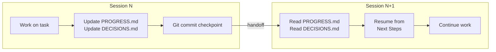
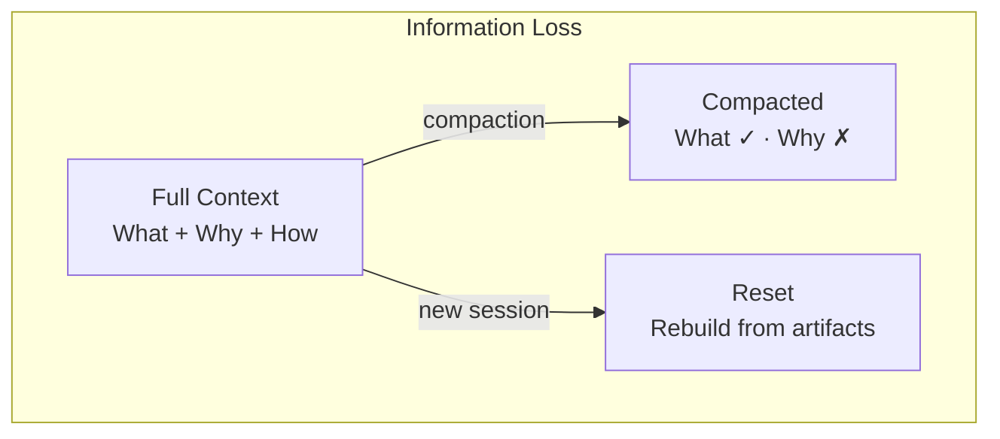

[中文版本 →](../../../zh/lectures/lecture-05-why-long-running-tasks-lose-continuity/)

> Code examples: [code/](https://github.com/walkinglabs/learn-harness-engineering/blob/main/docs/en/lectures/lecture-05-why-long-running-tasks-lose-continuity/code/)
> Practice project: [Project 03. Multi-session continuity](./../../projects/project-03-multi-session-continuity/index.md)

# Lecture 05. Keep Context Alive Across Sessions

## What Problem Does This Lecture Solve?

You ask Claude Code to implement a complete feature. It runs for 30 minutes, does most of the work, but context is running low. You start a new session to continue — and discover it doesn't remember what decisions were made last time, why option A was chosen over option B, which files were already modified, or what state the tests are in. It spends 15 minutes re-exploring the project, and might be inconsistent with the previous approach.

This is one of the most painful problems with AI coding agents: cross-session context continuity. This lecture explains why agents "black out" during long tasks, and how to maintain continuity through structured state persistence.

## Core Concepts

- **Context Windows Are Finite**: No matter what window size is claimed (128K, 200K, 1M), long tasks will eventually exhaust it. After exhaustion, either compaction (losing information) or reset (new session) is required. Both lose something.
- **Continuity Artifacts**: Persisted state files that let a new session unambiguously resume where the last one left off. The basic form: progress log + verification record + next actions.
- **Rebuild Cost**: The time a new session needs to reach an executable state. Good harnesses can compress rebuild cost from 15 minutes to 3 minutes.
- **Drift**: The gap between the agent's understanding and the actual state of the code repository. Every session boundary introduces drift; without control, it compounds.
- **Compaction vs Reset**: Compaction summarizes context within the same session (keeps "what," may lose "why"); reset opens a new session rebuilding from persisted state (clean but depends on artifact completeness).
- **Context Anxiety**: A phenomenon observed by Anthropic — agents exhibit premature convergence behavior when approaching perceived context limits, ending tasks early to avoid information loss. It's an irrational resource anxiety.

## Session Continuity Flow





## Why This Happens

Context windows are finite. This isn't solvable by model upgrades — even if window sizes grow to 1M tokens, complex tasks will still exhaust them. Because agents aren't just generating code; they're understanding codebases, tracking their own decision history, processing tool output, and maintaining conversation context. All this information grows faster than window expansion.

A deeper problem: information the agent produces isn't uniformly important. Intermediate reasoning steps contain the "why" of decisions — why option B was chosen over A, why this library instead of that one, why a particular optimization was skipped. The final output only contains the "what" — the code itself. Compaction strategies usually preserve the latter but lose the former. The next session sees the code but doesn't know why it's written that way, and might "optimize" away a deliberate design decision.

Anthropic discovered something fascinating in their long-running agent research: when agents sense context is running low, they exhibit "premature convergence" behavior — rushing to finish current work, skipping verification steps, or choosing a simple solution over the optimal one. It's like realizing time is running out on an exam and quickly guessing on the remaining multiple-choice questions. Anthropic calls this "context anxiety."

Specifically, cross-session continuity loss manifests in several ways:

**Decision context loss.** The previous session spent significant context budget analyzing three approaches and choosing option B. This session's agent doesn't know about that analysis and might re-decide based on incomplete information — potentially choosing option A.

**Duplicate work.** The agent isn't sure whether certain work was already completed and does it again. Worse — it does half of it, discovers a conflict with the existing implementation, and has to rework.

**Direction drift.** Each new session has a slightly different understanding of the project goals. Over several sessions, the implementation direction may have drifted significantly from the original requirements.

**Verification gap amplification.** The previous session's verification results (which tests pass, which fail, why they fail) weren't recorded. The new session has to re-run all verification to understand the current state.

Both OpenAI and Anthropic emphasize structured state persistence in their documentation. OpenAI's harness engineering article treats the repository as an "operational record" — every operation's results should leave traceable evidence in the repo. Anthropic's long-running agents documentation specifically recommends "handoff files" — structured documents containing current state, known issues, and next actions.

## How to Do It Right

Core approach: **Treat the agent like a brilliant engineer with amnesia.** Before it "clocks out," it must write down critical information so the next "shift" agent can pick up quickly.

**Tool 1: Progress file (PROGRESS.md).** The most basic continuity artifact. Simple format:

```markdown
# Project Progress

## Current State
- Latest commit: abc1234 (feat: add user preferences endpoint)
- Test status: 42/43 passing (test_pagination_edge_case failing)
- Lint: passing

## Completed
- [x] User model and database migration
- [x] Basic CRUD endpoints
- [x] Auth middleware integration

## In Progress
- [ ] Pagination feature (90% - edge case test failing)

## Known Issues
- test_pagination_edge_case returns 500 on empty result sets
- Need to confirm whether deleted users should appear in listings

## Next Steps
1. Fix pagination edge case bug
2. Add "include deleted users" query parameter
3. Update API documentation
```

**Tool 2: Decision log (DECISIONS.md).** Record important design decisions and reasons. No need for detailed design documents — just "what decision, why, when":

```markdown
# Design Decisions

## 2024-01-15: Use Redis for user preferences caching
- Reason: High read frequency (every API call), small data size
- Rejected alternative: PostgreSQL materialized view (high change frequency makes maintenance cost not worthwhile)
- Constraint: Cache TTL of 5 minutes, active invalidation on write
```

**Tool 3: Git commits as checkpoints.** Commit after completing each atomic unit of work. Commit messages should explain what was done and why. These are free, automatically versioned state snapshots.

**Tool 4: init.sh or harness initialization flow.** Specify in `AGENTS.md`:

```markdown
## At session start
1. Read PROGRESS.md for current state
2. Read DECISIONS.md for important decisions
3. Run make check to confirm repo is in consistent state
4. Continue from PROGRESS.md "Next Steps" section

## Before session end
1. Update PROGRESS.md
2. Run make check to confirm consistent state
3. Commit all completed work
```

**Mixed strategy**: Not every task needs a context reset. Short tasks (under 30 minutes) can complete within one session. Long tasks (spanning sessions) must use progress files and decision logs for continuity. Decision criterion: if a task needs more than 60% of the window, start preparing handoff.

## Real-World Example

An agent was tasked with implementing a blog system with user authentication — 12 feature points, estimated 5 sessions needed.

**Baseline without continuity artifacts**: Session 1 implemented the user model and basic routes. Session 2 started without the agent remembering the auth middleware's interface contract, spending ~15 minutes inferring the previous design intent. By session 3, accumulated drift caused the agent to start reimplementing already-completed features. By session 5, the repo contained lots of redundant code but the core auth feature still hadn't passed end-to-end tests. Only 7 of 12 feature points completed, 3 with hidden correctness issues.

**With structured artifacts**: Using progress files, decision logs, verification records, and git checkpoints. State report updated automatically at each session end. Session 2's rebuild cost dropped to ~3 minutes. By session 5, all 12 feature points completed and verified.

Quantitative comparison: rebuild time reduced ~78%, feature completion rate from 58% to 100%, hidden defect rate from 43% down to 8%.

## Key Takeaways

- Context windows are a finite resource. Long tasks will span sessions, and sessions will lose information.
- The solution isn't bigger windows — it's better state persistence. Progress files + decision logs + git checkpoints.
- Treat the agent like an engineer with amnesia: before "clocking out," write down what was done, why, and what's next.
- Rebuild cost is the key metric. Good harnesses should get new sessions to an executable state within 3 minutes.
- Mixed strategy: short tasks within sessions, long tasks with structured artifacts for continuity.

## Further Reading

- [Anthropic: Effective Harnesses for Long-Running Agents](https://www.anthropic.com/engineering/effective-harnesses-for-long-running-agents)
- [OpenAI: Harness Engineering](https://openai.com/index/harness-engineering/)
- [Lost in the Middle: How Language Models Use Long Contexts](https://arxiv.org/abs/2307.03172)
- [Claude Code Documentation](https://docs.anthropic.com/en/docs/claude-code)
- [HumanLayer: Harness Engineering for Coding Agents](https://humanlayer.dev/articles/harness-engineering-for-coding-agents/)

## Exercises

1. **Continuity loss measurement**: Pick a development task needing at least 3 sessions. Without providing any continuity artifacts, record at each session start how much context the agent spends "figuring out what happened last time." After each session, create a progress file and let the next session start from it. Compare rebuild costs with and without progress files.

2. **Handoff template design**: Design a minimal handoff template with four fields: repo state (commit hash), runtime state (test pass rate), blockers, next actions. Let a completely fresh agent session restore project state using only this template. Record ambiguities encountered during restoration, iterate to improve the template.

3. **Mixed strategy experiment**: In a 5-session development task, compare three strategies: (a) always start fresh sessions + progress files, (b) do as much as possible in one session (context compaction), (c) mixed strategy (short tasks in-session, long tasks across sessions + progress files). Compare rebuild time, feature completion rate, and decision consistency.
