[中文版本 →](../../../zh/lectures/lecture-06-why-initialization-needs-its-own-phase/)

> Code examples: [code/](https://github.com/walkinglabs/learn-harness-engineering/blob/main/docs/en/lectures/lecture-06-why-initialization-needs-its-own-phase/code/)
> Practice project: [Project 03. Multi-session continuity](./../../projects/project-03-multi-session-continuity/index.md)

# Lecture 06. Initialize Before Every Agent Session

You start a new agent session and say "add a search feature." It jumps straight into coding — admirable enthusiasm. After 20 minutes it discovers the test framework isn't configured properly, spends another 10 fixing that, then the database migration script format is wrong, more fiddling. The search feature eventually gets added, but the whole session was inefficient — most time went to "figuring out how this project works" rather than writing the search feature.

The better approach: before letting the agent start working, use a separate phase to get the base environment ready, verification commands passing, and project structure understood. It's like building a house — you don't pour the foundation and put up walls simultaneously. If you do, the walls go up before the foundation has cured, and the whole building has to be torn down and started over. Pour the foundation first, let it cure, then build the walls — clean and efficient.

This lecture explains why initialization must be a separate phase, not mixed in with implementation.

## Foundation and Walls: Two Fundamentally Different Jobs

Initialization and implementation have completely different optimization targets. The implementation phase optimizes for: maximizing the quantity and quality of verified features. The initialization phase optimizes for: maximizing the reliability and efficiency of all subsequent implementation.

When you mix initialization and implementation, the agent faces a multi-objective optimization problem — simultaneously building infrastructure and writing feature code. Without explicit priority setting, the agent naturally gravitates toward writing code (because that's directly visible output) while sacrificing infrastructure (because its value only shows in subsequent sessions). It's like telling a construction crew to simultaneously pour the foundation and build the walls — they'll probably rush to build walls because walls are visible and demonstrable. But a house with a bad foundation has systemic problems down the line.

## Initialization Lifecycle

```mermaid
flowchart TB
    subgraph Wrong["Mixed session (wrong)"]
        W1["Start feature work immediately"] --> W2["Discover env and test gaps mid-task"]
        W2 --> W3["Accumulate unverified code"]
        W3 --> W4["Next session must rediscover project state"]
    end

    subgraph Right["Dedicated initialization (right)"]
        R1["Session 1: environment runnable"] --> R2["Example test passing"]
        R2 --> R3["Bootstrap contract + task list written"]
        R3 --> R4["Clean checkpoint committed"]
        R4 --> R5["Later sessions start directly on verified tasks"]
    end
```



## What Happens When You Mix Them

The most direct problem: the foundation doesn't set properly. The agent spends 80% of its effort on feature code and 20% casually setting up some infrastructure. The test framework is configured but never verified, lint rules are set but too loose, no progress file created. These defects aren't obvious in the first session (because the agent still remembers what it did), but they surface in the second session — the new agent doesn't know how to run, test, or where things stand. Shoddy foundation, shaky building.

A more hidden cost is "unverified accumulation" — feature code written before the test framework is configured is code without verification. When you finally go back to add tests for that code, you might discover the design was wrong from the start — had you known, you would have implemented it differently. Like tiling over wet concrete — when you discover the floor isn't level, all the tiles have to be pried up and redone.

Session budget is being wasted too. Initialization work (configuring environments, setting up tests, understanding project structure) consumes significant budget, leaving less for actual feature implementation. Result: the first session only completes half the features, and the second session has to start over understanding the project. Budget spent on the foundation, but the foundation isn't solid either — neither goal achieved.

The most easily overlooked problem is implicit assumption landmines. Decisions the agent makes during initialization (which test framework, how to organize directories, dependency management) — if not explicitly recorded, subsequent sessions can't understand these choices. Worse, subsequent sessions might make contradictory choices. The first construction crew used a concrete foundation, the second crew doesn't know and drove wooden pilings into it — the foundation cracks.

Anthropic's long-running application development research explicitly recommends separating initialization from implementation. Their experimental data: projects using a dedicated initialization phase showed 31% higher feature completion rates in multi-session scenarios compared to mixed approaches. The key insight — time invested in the initialization phase is fully recovered in the next 3-4 sessions. The more solid the foundation, the faster the walls go up.

OpenAI's Codex harness engineering guide also emphasizes the "repository as operational record" principle — establish clear operational structure from the first run, or every new session has to re-infer project conventions.

## Core Concepts

- **Initialization Phase**: The first phase in the agent's lifecycle — no feature implementation, only establishing prerequisites for all subsequent implementation phases. The output isn't code, it's infrastructure.
- **Bootstrap Contract**: The conditions under which a project can be unambiguously operated by a fresh agent session — can start, can test, can see progress, can pick up next steps. Four conditions, all required.
- **Cold Start vs Warm Start**: Cold start is from an empty directory where the agent must guess project structure; warm start is from a template or existing project where infrastructure is already in place. Warm start far outperforms cold start — like starting work on a site with running water and electricity versus beginning from a barren wasteland.
- **Handoff Readiness**: The project is in a state at any given moment where a fresh agent can take over. No verbal explanation needed — just repo contents.
- **Time to First Verification**: The time from project start until the first feature point passes verification. This is the core metric for measuring initialization efficiency.
- **Downstream Usability**: The best measure of initialization quality — the proportion of subsequent sessions that can successfully execute tasks without relying on implicit knowledge.

## How to Do Initialization Right

**Treat initialization as a dedicated phase.** The first session does only initialization — no business feature code at all. Initialization produces:

**1. Runnable environment.** The project starts, dependencies are installed, no environment issues. Foundation poured, no cracks.

**2. Verifiable test framework.** At least one example test passes. This proves the test framework itself is properly configured — like standing a pillar on the foundation to prove it can bear weight.

**3. Bootstrap contract document.** A clear document telling subsequent sessions:
```markdown
# Initialization Contract

## Start Commands
- Install dependencies: `make setup`
- Start dev server: `make dev`
- Run tests: `make test`
- Full verification: `make check`

## Current State
- All dependencies installed and locked
- Test framework configured (Vitest + React Testing Library)
- Example test passing (1/1)
- Lint rules configured (ESLint + Prettier)

## Project Structure
- src/ — Source code
- src/components/ — React components
- src/api/ — API client
- tests/ — Test files
```

**4. Task breakdown.** Split the entire project into an ordered task list, each task with clear acceptance criteria:
```markdown
# Task Breakdown

## Task 1: User Authentication Basics
- Implement JWT auth middleware
- Add login/register endpoints
- Acceptance: pytest tests/test_auth.py all passing

## Task 2: User Profile Page
- Implement user profile CRUD
- Add profile edit form
- Acceptance: pytest tests/test_profile.py all passing

## Task 3: Search Feature
- ...
```

**5. Git commit as checkpoint.** After initialization completes, commit a clean checkpoint. All subsequent work starts from this checkpoint.

**Warm start strategy**: Don't start from an empty directory. Use a project template (create-react-app, fastapi-template, etc.) to preset standard directory structure, dependency configuration, and test framework. Bake common initialization steps into the template, leaving only project-specific initialization work. Like starting work on a site with running water and electricity — ten thousand times better than beginning from a barren wasteland.

**Initialization completion criteria**: Not "how much code was written," but whether the bootstrap contract's four conditions are met — can start, can test, can see progress, can pick up next steps. Use this checklist to validate initialization:

```markdown
## Initialization Acceptance Checklist
- [ ] `make setup` succeeds from scratch
- [ ] `make test` has at least one passing test
- [ ] A new agent session can answer "how to run" and "how to test" from repo contents alone
- [ ] Task breakdown file exists with at least 3 tasks
- [ ] Everything committed to git
```

## Real-World Example

Two initialization approaches for a React frontend project:

**Mixed approach (pouring foundation and building walls simultaneously)**: The agent simultaneously created project scaffolding and implemented the first feature in session 1. At session end, the repo had runnable code but: no explicit start/test command documentation, no progress tracking file, no task breakdown. Session 2 spent ~20 minutes inferring project structure, test framework, and build process — like a new construction crew arriving at a site, not knowing how far the foundation got or where the plumbing runs are, having to dig holes one by one to find out.

**Dedicated initialization (foundation first)**: Session 1 did only initialization — created directory structure from a template, configured the test framework (Vitest + React Testing Library), wrote and verified one example test, created the bootstrap contract document and task breakdown file, committed the initial checkpoint. Session 2's rebuild time was under 3 minutes, and it started working directly from the task list — the crew arrives, glances at the blueprint, and knows exactly where to pick up.

Full project cycle comparison: the mixed approach's total rebuild time (across all sessions) was ~60% more than the dedicated initialization approach. The extra 20 minutes spent on initialization was recovered many times over in subsequent sessions. Like a solid foundation making the walls go up faster — slow is fast.

## Key Takeaways

- Initialization and implementation have different optimization targets — mixing them just drags both down. Pour the foundation first, then build the walls.
- Initialization's output isn't code, it's infrastructure: runnable environment, verifiable tests, bootstrap contract, task breakdown.
- Validate initialization with the bootstrap contract's four conditions: can start, can test, can see progress, can pick up next steps.
- Warm start beats cold start. Use project templates to preset standardized infrastructure.
- Time invested in initialization is fully recovered in the next 3-4 sessions. This isn't extra cost — it's upfront investment. The more solid the foundation, the faster the building goes up.

## Further Reading

- [Anthropic: Effective Harnesses for Long-Running Agents](https://www.anthropic.com/engineering/effective-harnesses-for-long-running-agents)
- [OpenAI: Harness Engineering](https://openai.com/index/harness-engineering/)
- [HumanLayer: Harness Engineering for Coding Agents](https://humanlayer.dev/articles/harness-engineering-for-coding-agents/)
- [Infrastructure as Code — Martin Fowler](https://martinfowler.com/bliki/InfrastructureAsCode.html)
- [SWE-agent: Agent-Computer Interfaces](https://github.com/princeton-nlp/SWE-agent)

## Exercises

1. **Bootstrap contract design**: Write a complete bootstrap contract for a project you're developing. Then open a completely fresh agent session, show it only repo contents (no verbal context), and have it try to start the project, run tests, and understand current progress. Record every problem it encounters — each one corresponds to a missing clause in your bootstrap contract.

2. **Comparison experiment**: Pick a moderately complex new project. Approach A: let the agent initialize and do first implementation simultaneously. Approach B: spend one session on dedicated initialization, start implementation in session 2. After 4 sessions, compare: time to first verification, rebuild cost, feature completion rate.

3. **Initialization acceptance checklist**: Design an initialization acceptance checklist for your project. Have a fresh agent session execute each checklist item and record which pass and which fail. The failing items are where your harness needs strengthening.
