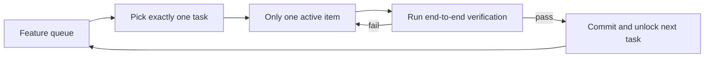
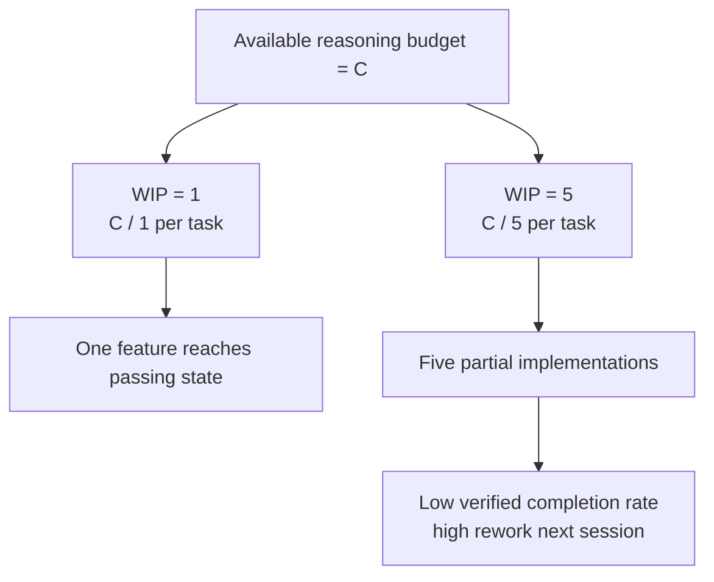

[中文版本 →](../../../zh/lectures/lecture-07-why-agents-overreach-and-under-finish/)

> Code examples: [code/](https://github.com/walkinglabs/learn-harness-engineering/blob/main/docs/en/lectures/lecture-07-why-agents-overreach-and-under-finish/code/)
> Practice project: [Project 04. Runtime feedback and scope control](./../../projects/project-04-incremental-indexing/index.md)

# Lecture 07. Draw Clear Task Boundaries for Agents

You tell Claude Code to "add user authentication to this project," and it starts modifying the database schema, writing routes, changing frontend components, and — while it's at it — refactoring the error-handling middleware. Two hours later you check: 12 files modified, 800 lines of new code, and not a single feature works end-to-end.

Biting off more than you can chew — this saying applies to AI agents especially well. Agents are born with an impulse to "do a little extra" — they see related things and just handle them along the way, like someone who goes to the supermarket for a bottle of soy sauce and comes out pushing a full cart. The problem is, humans who buy too much just waste money; agents doing too many things simultaneously means none of them get done properly.

Anthropic's "Effective harnesses for long-running agents" engineering blog states clearly: when prompts are too broad, agents tend to "start multiple things at once" rather than "finish one thing first." OpenAI's Codex engineering practices found the same — tasks without explicit scope controls see completion rates plummet. This is not a model problem — it's a harness problem. You didn't draw the boundary.

## Attention Is a Finite Resource

This isn't a metaphor — it's math. Assume the agent's context capacity is C and it activates k tasks simultaneously. Each task gets an average of C/k reasoning resources. When C/k drops below the minimum threshold needed to complete a single task, none of them get finished. Your stomach is only so big — stuff ten dumplings in at once and you won't digest them all, you'll just get ten cases of indigestion.

Claude Code's real behavior is telling. Ask it to "add user registration" and it might:

1. Create a User model
2. Write the registration route
3. Notice it needs email verification, so add a mail service
4. See that passwords need hashing, so bring in bcrypt
5. Notice the error handling is inconsistent, so refactor the global error middleware
6. See the test file structure is messy, so reorganize the directory

Six steps later, every one is half-done. No end-to-end verification, complex coupling between the half-baked code, and the next session to pick up the pieces will be completely lost. Like someone cooking six dishes simultaneously — every dish is in the pan but none has been plated. They all burn.

Anthropic's experimental data directly supports this: agents using a "small next step" strategy (equivalent to WIP=1) show a 37% higher task completion rate than agents using broad prompts. More interestingly, the number of lines of code generated by agents is weakly negatively correlated with actual feature completion — more code written, fewer features completed. Biting off more than you can chew, proven by data.

## WIP=1 Workflow





## Core Concepts

- **Overreach**: The agent activates more tasks in a single session than optimal. It's quantifiable — doing 5 features with 0 passing end-to-end is overreach.
- **Under-finish**: The ratio of tasks that pass end-to-end verification, out of all activated tasks, falls below threshold. Code written but tests not passing is under-finish.
- **WIP Limit (Work-in-Progress Limit)**: From Kanban methodology. Core idea: limit how many tasks are in-flight at once. For agents, WIP=1 is the safest default — finish one before starting the next. Like a buffet — don't pile your plate, finish one plate then go back for the next.
- **Completion Evidence**: The verifiable condition a task must satisfy to move from "in progress" to "done." Without this, agents substitute "the code looks fine" for "the behavior passes tests."
- **Scope Surface**: A DAG structure where each node is a work unit and edges are dependencies. States are limited to four: not_started, active, blocked, passing.
- **Completion Pressure**: The constraining force the harness exerts through WIP limits and completion evidence requirements, forcing the agent to finish the current task before starting a new one.

## Overreach and Under-finish Are Symbiotic

These two problems aren't independent — they amplify each other. Overreach dilutes attention, diluted attention causes under-finish, and the half-finished code left behind increases system complexity, which further drives overreach in the next task. A vicious cycle.

In Kanban terms: Little's Law tells us L = lambda * W. If work-in-progress L is too high (doing too many things at once), the lead time W for each task inevitably increases. For agents, this means each feature takes longer from start to verified completion, and the probability of failure grows.

This is an old problem in the human world too — Steve McConnell documented in *Rapid Development* that scope creep is the leading cause of project failure. But humans at least have the intuition of "I've done enough." Agents have none. Generating the next idea costs the model almost nothing in extra tokens — writing "let me fix this too while I'm here" barely registers — but every additional modification dilutes the agent's attention. Like a buffet where each extra plate has near-zero marginal cost, but your stomach only has so much capacity.

## How to Do It Right

### 1. Enforce WIP=1

This is the most direct and effective method. In your harness, tell the agent explicitly: **only one task is allowed in "active" status at any time.** In Claude Code's CLAUDE.md or Codex's AGENTS.md, write:

```
## Work Rules
- Work on one feature at a time
- Only start the next feature after the current one passes end-to-end verification
- Don't "also refactor" feature B while implementing feature A
```

Like eating at a buffet — one plate at a time, finish it before going back for more.

### 2. Define Explicit Completion Evidence for Every Task

Done is not "code is written" — it's "behavior verification passes." In your feature list, every entry needs a verification command:

```
F01: User Registration
  Verification: curl -X POST /api/register -d '{"email":"test@example.com","password":"123456"}' | jq .status == 201
  State: passing
```

### 3. Externalize the Scope Surface

Use a machine-readable file (JSON or Markdown) to record all task states. Any new session can read this file and immediately know: which task is active? What behavior counts as done? What verifications have passed?

### 4. Monitor Verified Completion Rate

The harness should continuously track VCR (Verified Completion Rate) = verified tasks / activated tasks. Block new task activations when VCR < 1.0.

## Real-World Case

A REST API project with 8 features, two strategies compared:

**Buffet mode (unconstrained)**: Agent activates 5 features simultaneously in session 1. Produces ~800 lines across 12 files. End-to-end test pass rate: 20% — only user registration works. The other 4 features: database schema created but missing validation logic, routes defined but returning wrong response formats. Like someone cooking six dishes at once, only one is barely edible. By end of session 3, only 3 of 8 features complete.

**Single-plate mode (WIP=1)**: Agent works on user registration only in session 1. Produces ~200 lines across 4 files. End-to-end tests: 100% passing. Commits a clean, verified implementation. By end of session 4, 7 of 8 features complete (the 8th blocked by an external dependency).

Result: less total code (800 vs 1200 lines) but more effective code. Completion rate: 87.5% vs 37.5%. Take one bite at a time, and you actually eat more.

## Key Takeaways

- **WIP=1 is the default safe setting for agent harnesses** — finish one, then start the next; don't try to parallelize. You can't become fat in one bite.
- **Completion evidence must be executable** — "the code looks fine" doesn't count; "curl returns 201" does.
- **The scope surface must be externalized as a file** — not just mentioned in conversation, but recorded in a machine-readable format in the repo.
- **Overreach and under-finish are symbiotic** — solving one solves the other.
- **"Do less but finish" always beats "do more but leave half-done"** — agent code lines and feature completion rate are negatively correlated. Quality always beats quantity.

## Further Reading

- [Effective harnesses for long-running agents - Anthropic](https://www.anthropic.com/engineering/effective-harnesses-for-long-running-agents) — Anthropic's engineering blog, detailed discussion of the "small next step" strategy
- [Harness Engineering - OpenAI](https://openai.com/index/harness-engineering/) — OpenAI's complete treatment of harness engineering
- [Kanban: Successful Evolutionary Change - David Anderson](https://www.goodreads.com/book/show/1070822.Kanban) — The classic source on WIP limits
- [Rapid Development - Steve McConnell](https://www.goodreads.com/book/show/125171.Rapid_Development) — Empirical data on scope creep as the leading cause of project failure

## Exercises

1. **Task Atomization**: Pick a broad requirement (e.g., "implement a user management system") and break it into at least 5 atomic work units. For each unit, specify: (a) a single behavior description, (b) an executable verification command, (c) dependencies. Check whether the decomposition satisfies the WIP=1 constraint.

2. **Comparison Experiment**: Run the same project twice — once without constraints, once with enforced WIP=1. Compare: verified completion rate, total lines of code, effective code ratio.

3. **Completion Evidence Audit**: Review a recent agent run's output, classifying each code change as "completed behavior," "incomplete behavior," or "scaffolding." Add missing verification commands for each incomplete behavior.
