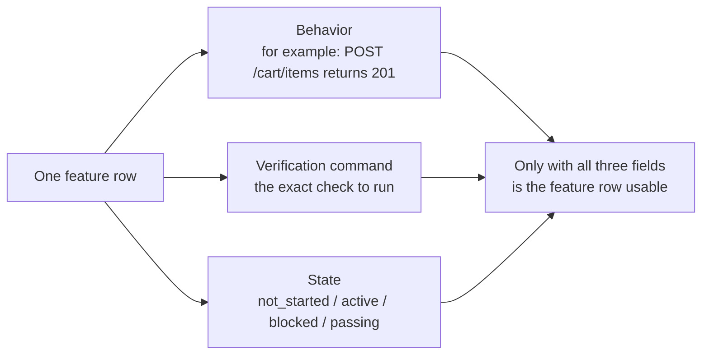
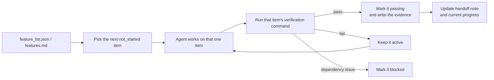

[中文版本 →](../../../zh/lectures/lecture-08-why-feature-lists-are-harness-primitives/)

> Code examples: [code/](https://github.com/walkinglabs/learn-harness-engineering/blob/main/docs/en/lectures/lecture-08-why-feature-lists-are-harness-primitives/code/)
> Practice project: [Project 04. Runtime feedback and scope control](./../../projects/project-04-incremental-indexing/index.md)

# Lecture 08. Use Feature Lists to Constrain What the Agent Does

You ask an agent to build an e-commerce site. After it finishes, it tells you "done." You look at the code — user authentication works, but the checkout button in the shopping cart does nothing, and the payment flow isn't connected at all. The problem: you never told it what "done" means, so it used its own standard — "I wrote a lot of code and it looks fairly complete."

 Feature lists, in many people's eyes, are just a memo — write things down so you don't forget, then toss it aside. But in the harness world, a feature list isn't a memo for humans — it's the backbone of the entire harness. The scheduler relies on it to pick tasks, the verifier relies on it to judge completion, the handoff reporter relies on it to generate summaries. Break the backbone and the whole body is paralyzed.

Both Anthropic and OpenAI emphasize: **artifacts must be externalized.** Feature state must live in a machine-readable file in the repo, not in unstructured conversation text.

## Agents Don't Know What "Done" Means

Neither Claude Code nor Codex automatically knows what you mean by "done." You say "add a shopping cart feature," and the model's interpretation might be "write a Cart component and an addToCart method." But you meant "the user can browse products, add to cart, and complete checkout end-to-end." This understanding gap persists without a feature list. The agent uses its own implicit standard — usually "the code has no obvious syntax errors." What you need is end-to-end behavioral verification. Like asking a friend to buy you fruit — you say "get some fruit" and they come back with lemons. Their fruit and your fruit are not the same fruit.

Look at this common progress note:

```
Did user auth, shopping cart mostly done, still need payments
```
Can a new agent session answer these questions from this note? What does "mostly done" mean? Which tests did the cart pass? What's blocking payments? The answer to all is "nobody knows." Like telling your doctor "my stomach hurts, been okay lately" — what medicine can they prescribe?

The result: the new session spends 20 minutes inferring project state, and may re-implement completed features. Anthropic's engineering data shows that good progress records reduce session startup diagnostic time by 60-80%.

## Feature State Machine





## Core Concepts

- **Feature lists are harness primitives**: Not "optional planning tools," but foundational data structures that all other harness components depend on. Like database table structures — you can't say "let's skip primary keys."
- **Triple structure**: Each feature item is a `(behavior description, verification command, current state)` triple. Missing any element makes the item incomplete.
- **State machine model**: Each feature item has four states — `not_started`, `active`, `blocked`, `passing`. State transitions are controlled by the harness, not freely changed by the agent.
- **Pass-state gating**: The only way a feature moves from `active` to `passing` is by verification command executing successfully. This is irreversible — once `passing`, it can't go back. Like passing an exam means you passed, you can't retroactively change the score.
- **Single source of truth**: All information about "what needs to be done" must derive from one feature list. No contradictions between the feature list and conversation history.
- **Back-pressure**: The number of features that haven't passed yet is the pressure the harness exerts on the agent. Zero pressure = project complete.

## Why Feature Lists Must Be "Primitives"

Documents are for humans to read; primitives are for systems to execute. Documents can be ignored; primitives can't be bypassed.

Think of it like database trigger constraints vs. application-layer checks: the former is enforced by the database engine, no SQL can skip it; the latter depends on application code correctness and can be accidentally bypassed. Feature lists as harness primitives are Specifically, the feature list serves four harness components:

1. **Scheduler**: Reads states, picks the next `not_started` feature. Like a factory production planning system.
2. **Verifier**: Executes verification commands, decides whether to allow state transitions. Like quality inspection.
3. **Handoff reporter**: Automatically generates session handoff summaries from the feature list. Like an automatic shift-change report.
4. **Progress tracker**: Tallies state distribution, provides project health metrics. Like a dashboard.

## How to Do It Right

### 1. Define a Minimal Feature List Format

You don't need a complex system — a structured Markdown or JSON file works. The key is every entry must have the triple:

```json
{
  "id": "F03",
  "behavior": "POST /cart/items with {product_id, quantity} returns 201",
  "verification": "curl -X POST http://localhost:3000/api/cart/items -H 'Content-Type: application/json' -d '{\"product_id\":1,\"quantity\":2}' | jq .status == 201",
  "state": "passing",
  "evidence": "commit abc123, test output log"
}
```

### 2. Let the Harness Control State Transitions

The agent can't directly change a feature's state to `passing`. It can only submit a verification request; the harness executes the verification command and decides whether to allow the transition. This is "pass-state gating."

### 3. Write the Rules in CLAUDE.md

```
## Feature List Rules
- Feature list file: /docs/features.md
- Only one feature active at a time
- Verification command must pass before marking as passing
- Don't modify feature list states yourself — the verification script updates them automatically
```

### 4. Calibrate Granularity

Each feature item should be scoped to "completable in one session." Too broad and it won't finish; too narrow and the management overhead grows. "User can add items to cart" is good granularity. "Implement the shopping cart" is too broad. "Create the name field on the Cart model" is too narrow. Like cutting a steak — not the whole piece, and not ground meat.

## Real-World Case

An e-commerce platform with 10 features. Two tracking approaches compared:

**Memo mode**: Agent uses unstructured notes. After 3 sessions, notes become "did user auth and product list, shopping cart mostly done but has bugs, payments not started." New session needs 20 minutes to infer state, ultimately re-implements completed features. Like your shopping list saying "milk, bread, and that thing" — at the store, you still don't know what to buy.

**Backbone mode**: Every feature has a clear state and verification command. New session reads the feature list and in 3 minutes knows: F01-F05 are `passing`, F06 is `active`, F07-F10 are `not_started`. Picks up from F06 directly, zero rework.

Quantified result: projects using structured feature lists show 45% higher feature completion rate than free-form tracking, with zero duplicate implementations.

## Key Takeaways

- **Feature lists are the harness's backbone**, not memos for humans. Scheduler, verifier, and handoff reporter all depend on them.
- **Every feature item must have the triple**: behavior description + verification command + current state. Missing one element makes it incomplete — like a three-legged stool missing a leg.
- **State transitions are controlled by the harness** — the agent can't change states on its own. Passing verification = the only upgrade path.
- **The feature list is the project's single source of truth** — all "what to do" information derives from one list.
- **Calibrate granularity to "completable in one session."**

## Further Reading

- [Building Effective Agents - Anthropic](https://www.anthropic.com/research/building-effective-agents) — Explicitly identifies feature list as the "core data structure" for controlling agent scope
- [Harness Engineering - OpenAI](https://openai.com/index/harness-engineering/) — Emphasizes the principle of "externalizing artifacts"
- [Design by Contract - Bertrand Meyer](https://www.goodreads.com/book/show/130439.Object_Oriented_Software_Construction) — Contract design principles, the theoretical foundation of feature lists
- [How Google Tests Software](https://www.goodreads.com/book/show/13563030-how-google-tests-software) — Test pyramid and behavioral specification engineering practices

## Exercises

1. **Feature List Design**: Define a minimal feature list JSON schema. Include: id, behavior description, verification command, current state, evidence reference. Use it to describe a real project with 5 features.

2. **Verification Strictness Comparison**: Pick 3 features and design both a "loose" verification (e.g., "code has no syntax errors") and a "strict" verification (e.g., "end-to-end test passes"). Compare false positive rate under each approach.

3. **Single Source Principle Audit**: Review an existing agent project and check for scope information that contradicts the feature list (implicit requirements in conversations, TODO comments in code, etc.). Design a plan to unify all information into the feature list.
