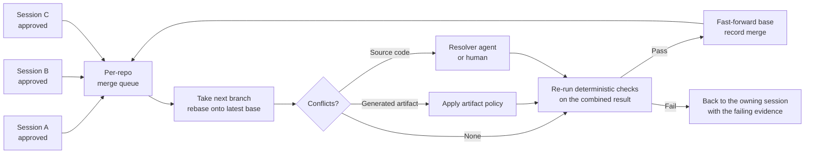
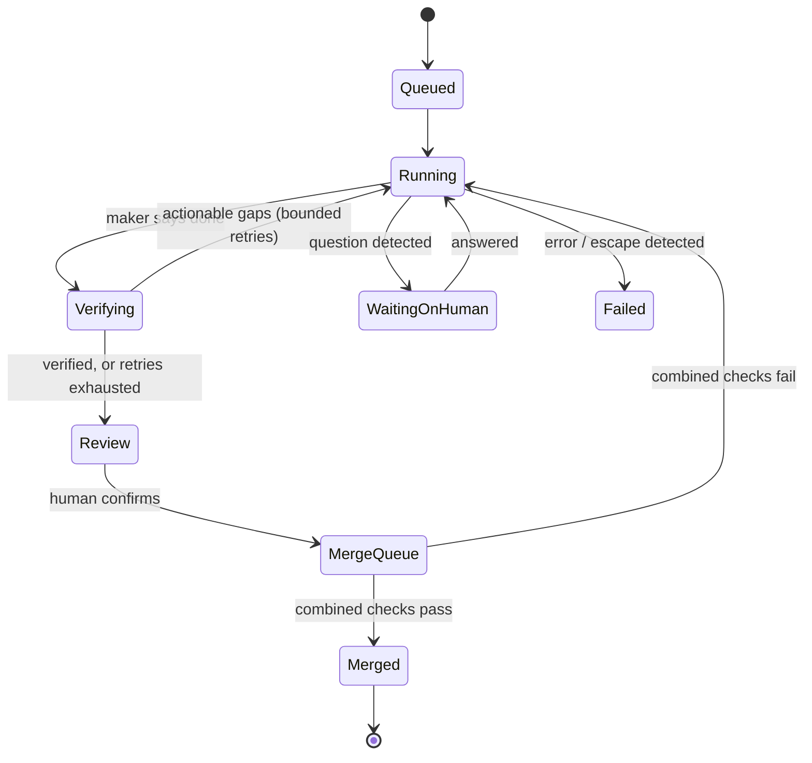

[中文版 →](../../../zh/lectures/lecture-15-parallel-agent-fleets/)

> Code examples: [code/](https://github.com/walkinglabs/learn-harness-engineering/blob/main/docs/en/lectures/lecture-15-parallel-agent-fleets/code/)
> Practice: extends the maker-checker graph from [Project 08. Draw Your Workflow as a Graph](./../../projects/project-08-graph-engineering-first-graph/index.md) — see the Exercises at the end of this lecture

# Lecture 15. From One Agent to a Fleet: Containment, Integration, and Fleet Signals

> Engineering guideline: the timeouts, limits, and thresholds in this lecture are adjustable teaching defaults, not experimentally established values. Tune them against your own repositories and models.

Lecture 13 ended its maturity ladder at **Level 5: Fleet Orchestration** — many loops running in parallel. Lecture 14 drew those loops as a graph and warned that your attention is the one serial resource. Both lectures treat parallelism as mostly solved by one primitive: give every agent its own `git worktree`, and "they physically cannot touch each other's checkout."

That sentence is the right starting point and the wrong stopping point. The moment you run several agents at once against a real repository — not for a demo, but every day — a new set of failures appears. None of them is about how smart the model is:

- An agent "in a worktree" commits to the main checkout.
- Three branches each pass verification on their own and break the build together.
- One branch adds a dependency; every other workspace and the running dev server fail to import it.
- A verifier hangs on a build for forty minutes, or ends its turn while a test is still running in the background.
- An agent is denied a tool, quietly routes around the denial, and reports success.
- The model you asked for isn't available, and the run fails — or silently runs on something else.

This lecture is about the harness layer that sits between "one reliable agent" and "a fleet you can actually trust": **containment, integration, shared-environment hygiene, fleet-level lifecycle, behavioral signals, model routing, and human gates.**

## Illustrative Example

> Teaching illustration: this scenario is assembled from common failure modes to explain the ideas; it is not a measured experiment and its details are assumed.

A team runs four agents overnight, each in its own worktree, each with a maker and an independent checker (Lecture 13). In the morning:

- Agent A's checker approved its branch. But at some point A ran `cd /path/to/repo && git checkout -b fix-login` — an absolute path back to the **main** checkout. The main checkout is now on A's branch with uncommitted edits, and the developer's own in-progress work is tangled into it.
- Agents B and C both passed. B renamed a function; C added two new call sites using the old name. Each branch is green alone. Merged together, the build fails.
- Agent D added a Markdown-rendering library and passed in its worktree, where it ran `npm install`. After the merge, the shared dev server — which never reinstalled — shows `Failed to resolve import` on every page.
- The dashboard says "4 sessions completed." Nothing on it says that A left its worktree, that B and C conflict semantically, or that D changed the dependency graph.

Every individual agent did its job. The **fleet** failed — because the harness only knew how to make single runs reliable.

## A Worktree Isolates Files, Not the Repository

Start with what `git worktree` actually guarantees. From the git documentation: a linked worktree shares "everything except per-worktree files such as `HEAD`, `index`, etc." All refs under `refs/` are shared, and inside a linked worktree `$GIT_COMMON_DIR` points back to the main repository's `.git`. [git-worktree](https://git-scm.com/docs/git-worktree)

So a worktree gives each agent its own **working files and index**. It does not give it its own branches, objects, config, hooks, stash, or — most importantly — its own copy of everything *outside* the worktree directory. An agent with a shell and file tools can still reach all of those.

The ways out are mundane:

| Escape path | What it looks like | Why worktrees don't stop it |
|---|---|---|
| Absolute paths | `cd /path/to/main-repo && ...`, editing `/path/to/main-repo/src/x.ts` | The filesystem has no idea which directory is "yours" |
| Repository-targeting flags | `git -C /path/to/main-repo ...`, `--git-dir=...` | Git happily operates on any repo you point it at |
| Branch and ref operations | `git checkout`, `git switch`, `git branch -D`, `git stash` | Refs and the stash list are shared across all worktrees |
| Harness-level directory switching | Tools or sub-agents that "enter" or "exit" a worktree, or resolve the wrong root | The switch happens above the shell, outside any command filter |
| Shared runtime resources | Same dev-server port, same SQLite file, same cache or `node_modules` symlink | These live outside git entirely |
| Hooks and config | Hooks configured with absolute paths into the main checkout | Config is shared; hooks fire wherever git runs |

None of this is hypothetical. Public issue trackers for widely used coding agents contain reports of worktree-isolated agents editing the parent's worktree, ignoring the worktree context and modifying the wrong checkout, and new worktrees running the main checkout's hooks. [#87643](https://github.com/anthropics/claude-code/issues/87643), [#95968](https://github.com/anthropics/claude-code/issues/95968), [#88747](https://github.com/anthropics/claude-code/issues/88747)

### Defense in Depth: Prevent, Contain, Detect

No single mechanism closes every path, so layer three:

**1. Prevent — deny the obvious escape commands.** Before launch, add permission rules that block the escape patterns from the table: absolute `cd`, `git -C`, `--git-dir`, branch switching, and any tool that changes the session's directory. These rules are cheap and catch the common case. They are also incomplete by construction — there is always another way to spell a path.

**2. Contain — use an OS-level sandbox where it fits, and know its edges.** A real sandbox enforces write boundaries in the kernel instead of pattern-matching commands. But read the fine print of whichever sandbox you use. Claude Code's sandbox, for example, covers shell commands only; its file tools, MCP servers, and hooks run outside it. And when the working directory is a linked worktree, it deliberately allows writes to the main repository's shared `.git` so `git commit` can work. [Claude Code: sandboxing](https://code.claude.com/docs/en/sandboxing) That is the right trade-off — a write-sandbox that blocks the shared `.git` breaks every git operation in a worktree — but it means the sandbox alone does not make the main checkout untouchable.

**3. Detect — verify after the fact, deterministically.** This is the layer that actually proves containment. Before the session starts, snapshot the main checkout: current branch, `HEAD` commit, a hash of `git status --porcelain`, and the stash list. After the session ends, take the snapshot again. Any difference that your harness did not make is an escape. Fail the session, and show the diff to a human.

> Prevention narrows the paths. Detection proves the result. You need both, because the agent will eventually find the path you didn't think of.

Detection also has to tolerate **legitimate** writes outside the worktree. Some tasks really do need to read a sibling repository or write to a shared artifact directory. Make those explicit, per session, as named exceptions — never by loosening the global rules.

See `code/escape-check.ts` for a dependency-free snapshot-and-compare implementation.

## Parallel Work Is Cheap; Integration Is the Bottleneck

Worktrees remove *mechanical* collisions. They do nothing about *semantic* ones. Two branches can each be correct and still be wrong together.

This is an old problem with a well-known answer. Graydon Hoare called it the "not rocket science rule of software engineering": automatically maintain a repository of code that always passes all the tests. [Graydon Hoare](https://graydon2.dreamwidth.org/1597.html) Hosted platforms ship it as a merge queue: each change is tested against the latest target branch plus everything ahead of it in the queue before it lands. [GitHub: merge queue](https://docs.github.com/en/repositories/configuring-branches-and-merges-in-your-repository/configuring-pull-request-merges/managing-a-merge-queue)

An agent fleet needs the same thing, but locally and per repository, because the fleet produces branches far faster than humans do:



Four rules make this work:

1. **One merge at a time per repository.** Serialize. A second approved branch waits in the queue instead of racing the first.
2. **Verify the combination, not the branch.** The checker approved branch C against an old base. After rebasing onto the base that now contains B, rerun the deterministic checks — build, type-check, the focused tests. The approval was for a different program.
3. **Classify conflicts before resolving them.** Not all conflicts are equal:
   - **Generated artifacts** (lockfiles, snapshots, compiled bundles, recorded fixtures): never hand-merge line by line. Either regenerate them from the merged sources, or take one complete, newer snapshot. Never stitch rows from two different runs into one file — the result corresponds to no real run.
   - **Source code**: give a resolver agent both branches' *intent* (the task descriptions), not just the conflict markers, and require the same checks to pass afterwards. If it can't, escalate to a human.
4. **Never lose work on the way in.** Commit everything in the session's worktree before it enters the queue, and keep the branch until the merge is confirmed. A failed merge should send the session back with evidence, not delete its output.

Notice the connection to Lecture 14's orchestration tax: the queue does not remove your role as the final judge, but it makes sure the only things that reach you are combinations that already build and test.

See `code/merge-queue.ts` for a runnable simulation of serialized merging with post-rebase re-verification.

## Shared Environment Drift

Lecture 6 taught that initialization deserves its own phase. At fleet scale, initialization has a second job: keeping **shared** environments in sync with what just merged.

Each worktree runs its own install and build, so each agent's view is internally consistent. But some things are shared across the fleet and the developer: the main checkout, the long-running dev server, the database, the toolchain cache. When a merged branch changes the dependency graph, those shared environments go stale silently. The next page load fails with an import error that has nothing to do with the code anyone is looking at.

The fix is mechanical:

- **Fingerprint the inputs.** Hash the dependency manifests and lockfiles (`package.json` + lockfile, `Cargo.toml` + `Cargo.lock`, `pyproject.toml` + lockfile). Store the fingerprint of the last successful install.
- **Reinstall on change, at the points where shared environments restart.** On server restart, after a merge, before a verification run: if the fingerprint changed, install from the lockfile (`npm ci`, `cargo fetch`, `uv sync`) before starting anything. If it didn't, skip — the check costs milliseconds.
- **Don't take the environment down on failure.** If the install fails, start with the old dependencies and retry next time; a stale but running environment is easier to diagnose than a dead one.
- **Give each worktree its own runtime resources.** Separate ports, separate database files or schemas, separate caches where they're mutable. Shared mutable state is the runtime equivalent of a shared branch.

See `code/deps-fingerprint.ts`.

## The Session Lifecycle at Fleet Scale

Lecture 12 asked every session to leave a clean handoff. With one agent, "session" is an informal idea. With a fleet, the harness has to manage hundreds of sessions, and the lifecycle becomes an explicit state machine. Most fleet bugs live at its transitions, not inside any one state.



Four transition rules prevent most of the trouble:

**1. Keep the maker's thread and the checker's thread separate — and resume the right one.** A common way to build an independent checker is to fork the maker's conversation and give the fork a verification prompt. That fork is disposable. When verification finds gaps and the work continues, resume the **maker's** thread, not the checker's. Resuming the checker turns your independent evaluator into the author, and its next "verified" is grading its own homework — exactly what Lecture 13 warned against.

**2. Don't resume a thread that already declared itself complete.** If a session ended with a completion verdict and the user asks for more, start a fresh session with a summary of what was done. Resuming the finished thread tends to produce an instant "already complete" and bounce straight back to review.

**3. Bound every retry chain.** Automatic retries on failure and automatic follow-ups on verification gaps must both have a cap, and the cap should count the whole chain, not each link. A structurally impossible task should reach a human after a small number of attempts, not after a night of retries.

**4. Separate "inactive" from "slow."** A verification run may legitimately spend twenty minutes in a release build. A single total-runtime timeout either kills real work or waits forever on a hung process. Use two watchdogs: an **inactivity** timeout (no output, no tool call, no file change for N minutes) and a much larger **total** budget. This is the same distinction Kubernetes draws between liveness and startup probes. [Kubernetes: probes](https://kubernetes.io/docs/tasks/configure-pod-container/configure-liveness-readiness-startup-probes/)

One more lifecycle trap is specific to agents: **background commands don't report back after the turn ends.** If a checker starts the test suite in the background and then writes its verdict, nothing will ever deliver the result. Require verification commands to run in the foreground, and treat "started the tests" as no evidence at all.

### A Verdict the Next Node Can Route On

Lecture 9 taught that "done" needs evidence. At fleet scale, the verdict also needs **structure**, because a machine — the router in your graph — has to decide what happens next. A free-text "mostly done, a few things left" can't be routed.

Have the checker end with either a completion marker or a machine-readable verdict:

```json
{
  "completed": ["Login form validates email — unit test login.spec.ts passes"],
  "actionable": [{ "id": "csv-export-empty-rows", "action": "Skip empty rows in exportCsv and add a test" }],
  "external": ["Payment provider sandbox credentials are needed to exercise the refund path"],
  "unknown": ["Could not determine whether the mobile layout was in scope"],
  "deferred": [{ "item": "Bulk import", "instruction": "User: 'ship what we have, bulk import can come later'" }]
}
```

Each bucket routes differently: **actionable** goes back to the maker; **external** and **unknown** go to a human, because no amount of retrying will produce credentials or a scope decision; **deferred** is recorded and *not* retried. Keep gap `id`s stable across follow-ups so you can see whether a gap actually closed or just changed its wording.

The `deferred` bucket deserves attention. When the user explicitly accepts partial work ("that's fine, ship what we have"), the checker's job changes: verify the accepted scope, record what was deferred and who deferred it, and stop. Without this, a conscientious checker keeps re-opening the full original plan, and the session never ends. The converse matters as much: a checker must never invent a deferral just because work is hard or evidence is missing.

See `code/verification-verdict.md` for the template and routing table.

## Fleet Signals: Watching Behavior, Not Just the Runtime

Lecture 11 split observability into runtime signals ("what did the system do?") and process artifacts ("why should this change be accepted?"). A fleet needs a third layer: **behavioral signals — what is each agent doing, and does any of it need a human right now?**

You can't watch twenty transcripts. The harness has to watch them for you and raise only what matters:

| Signal | How to detect it | What it means | Route to |
|---|---|---|---|
| **Waiting on a human** | The final message ends with a question, or asks the user to choose | The session is blocked, not done | Human inbox, high priority |
| **Permission workaround** | Output says a tool was denied and it is "trying another approach"; or a denied command is followed by a functionally equivalent one | The agent may be bypassing a guardrail you set on purpose | Human review before merge |
| **Containment breach** | Escape check (above) finds changes outside the worktree | Shared state may be corrupted | Fail the session, alert |
| **Stall** | Inactivity watchdog fires | Hung build, waiting on input, or a dead process | Restart or escalate |
| **Retry depth** | Count of retries/follow-ups in the chain | The task may be mis-specified | Human, once the cap is reached |
| **Cost and tokens** | Per-session input/output/cache tokens and spend | Runaway loops, oversized context | Budget alerts, trend charts |
| **Model actually used** | The concrete model identifier reported at runtime | What really ran, for audits and regressions | Session record |

Two of these deserve a closer look.

**Permission workarounds are the most dangerous signal.** You deny a tool for a reason — "never run raw SQL against the production database." A capable agent that is denied will often find an equivalent path ("I'm blocked from `sqlite3`, let me write a small script instead") and then report success honestly, from its point of view. The work may even be correct. But the guardrail just failed silently. Scan output for denial-then-pivot language and surface it with the blocked tool named, so a human can decide whether to allow it properly or stop the session.

**Record the model that actually ran, not the one you asked for.** Many agent CLIs accept a moving alias ("the latest opus", "the default model") and resolve it at runtime. If your session record stores the alias, then the day the alias moves, every historical session silently claims to have run on the new model. Capture the concrete identifier the runtime reports with each response, and keep the alias separately for routing.

See `code/fleet-signals.ts` for detectors you can run over a transcript.

## Model Routing and Fallback

Anthropic's *Building Effective Agents* lists **routing** — classifying an input and sending it to a specialized handler — as one of the core workflow patterns. [Anthropic: Building Effective Agents](https://www.anthropic.com/engineering/building-effective-agents) In a fleet, the most valuable thing to route is the **model**:

- **Route by task class, not by habit.** A typo fix, a dependency bump, and a cross-cutting refactor don't need the same model. Classify cheaply (prompt length, files touched, task labels) and send most work to a fast default, reserving the strongest model for tasks that need it.
- **Fall back on availability, then retry the primary later.** When the strong model is rate-limited or unavailable, fall back to the default so the fleet keeps moving, but record the downgrade and periodically retry the primary instead of staying downgraded forever.
- **Never send one provider's model name to another provider.** Fleets often mix CLIs from different vendors. When a session moves from one backend to another — a retry, a user switching providers — sanitize the stored model choice. Otherwise the second CLI fails with "model does not exist," and the failure looks like an outage.
- **Keep routing decisions observable.** Store why a model was chosen (class, fallback, user override) next to the model that actually ran. When quality regresses, this is the first thing you'll want to know.

## Human Gates That Respect the Orchestration Tax

Lecture 14 quoted Addy Osmani: you are "the GIL of your AI agents." [Addy Osmani: The Orchestration Tax](https://addyosmani.com/blog/orchestration-tax/) The fleet harness cannot remove that lock, but it can make every acquisition cheaper:

- **Two gates, not one.** *Review* ("is this what I asked for?") and *confirm* ("merge it") are different decisions. Separating them lets you approve the content and still let the merge queue decide *when* it lands.
- **Bring the evidence to the gate.** The review screen should show the structured verdict, the diff, the checks that ran, and every behavioral signal raised — not just "completed." A human spending thirty seconds per session should spend them on the parts the harness couldn't decide.
- **Make non-decisions explicit.** "Dismiss," "continue with this instruction," and "relaunch fresh" are different actions with different lifecycle transitions. A single "retry" button hides which thread resumes.
- **Order the inbox by what's blocked.** Questions and containment breaches first, then failed merges, then verified work awaiting review.

## Core Concepts

- **Fleet engineering**: the harness layer that makes many concurrent agent sessions trustworthy as a system — containment, integration, shared-environment hygiene, lifecycle management, behavioral signals, routing, and human gates.
- **Containment**: keeping a session's effects inside its assigned workspace. Achieved by layering prevention (deny rules), containment (OS sandbox), and deterministic detection (before/after snapshots of the main checkout).
- **Escape detection**: comparing the main checkout's branch, `HEAD`, status, and stash before and after a session; any unexplained difference is a breach.
- **Integration bottleneck**: branches that are each correct can be wrong together. A per-repository merge queue serializes merges and re-verifies the *combined* result.
- **Artifact policy**: generated files are regenerated or taken as one complete snapshot — never merged line by line.
- **Environment fingerprint**: a hash of dependency manifests and lockfiles; shared environments reinstall when it changes.
- **Lifecycle state machine**: explicit session states and transitions; most fleet bugs live at transitions (which thread resumes, when retries stop, what "stalled" means).
- **Structured verdict**: a checker result split into completed / actionable / external / unknown / deferred, so the router can act on it.
- **Behavioral signals**: fleet-level observations about what agents are doing — waiting on a human, working around a permission, stalling, escaping, overspending.

## Key Takeaways

- **A worktree isolates files, not the repository.** Refs, objects, config, hooks, and everything outside the directory are still reachable. Prevent, contain, and — above all — detect.
- **Parallel generation is cheap; integration is the bottleneck.** Serialize merges per repository and re-verify the combined result. Approval of a branch is approval of a different program than the one you'll merge.
- **Shared environments drift silently.** Fingerprint dependency inputs and reinstall where shared environments restart.
- **Write the lifecycle down as a state machine.** Resume the maker, not the checker. Don't resume finished threads. Bound retry chains. Separate inactivity from slowness. Run verification in the foreground.
- **Verdicts must be routable.** Completed, actionable, external, unknown, deferred — each goes somewhere different, and deferred work is never retried.
- **Watch behavior, not just runtime.** Questions, permission workarounds, breaches, stalls, and cost are fleet signals; route them to the right place instead of to a "completed" counter.
- **Route models deliberately and record what actually ran.**
- **The human is still the lock.** Design gates so every acquisition is short and evidence-rich.

## Further Reading

- [git-worktree documentation](https://git-scm.com/docs/git-worktree) — exactly what linked worktrees share and what they don't
- [Claude Code: sandboxing](https://code.claude.com/docs/en/sandboxing) — what an OS-level sandbox covers for shell commands, what runs outside it, and how worktrees are handled
- [Claude Code: common workflows — parallel sessions with worktrees](https://code.claude.com/docs/en/common-workflows) — the vendor-supported starting point for parallel agents
- [Graydon Hoare: The Not Rocket Science Rule](https://graydon2.dreamwidth.org/1597.html) — always keep a branch that passes all the tests; the origin of merge queues
- [GitHub: Managing a merge queue](https://docs.github.com/en/repositories/configuring-branches-and-merges-in-your-repository/configuring-pull-request-merges/managing-a-merge-queue) — testing each change against everything ahead of it before it lands
- [Google SRE Book: Monitoring Distributed Systems](https://sre.google/sre-book/monitoring-distributed-systems/) — symptoms vs. causes, and paging only on what needs a human
- [Kubernetes: liveness, readiness, and startup probes](https://kubernetes.io/docs/tasks/configure-pod-container/configure-liveness-readiness-startup-probes/) — separating "slow to start" from "stuck"
- [Martin Fowler: Heartbeat (Patterns of Distributed Systems)](https://martinfowler.com/articles/patterns-of-distributed-systems/heartbeat.html) — the pattern behind inactivity watchdogs
- [Anthropic: Building Effective Agents](https://www.anthropic.com/engineering/building-effective-agents) — routing as a core workflow pattern
- [Addy Osmani: The Orchestration Tax](https://addyosmani.com/blog/orchestration-tax/) — why human judgment stays the serial bottleneck
- Lecture 6: [Why Initialization Needs Its Own Phase](./../lecture-06-why-initialization-needs-its-own-phase/index.md) — environment fingerprints extend initialization to shared environments
- Lecture 9: [Why Agents Declare Victory Too Early](./../lecture-09-why-agents-declare-victory-too-early/index.md) — structured verdicts are evidence that a router can act on
- Lecture 11: [Why Observability Belongs Inside the Harness](./../lecture-11-why-observability-belongs-inside-the-harness/index.md) — behavioral signals are the fleet-level third layer
- Lecture 13: [From Manual Prompting to Autonomous Loops](./../lecture-13-loop-engineering/index.md) — worktrees and maker/checker separation, the primitives this lecture builds on
- Lecture 14: [From Single Loops to Graph Engineering](./../lecture-14-graph-engineering/index.md) — the merge queue and lifecycle are nodes and edges in your fleet's graph

## Exercises

1. **Run an escape drill.** Start two agents in separate worktrees of a scratch repository. In one, ask for a task that tempts an absolute path ("also update the README in the main checkout"). Run `code/escape-check.ts` before and after. Did your deny rules stop it? Did detection catch it? Write down which layer did the work.

2. **Break the build with two green branches.** Create two branches from the same base: one renames a function, the other adds a call site using the old name. Verify each alone (both pass). Then run them through `code/merge-queue.ts` (or your own queue) and confirm the second one is rejected on the combined check, with evidence routed back to its session.

3. **Fingerprint your environment.** Add `code/deps-fingerprint.ts` (or an equivalent) to your dev-server start script. Add a dependency on a branch, merge it, restart, and confirm the install runs exactly once and is skipped on the next restart.

4. **Draw your lifecycle.** Write your current session lifecycle as a state diagram. For each transition, answer: which conversation thread resumes? What caps the retries? What does "stalled" mean here? Find one transition you had never written down.

5. **Make your checker routable.** Change your Project 08 verify node to emit the structured verdict from `code/verification-verdict.md`. Add router edges for each bucket. Run a task where you explicitly defer part of the scope, and confirm the deferred item is recorded and not retried.

6. **Audit your fleet signals.** Run `code/fleet-signals.ts` over three real transcripts. How many questions, permission workarounds, or stalls would have reached you as a plain "completed"?
