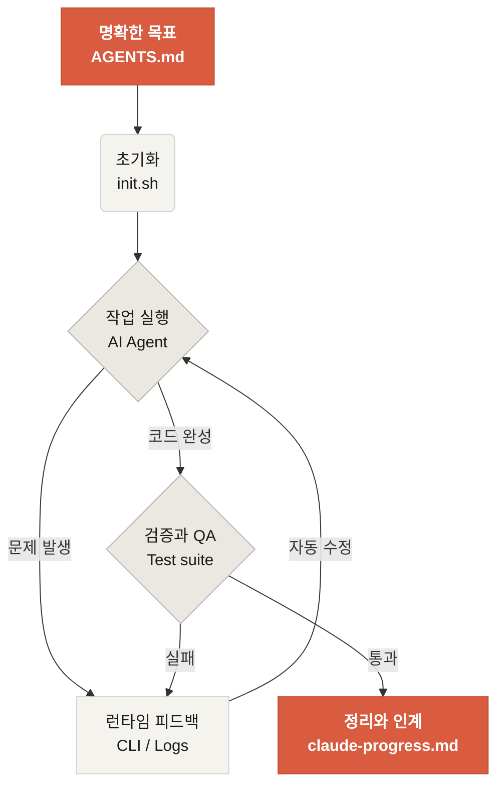

# Learn Harness Engineering에 오신 것을 환영합니다

Learn Harness Engineering은 AI 코딩 에이전트(coding agent)의 엔지니어링에 집중하는 강의입니다. 우리는 업계에서 가장 앞선 하네스 엔지니어링(Harness Engineering) 이론과 실천을 깊이 학습하고 정리했습니다. 핵심 참고 자료는 다음과 같습니다.

- [OpenAI: Harness engineering: leveraging Codex in an agent-first world](https://openai.com/index/harness-engineering/)
- [Anthropic: Effective harnesses for long-running agents](https://www.anthropic.com/engineering/effective-harnesses-for-long-running-agents)
- [Anthropic: Harness design for long-running application development](https://www.anthropic.com/engineering/harness-design-long-running-apps)
- [Awesome Harness Engineering](https://github.com/walkinglabs/awesome-harness-engineering)

이 강의는 체계적인 환경 설계, 상태(state) 관리, 검증(verification), 제어(control) 시스템을 통해 Codex와 Claude Code 같은 에이전트형 코딩 도구를 실제로 신뢰할 수 있게 만드는 방법을 가르칩니다. 명시적인 규칙과 경계로 AI 코딩 보조 도구를 제약하여, 기능을 구현하고 버그를 수정하며 개발 작업을 자동화하도록 돕습니다.

> 처음 보시는 용어가 많아도 괜찮습니다. 핵심 개념의 한국어·영어 대응표는 [용어집](./resources/reference/glossary.md)에 정리되어 있습니다.

## 시작하기

학습 경로를 선택해 시작하세요. 강의는 이론 강의, 실습 프로젝트, 즉시 사용 가능한 리소스 모음으로 구성됩니다.

  <a href="./lectures/lecture-01-why-capable-agents-still-fail/" class="card">
    <h3>강의(Lectures)</h3>
    
강력한 모델이 왜 여전히 실패하는지 이해하고, 효과적인 하네스의 이론을 배웁니다.

  </a>
  <a href="./projects/" class="card">
    <h3>프로젝트(Projects)</h3>
    
믿을 수 있는 에이전트 환경을 처음부터 직접 만들어 보는 실습입니다.

  </a>
  <a href="./resources/" class="card">
    <h3>리소스 모음(Resource Library)</h3>
    
여러분의 저장소에서 바로 쓸 수 있는 복사용 템플릿(AGENTS.md, feature_list.json 등)입니다.

  </a>

## 하네스의 핵심 메커니즘

하네스(harness)는 모델을 "더 똑똑하게" 만드는 도구가 아닙니다. 대신, 모델을 위한 닫힌 루프(closed loop) **작업 시스템**을 만들어 줍니다. 핵심 흐름은 다음 다이어그램으로 이해할 수 있습니다.

## 이 강의에서 배우는 것

본 강의를 완주하면 다음과 같은 핵심 개념을 다룰 수 있게 됩니다.

<ul class="index-list">
  <li><strong>에이전트 동작 제약</strong>: 명시적인 규칙과 경계로 에이전트의 행동 범위를 한정합니다.</li>
  <li><strong>컨텍스트(context) 유지</strong>: 장시간·다중 세션 작업에서도 컨텍스트를 잃지 않도록 합니다.</li>
  <li><strong>섣부른 완료 선언 방지</strong>: 에이전트가 너무 빨리 "끝났다"고 선언하지 못하게 합니다.</li>
  <li><strong>작업 검증</strong>: 전체 파이프라인 테스트와 자기 점검(self-reflection)으로 결과물을 검증합니다.</li>
  <li><strong>관측 가능성 확보</strong>: 런타임을 관측·디버깅 가능하게 만듭니다.</li>
</ul>

## 다음 단계

핵심 개념이 익숙해졌다면, 다음 자료로 한 걸음 더 들어가 보세요.

<ul class="index-list">
  <li><a href="./lectures/lecture-01-why-capable-agents-still-fail/">강의 01: 유능한 에이전트가 여전히 실패하는 이유</a> — 하네스 엔지니어링의 이론적 출발점입니다.</li>
  <li><a href="./projects/project-01-baseline-vs-minimal-harness/">프로젝트 01: 베이스라인(Baseline) vs 미니멀 하네스(Minimal Harness)</a> — 첫 실제 과제를 처음부터 진행해 봅니다.</li>
  <li><a href="./resources/templates/">템플릿(Templates)</a> — 미니멀 하네스 팩(AGENTS.md, feature_list.json, claude-progress.md)을 자신의 프로젝트에 바로 적용해 보세요.</li>
</ul>
