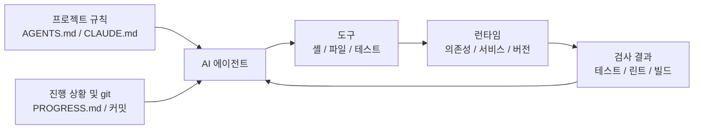

[中文版本 →](../../../zh/lectures/lecture-02-what-a-harness-actually-is/)

> 코드 예제: [code/](https://github.com/walkinglabs/learn-harness-engineering/blob/main/docs/en/lectures/lecture-02-what-a-harness-actually-is/code/)
> 실습 프로젝트: [Project 01. Prompt-only vs. rules-first](./../../projects/project-01-baseline-vs-minimal-harness/index.md)

# 강의 02. 하네스란 실제로 무엇인가

"하네스(harness)"라는 단어는 AI 코딩 에이전트 분야에서 자주 언급되지만, 솔직히 말하면 대부분의 사람들이 하네스라고 할 때 "프롬프트 파일"을 의미합니다. 그것은 하네스가 아닙니다. 재료만 있고 가스레인지도, 칼도, 레시피도, 플레이팅 워크플로도 없이 레스토랑을 여는 것과 같습니다. 그것은 레스토랑이 아닙니다. 냉장고입니다.

이 강의에서는 정확하고 실행 가능한 하네스의 정의를 제시합니다. 학술적 추상이 아니라 오늘 바로 활용할 수 있는 프레임워크입니다: 하네스는 명확한 책임과 평가 기준을 가진 다섯 가지 하위 시스템으로 구성됩니다.

## 비유로 시작하기

문서도 없고, 코드에 주석도 없고, 테스트 실행 방법도 아무도 알려주지 않고, CI 설정은 어딘가에 묻혀 있는 프로젝트에 갑자기 투입된 신규 엔지니어를 상상해보십시오. 좋은 코드를 작성할 수 있을까요? 충분히 똑똑하고 인내심이 있다면 가능할 수도 있습니다. 하지만 "문제를 해결하는 것"보다 "이 프로젝트가 뭔지 파악하는 것"에 엄청난 시간을 쏟게 됩니다.

AI 에이전트도 정확히 같은 상황에 놓입니다. 그리고 더 나쁩니다 — 여러분은 적어도 동료에게 물어볼 수 있습니다. 에이전트는 여러분이 앞에 놓아준 파일과 실행할 수 있는 명령어만 볼 수 있습니다. 누군가를 톡 치면서 "이 프로젝트가 어떤 버전의 ORM을 사용해요?"라고 물을 수 없습니다.

OpenAI는 핵심 원칙을 "저장소(repo)가 명세(spec)다"로 정의합니다 — 필요한 모든 컨텍스트(context)는 저장소에 있어야 하며, 구조화된 지시 파일, 명시적 검증(verification) 명령어, 명확한 디렉터리 구성을 통해 전달되어야 합니다. Anthropic의 장기 실행 에이전트 문서는 상태(state) 지속성, 명시적 복구 경로, 구조화된 진행 추적을 강조합니다. 두 회사는 서로 다른 측면에 집중하지만 같은 말을 합니다: **모델 외부의 엔지니어링 인프라 전체가 모델의 역량이 실제로 얼마나 발휘되는지를 결정합니다.**

이미 알고 있는 도구들을 살펴보십시오:

**Claude Code**는 하네스 사고를 구현합니다. 저장소에서 `CLAUDE.md`를 읽고(레시피 선반), 셸 명령어를 실행할 수 있으며(칼 랙), 로컬 환경에서 실행되고(가스레인지), 세션 기록을 유지하며(준비 스테이션), 테스트를 실행하고 결과를 볼 수 있습니다(품질 확인 창). 하지만 테스트 실행 방법을 알려주지 않으면 품질 확인 창이 고장납니다 — 요리가 완전히 익었는지 아무도 알 수 없습니다.

**Cursor**도 유사한 논리를 따릅니다. `.cursorrules` 파일이 레시피 선반이고, 터미널이 칼 랙이며, 프로젝트 구조와 린트 설정을 읽는 것이 가스레인지입니다. 하지만 Cursor의 상태 관리는 상대적으로 취약합니다 — IDE를 닫고 다시 열면 이전 컨텍스트가 사라집니다.

**Codex**(OpenAI의 코딩 에이전트)는 git 워크트리(worktree)를 사용하여 각 작업의 런타임 환경을 격리하고, 로컬 관찰 가능성 스택(로그, 메트릭, 트레이스)과 결합하여 모든 변경 사항이 독립적인 환경에서 검증됩니다. `AGENTS.md`와 명확한 검증 명령어가 있는 저장소에서는 "맨손" 저장소보다 훨씬 뛰어난 성능을 발휘합니다.

**AutoGPT**는 경고의 사례입니다 — 구조화된 상태 관리의 부재로 장시간 작업에서 컨텍스트가 축적되고, 정밀한 피드백 메커니즘의 부재로 에이전트가 루프에 빠집니다. 많은 사람들이 AutoGPT가 "작동하지 않는다"고 말하지만, 실제로는 AutoGPT의 하네스가 작동하지 않는 것입니다 — 고장난 가스레인지에 주방장을 배치하면 아무리 좋은 재료도 요리가 되지 않습니다.

## 핵심 개념

- **하네스(harness)란 무엇인가**: 모델 가중치 외부의 엔지니어링 인프라 전체. OpenAI는 엔지니어의 핵심 업무를 세 가지로 정리합니다: 환경 설계, 의도 표현, 피드백 루프 구축. Anthropic은 자사의 Claude Agent SDK를 "범용 에이전트 하네스"라고 부릅니다.
- **저장소는 단일 진실 원천(SoR)이다**: 에이전트가 볼 수 없는 것은 실질적으로 존재하지 않습니다. OpenAI는 저장소를 "시스템 오브 레코드(SoR, system of record)"로 취급합니다 — 모든 필요한 컨텍스트는 구조화된 파일과 명확한 디렉터리 구성을 통해 저장소에 있어야 합니다.
- **지도를 줘라, 매뉴얼이 아니라**: OpenAI의 경험 — `AGENTS.md`는 백과사전이 아니라 디렉터리 페이지여야 합니다. 100줄 정도가 적당합니다. 맞지 않으면 `docs/` 디렉터리로 분리하여 에이전트가 필요할 때 읽도록 하십시오.
- **제약하되, 마이크로매니지하지 마라**: 좋은 하네스는 실행 가능한 규칙으로 에이전트를 제약하지, 지시를 하나하나 열거하지 않습니다. OpenAI는 "불변성을 강제하되, 구현을 마이크로매니지하지 말라"고 말합니다. Anthropic은 에이전트가 자신의 작업을 자신만만하게 칭찬한다는 것을 발견했으며, 해결책은 "일하는 사람"과 "확인하는 사람"을 분리하는 것입니다.
- **컴포넌트를 하나씩 제거하라**: 각 하네스 컴포넌트의 가치를 정량화하려면 하나씩 제거하고 어떤 제거가 가장 큰 성능 저하를 유발하는지 확인하십시오. Anthropic은 이 방법을 사용했으며, 모델이 강해질수록 일부 컴포넌트는 더 이상 핵심적이지 않지만 새로운 컴포넌트가 항상 등장한다는 것을 발견했습니다.

## 5개 하위 시스템 하네스 모델

주방 비유로 돌아가봅시다. 완전한 주방에는 다섯 가지 기능 구역이 있고, 하네스에도 다섯 가지 하위 시스템이 있습니다:



**지시 하위 시스템(레시피 선반)**: `AGENTS.md`(또는 `CLAUDE.md`)를 만들어 다음을 포함하십시오: 프로젝트 개요와 목적(한 문장), 기술 스택과 버전(Python 3.11, FastAPI 0.100+, PostgreSQL 15), 첫 실행 명령어(`make setup`, `make test`), 협상 불가능한 HARD 제약("모든 API는 OAuth 2.0을 사용해야 함"), 더 자세한 문서 링크.

**도구 하위 시스템(칼 랙)**: 에이전트가 충분한 도구 접근권을 갖도록 하십시오. "보안"을 위해 셸을 비활성화하지 마십시오 — 에이전트가 `pip install`조차 실행할 수 없다면 어떻게 작업하겠습니까? 하지만 모든 것을 열어두지도 마십시오 — 최소 권한 원칙을 따르십시오.

**환경 하위 시스템(가스레인지)**: 환경 상태가 자기 서술적이도록 만드십시오. 의존성 잠금을 위해 `pyproject.toml` 또는 `package.json`을 사용하고, 런타임 버전을 위해 `.nvmrc` 또는 `.python-version`을, 재현성을 위해 Docker 또는 devcontainers를 사용하십시오.

**상태(state) 하위 시스템(준비 스테이션)**: 장시간 작업에는 진행 추적이 필요합니다. 간단한 `PROGRESS.md` 파일을 사용하여 기록하십시오: 완료된 것, 진행 중인 것, 차단된 것. 매 세션 종료 전에 업데이트하고, 다음 세션 시작 시 읽으십시오.

**피드백 하위 시스템(품질 확인 창)**: 이것이 투자 대비 효과가 가장 높은 하위 시스템입니다. `AGENTS.md`에 검증 명령어를 명시적으로 나열하십시오:
```
검증 명령어:
- 테스트: pytest tests/ -x
- 타입 검사: mypy src/ --strict
- 린트: ruff check src/
- 전체 검증: make check (위 모두 포함)
```

하위 시스템 하나라도 빠지면 주방의 기능 구역 하나가 없는 것과 같습니다 — 요리는 할 수 있지만 항상 불편합니다.

**하네스 품질 진단**: "등압 모델 제어(isometric model control)"를 사용하십시오. 모델을 고정하고 하위 시스템을 하나씩 제거하면서 어떤 제거가 가장 큰 성능 저하를 유발하는지 측정하십시오. 그것이 병목 — 거기에 집중하십시오. 주방에서 병목을 찾는 것처럼: 레시피 선반을 없애고 얼마나 느려지는지 보고, 가스레인지를 끄고 영향을 확인하십시오.

## 한 팀의 실제 이야기

한 팀이 TypeScript + React 프론트엔드 앱(약 20,000줄)에 GPT-4o를 사용했습니다. 필수적으로 주방 장비를 하나씩 추가하는 4단계를 거쳤습니다:

**1단계 — 빈 주방**: README에 기본 프로젝트 설명만 있음. 5번 실행 중 1번 성공(20%). 주요 실패: 잘못된 패키지 매니저 선택(npm vs yarn), 컴포넌트 명명 컨벤션 미준수, 테스트 실행 불가.

**2단계 — 레시피 선반 설치**: 기술 스택 버전, 명명 컨벤션, 주요 아키텍처 결정이 담긴 `AGENTS.md` 추가. 성공률 60%로 상승. 남은 실패는 주로 환경 문제와 검증 누락.

**3단계 — 품질 확인 창 개방**: `AGENTS.md`에 검증 명령어 나열: `yarn test && yarn lint && yarn build`. 성공률 80%로 상승.

**4단계 — 준비 스테이션 준비**: 에이전트가 매 실행마다 완료된 작업과 미완료 작업을 기록하는 진행 파일 템플릿 도입. 성공률 80-100%로 안정화.

4번의 반복, 모델은 전혀 바꾸지 않았고, 성공률은 20%에서 거의 100%로. 그것이 하네스 엔지니어링의 힘입니다. 더 비싼 재료를 구매한 것이 아닙니다 — 주방을 제대로 정리한 것입니다.

## 핵심 정리

- 하네스 = 지시 + 도구 + 환경 + 상태(state) + 피드백. 다섯 가지 하위 시스템, 주방의 다섯 가지 기능 구역처럼 — 모두 필수입니다.
- 모델 가중치가 아니라면 모두 하네스입니다. 하네스가 모델 역량이 얼마나 발휘되는지를 결정합니다.
- 다섯 가지 하위 시스템 중 피드백 하위 시스템이 일반적으로 가장 낮은 투자로 가장 높은 수익을 냅니다. 검증 명령어를 먼저 맞추십시오 — 품질 확인 창이 가장 가치 있는 업그레이드입니다.
- "등압 모델 제어"를 사용하여 각 하위 시스템의 한계 기여도를 정량화하십시오 — 직감에 의존하지 마십시오.
- 하네스는 코드처럼 부패합니다. 정기적으로 감사하고 기술 부채를 갚듯 하네스 부채를 갚으십시오.

## 더 읽을거리

- [OpenAI: Harness Engineering](https://openai.com/index/harness-engineering/)
- [Anthropic: Effective Harnesses for Long-Running Agents](https://www.anthropic.com/engineering/effective-harnesses-for-long-running-agents)
- [HumanLayer: Harness Engineering for Coding Agents](https://humanlayer.dev/articles/harness-engineering-for-coding-agents/)
- [SWE-agent: Agent-Computer Interfaces](https://github.com/princeton-nlp/SWE-agent)
- [Thoughtworks: Harness Engineering on Technology Radar](https://www.thoughtworks.com/radar)

## 연습 문제

1. **5개 하위 시스템 하네스 감사**: AI 에이전트를 사용하는 프로젝트를 가져와 5개 하위 시스템 프레임워크를 사용하여 완전한 감사를 수행하십시오. 각 하위 시스템에 1-5점을 매기십시오. 점수가 가장 낮은 하위 시스템을 찾아 30분을 개선에 투자하고, 에이전트 성능의 변화를 관찰하십시오.

2. **등압 모델 제어 실험**: 모델 하나와 도전적인 작업 하나를 선택하십시오. 지시(AGENTS.md 삭제), 피드백(검증 명령어 미제공), 상태(진행 파일 없음)를 순차적으로 제거하되 한 번에 하나씩만 제거하고 성능 저하를 측정하십시오. 결과를 기반으로 프로젝트에서 하위 시스템 중요도를 순위 매기십시오.

3. **어포던스 분석**: 프로젝트에서 에이전트가 "하고 싶지만 할 수 없는" 시나리오(예: 매개변수화된 쿼리를 사용해야 하지만 프로젝트의 ORM 패턴을 모르는 경우)를 찾으십시오. 이것이 실행의 간극(Gulf of Execution, 방법을 모름)인지 아니면 평가의 간극(Gulf of Evaluation, 맞는지를 모름)인지 분석한 다음, 이를 해소할 하네스 개선 방안을 설계하십시오.
