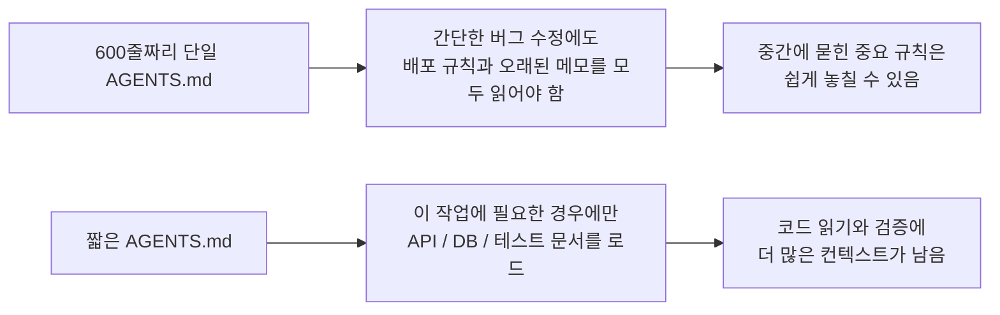
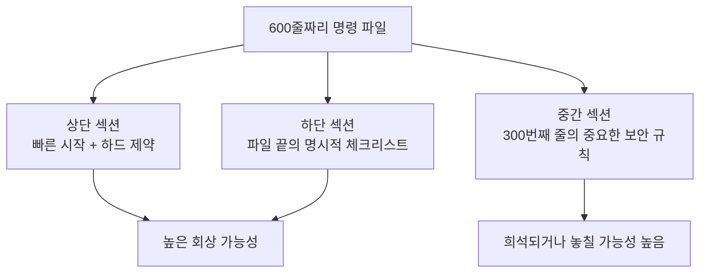

[中文版本 →](../../../zh/lectures/lecture-04-why-one-giant-instruction-file-fails/)

> 코드 예제: [code/](https://github.com/walkinglabs/learn-harness-engineering/blob/main/docs/en/lectures/lecture-04-why-one-giant-instruction-file-fails/code/)
> 실습 프로젝트: [Project 02. 에이전트가 읽을 수 있는 작업 공간](./../../projects/project-02-agent-readable-workspace/index.md)

# 강의 04. 명령 파일을 여러 파일로 분산하라

하네스 엔지니어링(harness engineering)에 진지하게 임하기 시작했습니다. `AGENTS.md`를 만들고, 떠오르는 모든 규칙과 제약과 교훈을 그 안에 빼곡히 담았습니다. 한 달이 지나자 파일이 300줄로 불었고, 두 달 뒤엔 450줄, 세 달 뒤엔 600줄이 됐습니다. 그런데 에이전트(agent) 성능이 오히려 나빠지고 있다는 것을 알게 됩니다. 간단한 버그 수정을 할 때도 에이전트가 불필요한 배포 명령을 처리하느라 컨텍스트(context)를 낭비하고, 300번째 줄에 묻혀 있는 중요한 보안 제약은 완전히 무시되며, 서로 모순된 코드 스타일 규칙 세 개를 매번 임의로 골라 따릅니다.

이것이 "거대한 명령 파일" 함정입니다. 여행 가방을 과도하게 채우는 것과 같습니다. 모든 물건이 필요해 보여서 계속 욱여넣다 보면 지퍼가 터질 지경이 됩니다. 속옷 한 장을 찾으려면 가방 전체를 비워야 합니다. 가득 찬 가방을 들고 다니지만, 실제로 꺼내 쓰는 물건은 그 중 3분의 1도 안 됩니다.

## 근본 원인: 악순환

가장 흔한 악순환은 이렇게 진행됩니다. 에이전트가 실수를 하면, "이걸 막을 규칙을 추가하자"라는 생각에 AGENTS.md에 규칙을 넣습니다. 잠시 효과가 있습니다. 에이전트가 다른 실수를 하면, 또 규칙을 추가합니다. 이 과정을 반복하다 보면 파일은 걷잡을 수 없이 커집니다.

이것은 여러분의 잘못이 아닙니다. "문제가 생기면 규칙을 추가한다"는 반응은 매우 자연스럽습니다. 외출할 때마다 "혹시 몰라서" 가방에 물건을 하나씩 더 챙기는 것과 같습니다. 하지만 누적 효과는 치명적입니다. 구체적으로 무엇이 잘못되는지 살펴보겠습니다.

**컨텍스트 예산이 잠식됩니다.** 에이전트의 컨텍스트 윈도(context window)는 유한합니다. 에이전트에게 200K 토큰 윈도가 있다고 가정하면, 비대해진 명령 파일이 10~20K 토큰을 먹어치울 수 있습니다. 아직 여유가 있어 보이나요? 하지만 복잡한 작업은 수십 개의 소스 파일을 읽어야 하고, 도구 실행 결과도 컨텍스트를 차지하며, 대화 기록도 쌓입니다. 에이전트가 코드를 이해해야 할 때쯤이면 예산은 이미 빠듯합니다. "혹시 몰라서" 챙긴 물건들로 가득 찬 가방에 노트북을 넣을 자리가 없는 것과 같습니다.

**중간에서 길을 잃습니다(Lost in the Middle).** "Lost in the Middle" 논문(Liu et al., 2023)은 LLM이 긴 텍스트의 중간에 있는 정보를 처음이나 끝에 있는 정보보다 훨씬 덜 효과적으로 활용한다는 것을 명확히 증명했습니다. AGENTS.md가 600줄이고 300번째 줄에 "모든 데이터베이스 쿼리는 매개변수화된 쿼리를 사용해야 한다"는 보안 하드 제약이 있다면, 그것은 중간에 묻혀 있어 에이전트가 거의 확실히 무시할 것입니다. 과도하게 채운 여행 가방 바닥의 선크림과 같습니다. 있다는 건 알지만 세 번을 뒤져도 못 찾아서 결국 새로 하나 삽니다.

**우선순위 충돌이 발생합니다.** 파일은 협상 불가능한 하드 제약("절대 eval()을 사용하지 말 것"), 중요한 설계 지침("함수형 스타일을 선호할 것"), 그리고 특정 역사적 교훈("지난주에 WebSocket 메모리 누수를 고쳤으니 유사 패턴을 주의할 것")을 뒤섞어 놓습니다. 이 세 규칙의 중요도는 완전히 다르지만 파일 안에서는 동일하게 보입니다. 에이전트가 이를 구별할 신뢰할 만한 신호가 없습니다. 여행 가방 안에서 여권과 충전 케이블이 뒤엉켜 있는 것처럼, 어느 쪽이 더 긴급한지 알 수 없습니다.

**유지보수 붕괴가 옵니다.** 큰 파일은 본질적으로 유지보수하기 어렵습니다. 오래된 명령은 좀처럼 삭제되지 않습니다. 삭제의 결과가 불확실하기 때문입니다("어쩌면 다른 규칙이 이것에 의존하고 있을지도?"). 반면 새 명령을 추가하는 것은 공짜처럼 느껴집니다. 결과적으로 파일은 오로지 커지기만 하고 줄어들지 않으며, 신호 대 잡음비(SNR)는 지속적으로 하락합니다. 이것은 소프트웨어의 기술 부채 축적과 정확히 같습니다.

**모순이 쌓입니다.** 서로 다른 시점에 추가된 명령들이 서로 충돌하기 시작합니다. 한쪽은 "TypeScript strict 모드를 사용하라"고 하고, 다른 쪽은 "일부 레거시 파일은 any 타입을 허용한다"고 합니다. 에이전트는 매번 하나를 임의로 골라 따릅니다. 엄마가 "따뜻하게 입어라", 아빠가 "너무 두껍게 입지 마라"라고 하는 상황에서 문 앞에 서서 누구 말을 들어야 할지 모르는 것과 같습니다.

## 핵심 개념

- **명령 비대화(Instruction Bloat)**: 명령 파일이 컨텍스트 윈도의 10~15%를 초과하면 코드 읽기와 작업 추론에 쓸 예산을 잠식하기 시작합니다. 600줄짜리 `AGENTS.md`는 10,000~20,000 토큰을 소비할 수 있으며, 이는 에이전트가 시작하기도 전에 128K 윈도의 8~15%가 소진되는 것입니다.
- **중간 손실 효과(Lost in the Middle Effect)**: Liu et al.의 2023년 연구는 LLM이 긴 텍스트의 중간 정보를 처음이나 끝 정보보다 훨씬 덜 효과적으로 활용한다는 것을 증명했습니다. 600줄 파일의 300번째 줄에 묻힌 중요한 제약은 사실상 무시될 가능성이 매우 높습니다.
- **명령 신호 대 잡음비(SNR)**: 파일 안의 명령 중 현재 작업과 관련된 비율입니다. 버그 수정 중에 배포 명령 50줄을 읽어야 한다면, 그것은 낮은 SNR입니다.
- **라우팅 파일(Routing File)**: 모든 것을 담는 것이 아니라 에이전트를 더 상세한 문서로 안내하는 것이 핵심 기능인 짧은 진입 파일. 50~200줄이면 충분합니다.
- **점진적 공개(Progressive Disclosure)**: 먼저 개요 정보를 제공하고, 필요할 때 상세 정보를 제공합니다. 좋은 하네스 설계는 좋은 UI 설계와 같습니다. 모든 옵션을 한 번에 사용자에게 쏟아붓지 않습니다.
- **우선순위 모호성(Priority Ambiguity)**: 모든 명령이 같은 형식과 위치에 나타나면, 에이전트는 협상 불가능한 하드 제약과 권장적인 소프트 가이드라인을 구별할 수 없습니다.

## 명령 아키텍처





## 분산하는 방법

핵심 원칙: 자주 필요한 정보는 손에 닿는 곳에, 가끔 필요한 정보는 치워두고, 결코 쓰지 않을 정보는 버립니다.

진입 파일인 `AGENTS.md`는 50~200줄로 유지하며, 가장 자주 사용하는 항목만 담습니다. 프로젝트 개요(한두 문장), 첫 실행 명령(`make setup && make test`), 전역 하드 제약(협상 불가능한 규칙 최대 15개), 그리고 주제 문서 링크(한 줄 설명 + 적용 조건)입니다.

```markdown
# AGENTS.md

## 프로젝트 개요
Python 3.11 FastAPI 백엔드, PostgreSQL 15 데이터베이스.

## 빠른 시작
- 설치: `make setup`
- 테스트: `make test`
- 전체 검증: `make check`

## 하드 제약
- 모든 API는 OAuth 2.0 인증을 사용해야 함
- 모든 데이터베이스 쿼리는 SQLAlchemy 2.0 문법을 사용해야 함
- 모든 PR은 pytest + mypy --strict + ruff check를 통과해야 함

## 주제 문서
- [API 설계 패턴](docs/api-patterns.md) — 엔드포인트 추가 시 필독
- [데이터베이스 규칙](docs/database-rules.md) — 데이터베이스 작업 수정 시 필독
- [테스트 표준](docs/testing-standards.md) — 테스트 작성 시 참조
```

각 주제 문서는 50~150줄이며, `docs/` 디렉터리 또는 해당 모듈 옆에 주제별로 정리됩니다. 에이전트는 필요할 때만 읽습니다. 여행 가방 안의 패킹 큐브와 같습니다. 속옷은 한 큐브에, 세면도구는 다른 큐브에, 충전기는 세 번째 큐브에. 전체 가방을 비우지 않아도 원하는 것을 찾을 수 있습니다.

일부 정보는 코드 안에 직접 배치하는 것이 더 낫습니다. 타입 정의, 인터페이스 주석, 설정 파일의 설명 등입니다. 에이전트는 코드를 읽을 때 자연스럽게 이것들을 보게 되므로, 명령 파일에 중복할 필요가 없습니다.

모든 명령에는 출처("이 규칙은 왜 추가됐는가?"), 적용 조건("이 규칙은 언제 필요한가?"), 만료 조건("어떤 상황에서 이 규칙을 제거할 수 있는가?")이 있어야 합니다. 정기적으로 감사하고, 오래되거나 중복되거나 모순된 항목을 제거합니다. 코드 의존성을 관리하듯 명령을 관리하세요. 사용하지 않는 의존성은 삭제해야 합니다. 그렇지 않으면 시스템이 느려질 뿐입니다.

명령이 반드시 진입 파일에 있어야 한다면, 맨 위나 맨 아래에 두세요. 절대 중간에 두지 마세요. "중간 손실" 효과는 LLM이 양 끝의 정보를 중간보다 훨씬 더 잘 활용한다는 것을 알려줍니다. 하지만 더 나은 접근법은 명령을 주제 문서로 옮겨 필요할 때만 로드하는 것입니다.

OpenAI와 Anthropic 모두 분산 접근 방식을 암묵적으로 지지합니다. OpenAI는 진입 파일이 "짧고 라우팅 중심"이어야 한다고 말하고, Anthropic은 장기 실행 에이전트 제어 정보가 "간결하고 높은 우선순위"여야 한다고 말합니다. 둘 다 같은 말을 하고 있습니다. 모든 것을 하나의 파일에 구겨 넣지 말라는 것입니다. 여행 가방도 정리가 필요합니다. 무작정 욱여넣는 것이 아니라.

## 실제 사례

한 SaaS 팀의 `AGENTS.md`가 50줄에서 600줄로 불었습니다. 내용은 기술 스택 버전, 코딩 표준, 역사적 버그 수정 메모, API 사용 가이드, 배포 절차, 팀원들의 개인 선호도가 뒤섞여 있었습니다. 여행 가방이 터질 지경이었습니다.

에이전트 성능이 눈에 띄게 저하되기 시작했습니다. 간단한 버그 수정 중에도 에이전트가 관련 없는 배포 명령을 처리하느라 많은 컨텍스트를 낭비했고, "모든 데이터베이스 쿼리는 매개변수화된 쿼리를 사용해야 한다"는 보안 제약이 300번째 줄에 묻혀 자주 무시됐으며, 서로 모순된 코드 스타일 규칙 세 개가 에이전트의 임의적인 행동을 유발했습니다.

팀은 "여행 가방 재정리"를 실행했습니다.
1. `AGENTS.md`를 80줄로 줄임: 프로젝트 개요, 실행 명령, 전역 하드 제약 15개만 남김
2. 주제 문서 생성: `docs/api-patterns.md`(120줄), `docs/database-rules.md`(60줄), `docs/testing-standards.md`(80줄)
3. 라우팅 파일에 주제 문서 링크 추가
4. 역사적 메모는 테스트 케이스로 전환하거나 삭제

리팩터링 후: 동일 작업 세트 성공률이 45%에서 72%로 올랐습니다. 보안 제약 준수율은 60%에서 95%로 상승했는데, 이는 파일 중간에서 라우팅 파일 상단으로 이동해 더 이상 "중간에서 길을 잃지" 않게 됐기 때문입니다.

## 핵심 정리

- "규칙 추가"는 단기 진통제이고 장기 독약입니다. 규칙을 추가하기 전에 먼저 물어보세요: 이게 주제 문서에 더 적합하지 않을까요? 가방에 물건을 계속 욱여넣지 마세요.
- 진입 파일은 라우터이지 백과사전이 아닙니다. 50~200줄에 개요, 하드 제약, 링크만 담으세요.
- "중간 손실" 효과를 활용하세요: 중요한 정보는 위나 아래에, 덜 중요한 정보는 주제 문서로 이동합니다.
- 명령 비대화를 기술 부채처럼 관리하세요. 정기적인 감사, 모든 명령에 출처·적용 조건·만료 조건이 필요합니다.
- 분산 후 SNR이 개선되고 에이전트는 관련 없는 명령을 처리하는 대신 실제 작업에 더 많은 컨텍스트 예산을 씁니다.

## 더 읽어보기

- [OpenAI: Harness Engineering](https://openai.com/index/harness-engineering/)
- [Anthropic: Effective Harnesses for Long-Running Agents](https://www.anthropic.com/engineering/effective-harnesses-for-long-running-agents)
- [Lost in the Middle: How Language Models Use Long Contexts](https://arxiv.org/abs/2307.03172)
- [HumanLayer: Harness Engineering for Coding Agents](https://humanlayer.dev/articles/harness-engineering-for-coding-agents/)
- [Nielsen Norman Group: Progressive Disclosure](https://www.nngroup.com/articles/progressive-disclosure/)

## 연습 문제

1. **SNR 감사**: 현재 진입 명령 파일을 가져와 모든 명령 항목을 나열하세요. 흔한 작업 유형 5가지를 골라 각 명령이 해당 작업과 관련 있는지 표시하세요. 각 작업 유형별 SNR을 계산하세요. 대부분의 작업에서 잡음인 명령은 주제 문서로 이동해야 합니다.

2. **점진적 공개 리팩터**: 300줄 이상의 명령 파일이 있다면 다음으로 분리하세요: (a) 100줄 미만의 라우팅 파일, (b) 3~5개의 주제 문서. 분리 전후에 동일한 작업 세트(최소 5개)를 실행하고 성공률을 비교하세요.

3. **중간 손실 검증**: 긴 명령 파일에서 중요한 제약을 각각 맨 위, 중간, 맨 아래에 배치하고 동일한 작업 세트를 실행하세요(위치당 최소 5회). 준수율에 차이가 있는지 확인하세요. 위치 효과가 얼마나 강력한지 놀랄 수도 있습니다.
