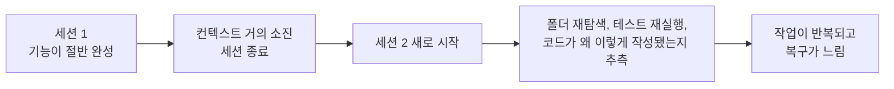
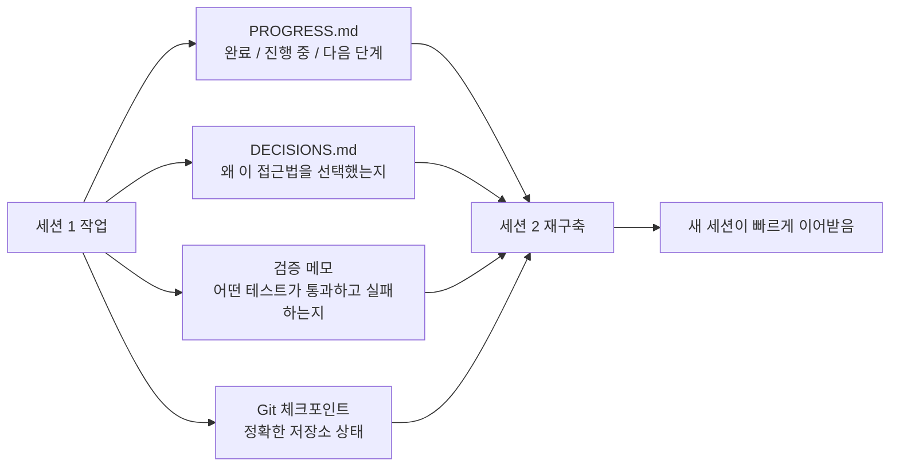

[中文版本 →](../../../zh/lectures/lecture-05-why-long-running-tasks-lose-continuity/)

> 코드 예제: [code/](https://github.com/walkinglabs/learn-harness-engineering/blob/main/docs/en/lectures/lecture-05-why-long-running-tasks-lose-continuity/code/)
> 실습 프로젝트: [Project 03. 멀티 세션 연속성](./../../projects/project-03-multi-session-continuity/index.md)

# 강의 05. 세션을 넘어 컨텍스트를 살아있게 유지하라

Claude Code에게 완전한 기능을 구현하도록 요청합니다. 30분 동안 실행되며 대부분의 작업을 완료하지만 컨텍스트(context)가 거의 소진됩니다. 계속하기 위해 새 세션을 시작하면, 지난번에 어떤 결정이 내려졌는지, 왜 옵션 A가 아닌 옵션 B가 선택됐는지, 어떤 파일이 이미 수정됐는지, 테스트 상태가 어떤지를 기억하지 못한다는 것을 발견합니다. 프로젝트를 재탐색하는 데 15분을 쓰고, 이전 접근법과 일관성이 없을 수도 있습니다.

매일 아침 일어나면 모든 것을 잊어버리는 장인을 상상해 보세요. 건설 현장 전체를 다시 파악해야 합니다. 어떤 벽이 반쯤 지어졌는지, 왜 파란 벽돌이 아닌 빨간 벽돌을 선택했는지, 배관 공사가 어디까지 진행됐는지를요. 더 나쁜 경우, 어제 이미 설치된 창문을 그것이 완료됐다는 것을 기억하지 못해서 뜯어낼 수도 있습니다.

이것이 바로 장기 작업에서 AI 코딩 에이전트(agent)가 처한 딜레마입니다. 이 강의는 에이전트가 장기 작업 중에 "블랙아웃"되는 이유와, 구조화된 상태(state) 영속화가 에이전트를 신뢰할 수 있는 일일 일지를 갖춘 장인으로 만드는 방법을 설명합니다. 여전히 건망증이 있지만, 일지가 모든 것을 기억합니다.

## 컨텍스트 윈도는 무한하지 않습니다

컨텍스트 윈도는 유한합니다. 이것은 모델 업그레이드로 해결할 수 없는 문제입니다. 윈도 크기가 1M 토큰으로 커지더라도 복잡한 작업은 결국 소진될 것입니다. 에이전트는 단순히 코드를 생성하는 것이 아닙니다. 코드베이스를 이해하고, 자신의 결정 이력을 추적하고, 도구 출력을 처리하고, 대화 컨텍스트를 유지합니다. 이 모든 정보는 윈도 확장보다 빠르게 증가합니다.

더 깊은 문제가 있습니다. 에이전트가 생성하는 정보가 균등하게 중요하지 않다는 것입니다. 중간 추론 단계에는 결정의 "왜"가 담겨 있습니다. 왜 옵션 A가 아닌 옵션 B를 선택했는지, 왜 이 라이브러리를 저 라이브러리 대신 사용했는지, 왜 특정 최적화를 건너뛰었는지를요. 최종 출력에는 "무엇"만 담겨 있습니다. 코드 자체입니다. 컴팩션(compaction) 전략은 보통 후자를 보존하지만 전자를 잃습니다. 다음 세션은 코드를 보지만 왜 그렇게 작성됐는지 알지 못하며, 의도적인 설계 결정을 "최적화"해 버릴 수도 있습니다.

Anthropic은 자신들의 장기 실행 에이전트 연구에서 흥미로운 사실을 발견했습니다. 에이전트가 컨텍스트가 소진되고 있다고 느끼면 "조기 수렴" 행동을 보인다는 것입니다. 현재 작업을 서둘러 마무리하고, 검증 단계를 건너뛰거나, 최적의 해결책 대신 간단한 해결책을 선택합니다. 시험에서 시간이 얼마 남지 않았다는 것을 깨닫고 나머지 객관식 문제에 급하게 임의로 답을 채워넣는 것과 같습니다. Anthropic은 이를 "컨텍스트 불안(context anxiety)"이라고 부릅니다.

## 세션 연속성(continuity) 흐름

연속성 산출물(continuity artifacts)이 없으면 모든 새 세션은 재앙입니다.



연속성 산출물이 있으면 새 세션이 빠르게 이어받을 수 있습니다.



## 핵심 개념

- **컨텍스트 윈도는 유한합니다**: 어떤 윈도 크기가 주장되더라도(128K, 200K, 1M), 긴 작업은 결국 소진됩니다. 소진 후에는 컴팩션(정보 손실) 또는 리셋(새 세션)이 필요합니다. 둘 다 무언가를 잃습니다.
- **연속성 산출물**: 새 세션이 이전 세션이 중단한 곳에서 명확하게 재개할 수 있도록 해주는 영속화된 상태 파일입니다. 기본 형태: 진행 로그 + 검증(verification) 기록 + 다음 행동. 그 장인의 일지입니다.
- **재구축 비용(Rebuild cost)**: 새 세션이 실행 가능한 상태에 도달하는 데 필요한 시간. 좋은 하네스는 재구축 비용을 15분에서 3분으로 줄일 수 있습니다.
- **드리프트(Drift)**: 에이전트의 이해와 코드 저장소(repository)의 실제 상태 사이의 간극. 모든 세션 경계는 드리프트를 유발하며, 통제하지 않으면 누적됩니다.
- **컨텍스트 불안(Context anxiety)**: Anthropic이 관찰한 현상으로, 에이전트가 인식된 컨텍스트 한계에 접근하면 조기 수렴 행동을 보이며 정보 손실을 피하기 위해 작업을 일찍 마무리합니다. 비합리적인 자원 불안입니다.
- **컴팩션 vs 리셋**: 컴팩션은 동일 세션 내에서 초기 대화를 요약합니다("무엇"은 유지하지만 "왜"를 잃을 수 있음). 리셋은 새 세션을 열어 영속화된 상태에서 재구축합니다(깔끔하지만 산출물 완전성에 의존함).

## 연속성이 깨지면 어떤 일이 벌어지나

이전 세션은 상당한 컨텍스트 예산을 사용해 세 가지 접근법을 분석하고 옵션 B를 선택했습니다. 이번 세션의 에이전트는 그 분석을 모르고 불완전한 정보를 바탕으로 다시 결정을 내릴 수 있습니다. 왜 빨간 벽돌이 선택됐는지 기억하지 못하는 건망증 장인이 오늘 파란 벽돌을 보고 더 예쁘다고 생각해 어제 쌓은 벽을 허물고 다시 짓는 것과 같습니다.

더 나쁜 것은 중복 작업입니다. 에이전트가 특정 작업이 이미 완료됐는지 확인할 수 없어 다시 합니다. 또는 더 나쁜 경우, 절반만 하다가 기존 구현과의 충돌을 발견하고 다시 작업해야 합니다. 건설 현장에서 두 팀이 동시에 같은 벽을 지을 수 없습니다. 하지만 진행 기록이 없으면 새 팀은 누군가가 이미 그것을 하고 있다는 것을 알 수 없습니다.

여러 세션에 걸쳐 구현 방향이 원래 요구사항에서 조용히 벗어났을 수도 있습니다. 각 새 세션은 프로젝트 목표에 대해 약간 다른 이해를 가집니다. 전화 전달 게임처럼, 열 명이 메시지를 전달한 후 "커피 한 잔 가져다 줘"가 "커피 머신을 사줘"가 될 수 있습니다.

검증 격차도 있습니다. 이전 세션의 검증 결과(어떤 테스트가 통과하고, 실패하고, 왜 실패하는지)가 기록되지 않았습니다. 새 세션은 현재 상태를 이해하기 위해 모든 검증을 다시 실행해야 합니다. 매 세션마다 처음부터 진단하고, 매번 귀중한 컨텍스트를 낭비합니다.

OpenAI와 Anthropic 모두 자신들의 문서에서 구조화된 상태 영속화를 강조합니다. OpenAI의 하네스 엔지니어링 기사는 저장소를 "운영 기록"으로 취급합니다. 모든 작업의 결과는 저장소에 추적 가능한 증거를 남겨야 합니다. Anthropic의 장기 실행 에이전트 문서는 "핸드오프(handoff) 파일"을 명시적으로 권장합니다. 현재 상태, 알려진 이슈, 다음 행동을 담은 구조화된 문서입니다.

## 건망증 장인을 위한 일지

핵심 접근법: **에이전트를 건망증이 있는 뛰어난 엔지니어처럼 취급하세요.** "퇴근" 전에 다음 "교대" 에이전트가 빠르게 이어받을 수 있도록 중요한 정보를 적어두어야 합니다.

**도구 1: 진행 파일(PROGRESS.md).** 가장 기본적인 연속성 산출물, 일지의 핵심입니다.

```markdown
# 프로젝트 진행 상황

## 현재 상태
- 최신 커밋: abc1234 (feat: add user preferences endpoint)
- 테스트 상태: 42/43 통과 (test_pagination_edge_case 실패)
- 린트: 통과

## 완료된 항목
- [x] 사용자 모델 및 데이터베이스 마이그레이션
- [x] 기본 CRUD 엔드포인트
- [x] 인증 미들웨어 통합

## 진행 중
- [ ] 페이지네이션 기능 (90% - 엣지 케이스 테스트 실패 중)

## 알려진 이슈
- test_pagination_edge_case가 빈 결과 세트에서 500을 반환함
- 삭제된 사용자가 목록에 표시돼야 하는지 확인 필요

## 다음 단계
1. 페이지네이션 엣지 케이스 버그 수정
2. "삭제된 사용자 포함" 쿼리 매개변수 추가
3. API 문서 업데이트
```

**도구 2: 결정 로그(DECISIONS.md).** 중요한 설계 결정과 이유를 기록합니다. 상세한 설계 문서가 필요하지 않습니다. "어떤 결정, 왜, 언제"만 있으면 됩니다. 일지의 메모입니다.

```markdown
# 설계 결정

## 2024-01-15: 사용자 선호도 캐싱에 Redis 사용
- 이유: 읽기 빈도 높음 (모든 API 호출), 데이터 크기 작음
- 거부된 대안: PostgreSQL 구체화 뷰 (변경 빈도가 높아 유지보수 비용이 수지에 맞지 않음)
- 제약: 캐시 TTL 5분, 쓰기 시 능동적 무효화
```

**도구 3: Git 커밋을 체크포인트로.** 각 원자적 작업 단위 완료 후 커밋합니다. 커밋 메시지는 무엇을 했고 왜 했는지를 설명해야 합니다. 이것은 무료로 자동으로 버전이 관리되는 상태 스냅샷입니다.

**도구 4: init.sh 또는 하네스 초기화 흐름.** `AGENTS.md`에 "출근"과 "퇴근" 루틴을 명시합니다.

```markdown
## 세션 시작 시 (출근)
1. PROGRESS.md를 읽어 현재 상태 파악
2. DECISIONS.md를 읽어 중요 결정 파악
3. make check를 실행해 저장소가 일관된 상태인지 확인
4. PROGRESS.md의 "다음 단계" 섹션에서 이어서 진행

## 세션 종료 전 (퇴근)
1. PROGRESS.md 업데이트
2. make check를 실행해 일관된 상태 확인
3. 완료된 모든 작업 커밋
```

**혼합 전략**: 모든 작업에 컨텍스트 리셋이 필요하지 않습니다. 짧은 작업(30분 이하)은 한 세션 내에서 완료할 수 있습니다. 긴 작업(세션에 걸쳐 있는)은 연속성을 위해 진행 파일과 결정 로그를 사용해야 합니다. 결정 기준: 작업에 윈도의 60% 이상이 필요하다면 핸드오프(handoff) 준비를 시작하세요.

### 컨텍스트 불안 깊이 보기

Anthropic의 2026년 3월 연구는 컨텍스트 불안의 구체적인 발현을 추가로 밝혔습니다. Sonnet 4.5에서 컨텍스트가 윈도 한계에 접근하면 에이전트가 강한 "조기 수렴" 행동을 보입니다. 시험에서 시간이 거의 다 됐다는 것을 깨닫고 객관식 문제에 급하게 임의 답을 채워넣는 것과 같습니다.

두 가지 전략으로 이에 대처합니다.

**컴팩션**: 같은 세션 내에서 초기 대화를 요약합니다. 장점: 연속성을 유지하며 에이전트가 "무엇"을 볼 수 있습니다. 단점: "왜"는 요약에서 자주 사라집니다. 왜 옵션 B가 옵션 A 대신 선택됐는지, 왜 특정 최적화가 건너뛰어졌는지요. 더 결정적으로, 컴팩션은 컨텍스트 불안을 없애지 않습니다. 에이전트는 컨텍스트가 한때 컸다는 것을 알고, 심리적으로 여전히 종결을 서두르는 경향이 있습니다.

**컨텍스트 리셋**: 컨텍스트를 완전히 지우고, 새 세션을 열고, 영속화된 산출물에서 재구축합니다. 장점: 깨끗한 정신 상태로 새 세션에는 "시간이 촉박하다"는 불안이 없습니다. 단점: 핸드오프 산출물의 완전성에 의존합니다. 일지에 중요한 정보가 빠져 있으면 새 세션이 잘못된 방향으로 시간을 낭비할 수 있습니다.

Anthropic의 실제 데이터: Sonnet 4.5에서 컨텍스트 불안이 심각해서 컴팩션만으로는 충분하지 않으며, 컨텍스트 리셋이 하네스 설계의 중요한 구성 요소가 됩니다. 하지만 Opus 4.5에서는 이 행동이 크게 줄어들어 컴팩션으로 리셋에 의존하지 않고 컨텍스트를 관리할 수 있습니다. 이것이 의미하는 바: **하네스 설계는 대상 모델에 대한 구체적인 이해가 필요하며, 일률적인 템플릿이 아닙니다.**

> 출처: [Anthropic: Harness design for long-running application development](https://www.anthropic.com/engineering/harness-design-long-running-apps)

## 실제 사례

에이전트에게 사용자 인증이 있는 블로그 시스템 구현을 맡겼습니다. 기능 포인트 12개, 예상 5세션이 필요합니다.

**일지 없는 기준선**: 세션 1에서 사용자 모델과 기본 라우트를 구현했습니다. 세션 2는 에이전트가 인증 미들웨어의 인터페이스 계약을 기억하지 못해 이전 설계 의도를 추론하는 데 약 15분을 썼습니다. 세션 3에서는 누적된 드리프트로 에이전트가 이미 완료된 기능을 다시 구현하기 시작했습니다. 세션 5에서는 저장소에 중복 코드가 많았지만 핵심 인증 기능은 여전히 엔드투엔드 테스트를 통과하지 못했습니다. 12개 기능 포인트 중 7개만 완료됐고, 3개는 숨겨진 정확성 문제가 있었습니다. 일지를 쓰지 않는 장인처럼, 5일째 건설 현장은 혼돈입니다. 어떤 벽은 두 번 지어졌고, 지어져야 했던 어떤 벽은 시작도 안 됐습니다.

**일지 있는 경우**: 진행 파일, 결정 로그, 검증 기록, git 체크포인트를 사용했습니다. 각 세션 종료 시 상태 보고서가 자동으로 업데이트됐습니다. 세션 2의 재구축 비용이 약 3분으로 줄었습니다. 세션 5에서 12개 기능 포인트 모두 완료되고 검증됐습니다.

정량적 비교: 재구축 시간이 약 78% 감소했고, 기능 완료율은 58%에서 100%로, 숨겨진 결함율은 43%에서 8%로 낮아졌습니다. 장인은 여전히 건망증이 있지만, 일지 덕분에 매일 어제가 멈춘 곳에서 시작합니다. 처음부터가 아니라.

## 핵심 정리

- 컨텍스트 윈도는 유한한 자원입니다. 긴 작업은 세션에 걸쳐 이어지고, 세션은 정보를 잃습니다. 매일 잊어버리는 장인처럼, 이것은 객관적인 현실입니다.
- 해결책은 더 큰 윈도가 아닙니다. 더 나은 상태 영속화입니다. 진행 파일 + 결정 로그 + git 체크포인트로 건망증 장인에게 신뢰할 수 있는 일지를 제공하세요.
- 에이전트를 건망증 있는 엔지니어처럼 취급하세요. "퇴근" 전에 무엇을 했는지, 왜 했는지, 다음은 무엇인지를 적어두세요.
- 재구축 비용이 핵심 지표입니다. 좋은 하네스는 새 세션이 3분 이내에 실행 가능한 상태에 도달하도록 해야 합니다.
- 혼합 전략: 짧은 작업은 세션 내에서, 긴 작업은 구조화된 산출물로 연속성을 유지합니다.

## 더 읽어보기

- [Anthropic: Effective Harnesses for Long-Running Agents](https://www.anthropic.com/engineering/effective-harnesses-for-long-running-agents)
- [OpenAI: Harness Engineering](https://openai.com/index/harness-engineering/)
- [Lost in the Middle: How Language Models Use Long Contexts](https://arxiv.org/abs/2307.03172)
- [Claude Code Documentation](https://docs.anthropic.com/en/docs/claude-code)
- [HumanLayer: Harness Engineering for Coding Agents](https://humanlayer.dev/articles/harness-engineering-for-coding-agents/)

## 연습 문제

1. **연속성 손실 측정**: 최소 3세션이 필요한 개발 작업을 고르세요. 연속성 산출물을 제공하지 않고, 각 세션 시작 시 에이전트가 "지난번에 무슨 일이 있었는지" 파악하는 데 얼마나 많은 컨텍스트를 소비하는지 기록하세요. 각 세션 후 진행 파일을 만들고 다음 세션이 그것에서 시작하게 하세요. 진행 파일 있을 때와 없을 때의 재구축 비용을 비교하세요.

2. **핸드오프 템플릿 설계**: 네 개의 필드를 가진 최소 핸드오프(handoff) 템플릿을 설계하세요: 저장소 상태(커밋 해시), 실행 상태(테스트 통과율), 차단 항목, 다음 행동. 완전히 새로운 에이전트 세션이 오직 이 템플릿만을 사용해 프로젝트 상태를 복원하게 하세요. 복원 중 만난 모호함을 기록하고, 템플릿을 개선하세요.

3. **혼합 전략 실험**: 5세션짜리 개발 작업에서 세 가지 전략을 비교하세요: (a) 항상 새 세션 시작 + 진행 파일, (b) 한 세션에서 최대한 많이 하기(컨텍스트 컴팩션), (c) 혼합 전략(짧은 작업은 세션 내, 긴 작업은 세션 간 + 진행 파일). 재구축 시간, 기능 완료율, 결정 일관성을 비교하세요.
