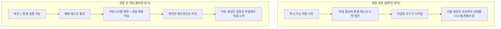

[中文版本 →](../../../zh/lectures/lecture-06-why-initialization-needs-its-own-phase/)

> 코드 예제: [code/](https://github.com/walkinglabs/learn-harness-engineering/blob/main/docs/en/lectures/lecture-06-why-initialization-needs-its-own-phase/code/)
> 실습 프로젝트: [Project 03. 멀티 세션 연속성](./../../projects/project-03-multi-session-continuity/index.md)

# 강의 06. 모든 에이전트 세션 전에 초기화하라

새 에이전트(agent) 세션을 시작하고 "검색 기능을 추가해줘"라고 말합니다. 에이전트가 바로 코딩에 뛰어듭니다. 훌륭한 열정입니다. 20분 후 테스트 프레임워크가 제대로 설정되지 않았다는 것을 발견하고, 그것을 수정하는 데 10분을 더 씁니다. 그러다 데이터베이스 마이그레이션 스크립트 형식이 잘못됐다는 것을 알게 되어 또 수정합니다. 검색 기능은 결국 추가되지만, 전체 세션이 비효율적이었습니다. 대부분의 시간이 검색 기능을 작성하는 것이 아닌 "이 프로젝트가 어떻게 작동하는지 파악하기"에 사용됐습니다.

더 나은 접근법은 이렇습니다. 에이전트가 작업을 시작하기 전에, 별도의 단계를 사용해 기본 환경을 준비하고, 검증 명령이 통과하도록 하고, 프로젝트 구조를 이해합니다. 집을 짓는 것과 같습니다. 기초를 붓고 동시에 벽을 세우지 않습니다. 그렇게 하면 기초가 굳기 전에 벽이 올라가고, 건물 전체를 허물고 다시 시작해야 합니다. 먼저 기초를 붓고, 굳힌 다음, 벽을 세웁니다. 깔끔하고 효율적입니다.

이 강의는 초기화(initialization)가 구현과 혼합되지 않고 왜 별도의 단계여야 하는지 설명합니다.

## 기초와 벽: 근본적으로 다른 두 가지 작업

초기화와 구현은 완전히 다른 최적화 목표를 가집니다. 구현 단계는 검증된 기능의 수량과 품질을 극대화하는 것을 최적화합니다. 초기화(initialization) 단계는 이후 모든 구현의 신뢰성과 효율성을 극대화하는 것을 최적화합니다.

초기화와 구현을 혼합하면 에이전트는 다중 목표 최적화 문제에 직면합니다. 동시에 인프라를 구축하고 기능 코드를 작성합니다. 명시적인 우선순위 설정 없이는 에이전트가 자연스럽게 코드 작성을 선호합니다(직접 보이는 출력이기 때문에). 인프라는 희생됩니다(그 가치는 이후 세션에서만 나타나기 때문에). 건설 팀에게 동시에 기초를 붓고 벽을 세우라고 하는 것과 같습니다. 팀은 벽이 보이고 보여줄 수 있으니 서두를 것입니다. 하지만 기초가 나쁜 집은 나중에 체계적인 문제를 가집니다.

## 초기화 생명주기



## 혼합했을 때 어떤 일이 벌어지나

가장 직접적인 문제: 기초가 제대로 굳지 않습니다. 에이전트가 기능 코드에 80%의 노력을 쓰고 인프라 설정에 20%만 임시로 씁니다. 테스트 프레임워크가 설정됐지만 검증되지 않았고, 린트 규칙이 설정됐지만 너무 느슨하고, 진행 파일이 만들어지지 않았습니다. 이 결함은 첫 번째 세션에서 명확하지 않습니다(에이전트가 무엇을 했는지 여전히 기억하기 때문에). 하지만 두 번째 세션에서 표면화됩니다. 새 에이전트는 실행 방법, 테스트 방법, 상황이 어떤지를 알지 못합니다. 기초가 부실하면 건물이 흔들립니다.

더 숨겨진 비용은 "미검증 누적"입니다. 테스트 프레임워크가 설정되기 전에 작성된 기능 코드는 검증 없는 코드입니다. 마침내 그 코드에 테스트를 추가하러 돌아갈 때, 처음부터 설계가 잘못됐다는 것을 발견할 수도 있습니다. 알았더라면 다르게 구현했을 것입니다. 젖은 콘크리트 위에 타일을 붙이는 것과 같습니다. 바닥이 평평하지 않다는 것을 발견하면 모든 타일을 들어내고 다시 해야 합니다.

세션 예산도 낭비됩니다. 초기화 작업(환경 설정, 테스트 구성, 프로젝트 구조 이해)이 상당한 예산을 소비해 실제 기능 구현에 남는 것이 적습니다. 결과: 첫 번째 세션에서 기능의 절반만 완료되고, 두 번째 세션은 프로젝트를 다시 이해하는 것부터 시작해야 합니다. 기초에 예산을 썼지만 기초도 단단하지 않습니다. 어떤 목표도 달성하지 못합니다.

가장 쉽게 간과하는 문제는 암묵적 가정의 지뢰밭입니다. 에이전트가 초기화 중에 내리는 결정들(어떤 테스트 프레임워크, 디렉터리 구성 방식, 의존성 관리)이 명시적으로 기록되지 않으면 이후 세션이 이러한 선택을 이해할 수 없습니다. 더 나쁜 경우, 이후 세션이 상충되는 선택을 할 수도 있습니다. 첫 번째 건설 팀이 콘크리트 기초를 사용했는데 두 번째 팀은 그것을 모르고 그 위에 나무 말뚝을 박습니다. 기초가 갈라집니다.

Anthropic의 장기 실행 애플리케이션 개발 연구는 초기화와 구현을 분리할 것을 명시적으로 권장합니다. 그들의 실험 데이터: 전용 초기화 단계를 사용한 프로젝트는 멀티 세션 시나리오에서 혼합 접근법 대비 기능 완료율이 31% 높았습니다. 핵심 통찰은 초기화 단계에 투자한 시간이 이후 3~4세션에서 완전히 회수된다는 것입니다. 기초가 견고할수록 벽이 더 빨리 올라갑니다.

OpenAI의 Codex 하네스 엔지니어링 가이드도 "저장소(repository)를 운영 기록으로" 원칙을 강조합니다. 첫 번째 실행에서 명확한 운영 구조를 확립하거나, 모든 새 세션이 프로젝트 컨벤션을 다시 추론해야 합니다.

## 핵심 개념

- **초기화 단계(Initialization Phase)**: 에이전트 생명주기의 첫 번째 단계로, 기능 구현이 없고 이후 모든 구현 단계의 전제 조건을 확립하는 것만 합니다. 출력은 코드가 아니라 인프라입니다.
- **부트스트랩 계약(Bootstrap Contract)**: 새로운 에이전트 세션이 프로젝트를 명확하게 운영할 수 있는 조건입니다. 시작할 수 있고, 테스트할 수 있고, 진행 상황을 볼 수 있고, 다음 단계를 파악할 수 있어야 합니다. 네 가지 조건이 모두 필요합니다.
- **콜드 스타트(Cold Start) vs 웜 스타트(Warm Start)**: 콜드 스타트는 에이전트가 프로젝트 구조를 추측해야 하는 빈 디렉터리에서 시작하는 것입니다. 웜 스타트는 인프라가 이미 갖춰진 템플릿이나 기존 프로젝트에서 시작하는 것입니다. 웜 스타트가 콜드 스타트보다 훨씬 우수합니다. 물과 전기가 들어오는 현장에서 작업을 시작하는 것과 황량한 땅에서 시작하는 것의 차이입니다.
- **핸드오프 준비성(Handoff Readiness)**: 어느 순간이든 프로젝트가 새로운 에이전트가 인계받을 수 있는 상태인 것. 구두 설명이 필요 없고, 저장소 내용만으로 충분합니다.
- **첫 번째 검증까지의 시간(Time to First Verification)**: 프로젝트 시작부터 첫 번째 기능 포인트가 검증을 통과할 때까지의 시간. 초기화 효율성을 측정하는 핵심 지표입니다.
- **다운스트림 사용성(Downstream Usability)**: 초기화 품질을 측정하는 가장 좋은 방법. 암묵적 지식에 의존하지 않고 성공적으로 작업을 실행할 수 있는 이후 세션의 비율.

## 초기화를 올바르게 하는 방법

**초기화를 전용 단계로 취급하세요.** 첫 번째 세션은 초기화만 합니다. 비즈니스 기능 코드는 전혀 없습니다. 초기화가 생성하는 것:

**1. 실행 가능한 환경.** 프로젝트가 시작되고, 의존성이 설치되고, 환경 문제가 없습니다. 기초를 부었고, 균열이 없습니다.

**2. 검증 가능한 테스트 프레임워크.** 최소한 하나의 예제 테스트가 통과합니다. 이것은 테스트 프레임워크 자체가 제대로 설정됐다는 것을 증명합니다. 기초 위에 기둥을 세워 무게를 지탱할 수 있음을 증명하는 것과 같습니다.

**3. 부트스트랩 계약 문서.** 이후 세션에 다음을 알려주는 명확한 문서:
```markdown
# 초기화 계약

## 시작 명령
- 의존성 설치: `make setup`
- 개발 서버 시작: `make dev`
- 테스트 실행: `make test`
- 전체 검증: `make check`

## 현재 상태
- 모든 의존성 설치 및 잠금
- 테스트 프레임워크 설정됨 (Vitest + React Testing Library)
- 예제 테스트 통과 (1/1)
- 린트 규칙 설정됨 (ESLint + Prettier)

## 프로젝트 구조
- src/ — 소스 코드
- src/components/ — React 컴포넌트
- src/api/ — API 클라이언트
- tests/ — 테스트 파일
```

**4. 작업 분해.** 전체 프로젝트를 순서가 있는 작업 목록으로 분리하고, 각 작업에 명확한 인수 기준을 부여합니다.
```markdown
# 작업 분해

## 작업 1: 사용자 인증 기본
- JWT 인증 미들웨어 구현
- 로그인/회원가입 엔드포인트 추가
- 인수 기준: pytest tests/test_auth.py 모두 통과

## 작업 2: 사용자 프로필 페이지
- 사용자 프로필 CRUD 구현
- 프로필 편집 폼 추가
- 인수 기준: pytest tests/test_profile.py 모두 통과

## 작업 3: 검색 기능
- ...
```

**5. Git 커밋을 체크포인트로.** 초기화가 완료되면 깨끗한 체크포인트를 커밋합니다. 이후 모든 작업은 이 체크포인트에서 시작합니다.

**웜 스타트 전략**: 빈 디렉터리에서 시작하지 마세요. 프로젝트 템플릿(create-react-app, fastapi-template 등)을 사용해 표준 디렉터리 구조, 의존성 설정, 테스트 프레임워크를 미리 설정하세요. 일반적인 초기화 단계를 템플릿에 굽고, 프로젝트별 초기화 작업만 남깁니다. 물과 전기가 들어오는 현장에서 작업을 시작하는 것과 같습니다. 황량한 땅에서 시작하는 것보다 만 배 낫습니다.

**초기화 완료 기준**: "얼마나 많은 코드를 작성했는가"가 아니라, 부트스트랩 계약의 네 가지 조건이 충족됐는지 여부입니다. 시작할 수 있고, 테스트할 수 있고, 진행 상황을 볼 수 있고, 다음 단계를 파악할 수 있어야 합니다. 이 체크리스트로 초기화를 검증하세요:

```markdown
## 초기화 인수 체크리스트
- [ ] `make setup`이 처음부터 성공함
- [ ] `make test`에 최소한 하나의 통과하는 테스트가 있음
- [ ] 새 에이전트 세션이 저장소 내용만으로 "실행 방법"과 "테스트 방법"을 답할 수 있음
- [ ] 최소 3개의 작업이 있는 작업 분해 파일이 존재함
- [ ] 모든 것이 git에 커밋됨
```

## 실제 사례

React 프론트엔드 프로젝트에 대한 두 가지 초기화 접근법:

**혼합 접근법 (기초를 부으면서 동시에 벽을 세우기)**: 에이전트가 세션 1에서 동시에 프로젝트 스캐폴딩을 만들고 첫 번째 기능을 구현했습니다. 세션 종료 시 저장소에는 실행 가능한 코드가 있었지만: 명시적인 시작/테스트 명령 문서가 없었고, 진행 추적 파일도 없었고, 작업 분해도 없었습니다. 세션 2는 프로젝트 구조, 테스트 프레임워크, 빌드 프로세스를 추론하는 데 약 20분을 썼습니다. 새 건설 팀이 현장에 도착해서 기초가 얼마나 됐는지, 배관 공사가 어디까지 됐는지 알지 못해 하나씩 구멍을 파가며 확인해야 하는 것과 같습니다.

**전용 초기화 (기초 먼저)**: 세션 1에서 초기화만 했습니다. 템플릿에서 디렉터리 구조를 만들고, 테스트 프레임워크(Vitest + React Testing Library)를 설정하고, 하나의 예제 테스트를 작성하고 검증하고, 부트스트랩 계약 문서와 작업 분해 파일을 만들고, 초기 체크포인트를 커밋했습니다. 세션 2의 재구축 시간은 3분 미만이었고, 작업 목록에서 바로 작업을 시작했습니다. 팀이 도착해서 청사진을 한번 보고 어디서 이어받아야 하는지 정확히 아는 것과 같습니다.

전체 프로젝트 주기 비교: 혼합 접근법의 총 재구축 시간(모든 세션 합산)은 전용 초기화 접근법보다 약 60% 더 많았습니다. 초기화에 쓴 추가 20분이 이후 세션에서 여러 배로 회수됐습니다. 견고한 기초가 벽을 더 빨리 올라가게 하는 것과 같습니다. 느린 것이 빠른 것입니다.

## 핵심 정리

- 초기화와 구현은 최적화 목표가 다릅니다. 섞으면 둘 다 끌어내립니다. 기초를 먼저 붓고, 그 다음 벽을 세우세요.
- 초기화의 출력은 코드가 아닙니다. 인프라입니다: 실행 가능한 환경, 검증 가능한 테스트, 부트스트랩 계약, 작업 분해.
- 부트스트랩 계약의 네 가지 조건으로 초기화를 검증하세요: 시작할 수 있고, 테스트할 수 있고, 진행 상황을 볼 수 있고, 다음 단계를 파악할 수 있어야 합니다.
- 웜 스타트가 콜드 스타트보다 낫습니다. 프로젝트 템플릿을 사용해 표준화된 인프라를 미리 설정하세요.
- 초기화에 투자한 시간은 이후 3~4세션에서 완전히 회수됩니다. 이것은 추가 비용이 아닙니다. 선행 투자입니다. 기초가 견고할수록 건물이 더 빨리 올라갑니다.

## 더 읽어보기

- [Anthropic: Effective Harnesses for Long-Running Agents](https://www.anthropic.com/engineering/effective-harnesses-for-long-running-agents)
- [OpenAI: Harness Engineering](https://openai.com/index/harness-engineering/)
- [HumanLayer: Harness Engineering for Coding Agents](https://humanlayer.dev/articles/harness-engineering-for-coding-agents/)
- [Infrastructure as Code — Martin Fowler](https://martinfowler.com/bliki/InfrastructureAsCode.html)
- [SWE-agent: Agent-Computer Interfaces](https://github.com/princeton-nlp/SWE-agent)

## 연습 문제

1. **부트스트랩 계약 설계**: 개발 중인 프로젝트에 대한 완전한 부트스트랩 계약을 작성하세요. 그런 다음 완전히 새로운 에이전트 세션을 열고, 저장소 내용만 보여주고(구두 컨텍스트 없이), 프로젝트를 시작하고, 테스트를 실행하고, 현재 진행 상황을 이해하게 하세요. 마주치는 모든 문제를 기록하세요. 각각이 부트스트랩 계약의 누락된 조항에 해당합니다.

2. **비교 실험**: 적당히 복잡한 새 프로젝트를 고르세요. 접근법 A: 에이전트가 초기화와 첫 번째 구현을 동시에 하게 합니다. 접근법 B: 한 세션을 전용 초기화에 쓰고, 세션 2에서 구현을 시작합니다. 4세션 후 비교: 첫 번째 검증까지의 시간, 재구축 비용, 기능 완료율.

3. **초기화 인수 체크리스트**: 프로젝트를 위한 초기화 인수 체크리스트를 설계하세요. 새로운 에이전트 세션이 각 체크리스트 항목을 실행하고 어떤 것이 통과하고 실패하는지 기록하게 하세요. 실패하는 항목이 하네스를 강화해야 하는 부분입니다.
