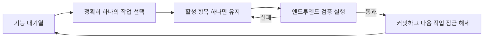
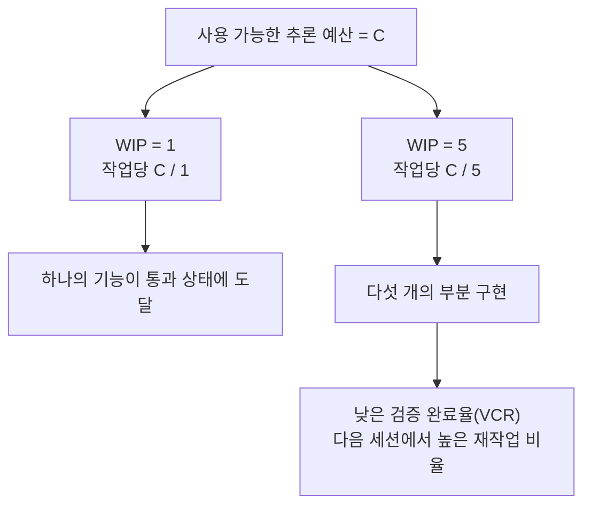

[中文版本 →](../../../zh/lectures/lecture-07-why-agents-overreach-and-under-finish/)

> 코드 예제: [code/](https://github.com/walkinglabs/learn-harness-engineering/blob/main/docs/en/lectures/lecture-07-why-agents-overreach-and-under-finish/code/)
> 실습 프로젝트: [프로젝트 04. 런타임 피드백과 범위(scope) 제어](./../../projects/project-04-incremental-indexing/index.md)

# 강의 07. 에이전트에게 명확한 작업 경계를 그어 주어야 합니다

Claude Code에게 "이 프로젝트에 사용자 인증을 추가해 줘"라고 지시하면, 에이전트(agent)는 데이터베이스 스키마를 수정하고, 라우트를 작성하고, 프론트엔드 컴포넌트를 변경하고 — 그 김에 오류 처리 미들웨어까지 리팩터링하기 시작합니다. 두 시간 후 확인해 보면: 수정된 파일 12개, 새로운 코드 800줄, 그리고 단 하나의 기능도 엔드투엔드로 동작하지 않습니다.

"한 번에 너무 많이 베어 물다" — 이 표현은 AI 에이전트에게 특히 잘 들어맞습니다. 에이전트는 "조금 더 해두자"는 충동을 타고납니다. 관련된 것들을 보면 그냥 처리해 버립니다. 마치 간장 한 병 사러 마트에 갔다가 카트 가득 채워 나오는 사람처럼요. 문제는, 사람이 너무 많이 사면 돈만 낭비하지만, 에이전트가 너무 많은 것을 동시에 하면 어느 것 하나도 제대로 마무리되지 않는다는 점입니다.

Anthropic의 "장시간 실행 에이전트를 위한 효과적인 하네스(harness)" 엔지니어링 블로그는 명확하게 밝힙니다: 프롬프트가 지나치게 넓으면, 에이전트는 "한 가지를 먼저 끝내기"보다 "여러 가지를 동시에 시작"하는 경향이 있다고. OpenAI의 Codex 엔지니어링 실천 사례에서도 같은 현상이 관찰되었습니다 — 명시적인 범위 제어가 없는 작업은 완료율이 급락합니다. 이것은 모델의 문제가 아닙니다 — 하네스의 문제입니다. 경계를 그어주지 않은 것입니다.

## 주의력은 유한한 자원입니다

이것은 비유가 아니라 수학입니다. 에이전트의 컨텍스트(context) 용량을 C라 하고, k개의 작업을 동시에 활성화한다고 가정하면, 각 작업에는 평균 C/k의 추론 자원이 할당됩니다. C/k가 단일 작업을 완료하는 데 필요한 최소 임계값 아래로 떨어지면, 어느 것도 완성되지 않습니다. 위가 한 개인데 만두 열 개를 한꺼번에 욱여넣으면 다 소화되지 않고, 열 개 모두 체하게 됩니다.

Claude Code의 실제 동작이 이를 잘 보여줍니다. "사용자 등록 기능을 추가해 줘"라고 요청하면 다음과 같이 진행될 수 있습니다:

1. User 모델 생성
2. 등록 라우트 작성
3. 이메일 인증이 필요하다는 것을 알아채고 메일 서비스 추가
4. 비밀번호 해싱이 필요하다는 것을 확인하고 bcrypt 도입
5. 오류 처리가 일관성이 없다는 것을 발견하고 글로벌 오류 미들웨어 리팩터링
6. 테스트 파일 구조가 지저분하다는 것을 보고 디렉터리 재구성

여섯 단계 후, 하나도 완성되지 않았습니다. 엔드투엔드 검증(verification)은 없고, 미완성 코드 간의 복잡한 결합만 남으며, 다음에 이어받을 세션은 완전히 길을 잃습니다. 마치 여섯 가지 요리를 동시에 하는 사람처럼 — 모든 요리가 냄비 안에 있지만 접시에 담긴 것은 하나도 없습니다. 다 타버립니다.

Anthropic의 실험 데이터가 이를 직접 뒷받침합니다: "작은 다음 단계" 전략(WIP=1에 해당)을 사용한 에이전트는 넓은 프롬프트를 사용한 에이전트보다 작업 완료율이 37% 높습니다. 더 흥미로운 점은, 에이전트가 생성한 코드 줄 수와 실제 기능 완료 수가 약한 음의 상관관계를 보인다는 것입니다 — 코드를 많이 작성할수록 완성된 기능은 적습니다. 데이터로 증명된 과욕(overreach)입니다.

## WIP=1 워크플로우





## 핵심 개념

- **과욕(Overreach)**: 에이전트가 단일 세션에서 최적보다 많은 작업을 활성화하는 것입니다. 정량화 가능합니다 — 5개 기능을 작업했지만 엔드투엔드를 통과한 것이 0개이면 과욕입니다.
- **미완성(Under-finish)**: 활성화된 전체 작업 중 엔드투엔드 검증을 통과한 작업의 비율이 임계값 아래로 떨어지는 상태입니다. 코드는 작성했지만 테스트가 통과하지 않으면 미완성입니다.
- **WIP 제한(Work-in-Progress Limit)**: 칸반(Kanban) 방법론에서 온 개념입니다. 핵심 아이디어: 동시에 진행 중인 작업 수를 제한합니다. 에이전트에게는 WIP=1이 가장 안전한 기본값입니다 — 하나를 끝낸 후 다음을 시작합니다. 뷔페처럼 — 접시를 쌓지 말고, 한 접시를 다 먹은 후 다음 접시를 가져오십시오. 칸반은 제조업에서 비롯된 작업 흐름 관리 방법론으로, 재공품(WIP) 제한을 통해 흐름 효율을 극대화하는 것이 핵심 원리입니다.
- **완료 증거(Completion Evidence)**: 작업이 "진행 중"에서 "완료"로 이동하기 위해 만족해야 하는 검증 가능한 조건입니다. 이것 없이는 에이전트가 "코드가 멀쩡해 보인다"를 "동작이 테스트를 통과했다"로 대체합니다.
- **범위 표면(Scope Surface)**: 각 노드가 작업 단위이고 엣지가 의존성인 DAG 구조입니다. 상태는 네 가지로 제한됩니다: not_started, active, blocked, passing.
- **완료 압력(Completion Pressure)**: 하네스가 WIP 제한과 완료 증거 요구사항을 통해 가하는 제약력으로, 에이전트가 새 작업을 시작하기 전에 현재 작업을 마무리하도록 강제합니다.

## 과욕과 미완성은 공생 관계입니다

두 문제는 독립적이지 않습니다 — 서로를 증폭시킵니다. 과욕은 주의력을 희석시키고, 희석된 주의력은 미완성을 야기하며, 남겨진 반완성 코드는 시스템 복잡도를 높이고, 이는 다음 작업에서 더 큰 과욕을 불러옵니다. 악순환입니다.

칸반 용어로: 리틀의 법칙(Little's Law)은 L = lambda * W임을 알려줍니다. 재공품(WIP) L이 너무 높으면(동시에 너무 많은 것을 하면), 각 작업의 리드 타임 W가 불가피하게 늘어납니다. 에이전트에게 이는 각 기능이 시작에서 검증된 완료까지 더 오래 걸리고 실패 확률이 커짐을 의미합니다.

이것은 인간 세계에서도 오래된 문제입니다 — Steve McConnell은 『Rapid Development』에서 범위 크리프(scope creep)가 프로젝트 실패의 주요 원인이라고 기록했습니다. 하지만 사람은 적어도 "이 정도면 됐다"는 직관이 있습니다. 에이전트에게는 그것이 없습니다. 다음 아이디어를 생성하는 데 드는 추가 토큰 비용은 거의 0에 가깝습니다 — "여기도 고쳐볼게"라고 쓰는 것은 모델 입장에서 거의 부담이 없지만, 모든 추가 수정은 에이전트의 주의력을 희석시킵니다. 한 접시 추가 비용이 거의 0인 뷔페에서도 위장은 여전히 한 개뿐인 것과 같습니다.

## 올바른 방법

### 1. WIP=1 강제 적용

가장 직접적이고 효과적인 방법입니다. 하네스에서 에이전트에게 명시적으로 지시하십시오: **어떤 시점에도 하나의 작업만 "active" 상태일 수 있습니다.** Claude Code의 CLAUDE.md 또는 Codex의 AGENTS.md에 다음과 같이 작성하십시오:

```
## 작업 규칙
- 한 번에 하나의 기능만 작업합니다
- 현재 기능이 엔드투엔드 검증을 통과한 후에만 다음 기능을 시작합니다
- 기능 A를 구현하는 동안 기능 B도 "리팩터링"하지 않습니다
```

뷔페에서 먹는 것처럼 — 한 번에 한 접시, 다 먹은 후 다시 가져옵니다.

### 2. 모든 작업에 명시적인 완료 증거 정의

완료는 "코드가 작성됨"이 아니라 "동작 검증이 통과됨"입니다. 기능 목록(feature list)의 모든 항목에는 검증 명령이 필요합니다:

```
F01: 사용자 등록
  검증: curl -X POST /api/register -d '{"email":"test@example.com","password":"123456"}' | jq .status == 201
  상태: passing
```

### 3. 범위 표면 외부화

기계 판독 가능한 파일(JSON 또는 Markdown)을 사용하여 모든 작업 상태를 기록하십시오. 새로운 세션은 이 파일을 읽고 즉시 알 수 있습니다: 어떤 작업이 활성 상태인가? 어떤 동작이 완료로 간주되는가? 어떤 검증이 통과했는가?

### 4. 검증 완료율(VCR) 모니터링

하네스는 VCR(Verified Completion Rate) = 검증된 작업 / 활성화된 작업을 지속적으로 추적해야 합니다. VCR < 1.0일 때 새 작업 활성화를 차단합니다.

## 실제 사례

8개의 기능을 가진 REST API 프로젝트, 두 가지 전략 비교:

**뷔페 모드(제약 없음)**: 에이전트가 세션 1에서 5개의 기능을 동시에 활성화합니다. 12개 파일에 걸쳐 ~800줄을 생성합니다. 엔드투엔드 테스트 통과율: 20% — 사용자 등록만 작동합니다. 나머지 4개 기능: 데이터베이스 스키마는 생성되었지만 유효성 검사 로직이 없고, 라우트는 정의되었지만 잘못된 응답 형식을 반환합니다. 마치 여섯 가지 요리를 동시에 하다가 하나만 겨우 먹을 수 있는 것처럼. 세션 3 종료 시 8개 기능 중 3개만 완성됩니다.

**단일 접시 모드(WIP=1)**: 에이전트가 세션 1에서 사용자 등록에만 집중합니다. 4개 파일에 ~200줄을 생성합니다. 엔드투엔드 테스트: 100% 통과. 검증된 클린 구현을 커밋합니다. 세션 4 종료 시 8개 기능 중 7개 완성(나머지 1개는 외부 의존성으로 차단됨).

결과: 총 코드는 적지만(800 vs 1200줄) 더 효과적인 코드. 완료율: 87.5% vs 37.5%. 한 번에 한 입씩 먹으면, 실제로 더 많이 먹을 수 있습니다.

## 핵심 요점

- **WIP=1은 에이전트 하네스의 기본 안전 설정입니다** — 하나를 완료한 후 다음을 시작하십시오. 병렬화하려 하지 마십시오. 한 입에 살찔 수 없습니다.
- **완료 증거는 실행 가능해야 합니다** — "코드가 멀쩡해 보인다"는 해당되지 않습니다. "curl이 201을 반환한다"가 해당됩니다.
- **범위 표면은 파일로 외부화되어야 합니다** — 대화에서만 언급하는 것이 아니라, 저장소의 기계 판독 가능한 형식으로 기록되어야 합니다.
- **과욕과 미완성은 공생 관계입니다** — 하나를 해결하면 다른 하나도 해결됩니다.
- **"적게 하되 끝내는 것"이 항상 "많이 하되 반만 남기는 것"보다 낫습니다** — 에이전트의 코드 줄 수와 기능 완료율은 음의 상관관계를 보입니다. 품질이 항상 양을 이깁니다.

## 더 읽을거리

- [Effective harnesses for long-running agents - Anthropic](https://www.anthropic.com/engineering/effective-harnesses-for-long-running-agents) — Anthropic 엔지니어링 블로그, "작은 다음 단계" 전략에 대한 상세한 논의
- [Harness Engineering - OpenAI](https://openai.com/index/harness-engineering/) — OpenAI의 하네스 엔지니어링에 대한 포괄적인 다룸
- [Kanban: Successful Evolutionary Change - David Anderson](https://www.goodreads.com/book/show/1070822.Kanban) — WIP 제한에 관한 고전 자료
- [Rapid Development - Steve McConnell](https://www.goodreads.com/book/show/125171.Rapid_Development) — 범위 크리프가 프로젝트 실패의 주요 원인이라는 실증적 데이터

## 연습 문제

1. **작업 원자화**: 넓은 요구사항(예: "사용자 관리 시스템 구현")을 골라 최소 5개의 원자적 작업 단위로 분해하십시오. 각 단위에 대해 다음을 명시하십시오: (a) 단일 동작 설명, (b) 실행 가능한 검증 명령, (c) 의존성. 분해가 WIP=1 제약을 만족하는지 확인하십시오.

2. **비교 실험**: 동일한 프로젝트를 두 번 실행하십시오 — 한 번은 제약 없이, 한 번은 WIP=1을 강제 적용하여. 비교하십시오: 검증 완료율, 총 코드 줄 수, 유효 코드 비율.

3. **완료 증거 감사**: 최근 에이전트 실행 결과를 검토하고, 각 코드 변경 사항을 "완료된 동작", "미완성 동작", "스캐폴딩"으로 분류하십시오. 각 미완성 동작에 누락된 검증 명령을 추가하십시오.
