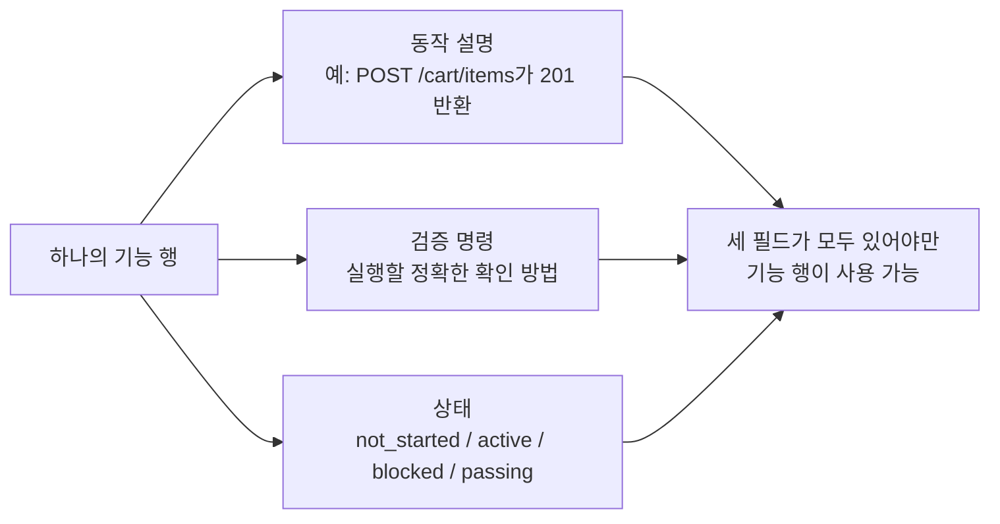
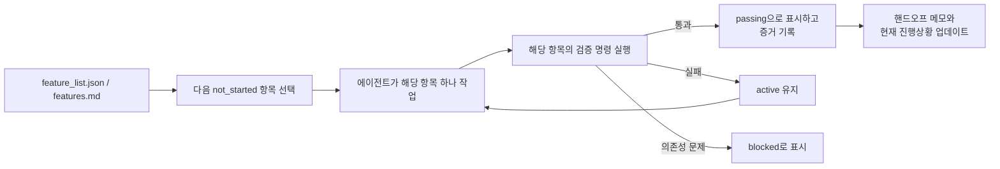

[中文版本 →](../../../zh/lectures/lecture-08-why-feature-lists-are-harness-primitives/)

> 코드 예제: [code/](https://github.com/walkinglabs/learn-harness-engineering/blob/main/docs/en/lectures/lecture-08-why-feature-lists-are-harness-primitives/code/)
> 실습 프로젝트: [프로젝트 04. 런타임 피드백과 범위 제어](./../../projects/project-04-incremental-indexing/index.md)

# 강의 08. 기능 목록으로 에이전트의 행동을 제약하십시오

에이전트에게 전자상거래 사이트를 구축하라고 요청합니다. 완성 후 에이전트는 "완료"라고 말합니다. 코드를 살펴보니 — 사용자 인증은 작동하지만 장바구니의 결제 버튼은 아무것도 하지 않고, 결제 흐름은 전혀 연결되어 있지 않습니다. 문제는: "완료"가 무엇을 의미하는지 전혀 알려주지 않았기 때문에, 에이전트는 자신만의 기준을 사용했습니다 — "코드를 많이 작성했고 꽤 완성된 것처럼 보인다."

기능 목록(feature list)은 많은 사람들의 눈에 그저 메모처럼 보입니다 — 잊지 않으려고 적어두고 나서 옆으로 치워두는 것. 하지만 하네스(harness) 세계에서 기능 목록은 인간을 위한 메모가 아닙니다 — 전체 하네스의 근간(backbone)입니다. 스케줄러(scheduler)는 이것을 바탕으로 작업을 선택하고, 검증기(verifier)는 이것을 바탕으로 완료를 판단하며, 핸드오프(handoff) 보고기는 이것을 바탕으로 요약본을 생성합니다. 근간이 부러지면 온 몸이 마비됩니다.

Anthropic과 OpenAI 모두 강조합니다: **산출물(artifact)은 외부화되어야 합니다.** 기능 상태는 구조화되지 않은 대화 텍스트가 아니라, 저장소의 기계 판독 가능한 파일에 존재해야 합니다.

## 에이전트는 "완료"의 의미를 모릅니다

Claude Code도 Codex도 "완료"가 무엇을 의미하는지 자동으로 알지 못합니다. "장바구니 기능을 추가해 줘"라고 하면, 모델의 해석은 "Cart 컴포넌트와 addToCart 메서드를 작성하는 것"일 수 있습니다. 하지만 당신이 의미한 것은 "사용자가 상품을 탐색하고, 장바구니에 추가하고, 결제를 완료할 수 있는 엔드투엔드 흐름"이었습니다. 이 이해의 간극은 기능 목록 없이는 지속됩니다. 에이전트는 자신만의 암묵적인 기준을 사용합니다 — 보통 "코드에 명백한 문법 오류가 없다"입니다. 당신이 필요한 것은 엔드투엔드 동작 검증입니다. 친구에게 과일을 사달라고 하면서 "과일 좀 사와"라고만 했는데 레몬을 가져오는 것처럼. 친구의 과일과 당신의 과일은 같은 과일이 아닙니다.

다음과 같은 일반적인 진행 메모를 살펴보십시오:

```
사용자 인증 완료, 장바구니 거의 완료, 결제는 아직 필요
```
새로운 에이전트 세션이 이 메모에서 다음 질문들에 답할 수 있을까요? "거의 완료"가 무엇을 의미하는지? 장바구니가 통과한 테스트는 무엇인지? 결제를 막는 것이 무엇인지? 모든 답은 "아무도 모른다"입니다. 의사에게 "배가 아픈데, 요즘엔 괜찮아요"라고 하는 것과 같습니다 — 어떤 약을 처방할 수 있을까요?

결과: 새 세션이 프로젝트 상태를 추론하는 데 20분을 소비하고, 이미 완료된 기능을 재구현할 수도 있습니다. Anthropic의 엔지니어링 데이터에 따르면 좋은 진행 기록은 세션 시작 진단 시간을 60-80% 줄입니다.

## 기능 상태 기계





## 핵심 개념

- **기능 목록은 하네스 프리미티브(primitive)입니다**: "선택적 계획 도구"가 아니라, 다른 모든 하네스 구성 요소가 의존하는 기반 데이터 구조입니다. 데이터베이스 테이블 구조처럼 — "기본 키는 건너뛰자"고 말할 수 없습니다. "프리미티브"란 시스템에서 더 이상 분해할 수 없는 기본 구성 요소를 의미하며, 다른 모든 추상화가 이 위에 구축됩니다.
- **삼중 구조**: 각 기능 항목은 `(동작 설명, 검증 명령, 현재 상태)` 삼중 구조입니다. 어느 한 요소가 빠지면 항목이 불완전합니다.
- **상태 기계 모델**: 각 기능 항목은 네 가지 상태를 가집니다 — `not_started`, `active`, `blocked`, `passing`. 상태 전환은 에이전트가 자유롭게 변경하는 것이 아니라 하네스가 제어합니다.
- **패스 상태 게이팅(Pass-state gating)**: 기능이 `active`에서 `passing`으로 이동하는 유일한 방법은 검증 명령이 성공적으로 실행되는 것입니다. 이것은 되돌릴 수 없습니다 — 한 번 `passing`이 되면 되돌아갈 수 없습니다. 시험에 합격하면 합격한 것이고, 점수를 소급하여 변경할 수 없는 것처럼요.
- **단일 진실 원천(Single source of truth)**: "무엇을 해야 하는가"에 관한 모든 정보는 하나의 기능 목록에서 파생되어야 합니다. 기능 목록과 대화 기록 간에 모순이 없어야 합니다.
- **역압력(Back-pressure)**: 아직 통과하지 못한 기능의 수는 하네스가 에이전트에게 가하는 압력입니다. 압력이 0이면 = 프로젝트 완료.

## 기능 목록이 "프리미티브"여야 하는 이유

문서는 인간이 읽기 위한 것이고, 프리미티브는 시스템이 실행하기 위한 것입니다. 문서는 무시될 수 있지만, 프리미티브는 우회될 수 없습니다.

데이터베이스 트리거 제약과 애플리케이션 레이어 검사를 생각해 보십시오: 전자는 데이터베이스 엔진이 강제하며, 어떤 SQL도 건너뛸 수 없습니다. 후자는 애플리케이션 코드의 정확성에 의존하며 우연히 우회될 수 있습니다. 하네스 프리미티브로서의 기능 목록은 구체적으로 네 가지 하네스 구성 요소를 담당합니다:

1. **스케줄러(Scheduler)**: 상태를 읽고, 다음 `not_started` 기능을 선택합니다. 공장 생산 계획 시스템처럼요.
2. **검증기(Verifier)**: 검증 명령을 실행하고, 상태 전환을 허용할지 결정합니다. 품질 검사처럼요.
3. **핸드오프 보고기(Handoff reporter)**: 기능 목록에서 자동으로 세션 핸드오프 요약을 생성합니다. 자동 교대 근무 보고서처럼요.
4. **진행 추적기(Progress tracker)**: 상태 분포를 집계하고, 프로젝트 건강 지표를 제공합니다. 대시보드처럼요.

## 올바른 방법

### 1. 최소한의 기능 목록 형식 정의

복잡한 시스템이 필요하지 않습니다 — 구조화된 Markdown 또는 JSON 파일이면 충분합니다. 핵심은 모든 항목이 삼중 구조를 가져야 한다는 것입니다:

```json
{
  "id": "F03",
  "behavior": "POST /cart/items with {product_id, quantity} returns 201",
  "verification": "curl -X POST http://localhost:3000/api/cart/items -H 'Content-Type: application/json' -d '{\"product_id\":1,\"quantity\":2}' | jq .status == 201",
  "state": "passing",
  "evidence": "commit abc123, test output log"
}
```

### 2. 하네스가 상태 전환을 제어하도록 하기

에이전트는 기능의 상태를 `passing`으로 직접 변경할 수 없습니다. 검증 요청만 제출할 수 있으며, 하네스가 검증 명령을 실행하고 전환을 허용할지 결정합니다. 이것이 "패스 상태 게이팅"입니다.

### 3. CLAUDE.md에 규칙 작성

```
## 기능 목록 규칙
- 기능 목록 파일: /docs/features.md
- 한 번에 하나의 기능만 활성화
- passing으로 표시하기 전에 검증 명령이 통과해야 함
- 기능 목록 상태를 직접 수정하지 마십시오 — 검증 스크립트가 자동으로 업데이트합니다
```

### 4. 세분화 수준 조정

각 기능 항목은 "하나의 세션 내에서 완료 가능"한 범위여야 합니다. 너무 넓으면 완료되지 않고, 너무 좁으면 관리 오버헤드가 늘어납니다. "사용자가 장바구니에 항목을 추가할 수 있다"는 적절한 세분화입니다. "장바구니 구현"은 너무 넓습니다. "Cart 모델에 name 필드 생성"은 너무 좁습니다. 스테이크 자르는 것처럼 — 통째로도 아니고, 간 고기도 아닌 적절한 한 입 크기.

## 실제 사례

10개의 기능을 가진 전자상거래 플랫폼. 두 가지 추적 방법 비교:

**메모 모드**: 에이전트가 구조화되지 않은 메모를 사용합니다. 3개의 세션 후 메모는 "사용자 인증과 상품 목록은 완료, 장바구니는 거의 완료지만 버그 있음, 결제는 시작 안 됨"이 됩니다. 새 세션은 상태를 추론하는 데 20분이 필요하고, 결국 완료된 기능을 재구현합니다. 장보기 목록에 "우유, 빵, 그 물건"이라고 적혀 있으면 — 마트에서도 여전히 무엇을 사야 할지 모르는 것처럼.

**근간 모드**: 모든 기능이 명확한 상태와 검증 명령을 가집니다. 새 세션은 기능 목록을 읽고 3분 만에 알 수 있습니다: F01-F05는 `passing`, F06은 `active`, F07-F10은 `not_started`. F06에서 직접 이어받고, 재작업 없이 진행합니다.

정량화된 결과: 구조화된 기능 목록을 사용하는 프로젝트는 자유 형식 추적에 비해 기능 완료율이 45% 높으며, 중복 구현이 전혀 없습니다.

## 핵심 요점

- **기능 목록은 하네스의 근간입니다**, 인간을 위한 메모가 아닙니다. 스케줄러, 검증기, 핸드오프 보고기 모두 이에 의존합니다.
- **모든 기능 항목은 삼중 구조를 가져야 합니다**: 동작 설명 + 검증 명령 + 현재 상태. 하나의 요소가 빠지면 불완전합니다 — 다리 하나 없는 세발 의자처럼.
- **상태 전환은 하네스가 제어합니다** — 에이전트는 혼자서 상태를 변경할 수 없습니다. 검증 통과 = 유일한 업그레이드 경로.
- **기능 목록은 프로젝트의 단일 진실 원천입니다** — "무엇을 해야 하는가"에 관한 모든 정보는 하나의 목록에서 파생됩니다.
- **세분화 수준을 "하나의 세션 내에서 완료 가능"으로 조정하십시오.**

## 더 읽을거리

- [Building Effective Agents - Anthropic](https://www.anthropic.com/research/building-effective-agents) — 기능 목록을 에이전트 범위 제어를 위한 "핵심 데이터 구조"로 명시적으로 식별
- [Harness Engineering - OpenAI](https://openai.com/index/harness-engineering/) — "산출물 외부화" 원칙 강조
- [Design by Contract - Bertrand Meyer](https://www.goodreads.com/book/show/130439.Object_Oriented_Software_Construction) — 계약 설계 원칙, 기능 목록의 이론적 기반
- [How Google Tests Software](https://www.goodreads.com/book/show/13563030-how-google-tests-software) — 테스트 피라미드와 동작 명세 엔지니어링 실천

## 연습 문제

1. **기능 목록 설계**: 최소한의 기능 목록 JSON 스키마를 정의하십시오. 포함 항목: id, 동작 설명, 검증 명령, 현재 상태, 증거 참조. 이를 사용하여 5개의 기능을 가진 실제 프로젝트를 설명하십시오.

2. **검증 엄격성 비교**: 3개의 기능을 선택하고 "느슨한" 검증(예: "코드에 문법 오류가 없음")과 "엄격한" 검증(예: "엔드투엔드 테스트 통과") 모두를 설계하십시오. 각 방법에서의 위양성 비율을 비교하십시오.

3. **단일 진실 원천 원칙 감사**: 기존 에이전트 프로젝트를 검토하고 기능 목록과 모순되는 범위 정보(대화 내 암묵적 요구사항, 코드의 TODO 댓글 등)를 찾아보십시오. 모든 정보를 기능 목록으로 통합하는 계획을 설계하십시오.
