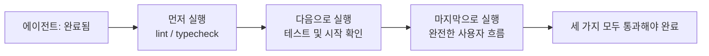
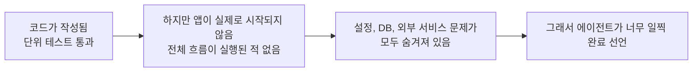

[中文版本 →](../../../zh/lectures/lecture-09-why-agents-declare-victory-too-early/)

> 이 강의의 코드 예제: [code/](https://github.com/walkinglabs/learn-harness-engineering/blob/main/docs/en/lectures/lecture-09-why-agents-declare-victory-too-early/code/)
> 실습 프로젝트: [프로젝트 05. 에이전트가 자신의 작업을 스스로 검증하게 하기](./../../projects/project-05-grounded-qa-verification/index.md)

# 강의 9. 에이전트가 너무 일찍 완료를 선언하지 못하도록 방지하기

에이전트에게 "비밀번호 재설정" 기능을 구현하라고 요청합니다. 에이전트는 데이터베이스 스키마를 수정하고, API 엔드포인트를 작성하고, 이메일 템플릿을 추가하고, 단위 테스트를 실행합니다(모두 통과). 그런 다음 자신 있게 "완료되었습니다"라고 알립니다. 실제로 실행해 보면 — 비밀번호 재설정 링크를 보낼 수 없고(이메일 서비스 설정 누락), 데이터베이스 마이그레이션이 중간에 실패하며(스키마 불일치), 엔드투엔드 흐름은 단 한 번도 실행되지 않았습니다.

이 느낌이 낯설지 않을 것입니다 — 시험지를 가득 채우고 자신 있게 가장 먼저 제출했는데, 성적이 나왔을 때 낙제하는 경우와 같습니다. 시험지가 가득 찼다고 해서 답이 맞는 것은 아닙니다.

이것은 단발성 사건이 아닙니다. 2017년 Guo et al.의 ICML 고전 논문이 증명했습니다: **현대 신경망은 체계적으로 과도한 자신감을 보입니다** — 모델이 보고하는 신뢰도는 실제 정확도보다 유의미하게 높습니다. AI 코딩 에이전트(agent)에게도 동일하게 적용됩니다: 에이전트는 완료되었다고 "느끼지만", 실제로는 아직 한참 멀었습니다. 여러분의 하네스(harness)는 에이전트의 "느낌"을 외부화된 실행 기반 검증(verification)으로 대체해야 합니다.

## 미끄러운 경사면

조기 완료 선언은 거의 항상 같은 패턴을 따릅니다: 코드가 괜찮아 보입니다 — 문법이 올바르고, 로직이 합리적으로 보이며, 정적 분석에서 명백한 오류가 없습니다. 하지만 하네스가 포괄적인 실행 검증을 강제하지 않기 때문에, 에이전트는 실제 실행을 건너뛰거나 부분적인 테스트만 수행합니다. 단위 테스트는 실행하지만 통합 테스트는 건너뜁니다. 테스트는 실행하지만 커버리지를 확인하지 않습니다. 결국 "코드가 멀쩡해 보인다"가 "기능이 완료되었다"의 증거로 사용됩니다. 그리고 시험지가 제출됩니다.

정보는 모든 단계에서 손실됩니다. 작업 명세에서 코드 구현을 거쳐 런타임 동작에 이르기까지, 모든 변환은 편향을 유발할 수 있으며, 건너뛴 모든 검증은 정보 비대칭을 악화시킵니다.

## 3단계 종료 검사





## 핵심 개념

- **조기 완료 선언(Premature Completion Declaration)**: 에이전트가 작업이 완료되었다고 주장하지만, 아직 충족되지 않은 정확성 명세가 존재하는 상태입니다. 핵심 문제: 에이전트는 코드 수준의 로컬 신뢰도를 기반으로 판단하지만, 시스템 수준의 정확성은 전역적 검증을 필요로 합니다.
- **신뢰도 보정 편향(Confidence Calibration Bias)**: 에이전트가 자체 보고한 완료 신뢰도와 실제 완료 품질 사이의 체계적인 간극입니다. 복잡한 다중 파일 작업의 경우 이 편향은 유의미하게 양(+)입니다 — 에이전트는 실제 성과보다 항상 더 자신 있어합니다. 시험 후 항상 점수를 과대 평가하는 학생처럼요.
- **종료 기준(Termination Criteria)**: 하네스에서 정의된 명확하고 실행 가능한 판단 조건의 집합입니다. 에이전트는 완료를 선언하기 전에 모든 조건을 만족해야 합니다. "완료"가 주관적 판단에서 객관적 결정으로 바뀝니다.
- **검증-유효성 검사 이중 게이트(Verification-Validation Dual Gate)**: 첫 번째 검증 레이어는 "코드가 명세된 동작을 올바르게 구현했는가"를 확인하고, 두 번째 유효성 검사 레이어는 "시스템 수준의 동작이 엔드투엔드 요구사항을 충족하는가"를 확인합니다. 완료로 간주되려면 두 가지 모두 통과해야 합니다.
- **런타임 피드백 신호(Runtime Feedback Signals)**: 프로그램 실행에서 나오는 로그, 프로세스 상태, 상태 확인. 하네스가 완료 품질을 판단하기 위한 객관적 근거입니다.
- **완료 우선순위 제약(Completion Priority Constraint)**: 먼저 기능적 정확성을 검증하고, 그다음 성능을 다루고, 마지막으로 스타일을 다룹니다. 핵심 기능이 검증되기 전까지 리팩터링은 금지입니다.

## 단위 테스트 통과 != 작업 완료

이것이 가장 흔한 함정이자 가장 위험한 것입니다. 에이전트가 코드를 작성하고, 단위 테스트를 실행하고, 모두 통과했으며, "완료"라고 했습니다. 하지만 단위 테스트의 설계 철학 — 테스트 대상을 격리하고 의존성을 모킹(mocking)하는 것 — 이 바로 단위 테스트가 컴포넌트 간 문제를 감지할 수 없게 하는 이유입니다:

**인터페이스 불일치**: 렌더 프로세스가 preload 스크립트에 전달하는 파일 경로는 상대 경로이지만, preload 스크립트는 절대 경로를 기대합니다. 각각의 단위 테스트는 모두 모킹을 사용했고 통과했습니다. 문제는 엔드투엔드 테스트 중에만 발견됩니다. 밴드의 모든 음악가가 각자 연습할 때는 완벽하지만, 함께 연주할 때 음이 맞지 않는다는 것을 깨닫는 것처럼.

**상태 전파 오류**: 데이터베이스 마이그레이션이 테이블 스키마를 변경했지만, ORM 캐싱 레이어는 여전히 이전 스키마의 캐시 항목을 보유하고 있습니다. 단위 테스트는 매번 새로운 모킹 환경을 제공하므로 이 교차 레이어 상태 불일치가 드러나지 않습니다.

**환경 의존성**: 코드는 테스트 환경(모든 것이 모킹됨)에서는 올바르게 동작하지만, 설정 차이, 네트워크 지연, 또는 서비스 불가용성으로 인해 실제 환경에서 실패합니다. 연습실에서는 완벽하게 노래하지만, 무대에서는 음향 장비 문제에 직면하는 것처럼.

### "그 김에 리팩터링"은 완료 판단에 독입니다

Claude Code에는 흔한 행동 패턴이 있습니다: 핵심 기능이 검증을 통과하기 전에 코드를 리팩터링하고, 성능을 최적화하고, 스타일을 개선하기 시작합니다. Knuth의 인용문 "조기 최적화는 만악의 근원"은 에이전트 시나리오에서 새로운 의미를 가집니다 — 리팩터링은 검증된 코드와 미검증 코드 사이의 경계를 변경하여, 이전에 암묵적으로 올바랐던 코드 경로를 잠재적으로 깨뜨릴 수 있습니다. 수학 서술형 문제를 다 풀기 전에 객관식 답안을 더 예쁘게 옮겨 적는 것과 같습니다 — 시간 낭비일 뿐만 아니라 잘못 옮길 수도 있습니다.

### 자기 평가의 체계적 편향

Anthropic은 2026년 연구에서 더 깊은 실패 패턴을 발견했습니다: **에이전트에게 자신의 작업을 평가하도록 요청하면, 인간 관찰자가 품질이 명백히 기준에 미달한다고 볼 때조차 체계적으로 지나치게 긍정적인 평가를 제공합니다.** 학생에게 자신의 시험을 채점하도록 하는 것과 같습니다 — 그들은 항상 자신의 답안에 특히 관대할 것입니다.

이 문제는 주관적인 작업(예: 디자인 미학)에서 특히 심각합니다 — "레이아웃이 정교한가"는 판단의 문제이며, 에이전트는 신뢰할 수 있게 긍정적으로 치우칩니다. 심지어 검증 가능한 결과가 있는 작업에서도 에이전트의 성과는 잘못된 판단에 의해 방해받을 수 있습니다.

해결책은 에이전트를 "더 객관적으로" 만드는 것이 아닙니다 — 생성과 평가를 담당하는 동일한 모델은 본질적으로 자신에게 관대한 경향이 있습니다. **해결책은 "작업자"와 "검사자"를 분리하는 것입니다.** 학생이 자신의 시험을 채점해서는 안 되는 것처럼 — 독립적인 채점자가 필요합니다.

"까다롭게" 튜닝된 독립적인 평가 에이전트는 생성 에이전트가 스스로를 평가하는 것보다 훨씬 효과적입니다. Anthropic의 실험 데이터:

| 아키텍처 | 실행 시간 | 비용 | 핵심 기능 작동 여부 |
|----------|-----------|------|---------------------|
| 단일 에이전트(bare run) | 20분 | $9 | 아니오(게임 개체가 입력에 반응 없음) |
| 세 에이전트(planner + generator + evaluator) | 6시간 | $200 | 예(게임이 완전히 플레이 가능) |

이것은 정확히 같은 모델(Opus 4.5)에 정확히 같은 프롬프트("2D 레트로 게임 에디터 구축")입니다. 유일한 차이점은 하네스입니다 — "bare 실행"에서 "플래너가 요구사항 확장 → 생성기가 기능별 구현 → 평가기가 Playwright를 사용하여 실제 클릭 테스트 수행"으로 변경된 것입니다.

> 출처: [Anthropic: 장시간 애플리케이션 개발을 위한 하네스 설계](https://www.anthropic.com/engineering/harness-design-long-running-apps)

## 조기 제출을 방지하는 방법

### 1. 종료 판단 외부화

완료 판단은 에이전트 자신이 내려서는 안 됩니다. 하네스는 런타임 신호를 입력으로 사용하여 독립적으로 종료 유효성 검사를 실행해야 하며, 에이전트의 신뢰도를 사용해서는 안 됩니다. `CLAUDE.md`에 다음과 같이 명확하게 작성하십시오:

```
## 완료의 정의
- 기능 완료 = 엔드투엔드 검증 통과, "코드가 작성됨"이 아님
- 필요한 검증 레벨:
  1. 단위 테스트 통과
  2. 통합 테스트 통과
  3. 엔드투엔드 흐름 검증 통과
- 레벨 1이 실패하면 레벨 2로 진행하지 않습니다
- 레벨 2가 실패하면 레벨 3으로 진행하지 않습니다
```

### 2. 3단계 종료 유효성 검사 구축

- **레이어 1: 문법 및 정적 분석**. 비용이 가장 낮고 정보가 가장 적지만, 반드시 통과해야 합니다. 이것이 최소한의 확인입니다 — 다른 것을 보기 전에 철자를 올바르게 써야 합니다.
- **레이어 2: 런타임 동작 검증**. 테스트 실행, 앱 시작 확인, 핵심 경로 유효성 검사. 이것이 완료의 핵심 증거입니다. 작성하는 것만으로는 충분하지 않습니다. 실행되어야 합니다.
- **레이어 3: 시스템 수준 확인**. 엔드투엔드 테스트, 통합 유효성 검사, 사용자 시나리오 시뮬레이션. 조기 선언에 대한 최후의 방어선입니다. 실행하는 것만으로는 충분하지 않습니다. 올바르게 실행되어야 합니다.

### 3. 에이전트를 위한 좋은 "빨간 펜 수정" 설계

OpenAI는 Codex 실천 과정에서 특히 효과적인 패턴을 소개했습니다: **에이전트에 대한 오류 메시지에는 수정 지침이 포함되어야 합니다**. 게으른 채점자처럼 큰 빨간 X만 그리지 말고, 좋은 선생님처럼 "여기를 이렇게 바꿔야 합니다"라고 여백에 써주십시오. `"테스트 실패"`를 사용하지 말고, `"테스트 실패: POST /api/reset-password가 500을 반환했습니다. 환경 변수에 이메일 서비스 설정이 있는지 확인하십시오. 템플릿 파일은 templates/reset-email.html에 있어야 합니다."`를 사용하십시오. 이러한 구체적이고 실행 가능한 피드백은 에이전트가 인간의 개입 없이 스스로 수정할 수 있게 해줍니다.

### 4. 런타임 신호 수집

효과적인 런타임 신호에는 다음이 포함됩니다:
- 애플리케이션이 성공적으로 시작되어 준비 상태에 도달했는가?
- 핵심 기능 경로가 런타임에 성공적으로 실행되었는가?
- 데이터베이스 쓰기, 파일 작업 및 기타 부작용이 올바른가?
- 임시 리소스가 정리되었는가?

## 실제 사례

**작업**: 사용자 비밀번호 재설정 기능 구현. 데이터베이스 작업, 이메일 전송, API 엔드포인트 수정이 포함됩니다.

**조기 제출 경로**: 에이전트가 데이터베이스 스키마를 수정하고, API 엔드포인트를 작성하고, 이메일 템플릿을 추가하고, 단위 테스트를 실행하고(통과), 완료를 선언합니다. 시험지가 가득 찼습니다.

**실제 감점 항목**: (1) 엔드투엔드 흐름 미테스트 — 재설정 링크의 실제 전송 및 검증이 확인된 적 없음. (2) 데이터베이스 마이그레이션이 부분 실행 후 실패하여 스키마 불일치 발생. (3) 대상 환경에서 이메일 서비스 설정 누락.

**하네스 개입**: 종료 유효성 검사 강제 실행 — (1) 전체 앱을 시작하여 재설정 엔드포인트 접근성 확인; (2) 전체 재설정 흐름 실행; (3) 데이터베이스 상태 일관성 검증. 모든 결함이 세션 내에서 발견되어, 이후 수정 비용의 5-10배를 절약했습니다. 독립적인 채점자가 실제 문제를 발견했습니다.

## 핵심 요점

- **에이전트는 체계적으로 과도한 자신감을 보입니다** — 신뢰도 보정 편향은 객관적 현실입니다. 시험지를 가득 채운다고 답이 맞는 것은 아닙니다.
- **완료 판단은 외부화되어야 합니다** — 하네스가 독립적으로 검증하며, 에이전트의 "느낌"을 신뢰하지 마십시오. 학생이 자신의 시험을 채점할 수 없습니다.
- **3단계 유효성 검사가 모두 필수입니다** — 문법 통과, 동작 통과, 시스템 통과, 단계별로 진행합니다.
- **오류 메시지는 좋은 선생님의 빨간 펜 수정과 같아야 합니다** — 에이전트가 스스로 수정할 수 있도록 구체적인 수정 단계를 포함하십시오.
- **핵심 기능이 검증되기 전에는 리팩터링하지 마십시오** — 완료 우선순위 제약이 조기 최적화를 방지하는 핵심입니다.

## 더 읽을거리

- [On Calibration of Modern Neural Networks - Guo et al.](https://arxiv.org/abs/1706.04599) — 현대 심층 신경망이 체계적으로 과도한 자신감을 보임을 증명
- [Building Effective Agents - Anthropic](https://www.anthropic.com/research/building-effective-agents) — 완료 판단에서 런타임 증거의 중요한 역할
- [Harness Engineering - OpenAI](https://openai.com/index/harness-engineering/) — 조기 완료 선언이 에이전트의 주요 실패 모드 중 하나
- [The Art of Software Testing - Myers](https://www.goodreads.com/book/show/137543.The_Art_of_Software_Testing) — 테스트 방법 계층 구조와 효과성에 관한 고전 참고서

## 연습 문제

1. **종료 유효성 검사 함수 설계**: 데이터베이스 마이그레이션과 API 수정이 포함된 작업에 대한 완전한 종료 유효성 검사를 설계하십시오. 필요한 런타임 신호와 각 신호의 통과/실패 기준을 나열하십시오. 실제 작업에 실행하고 어떤 숨겨진 문제가 발견되는지 기록하십시오.

2. **보정 편향 측정**: 10가지 다른 유형의 코딩 작업을 선택하고, 에이전트의 자체 보고 완료 신뢰도와 실제 완료 품질을 기록하십시오. 편향 값을 계산하고 작업 복잡성과의 관계를 분석하십시오.

3. **다층 방어 실험**: 동일한 작업 세트에 세 가지 구성을 실행하십시오 — (a) 정적 분석만, (b) 단위 테스트 추가, (c) 완전한 3단계 유효성 검사. 조기 완료 선언의 비율과 발견되지 않은 결함의 수를 비교하십시오.
