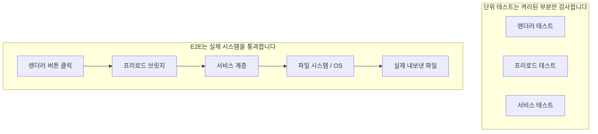
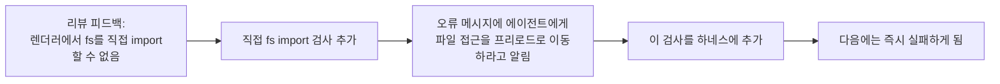

[English Version →](../../../en/lectures/lecture-10-why-end-to-end-testing-changes-results/)

> 이 강의의 코드 예제: [code/](https://github.com/walkinglabs/learn-harness-engineering/blob/main/docs/en/lectures/lecture-10-why-end-to-end-testing-changes-results/code/)
> 실습 프로젝트: [Project 05. 에이전트가 자신의 작업을 스스로 검증하게 하기](./../../projects/project-05-grounded-qa-verification/index.md)

# 강의 10. 엔드투엔드 테스트(end-to-end testing)만이 진정한 검증이다

에이전트에게 Electron 앱에 파일 내보내기 기능을 추가해 달라고 합니다. 에이전트는 렌더 프로세스 컴포넌트, 프리로드 스크립트, 서비스 계층 로직을 작성합니다. 각 컴포넌트에 대한 단위 테스트(unit test)는 완벽하게 통과합니다. 에이전트는 "완료됐습니다"라고 말합니다. 실제로 내보내기 버튼을 클릭하면—파일 경로 형식이 잘못되어 있고, 진행 표시줄이 업데이트되지 않으며, 대용량 파일 내보내기 시 메모리 누수가 발생합니다. 다섯 개의 컴포넌트 경계 결함이 있었는데, 단위 테스트는 하나도 잡아내지 못한 것입니다.

마치 합창 리허설에서 각 성부가 개별적으로 연습할 때는 완벽하게 들리지만, 함께 노래하면 소프라노가 베이스보다 반 박자 빠르고, 반주는 주 선율보다 반음 낮은 것과 같습니다. 각 파트는 개별적으로는 "정확"하지만, 전체적으로는 엇나갑니다.

Google의 테스팅 피라미드(Testing Pyramid)는 이렇게 말합니다. 대량의 단위 테스트가 기반이지만, 거기서 멈추면 컴포넌트 간 상호작용 문제를 체계적으로 놓치게 됩니다. AI 코딩 에이전트(coding agent)에게는 이 문제가 더욱 심각합니다—에이전트는 가장 빠른 테스트만 실행하고 완료를 선언하는 경향이 있기 때문입니다. **엔드투엔드 테스트만이 시스템 수준의 결함이 존재하지 않음을 증명할 수 있습니다.**

## 단위 테스트의 맹점

단위 테스트의 설계 철학은 격리(isolation)입니다—의존성을 모킹(mocking)하고 테스트 대상 단위에만 집중하는 것입니다. 이 철학이 단위 테스트를 빠르고 정밀하게 만들지만, 동시에 체계적인 맹점을 만들어 냅니다. 합창 리허설에서 각 성부가 헤드폰을 끼고 연습하는 것과 같습니다—자신에게는 괜찮게 들리지만, 함께 모였을 때야 비로소 문제가 드러납니다.

**인터페이스 불일치**: 렌더 프로세스가 프리로드 스크립트에 전달하는 파일 경로는 상대 경로이지만, 프리로드 스크립트는 절대 경로를 기대합니다. 각각의 단위 테스트는 모두 모킹을 사용해 통과했습니다. 엔드투엔드 흐름이 실행될 때야 비로소 문제가 발견됩니다—마치 두 성부가 개별적으로 연습하면서 괜찮다고 느끼다가, 앙상블에서 한쪽은 4/4박자로, 다른 쪽은 3/4박자로 노래하고 있다는 것을 알게 되는 것처럼.

**상태 전파 오류(State Propagation Errors)**: 데이터베이스 마이그레이션이 테이블 스키마를 변경했지만, ORM 캐싱 계층은 여전히 이전 스키마에 대한 캐시 항목을 보유하고 있습니다. 단위 테스트는 매번 완전히 새로운 모킹 환경을 제공하므로, 이러한 계층 간 상태 불일치를 드러내지 않습니다. 노래 가사를 바꿨는데 누군가가 아직도 이전 버전으로 노래하는 것과 같습니다.

**리소스 수명 주기 문제**: 파일 핸들, 데이터베이스 연결, 네트워크 소켓의 획득 및 해제는 여러 컴포넌트에 걸쳐 있습니다. 단위 테스트는 각 테스트를 위해 독립적인 리소스를 생성하고 소멸시키므로, 리소스 경합이나 누수를 드러내지 못합니다. 리허설 중에 각 성부가 마이크를 번갈아 사용하지만, 무대에서 모두 함께 올라갔을 때 마이크가 부족한 것과 같습니다.

**환경 의존성**: 코드는 테스트 환경(모든 것이 모킹된 곳)에서는 올바르게 동작하지만, 설정 차이, 네트워크 지연, 또는 서비스 불가용성으로 인해 실제 환경에서는 실패합니다. 리허설실에서는 완벽하게 노래했지만, 야외 페스티벌에서 오디오 피드백과 바람 간섭을 만나는 것과 같습니다.

## 엔드투엔드 테스트는 결과만 바꾸는 것이 아니라 행동을 바꾼다

많은 사람들이 깨닫지 못하는 것이 있습니다. 에이전트가 자신의 작업이 엔드투엔드 테스트를 받게 된다는 것을 알면, 코딩 행동이 바뀐다는 점입니다.

1. **컴포넌트 상호작용 고려**: 코드를 작성하면서 "이 인터페이스가 업스트림과 어떻게 연결되는가"를 생각하게 됩니다. 단순히 하나의 함수에만 집중하지 않습니다. 마치 결국 함께 노래하게 될 것을 알기에, 연습 중에도 다른 성부에 귀를 기울이는 것처럼.
2. **아키텍처 경계 준수**: 아키텍처 제약이 있는 시스템에서 엔드투엔드 테스트는 에이전트가 경계 규칙을 준수하도록 강제합니다. 악보에 "여기서 크레셴도(crescendo)"라고 표시된 것처럼, 따라야 합니다.
3. **오류 경로 처리**: 엔드투엔드 테스트는 보통 실패 시나리오를 포함하므로, 에이전트가 예외 처리를 고려하게 만듭니다. 리허설 중에 "마이크가 갑자기 꺼지면 어떻게 할까"를 시뮬레이션하여, 실제 상황에서 어떻게 대처할지 알게 되는 것처럼.

## 테스팅 피라미드와 리뷰 피드백 승격





Codex 엔지니어링 실천에서 OpenAI는 강조합니다. **에이전트를 위해 작성된 오류 메시지에는 수정 지침이 포함되어야 합니다.** `"렌더러에서 직접 파일시스템 접근"`이라고만 쓰지 말고, `"렌더러에서 직접 파일시스템 접근. 모든 파일 작업은 프리로드 브릿지를 통해야 합니다. 이 호출을 preload/file-ops.ts로 이동하고 window.api를 통해 호출하세요."`라고 써야 합니다. 이것이 아키텍처 규칙을 자동 수정 루프로 만듭니다. 지휘자가 단순히 "그거 틀렸어"라고 말하지 않고, "여기서 반 박자 빠르게 나왔어, 알토 리듬을 들어봐, 32마디에서 들어와"라고 말하는 것처럼.

## 핵심 개념

- **컴포넌트 경계 결함(Component Boundary Defects)**: 컴포넌트 A와 B가 각자의 단위 테스트를 통과하지만, 상호작용이 잘못된 동작을 만들어냅니다. 이것이 엔드투엔드 테스트가 가장 잘 잡아내는 문제 유형입니다—개별적으로는 정확하지만 함께하면 엇나가는 합창 성부처럼.
- **테스팅 적합성 기울기(Testing Adequacy Gradient)**: 단위 테스트가 잡는 결함 <= 통합 테스트가 잡는 결함 <= 엔드투엔드 테스트가 잡는 결함. 각 계층이 올라갈수록 탐지 능력이 증가합니다.
- **아키텍처 경계 강제 규칙(Architectural Boundary Enforcement Rules)**: 아키텍처 문서의 규칙(예: "렌더 프로세스는 파일 시스템에 직접 접근할 수 없다")을 실행 가능한 자동화된 검사로 전환합니다. "문서에 적힌"에서 "CI에서 실행되는"으로.
- **리뷰 피드백 승격(Review Feedback Promotion)**: 반복되는 코드 리뷰 코멘트를 자동화된 테스트로 전환합니다. 반복되는 문제가 발견될 때마다 규칙을 추가하면, 하네스(harness)가 자동으로 강화됩니다. 지휘자가 흔한 리허설 실수를 워밍업 연습으로 바꾸는 것처럼—다음에 같은 실수를 하면, 연습 자체가 지휘자가 한 마디 할 필요 없이 그것을 드러냅니다.
- **에이전트 지향 오류 메시지(Agent-Oriented Error Messages)**: 실패 메시지는 단순히 "무엇이 잘못됐는지"를 명시해서는 안 되고, 에이전트에게 정확히 어떻게 수정하는지도 알려줘야 합니다. 이것이 테스트 실패를 자기 수정 피드백 루프로 만듭니다.

## 어떻게 해야 하는가

### 0. 아키텍처 경계를 먼저 정의하고, 그 다음에 E2E 테스트를 작성하라

엔드투엔드 테스트의 전제 조건은 명확한 시스템 경계입니다. 아키텍처가 스파게티 더미라면, 엔드투엔드 테스트는 그저 "이 스파게티가 실행된다"는 것만 증명할 뿐, 설계 의도가 위반된 곳을 알려주지 않습니다. 성부 분리조차 안 된 합창단처럼—아무리 리허설을 해도 좋아지지 않습니다.

OpenAI의 경험: **에이전트가 생성한 코드베이스에는 아키텍처 제약이 팀이 커질 때 고려할 것이 아니라, 1일차에 확립되어야 하는 초기 전제 조건이어야 합니다.** 이유는 간단합니다—에이전트는 저장소의 기존 패턴을 복사하는 경향이 있고, 그 패턴이 고르지 않거나 차선이어도 마찬가지입니다. 아키텍처 제약 없이는 에이전트가 매 세션마다 더 많은 편차를 도입합니다.

OpenAI는 "계층화된 도메인 아키텍처(Layered Domain Architecture)"를 채택했습니다—각 비즈니스 도메인은 고정된 계층으로 구분됩니다: Types → Config → Repo → Service → Runtime → UI. 의존성은 엄격하게 앞으로만 흐르고, 도메인 간 관심사는 명시적인 Provider 인터페이스를 통해 들어옵니다. 다른 의존성은 금지되며 커스텀 린팅(linting)으로 기계적으로 강제됩니다.

핵심 원칙: **불변성을 강제하되, 구현을 세세하게 관리하지 않는다.** 예를 들어, "데이터는 경계에서 파싱된다"고 요구하되, 어떤 라이브러리를 사용할지는 지시하지 않습니다. 오류 메시지에는 수정 지침이 포함되어야 합니다—단순히 "위반"이라고 말하는 것이 아니라, 에이전트에게 정확히 어떻게 변경해야 하는지 알려줘야 합니다.

> 출처: [OpenAI: Harness engineering: leveraging Codex in an agent-first world](https://openai.com/index/harness-engineering/)

### 1. 하네스에 엔드투엔드 계층이 반드시 포함되어야 한다

검증 흐름에서 명시적으로 만드세요. 컴포넌트 간 변경이 포함된 작업의 경우, 엔드투엔드 테스트 통과가 완료의 전제 조건입니다.

```
## 검증 계층 구조
- 레벨 1: 단위 테스트 (반드시 통과)
- 레벨 2: 통합 테스트 (반드시 통과)
- 레벨 3: 엔드투엔드 테스트 (크로스 컴포넌트 변경 시 반드시 통과)
- 필수 레벨 건너뛰기 = 완료 아님
```

### 2. 아키텍처 규칙을 실행 가능한 검사로 전환하라

모든 아키텍처 제약에는 대응하는 테스트 또는 린트 규칙이 있어야 합니다.

```bash
# 렌더 프로세스가 Node.js API를 직접 호출하는지 검사
grep -r "require('fs')" src/renderer/ && exit 1 || echo "OK: no direct fs access in renderer"
```

### 3. 에이전트 지향 오류 메시지를 설계하라

실패 메시지에는 세 가지 요소가 포함되어야 합니다. 무엇이 잘못됐는지, 왜인지, 어떻게 수정하는지.

```
ERROR: Found direct import of 'fs' in src/renderer/App.tsx:12
WHY: Renderer process has no access to Node.js APIs for security
FIX: Move file operations to src/preload/file-ops.ts and call via window.api.readFile()
```

### 4. 리뷰 피드백 승격 프로세스를 수립하라

코드 리뷰 중에 새로운 유형의 에이전트 오류가 발견될 때마다, 자동화된 검사로 전환하세요. 한 달 후에는 하네스가 한 달 전보다 크게 강화되어 있을 것입니다. 합창의 리허설 노트처럼—매 리허설에서 발견된 문제를 기록해두면, 다음 리허설 전에 확인할 수 있습니다. 시간이 지날수록 흔한 오류는 줄어들고, 음악은 더 조화로워집니다.

## 실제 사례

**작업**: Electron 앱에 파일 내보내기 기능 구현. 렌더 프로세스 UI, 프리로드 스크립트 파일시스템 프록시, 서비스 계층 데이터 변환이 포함됩니다.

**각 성부 개별 연습 (단위 테스트 통과)**: 렌더 컴포넌트 테스트 (통과, 파일 작업 모킹), 프리로드 스크립트 테스트 (통과, 파일시스템 모킹), 서비스 계층 테스트 (통과, 데이터 소스 모킹). 에이전트는 완료를 선언합니다.

**함께 노래하기 (엔드투엔드 테스트로 드러난 결함)**:

| 결함 | 설명 | 단위 테스트 | E2E |
|------|------|-----------|-----|
| 인터페이스 불일치 | 파일 경로 형식 불일치 | 놓침 | 잡음 |
| 상태 전파 | 내보내기 진행 상황이 IPC를 통해 UI로 전달되지 않음 | 놓침 | 잡음 |
| 리소스 누수 | 대용량 파일 내보내기 핸들 미해제 | 놓침 | 잡음 |
| 권한 문제 | 패키징된 환경에서 권한 차이 | 놓침 | 잡음 |
| 오류 전파 | 서비스 계층 예외가 UI 계층까지 도달하지 않음 | 놓침 | 잡음 |

5개의 결함 모두 엔드투엔드 테스트로 잡혔고, 단위 테스트는 하나도 잡지 못했습니다. 비용은 테스트 시간이 2초에서 15초로 늘어난 것뿐이었습니다—에이전트 워크플로에서는 완전히 수용 가능합니다. 각 파트가 개별적으로 아무리 잘 노래해도, 전체 앙상블 리허설을 이길 수는 없습니다.

## 핵심 정리

- **단위 테스트는 컴포넌트 경계 결함에 체계적으로 맹목적입니다**—격리 설계 자체가 상호작용 문제를 탐지하지 못하게 합니다. 모두가 정확하게 노래해도 합창이 엇나갈 수 있습니다.
- **엔드투엔드 테스트는 결함을 탐지할 뿐만 아니라 에이전트의 코딩 행동을 바꿉니다**—통합과 경계에 더 집중하게 만듭니다.
- **아키텍처 규칙은 실행 가능해야 합니다**—읽히기를 기다리는 문서에 쓰이는 것이 아니라, 모든 커밋에서 자동으로 검사되어야 합니다.
- **오류 메시지는 에이전트를 위해 설계되어야 합니다**—"어떻게 수정하는지"에 대한 구체적인 단계를 포함해 자기 수정 루프를 형성해야 합니다.
- **리뷰 피드백 승격이 하네스를 자동으로 강화합니다**—포착된 결함의 각 카테고리가 영구적인 방어선이 됩니다.

## 더 읽을거리

- [How Google Tests Software - Whittaker et al.](https://www.goodreads.com/book/show/13563030-how-google-tests-software) — 테스팅 피라미드 모델의 고전적 원천
- [Harness Engineering - OpenAI](https://openai.com/index/harness-engineering/) — 아키텍처 제약의 자동화된 실행을 위한 엔지니어링 실천
- [Chaos Engineering - Netflix (Basiri et al.)](https://ieeexplore.ieee.org/document/7466237) — 시스템 복원력 검증을 위한 능동적 장애 주입
- [QuickCheck - Claessen & Hughes](https://www.cs.tufts.edu/~nr/cs257/archive/john-hughes/quick.pdf) — 예제 테스트와 형식 검증 사이에 위치한 속성 테스팅 방법론

## 연습 문제

1. **크로스 컴포넌트 결함 탐지**: 최소 세 개의 컴포넌트가 관련된 수정 작업을 선택하세요. 먼저 단위 테스트만 실행하고 결과를 기록한 다음, 엔드투엔드 테스트를 실행합니다. 추가로 발견된 각 결함이 어떤 유형의 계층 간 상호작용 문제에 해당하는지 분석하세요.

2. **아키텍처 규칙 자동화**: 프로젝트에서 아키텍처 제약을 선택하고 실행 가능한 검사(에이전트 지향 오류 메시지 포함)로 전환하세요. 하네스에 통합하고 기준선 작업으로 효과를 검증하세요.

3. **리뷰 피드백 승격**: 코드 리뷰 히스토리에서 반복되는 코멘트 유형을 찾아 5단계 프로세스를 사용해 자동화된 검사로 전환하세요. 승격 전후에 문제의 빈도를 비교하세요.
