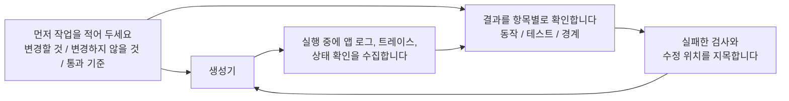

[English Version →](../../../en/lectures/lecture-11-why-observability-belongs-inside-the-harness/)

> 코드 예제: [code/](https://github.com/walkinglabs/learn-harness-engineering/blob/main/docs/en/lectures/lecture-11-why-observability-belongs-inside-the-harness/code/)
> 실습 프로젝트: [Project 06. 완전한 하네스 (캡스톤)](./../../projects/project-06-runtime-observability-and-debugging/index.md)

# 강의 11. 에이전트의 런타임을 관측 가능하게 만들어라

## 이 강의가 해결하는 문제

에이전트에게 기능을 구현하도록 요청합니다. 20분 동안 실행하고, 여러 파일을 수정한 다음, "완료됐지만 두 개의 테스트가 실패하고 있습니다"라고 알립니다. 왜 실패하는지 물으면 "잘 모르겠습니다, 타이밍 문제일 수 있습니다". 어떤 중요 경로를 변경했는지 물으면 "코드를 살펴보겠습니다..."

이것은 에이전트의 능력 부족 문제가 아닙니다. 하네스가 충분한 관측 가능성(observability)을 제공하지 않는 것입니다. **관측 가능성 없이는 에이전트가 불확실성 속에서 결정을 내리고, 평가는 주관적 판단이 되며, 재시도는 맹목적인 방황이 됩니다.** OpenAI와 Anthropic 모두 신뢰성을 증거 문제로 정의합니다—하네스는 런타임 동작과 평가 신호를 다음 결정을 안내할 수 있는 형태로 노출해야 합니다.

## 핵심 개념

- **런타임 관측 가능성(Runtime observability)**: 로그, 트레이스(trace), 프로세스 이벤트, 상태 확인 등 시스템 수준의 신호입니다. "시스템이 무엇을 했는가"에 대해 답합니다. 분산 시스템의 요청 트레이싱과 유사하게, 에이전트의 각 동작을 컨텍스트와 함께 기록합니다.
- **프로세스 관측 가능성(Process observability)**: 계획, 채점 루브릭(rubric), 인수 기준 등 하네스 결정 산출물에 대한 가시성입니다. "이 변경이 왜 수용되어야 하는가"에 대해 답합니다.
- **태스크 트레이스(Task trace)**: 태스크 시작부터 완료까지의 완전한 결정 경로 기록입니다. 분산 시스템의 요청 트레이싱과 유사하게, 에이전트가 취하는 모든 단계가 컨텍스트와 함께 기록됩니다.
- **스프린트 계약(Sprint contract)**: 코딩 시작 전에 협상되는 단기 합의입니다. 작업 범위, 검증 기준, 제외 사항을 명시합니다. 프로세스 관측 가능성을 위한 핵심 도구입니다.
- **평가자 루브릭(Evaluator rubric)**: 품질 평가를 주관적 판단에서 증거 기반 구조화된 채점으로 변환합니다. 서로 다른 평가자가 동일한 출력에 대해 유사한 결과를 도출하게 합니다.
- **계층화된 관측 가능성(Layered observability)**: 시스템 계층과 프로세스 계층의 관측 가능성을 동시에 설계하고 서로 강화하게 합니다. 런타임 신호는 동작을 설명하고, 프로세스 산출물은 의도를 설명합니다.

## 계층화된 관측 가능성



## 왜 이런 일이 발생하는가

### 관측 가능성 부재의 실제 비용

하네스에 관측 가능성이 없으면 네 가지 유형의 문제가 체계적으로 나타납니다.

**"정확함"과 "정확해 보임"을 구별할 수 없다**: 코드 리뷰 중에 함수가 완벽하게 보입니다—올바른 구문, 탄탄한 로직. 그러나 런타임에서 엣지 케이스 처리 오류가 특정 입력에서 잘못된 결과를 만들어냅니다. 실제 실행 경로가 예상에서 벗어났다는 것은 런타임 트레이스만이 드러낼 수 있습니다.

**평가가 신비주의가 된다**: 채점 루브릭과 인수 기준 없이는 평가자(사람 또는 에이전트)가 암묵적 가정에 의존합니다. 동일한 출력이 서로 다른 평가자로부터 완전히 다른 평가를 받을 수 있습니다. 품질 평가가 재현 불가능해집니다.

**재시도가 맹목적인 추측이 된다**: 에이전트가 왜 실패했는지 모르면, 재시도 방향이 무작위입니다. 실제 실패 근본 원인을 무시하고 관련 없는 코드 경로를 고치면서 잘못된 방향으로 반복적으로 시도할 수 있습니다. 모든 맹목적 재시도는 토큰과 시간을 소비합니다.

**세션 핸드오프(handoff) 정보 절벽**: 완료되지 않은 작업이 다음 세션으로 인계될 때, 관측 가능성 부재는 새 세션이 시스템 상태를 처음부터 진단해야 함을 의미합니다. Anthropic의 장시간 실행 에이전트 관찰에 따르면 이러한 중복 진단이 총 세션 시간의 30-50%를 소비할 수 있습니다.

### 실제 Claude Code 시나리오

"계획자-생성자-평가자(planner-generator-evaluator)" 세 가지 역할 워크플로를 사용하는 하네스가 "앱에 다크 모드 추가" 작업을 실행하는 것을 상상해 보세요.

**관측 가능성 없이**: 계획자가 모호한 설명을 출력합니다. 생성자가 그 모호함을 바탕으로 다크 모드를 구현하지만, 계획자의 암묵적 기대와 맞지 않습니다. 평가자는 자신의 암묵적 기준을 바탕으로 거부하지만, 구체적으로 무엇이 잘못됐는지 명확히 말할 수 없습니다. 생성자는 모호한 거부 이유를 바탕으로 맹목적으로 재시도합니다. 사이클이 3-4번 반복되고, 약 45분이 소요되며, 겨우 수용 가능한 출력이 만들어집니다.

**완전한 관측 가능성으로**: 계획자가 스프린트 계약을 출력합니다—수정할 컴포넌트, 각각의 검증 기준, 제외 사항(인쇄 스타일 처리 안 함)을 나열합니다. 생성자가 계약에 따라 구현합니다. 런타임 관측 가능성이 각 컴포넌트의 스타일 로딩 및 적용 프로세스를 기록합니다. 평가자가 채점 루브릭을 사용해 차원별로 평가하며, 구체적인 증거를 인용합니다. 한 번의 반복으로 고품질 결과가 나오고, 약 15분이 소요됩니다.

3배의 효율성 차이. 유일한 변화는 관측 가능성입니다.

### 에이전트가 이것을 스스로 해결할 수 없는 이유

"에이전트가 자체 로그를 출력하면 안 되나요?"라고 생각할 수 있습니다. 문제는 다음과 같습니다.

1. 에이전트는 자신이 모르는 것을 모릅니다—필요하다고 깨닫지 못하는 신호는 능동적으로 기록하지 않을 것입니다.
2. 로그 형식이 일관되지 않습니다—서로 다른 세션이 서로 다른 로그 형식을 사용하면 체계적인 분석이 불가능합니다.
3. 프로세스 관측 가능성은 로그로 해결할 수 없습니다—스프린트 계약과 채점 루브릭은 하네스 수준의 지원이 필요한 구조화된 산출물입니다.

## 올바르게 하는 방법

### 1. 런타임 신호 수집을 하네스에 구축하라

에이전트가 자체 로그를 출력하는 것에 의존하지 마세요. 하네스가 자동으로 이러한 신호를 수집해야 합니다.

- **애플리케이션 수명 주기**: 시작, 준비, 실행, 종료 단계 상태
- **기능 경로 실행**: 진입점, 체크포인트, 종료를 포함한 중요 경로 실행 기록
- **데이터 흐름**: 컴포넌트 간 데이터 흐름 기록
- **리소스 활용**: 비정상적인 리소스 사용 패턴 (예: 지속적으로 증가하는 메모리)
- **오류 및 예외**: 오류 메시지만이 아닌 전체 오류 컨텍스트

### 2. 스프린트 계약을 구현하라

각 작업 시작 전에, 생성자와 평가자(동일한 에이전트의 서로 다른 호출일 수 있음)가 계약을 협상합니다.

```markdown
# 스프린트 계약: 다크 모드 지원

## 범위
- 테마 전환 컴포넌트 수정
- 전역 CSS 변수 업데이트
- 다크 모드 테스트 추가

## 검증 기준
- 각 컴포넌트에 대한 시각적 회귀 테스트 통과
- 주요 흐름 엔드투엔드 테스트 통과
- 스타일되지 않은 콘텐츠의 플래시(FOUC) 없음

## 제외 사항
- 인쇄 스타일 처리 안 함
- 써드파티 컴포넌트 다크 모드 처리 안 함
```

### 3. 평가자 루브릭을 수립하라

"좋은가 아닌가"를 정량화 가능한 채점으로 전환합니다.

```markdown
# 채점 루브릭

| 차원 | A | B | C | D |
|------|---|---|---|---|
| 코드 정확성 | 모든 테스트 통과 | 주요 흐름 통과 | 부분 통과 | 빌드 실패 |
| 아키텍처 준수 | 완전 준수 | 사소한 편차 | 명백한 편차 | 심각한 위반 |
| 테스트 커버리지 | 주요 + 엣지 케이스 | 주요 흐름만 | 스켈레톤만 | 테스트 없음 |
```

### 4. OpenTelemetry로 표준화하라

각 하네스 세션에 대한 트레이스(trace)를, 각 작업에 대한 스팬(span)을, 각 검증 단계에 대한 하위 스팬을 생성하세요. 표준 속성을 사용해 주요 정보에 주석을 달 수 있습니다. 이렇게 하면 관측 가능성 데이터가 표준 툴체인(Jaeger, Zipkin)과 통합됩니다.

## 실제 사례

계획자-생성자-평가자 워크플로를 사용하는 하네스가 "다크 모드 지원 추가"를 실행합니다.

**관측 불가능한 버전**: 3-4번의 맹목적 재시도, 45분, 겨우 수용 가능한 출력. 평가자는 "느낌이 좋지 않습니다"라고 하지만 구체적으로 무엇인지 말할 수 없습니다. 생성자는 잘못된 방향으로 상당한 시간을 낭비합니다.

**완전히 관측 가능한 버전**:
- 스프린트 계약이 범위, 기준, 제외 사항을 명확히 함
- 런타임 트레이스가 각 컴포넌트의 스타일 로딩 프로세스를 기록
- 채점 루브릭이 차원별 구조화된 평가를 제공
- 한 번의 반복으로 고품질 결과, 15분

3배 효율성 향상, 더 안정적인 품질, 재현 가능한 평가.

## 핵심 정리

- **관측 가능성은 하네스 아키텍처의 속성입니다**—나중에 추가되는 기능이 아니라, 설계 중에 고려되어야 하는 핵심 역량입니다.
- **두 관측 가능성 계층이 모두 필수적입니다**—런타임 신호는 "무슨 일이 있었는가"를 설명하고, 프로세스 산출물은 "왜 그렇게 했는가"를 설명합니다.
- **스프린트 계약은 사전 정렬(front-load alignment)을 수행합니다**—"생성자가 구축한 것을 평가자가 예측 가능한 이유로 즉시 거부하는" 상황을 방지합니다.
- **채점 루브릭은 평가를 재현 가능하게 만듭니다**—서로 다른 평가자가 동일한 출력에 대해 유사한 점수를 부여합니다.
- **관측 가능성 부재는 세션 시간의 30-50%를 중복 진단에 낭비합니다.**

## 더 읽을거리

- [Observability Engineering - Charity Majors](https://www.honeycomb.io/blog/observability-engineering-book) — 현대 관측 가능성 엔지니어링의 이론과 실천 프레임워크
- [Dapper - Google (Sigelman et al.)](https://research.google/pubs/pub36356/) — 대규모 분산 트레이싱의 선구적 실천
- [Harness Design - Anthropic](https://www.anthropic.com/engineering/harness-design-long-running-apps) — 스프린트 계약과 평가자 루브릭 소개
- [Site Reliability Engineering - Google](https://sre.google/sre-book/table-of-contents/) — 프로덕션 시스템에서 관측 가능성의 체계적 적용

## 연습 문제

1. **관측 가능성 격차 분석**: 현재 하네스에서 시스템 계층과 프로세스 계층의 관측 가능성을 감사합니다. 기존 신호로 구별할 수 없는 시스템 상태를 찾아 추가 사항을 제안하세요.

2. **스프린트 계약 실습**: 실제 작업에 대한 스프린트 계약을 작성하세요. 에이전트가 계약에 따라 실행하도록 하고, 계약 유무에 따른 효율성과 품질을 비교하세요.

3. **태스크 트레이스 구성**: 완전한 코딩 작업 동안 에이전트 작업의 모든 단계를 기록합니다. OpenTelemetry 시맨틱 컨벤션으로 주석을 달 수 있습니다. 트레이스에서 정보 병목을 분석합니다—어떤 단계가 결정을 위한 충분한 신호 지원이 부족한지 파악하세요.
