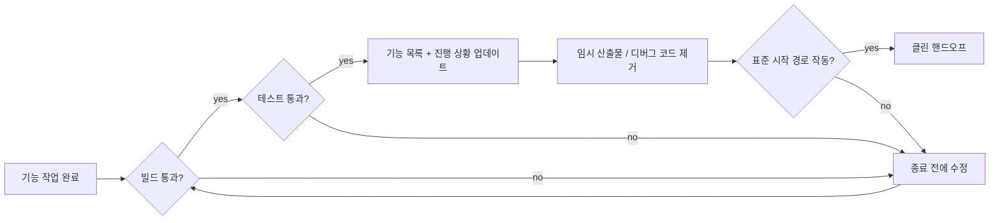
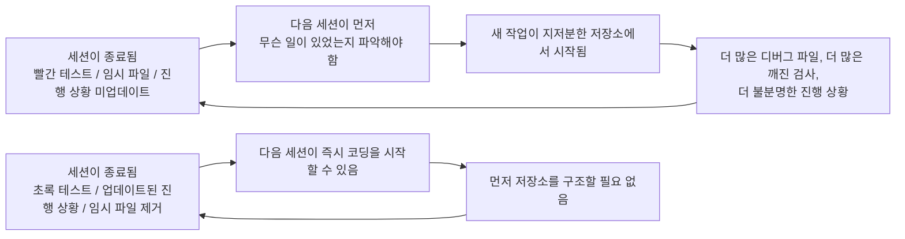

[English Version →](../../../en/lectures/lecture-12-why-every-session-must-leave-a-clean-state/)

> 코드 예제: [code/](https://github.com/walkinglabs/learn-harness-engineering/blob/main/docs/en/lectures/lecture-12-why-every-session-must-leave-a-clean-state/code/)
> 실습 프로젝트: [Project 06. 완전한 하네스 (캡스톤)](./../../projects/project-06-runtime-observability-and-debugging/index.md)

# 강의 12. 모든 세션은 클린 상태(clean state)로 끝나야 한다

## 이 강의가 해결하는 문제

에이전트가 오후 내내 실행되고, 20개의 파일을 수정하고, 코드를 커밋하고, 세션이 종료됩니다. 다음 에이전트 세션이 시작되고 즉시 발견합니다. 빌드가 깨져 있고, 테스트는 빨간 상태이며, 임시 디버그 파일이 곳곳에 있고, 기능 목록은 업데이트되지 않았으며, 진행 상황이 전혀 불분명합니다. 새 세션은 "지난 세션이 실제로 무엇을 했는가"를 파악하는 데 첫 30분을 씁니다.

OpenAI와 Anthropic 모두 명확히 밝힙니다. **장기적 신뢰성은 단일 실행의 성공이 아니라 운영 규율에 달려 있습니다.** 세션 종료 시점의 상태 품질이 다음 세션의 효율성을 직접 결정합니다. Git 모범 사례처럼 생각하세요—모든 커밋은 원자적이고 컴파일 가능한 변경이어야 하며, 반쯤 완성된 코드 더미가 되어서는 안 됩니다.

## 핵심 개념

- **클린 상태(Clean state)**: 세션 종료 시 시스템이 다섯 가지 조건을 만족하는 것입니다—빌드 통과, 테스트 통과, 진행 상황 기록됨, 오래된 산출물 없음, 시작 경로 사용 가능. 하나라도 빠지면 세션이 "완료"된 것이 아닙니다.
- **세션 무결성(Session integrity)**: 데이터베이스 트랜잭션과 유사합니다—완전히 커밋하고 클린 상태를 남기거나, 마지막 일관된 상태로 롤백합니다. 중간 지점은 없습니다.
- **품질 문서(Quality document)**: 각 모듈의 품질 등급을 지속적으로 기록하는 활성 산출물입니다. 일회성 평가가 아니라, 코드베이스가 시간이 지남에 따라 강해지는지 약해지는지 보여주는 추적기입니다.
- **클린업 루프(Cleanup loop)**: 코드베이스의 엔트로피(entropy)를 체계적으로 줄이기 위한 정기적인 유지보수 세션입니다. 긴급 수정이 아닌 일상적인 운영입니다.
- **하네스 단순화(Harness simplification)**: 모델 역량이 향상됨에 따라, 더 이상 필요하지 않은 하네스 구성 요소를 주기적으로 제거합니다. 오늘 필수적인 제약이 세 달 후에는 불필요한 오버헤드가 될 수 있습니다.
- **멱등 정리(Idempotent cleanup)**: 정리 작업이 몇 번 실행되든 동일한 결과를 생성합니다. 실패-재시도 시나리오에서도 정리가 안전하게 유지됨을 보장합니다.

## 클린 상태의 다섯 가지 차원





## 왜 이런 일이 발생하는가

### 엔트로피 증가가 기본 상태이다

소프트웨어 진화의 Lehman 법칙에 따르면 지속적으로 변경되는 시스템은 능동적으로 관리되지 않으면 복잡성이 불가피하게 증가합니다. 이것은 AI 코딩 에이전트에게 특히 사실입니다—매 세션마다 변경 사항을 도입하고, 종료 시 정리하지 않으면 기술 부채가 기하급수적으로 쌓입니다.

실제 데이터가 이를 말해줍니다. 정리 전략 없이 12주간 에이전트로 개발된 프로젝트:

- 1주차: 빌드 통과율 100%, 테스트 통과율 100%, 새 세션 시작 5분
- 4주차: 빌드 95%, 테스트 92%, 시작 15분
- 8주차: 빌드 82%, 테스트 78%, 시작 35분
- 12주차: 빌드 68%, 테스트 61%, 시작 60분+

정리 전략이 있는 동일한 프로젝트:

- 1주차: 100%, 100%, 5분
- 12주차: 97%, 95%, 9분

12주 후: 빌드 통과율 29퍼센트포인트 차이, 새 세션 시작 시간 85% 차이. 이것은 이론이 아닙니다—관찰된 차이입니다.

### 클린 상태의 다섯 가지 차원

클린 상태는 단순히 "코드가 컴파일된다"는 것이 아닙니다. 함께 평가되는 다섯 가지 차원입니다.

**빌드 차원**: 코드가 오류 없이 빌드되는가? 이것이 가장 기본입니다—다음 세션이 빌드 오류를 먼저 수정해야 하는 상황은 없어야 합니다.

**테스트 차원**: 모든 테스트가 통과하는가? 세션 전에 존재했던 테스트도 포함해서입니다—세션은 기존 기능을 깨뜨리지 않을 책임이 있습니다. 그리고 "내 기계에서는 작동해"가 아니라 CI에서 검증되어야 합니다.

**진행 상황 차원**: 현재 진행 상황이 기계가 읽을 수 있는 산출물에 기록되어 있는가? 통과 기준이 있는 완료된 하위 작업, 현재 상태가 있는 진행 중이지만 완료되지 않은 하위 작업, 아직 시작되지 않은 하위 작업. 좋은 진행 상황 기록은 세션 시작 진단 시간의 60-80%를 줄입니다.

**산출물 차원**: 오래되거나 모호한 임시 산출물이 있는가? 디버그 로그, 임시 파일, 주석 처리된 코드, TODO 마커—이 모두가 다음 세션의 인지 부하를 높입니다.

**시작 차원**: 표준 시작 경로를 사용할 수 있는가? 다음 세션이 수동 개입 없이 작업을 시작할 수 있는가? 환경 초기화, 코드베이스 로딩, 컨텍스트 획득, 작업 선택—이 경로들이 깨져서는 안 됩니다.

### "나중에 정리"는 절대 정리하지 않는다는 의미다

가장 흔한 정신적 함정은 "이번 세션에는 정리할 시간이 없으니 다음에 하겠다"입니다. 그러나 다음 에이전트 세션은 당신이 남겨 놓은 것을 모릅니다—코드 더미와 불확실한 상태를 봅니다. "이 코드의 어떤 부분이 의도적이고 어떤 부분이 임시적인가"를 추론하는 데 상당한 시간을 씁니다.

더 나쁜 것은, 모든 세션에는 자체 작업 목표가 있습니다. 새 세션은 이전 세션의 혼란을 정리하는 것이 아니라 새 작업을 하러 왔습니다. 혼란을 무시하고 그 위에 새 작업을 시작하여, 혼란 위에 더 많은 혼란을 도입합니다. 이것이 엔트로피의 양의 피드백 루프입니다.

## 올바르게 하는 방법

### 1. 클린 상태를 완료 요건으로 정의하라

하네스에서 명시적으로 정의하세요. **세션 완료 = 작업이 검증을 통과함 AND 클린 상태 검사를 통과함.** 둘 중 하나라도 빠지면 세션이 완료된 것이 아닙니다. CLAUDE.md에 작성하세요.

```
## 세션 종료 체크리스트
- [ ] 빌드 통과 (npm run build)
- [ ] 모든 테스트 통과 (npm test)
- [ ] 기능 목록 업데이트됨
- [ ] 디버그 코드 없음 (console.log, debugger, TODO)
- [ ] 표준 시작 경로 사용 가능 (npm run dev)
```

### 2. 이중 모드 정리 전략을 결합하라

두 가지 정리 모드를 결합합니다.

**즉각적 정리 (모든 세션 종료 시)**: 세션 중에 생성된 임시 산출물을 정리하고, 기능 목록 상태를 업데이트하고, 빌드와 테스트가 통과하는지 확인합니다. 이것은 "참조 카운팅" 정리입니다.

**주기적 정리 (주간)**: 전체 시스템 스캔—누적된 구조적 문제를 처리하고, 품질 문서를 업데이트하고, 드리프트를 탐지하기 위해 벤치마크 테스트를 실행합니다. 이것은 "추적" 정리입니다.

### 3. 품질 문서를 유지하라

품질 문서는 각 모듈을 지속적으로 채점하는 활성 산출물입니다.

```markdown
# 품질 문서

## 사용자 인증 모듈 (품질: A)
- 검증 통과: 예
- 에이전트 이해 가능: 예
- 테스트 안정성: 안정
- 아키텍처 경계: 준수
- 코드 컨벤션: 따름

## 결제 모듈 (품질: C)
- 검증 통과: 부분 (결제 콜백 미테스트)
- 에이전트 이해 가능: 어려움 (로직이 3개 파일에 분산)
- 테스트 안정성: 불안정 (2개의 불안정 테스트)
- 아키텍처 경계: 위반 존재
- 코드 컨벤션: 부분적으로 따름
```

새 세션은 이 문서를 읽고 어디에 우선순위를 둘지 즉시 알 수 있습니다. 가장 낮은 점수의 모듈을 먼저 수정합니다.

### 4. 주기적으로 하네스를 단순화하라

Anthropic의 중요한 통찰: **모든 하네스 구성 요소는 모델이 스스로 무언가를 안정적으로 할 수 없기 때문에 존재합니다. 그러나 모델이 향상됨에 따라 이러한 가정은 구식이 됩니다.** 세 달 전에 필수적인 제약이 오늘은 불필요한 오버헤드일 수 있습니다.

권장 실천: 매달 하나의 하네스 구성 요소를 선택하고, 일시적으로 비활성화하고, 벤치마크 작업을 실행합니다. 결과가 저하되지 않으면 영구적으로 제거합니다. 저하되면 복원하거나 더 가벼운 대안으로 교체합니다.

### 5. 정리 작업은 멱등적이어야 한다

정리 스크립트는 반복 실행에도 안전해야 합니다.

```bash
# 멱등 정리 작업
rm -f /tmp/debug-*.log  # -f는 파일이 없을 때 오류 없음을 보장
git checkout -- .env.local  # 알려진 상태로 복원
npm run test  # 정리가 아무것도 깨뜨리지 않았는지 확인
```

## 실제 사례

12주 동안 에이전트로 개발된 Electron 앱으로 두 가지 접근 방식을 비교합니다.

**정리 전략 없이** (대조군): 12주차, 빌드 통과율 68%, 테스트 통과율 61%, 새 세션 시작 60분+, 오래된 산출물 103개.

**정리 전략으로** (실험군): 모든 세션 종료 시 완전한 클린 상태 검사 + 주간 클린업 루프. 12주차, 빌드 통과율 97%, 테스트 통과율 95%, 새 세션 시작 9분, 오래된 산출물 11개.

12주차에 실험군의 빌드 통과율은 29퍼센트포인트 높고, 테스트 통과율은 34포인트 높으며, 새 세션 시작 시간은 85% 낮습니다.

## 핵심 정리

- **클린 상태는 세션 완료의 필요 조건입니다**—선택적 정리 작업이 아니라, "완료의 정의"의 일부입니다.
- **다섯 가지 차원 모두 필요합니다**—빌드, 테스트, 진행 상황, 산출물, 시작—각각 명시적으로 검사되어야 합니다.
- **품질 문서는 코드베이스 건강을 추적 가능하게 만듭니다**—저하되고 있다는 것을 알아야만 수정할 수 있습니다.
- **주기적으로 하네스를 단순화하세요**—모델 역량이 향상됨에 따라, 더 이상 필요 없는 제약을 제거하세요.
- **"나중에 정리"는 절대 정리하지 않는다는 의미입니다**—엔트로피 증가가 기본 상태이며, 능동적인 정리만이 이를 막을 수 있습니다.

## 더 읽을거리

- [Clean Code - Robert C. Martin](https://www.goodreads.com/book/show/3735293-clean-code) — 코드 청결성의 체계적 원칙
- [Harness Engineering - OpenAI](https://openai.com/index/harness-engineering/) — 핵심 하네스 설계 요건으로서의 재현성
- [Effective Harnesses - Anthropic](https://www.anthropic.com/engineering/effective-harnesses-for-long-running-agents) — 장기적 신뢰성을 위한 클린 세션 종료의 중요한 역할
- [Programs, Life Cycles, and Laws of Software Evolution - Lehman](https://ieeexplore.ieee.org/document/1702314) — 능동적 유지보수 없이는 시스템 복잡성이 불가피하게 증가함을 증명하는 소프트웨어 진화 법칙

## 연습 문제

1. **클린 상태 체크리스트**: 다섯 가지 차원을 모두 포함하는 코드베이스의 세션 종료 체크리스트를 설계하세요. 연속 5개 세션에 적용하고 차원별 위반 사항을 기록하세요.

2. **벤치마크 비교**: 두 가지 하네스 변형(클린 상태 요건 있음/없음)으로 고정된 작업 세트를 사용하세요. 완료율, 재시도 횟수, 결함 탈출률을 비교하세요.

3. **하네스 단순화 실습**: 하나의 하네스 구성 요소를 선택하고, 일시적으로 비활성화하고, 벤치마크 작업을 실행하세요. 있을 때와 없을 때의 결과를 비교하세요. 유지할지, 제거할지, 교체할지 결정하세요.
