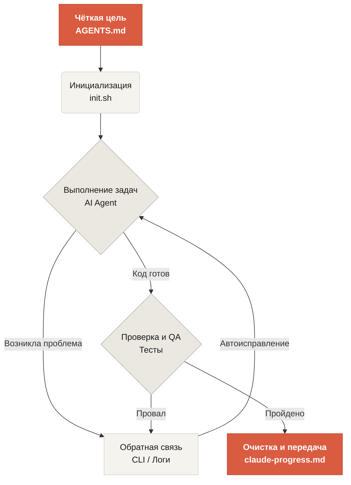

# Добро пожаловать в Learn Harness Engineering

Learn Harness Engineering — курс, посвящённый инженерии AI-агентов для кодинга. Мы глубоко изучили и обобщили самые передовые теории и практики Harness Engineering в индустрии. Наши основные источники:
- [OpenAI: Harness engineering: leveraging Codex in an agent-first world](https://openai.com/index/harness-engineering/)
- [Anthropic: Effective harnesses for long-running agents](https://www.anthropic.com/engineering/effective-harnesses-for-long-running-agents)
- [Anthropic: Harness design for long-running application development](https://www.anthropic.com/engineering/harness-design-long-running-apps)
- [Awesome Harness Engineering](https://github.com/walkinglabs/awesome-harness-engineering)

Через системный дизайн окружения, управление состоянием, верификацию и контроль курс учит, как сделать агентские инструменты вроде Codex и Claude Code по-настоящему надёжными. Он помогает строить фичи, чинить баги и автоматизировать задачи разработки, ограничивая AI-ассистента явными правилами и границами.

## С чего начать

Выберите свой путь обучения. Курс разделён на теоретические лекции, практические проекты и готовую к копированию библиотеку материалов.

  <a href="./lectures/lecture-01-why-capable-agents-still-fail/" class="card">
    <h3>Лекции</h3>
    
Поймите, почему сильные модели всё равно ошибаются, и изучите теорию эффективных harness.

  </a>
  <a href="./projects/" class="card">
    <h3>Проекты</h3>
    
Практическое построение надёжной агентской среды с нуля.

  </a>
  <a href="./resources/" class="card">
    <h3>Библиотека материалов</h3>
    
Готовые шаблоны (AGENTS.md, feature_list.json) для использования в своих репозиториях.

  </a>

## Основной механизм harness

Harness не «делает модель умнее» — он создаёт для неё замкнутую **рабочую систему**. Основной поток работы можно понять по этой простой диаграмме:

## Что вы узнаете

Ключевые концепции, которыми вы овладеете:

<ul class="index-list">
  <li><strong>Ограничивать поведение агента</strong> явными правилами и границами.</li>
  <li><strong>Сохранять контекст</strong> в длительных задачах между сессиями.</li>
  <li><strong>Не давать агенту</strong> объявлять успех слишком рано.</li>
  <li><strong>Верифицировать работу</strong> через сквозные тесты и саморефлексию.</li>
  <li><strong>Делать runtime наблюдаемым</strong> и отлаживаемым.</li>
</ul>

## Дальнейшие шаги

Когда вы поймёте основы, эти материалы помогут углубиться:

<ul class="index-list">
  <li><a href="./lectures/lecture-01-why-capable-agents-still-fail/">Лекция 01: Почему сильные агенты всё равно ошибаются</a>: начните с теории harness engineering.</li>
  <li><a href="./projects/project-01-baseline-vs-minimal-harness/">Проект 01: Базовый vs минимальный harness</a>: пройдите первое реальное задание.</li>
  <li><a href="./resources/templates/">Шаблоны</a>: возьмите минимальный набор (AGENTS.md, feature_list.json, claude-progress.md) для своих проектов.</li>
</ul>
