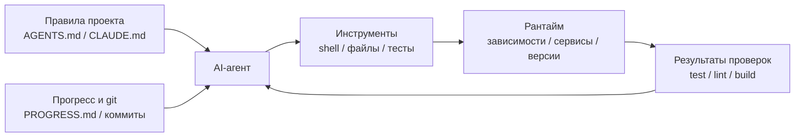

[中文版本 →](../../../zh/lectures/lecture-02-what-a-harness-actually-is/)

> Примеры кода: [code/](https://github.com/walkinglabs/learn-harness-engineering/blob/main/docs/en/lectures/lecture-02-what-a-harness-actually-is/code/)
> Практический проект: [Project 01. Prompt-only vs. rules-first](./../../projects/project-01-baseline-vs-minimal-harness/index.md)

# Лекция 02. Что на самом деле означает harness

Слово «harness» в кругах AI-кодинг-агентов разбрасывают направо и налево, но честно говоря, большинство людей под ним подразумевает «файл с промптом». Это не harness. Это как открыть ресторан, имея только продукты — без плиты, без ножей, без рецептов, без процесса подачи. Это не ресторан. Это холодильник.

В этой лекции вы получите точное и применимое определение harness. Не академическую абстракцию, а фреймворк, который можно использовать уже сегодня: harness состоит из пяти подсистем, у каждой — чёткие обязанности и критерии оценки.

## Начнём с аналогии

Представьте, что вы только что нанятый инженер, которого бросили в проект без какой-либо документации. Нет README, нет комментариев в коде, никто не сказал, как запускать тесты, конфиг CI закопан где-то глубоко. Сможете ли вы писать хороший код? Возможно — если вы достаточно умны и терпеливы. Но огромное количество времени уйдёт на «разобраться, что это вообще за проект», а не на «решить задачу».

AI-агент сталкивается ровно с той же ситуацией. И ему хуже — вы хоть коллегу можете спросить. Агент видит только файлы, которые вы ему положите, и команды, которые он может выполнить. Он не может постучать кому-то по плечу и спросить «слушай, какой версии ORM здесь используется?».

OpenAI формулируют главный принцип так: «the repo IS the spec» — весь необходимый контекст должен жить в репозитории, передаваясь через структурированные файлы инструкций, явные команды верификации и понятную организацию каталогов. В документации Anthropic про долгоживущих агентов делается упор на персистентность состояния, явные пути восстановления и структурированное отслеживание прогресса. Эти две компании смотрят на разные аспекты, но говорят об одном и том же: **всё в инженерной инфраструктуре за пределами модели определяет, какая часть способностей модели реально проявится на практике.**

Посмотрите на знакомые вам инструменты:

**Claude Code** воплощает harness-мышление. Он читает `CLAUDE.md` из вашего репо (полка с рецептами), может выполнять shell-команды (стойка с ножами), исполняется в вашей локальной среде (плита), хранит историю сессии (заготовочный стол) и может запускать тесты и видеть результаты (окно контроля качества). Но если вы не сказали ему, как запускать тесты, окно контроля качества разбито — никто не знает, готово ли блюдо.

**Cursor** следует той же логике. Файл `.cursorrules` — это полка с рецептами, терминал — стойка с ножами, он читает структуру проекта и конфиг линтера для плиты. Но управление состоянием у Cursor сравнительно слабое — закрыли IDE, открыли заново, и предыдущий контекст пропал.

**Codex** (кодинг-агент OpenAI) использует git worktrees, чтобы изолировать рантайм-среду каждой задачи, в паре с локальным observability-стеком (логи, метрики, трейсы), так что каждое изменение проверяется в независимом окружении. В репозиториях с `AGENTS.md` и понятными командами верификации он работает гораздо лучше, чем в «голых» репо.

**AutoGPT** — поучительный антипример: отсутствие структурированного управления состоянием приводит к накоплению контекста на длинных задачах, а отсутствие точных механизмов обратной связи заставляет агента ходить кругами. Многие говорят, что AutoGPT «не работает», но на самом деле не работает harness AutoGPT — дайте повару сломанную плиту, и даже из лучших продуктов еды не выйдет.

## Ключевые понятия

- **Что такое harness**: всё в инженерной инфраструктуре за пределами весов модели. OpenAI сводят основную работу инженера к трём вещам: проектирование сред, выражение намерения и построение петель обратной связи. Anthropic называют свой Claude Agent SDK «универсальным harness для агентов».
- **Репозиторий — единственный источник истины**: то, чего агент не видит, для всех практических целей не существует. OpenAI рассматривают репо как «system of record» — весь необходимый контекст должен жить там, через структурированные файлы и понятную организацию каталогов.
- **Дайте карту, а не учебник**: опыт OpenAI — `AGENTS.md` должен быть оглавлением, а не энциклопедией. Около 100 строк — достаточно. Если не помещается, выносите в каталог `docs/` и пусть агент читает по необходимости.
- **Ограничивайте, а не микроменеджите**: хороший harness ограничивает агента исполняемыми правилами, а не перечисляет инструкции одну за другой. OpenAI говорят «enforce invariants, don't micromanage implementation»; Anthropic обнаружили, что агенты уверенно хвалят свою же работу, и решение — разделить «того, кто делает» и «того, кто проверяет».
- **Удаляйте компоненты по одному**: чтобы измерить ценность каждого компонента harness, удаляйте их по одному и смотрите, какое удаление сильнее всего просаживает производительность. Anthropic именно так и делали — и обнаружили, что по мере усиления моделей некоторые компоненты перестают быть критичными, но всегда появляются новые.

## Модель harness из пяти подсистем

Возвращаемся к кухонной аналогии. У полноценной кухни пять функциональных зон, и у harness — пять подсистем:



**Подсистема инструкций (полка с рецептами)**: создайте `AGENTS.md` (или `CLAUDE.md`), содержащий обзор и цель проекта (одно предложение), стек и версии (Python 3.11, FastAPI 0.100+, PostgreSQL 15), команды первого запуска (`make setup`, `make test`), необсуждаемые жёсткие ограничения («все API должны использовать OAuth 2.0») и ссылки на более детальную документацию.

**Подсистема инструментов (стойка с ножами)**: убедитесь, что у агента есть достаточный доступ к инструментам. Не отключайте shell ради «безопасности» — если агент не может даже запустить `pip install`, как ему работать? Но и не открывайте всё подряд — следуйте принципу наименьших привилегий.

**Подсистема среды (плита)**: сделайте состояние среды самоописательным. Используйте `pyproject.toml` или `package.json`, чтобы залочить зависимости, `.nvmrc` или `.python-version` — для версий рантайма, Docker или devcontainers — для воспроизводимости.

**Подсистема состояния (заготовочный стол)**: длинным задачам нужно отслеживание прогресса. Используйте простой файл `PROGRESS.md`, фиксирующий: что сделано, что в работе, что заблокировано. Обновляйте перед концом каждой сессии, читайте в начале следующей.

**Подсистема обратной связи (окно контроля качества)**: подсистема с самым высоким ROI. Явно перечислите команды верификации в `AGENTS.md`:
```
Команды верификации:
- Тесты: pytest tests/ -x
- Проверка типов: mypy src/ --strict
- Линт: ruff check src/
- Полная верификация: make check (включает всё выше)
```

Отсутствие любой подсистемы — как отсутствие функциональной зоны на кухне: готовить можно, но всегда будет неудобно.

**Диагностика качества harness**: используйте «изометрический контроль модели». Зафиксируйте модель, удаляйте подсистемы по одной, измеряйте, какое удаление сильнее всего просаживает производительность. Это и есть бутылочное горлышко — туда направляйте усилия. Как в поиске бутылочного горлышка на кухне: уберите полку с рецептами и посмотрите, насколько всё замедлится; выключите плиту и оцените эффект.

## Реальная история одной команды

Команда использовала GPT-4o на TypeScript + React фронтенде (~20 000 строк кода). Они прошли четыре стадии — по сути, добавляя кухонное оборудование по одной единице:

**Стадия 1 — пустая кухня**: только базовое описание проекта в README. Из 5 прогонов успешен 1 (20%). Главные провалы: выбран не тот пакетный менеджер (npm vs yarn), не соблюдены конвенции именования компонентов, не получалось запустить тесты.

**Стадия 2 — установлена полка с рецептами**: добавили `AGENTS.md` с версиями стека, конвенциями именования, ключевыми архитектурными решениями. Успешность выросла до 60%. Оставшиеся провалы — в основном проблемы среды и отсутствие верификации.

**Стадия 3 — открыто окно контроля качества**: в `AGENTS.md` перечислены команды верификации: `yarn test && yarn lint && yarn build`. Успешность выросла до 80%.

**Стадия 4 — заготовочный стол готов**: ввели шаблоны файлов прогресса, в которых агент в каждом прогоне фиксировал сделанное и оставшееся. Успешность стабилизировалась на 80–100%.

Четыре итерации, модель не менялась вообще, успешность ушла с 20% к почти 100%. В этом сила harness engineering. Вы не покупали более дорогие продукты — вы просто навели порядок на кухне.

## Главное

- Harness = инструкции + инструменты + среда + состояние + обратная связь. Пять подсистем, как пять функциональных зон кухни — все обязательны.
- Если это не веса модели — это harness. Ваш harness определяет, какая часть способностей модели реализуется.
- Среди пяти подсистем у подсистемы обратной связи обычно самый низкий вход и самый высокий возврат. Сначала наладьте команды верификации — окно контроля качества стоит апгрейдить в первую очередь.
- Используйте «изометрический контроль модели», чтобы количественно оценить вклад каждой подсистемы — не на глазок.
- Harness гниёт так же, как код. Ревизуйте регулярно, гасите harness-долг как технический долг.

## Дальнейшее чтение

- [OpenAI: Harness Engineering](https://openai.com/index/harness-engineering/)
- [Anthropic: Effective Harnesses for Long-Running Agents](https://www.anthropic.com/engineering/effective-harnesses-for-long-running-agents)
- [HumanLayer: Harness Engineering for Coding Agents](https://humanlayer.dev/articles/harness-engineering-for-coding-agents/)
- [SWE-agent: Agent-Computer Interfaces](https://github.com/princeton-nlp/SWE-agent)
- [Thoughtworks: Harness Engineering on Technology Radar](https://www.thoughtworks.com/radar)

## Упражнения

1. **Аудит harness по пятёрке**: возьмите проект, в котором используете AI-агента, и проведите полный аудит по пятикомпонентному фреймворку. Каждой подсистеме поставьте оценку 1–5. Найдите подсистему с самой низкой оценкой, потратьте 30 минут на её улучшение и понаблюдайте за изменениями в работе агента.

2. **Эксперимент с изометрическим контролем модели**: возьмите одну модель и одну сложную задачу. Последовательно убирайте инструкции (удалите AGENTS.md), убирайте обратную связь (не давайте команды верификации), убирайте состояние (без файлов прогресса) — каждый раз убирайте только одно и измеряйте просадку. По результатам отранжируйте важность подсистем для вашего проекта.

3. **Анализ affordance**: найдите в проекте сценарий, где агент «хочет что-то сделать, но не может» (например, знает, что нужны параметризованные запросы, но не знает паттернов ORM в вашем проекте). Разберите, это Gulf of Execution (не знает, как) или Gulf of Evaluation (не знает, правильно ли). Затем спроектируйте улучшение harness, чтобы перекрыть этот разрыв.
