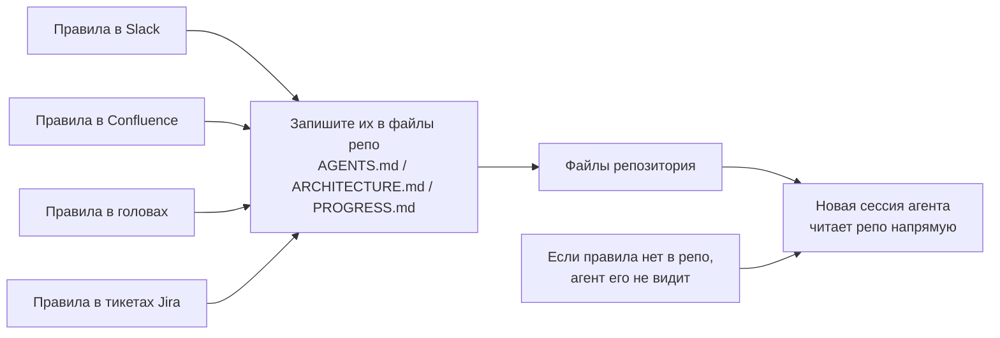
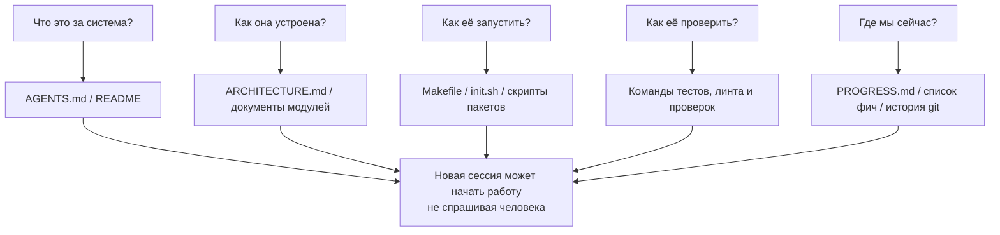

[中文版本 →](../../../zh/lectures/lecture-03-why-the-repository-must-become-the-system-of-record/)

> Примеры кода: [code/](https://github.com/walkinglabs/learn-harness-engineering/blob/main/docs/en/lectures/lecture-03-why-the-repository-must-become-the-system-of-record/code/)
> Практический проект: [Project 02. Agent-readable workspace](./../../projects/project-02-agent-readable-workspace/index.md)

# Лекция 03. Сделайте репозиторий своим единственным источником истины

Архитектурные решения вашей команды разбросаны по Confluence, Slack, Jira и головам нескольких сеньоров. Для людей это кое-как работает — можно спросить коллегу, поискать в чате, покопаться в доках. В крайнем случае поймать кого-то в курилке. Но для AI-агента информация, которой нет в репозитории, попросту не существует.

Это не преувеличение. Подумайте, что вообще является входом для агента: системные промпты и описания задач, содержимое файлов из репозитория, вывод инструментов. И всё. Ваша история в Slack, тикеты в Jira, страницы в Confluence и то архитектурное решение, которое вы обсудили с коллегой за кофе в пятницу днём — агент ничего из этого не видит. Он не может «пойти спросить» или «поискать в чате». Это инженер, запертый внутри репозитория — что снаружи, он не знает.

Так что вопрос ставится так: дадите ли вы этому инженеру хорошую карту?

## Что должно быть на карте

OpenAI говорят это прямо: **информации, которой нет в репо, для агента не существует.** Они называют это принципом «repo as spec» — сам репозиторий и есть спецификационный документ высшей инстанции.

Документация Anthropic про долгоживущих агентов вторит: персистентное состояние — необходимое условие непрерывности длинных задач. Восстановимость знаний между сессиями напрямую определяет успешность задач. И это состояние должно жить в репозитории — потому что это единственное стабильное, доступное хранилище у агента.

Вы можете подумать: «У нас маленькая команда, знания в головах, и всё нормально работает». Хорошо, для людей. Но если вы используете агента, примите факт: агент не может никого спрашивать. Всё, что ему нужно знать, должно быть записано и положено там, где он сможет это найти.

Это не про «писать больше документации». Это про «класть информацию о решениях в правильное место». 50 строк `ARCHITECTURE.md` в каталоге `src/api/` в десять тысяч раз полезнее, чем 500-страничный design-документ в Confluence, который никто не поддерживает. Это как нарисованная от руки карта офиса, приклеенная к столу, против красивого архитектурного чертежа, запертого в шкафу — первая под рукой, когда нужно; вторая технически круче, но в нужный момент бесполезна.

## Видимость знаний



Как проверить, достаточно ли хороша ваша карта? Запустите «тест холодного старта»: откройте абсолютно новую сессию агента, дайте ему только содержимое репо и посмотрите, ответит ли он на пять базовых вопросов:



Если он не отвечает — на карте белые пятна. Где карта пустая, агент гадает: неверная догадка превращается в баг, излишнее гадание сжирает контекст. И каждая новая сессия гадает заново. Цена гадания всегда выше цены того, чтобы один раз нормально нарисовать карту.

## Ключевые понятия

- **Knowledge Visibility Gap**: доля общего знания о проекте, которой НЕТ в репозитории. Чем больше разрыв, тем выше процент провалов агента. Сколько неявного знания о проекте у вас в голове? Посчитайте всё, потом посмотрите, сколько попало в репо — разница и есть ваш visibility gap.
- **System of Record**: репозиторий кода как авторитетный источник по проектным решениям, архитектурным ограничениям, состоянию исполнения и стандартам верификации. У репо последнее слово, нигде больше не считается. Как карта с пометкой «дорога закрыта» — вы туда не пойдёте. А если эта информация только в голове у Старого Чжана, придётся каждый раз идти к нему.
- **Cold-Start Test**: те самые пять вопросов выше. Сколько он сможет ответить — настолько и полна ваша карта.
- **Discovery Cost**: сколько контекстного бюджета агент сжигает, чтобы найти ключевую информацию в репо. Чем глубже спрятана информация, тем выше стоимость поиска и тем меньше бюджета остаётся на саму задачу. Спрятать критичную информацию в README на десятом уровне вложенности — это как закрыть огнетушитель в подвальном сейфе: он есть, но в нужный момент не достанете.
- **Knowledge Decay Rate**: доля записей знаний, протухающих за единицу времени. Документация, расходящаяся с кодом — главный враг, хуже, чем отсутствие документации.
- **ACID Analogy**: применение принципов транзакций БД (атомарность, согласованность, изолированность, долговечность) к управлению состоянием агента. Развернём ниже.

## Как нарисовать хорошую карту

**Принцип 1: знания живут рядом с кодом.** Правило аутентификации API-эндпоинтов должно лежать рядом с кодом API, а не быть закопанным в гигантском глобальном документе. Положите в каждый каталог модуля короткий документ с описанием обязанностей модуля, интерфейсов и особых ограничений. Как полочные ярлыки в библиотеке: нужны книги по истории — идёте сразу к полке «История». Не нужно прочёсывать всю библиотеку.

**Принцип 2: используйте стандартизированный входной файл.** `AGENTS.md` (или `CLAUDE.md`) — «лендинг» агента. Он не должен содержать всё, но должен дать агенту быстро ответить на три вопроса: «Что это за проект», «Как его запустить», «Как его проверить». 50–100 строк — достаточно.

**Принцип 3: минимально, но полно.** У каждого знания должен быть понятный сценарий использования. Если удаление правила не влияет на качество решений агента — этого правила быть не должно. Но на каждый вопрос cold-start теста должен быть ответ. Это тонкий баланс — не слишком много, не слишком мало, ровно столько, сколько нужно.

**Принцип 4: обновляйте вместе с кодом.** Привяжите обновления знаний к изменениям кода. Самый простой подход: положите архитектурные доки в соответствующий каталог модуля. Меняя код, вы естественно видите документ. После изменений CI может напомнить проверить, нужно ли обновить доку.

**Конкретная структура репо**:

```
project/
├── AGENTS.md              # Вход: обзор проекта, команды запуска, жёсткие ограничения
├── src/
│   ├── api/
│   │   ├── ARCHITECTURE.md  # Архитектурные решения слоя API
│   │   └── ...
│   ├── db/
│   │   ├── CONSTRAINTS.md   # Жёсткие ограничения работы с БД
│   │   └── ...
│   └── ...
├── PROGRESS.md             # Текущий прогресс: сделано, в работе, заблокировано
└── Makefile                # Стандартизированные команды: setup, test, lint, check
```

## Управление состоянием агента по принципам ACID

Аналогия пришла из управления транзакциями в БД — может показаться оверкомплексом, но на деле даёт очень практичный фреймворк:

- **Atomicity (атомарность)**: каждой «логической операции» (например, «добавить новый эндпоинт и обновить тесты») — один git-коммит. Если что-то пошло не так — `git stash` для отката. Всё или ничего, никакого «наполовину».
- **Consistency (согласованность)**: определите проверяющие предикаты «согласованного состояния» — все тесты проходят, линт без ошибок. Агент запускает верификацию после каждой операции; несогласованные промежуточные состояния не коммитятся. Как банковский перевод — нельзя списать без зачисления.
- **Isolation (изолированность)**: когда несколько агентов работают параллельно, спроектируйте файлы состояния так, чтобы избежать гонок. Простой подход: у каждого агента свой файл прогресса, или используйте git-ветки для изоляции. Два повара не могут одновременно солить одну кастрюлю — кому отвечать, если пересолили?
- **Durability (долговечность)**: критическое знание о проекте живёт в файлах под git. Временное состояние может оставаться в памяти сессии, но межсессионное знание должно быть персистировано в файлы. Что в голове — не считается, считается только то, что на бумаге.

## Реальная история трансформации

Команда поддерживала e-commerce платформу с ~30 микросервисами. Архитектурные решения (протоколы межсервисного общения, стратегии согласованности данных, правила версионирования API) были разбросаны по: Confluence (частично устарел), Slack (плохо ищется), голов нескольких сеньоров (не масштабируется) и эпизодических комментариев в коде (не системно).

После внедрения AI-агентов 70% задач требовали человеческого вмешательства. Почти каждый провал был связан с тем, что агент нарушал какое-то «все знают, но никто не записал» неявное ограничение. Это как новенький, которому никто не сказал «о своём заказе на обед нужно писать в группу» — он гадает, его ругают, но после ругани правило ему так и не озвучивают.

Команда провела трансформацию:
1. Создали `AGENTS.md` в корне репо с обзором проекта, версиями стека и глобальными жёсткими ограничениями
2. Добавили `ARCHITECTURE.md` в каталог каждого микросервиса с описанием обязанностей, интерфейсов и зависимостей
3. Создали централизованный `CONSTRAINTS.md` с жёсткими ограничениями в явных формулировках «MUST/MUST NOT»
4. Добавили `PROGRESS.md` в каталог каждого сервиса для отслеживания текущего статуса работы

После трансформации: тот же агент мог ответить на все ключевые вопросы по проекту на холодном старте, а качество выполнения задач существенно выросло.

## Главное

- Знания, которых нет в репо, для агента не существуют. Положить критические решения в репо — самая базовая инвестиция в harness. Нарисуйте хорошую карту, чтобы не заблудиться.
- Используйте «cold-start тест» для оценки качества репо: может ли свежая сессия ответить на пять базовых вопросов, имея только содержимое репо?
- Знания должны быть рядом с кодом, минимальны, но полны, и обновляться вместе с кодом. Дело не в том, чтобы писать больше доков — дело в том, чтобы класть информацию в правильные места.
- Используйте принципы ACID для состояния агента: атомарные коммиты, верификация согласованности, изоляция параллелизма, долговечность критичных знаний.
- Устаревание знаний — главный враг. Документация, расходящаяся с кодом, опаснее отсутствия документации — она ведёт агента в неверном направлении, когда он думает, что прав.

## Дальнейшее чтение

- [OpenAI: Harness Engineering](https://openai.com/index/harness-engineering/)
- [Anthropic: Effective Harnesses for Long-Running Agents](https://www.anthropic.com/engineering/effective-harnesses-for-long-running-agents)
- [Infrastructure as Code — Martin Fowler](https://martinfowler.com/bliki/InfrastructureAsCode.html)
- [ADR: Architecture Decision Records](https://adr.github.io/)
- [The Twelve-Factor App](https://12factor.net/)

## Упражнения

1. **Cold-start тест**: откройте абсолютно свежую сессию агента в проекте (без устного контекста, только содержимое репо). Задайте ему пять вопросов: что это за система? как она устроена? как её запускать? как её проверять? каков текущий прогресс? Зафиксируйте, на что он не отвечает, и улучшайте репо, пока не сможет.

2. **Количественная оценка экстернализации знаний**: перечислите все решения и ограничения, важные для разработки в проекте. Отметьте каждое: внутри репо или снаружи. Посчитайте knowledge visibility gap (долю снаружи). Составьте план, как опустить её ниже 10%.

3. **ACID-оценка**: оцените управление состоянием в проекте по ACID-аналогии из лекции. Атомарность — можно ли чисто откатить операции агента? Согласованность — есть ли верификация «согласованного состояния»? Изолированность — мешают ли друг другу параллельные агенты? Долговечность — все ли межсессионные знания персистированы?
