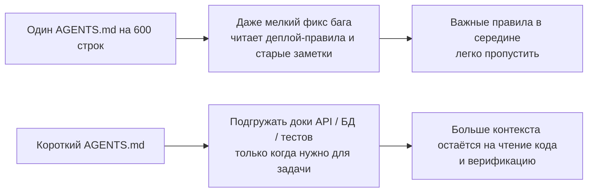
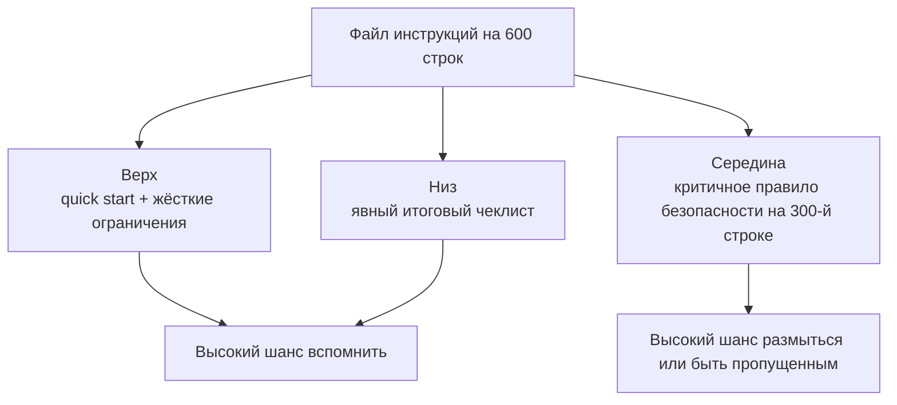

[中文版本 →](../../../zh/lectures/lecture-04-why-one-giant-instruction-file-fails/)

> Примеры кода: [code/](https://github.com/walkinglabs/learn-harness-engineering/blob/main/docs/en/lectures/lecture-04-why-one-giant-instruction-file-fails/code/)
> Практический проект: [Project 02. Agent-readable workspace](./../../projects/project-02-agent-readable-workspace/index.md)

# Лекция 04. Разносите инструкции по файлам

Вы серьёзно занялись harness engineering — здорово. Создали `AGENTS.md` и впихнули туда каждое правило, ограничение и вынесенный урок, какой только смогли вспомнить. Через месяц файл раздулся до 300 строк, через два — до 450, через три — до 600. И тут вы замечаете, что качество работы агента на самом деле падает: на простом фиксе бага агент сжигает кучу контекста на ненужные деплой-инструкции; критичное правило безопасности, закопанное на 300-й строке, просто игнорируется; три противоречащих друг другу правила стиля заставляют агента каждый раз случайно выбирать одно из них.

Это ловушка «гигантского файла инструкций». Это как переупаковать чемодан — всё кажется полезным, поэтому вы запихиваете всё, пока молния не лопнет. Чтобы найти смену белья, приходится опустошить весь чемодан. Вы тащили полный чемодан, а реально использовали примерно треть содержимого.

## Порочный круг в основе

Самый частый порочный круг такой: агент ошибается, вы говорите «добавим правило, чтобы это не повторилось», добавляете в AGENTS.md, временно работает, агент делает другую ошибку, добавляете ещё правило, повторяется, файл бесконтрольно раздувается.

Это не ваша вина. Это очень естественная реакция — «добавить правило» каждый раз, как что-то пошло не так, кажется разумным, как закидывать ещё одну вещь в сумку «на всякий случай» каждый раз перед выходом. Но накопительный эффект разрушителен. Посмотрим, что конкретно идёт не так.

**Бюджет контекста съедается живьём.** Окно контекста у агента конечно. Допустим, у вашего агента окно 200K токенов (стандарт Claude). Раздутый файл инструкций может съедать 10–20K токенов. Кажется, ещё много места? Но в сложной задаче нужно прочитать десятки исходных файлов, вывод инструментов тоже занимает контекст, и история диалога накапливается. К тому моменту, когда агент должен понять код, бюджет уже поджимает — как чемодан, настолько забитый «на всякий случай», что для ноутбука не остаётся места.

**Lost in the middle.** Статья «Lost in the Middle» (Liu et al., 2023) ясно показала, что LLM используют информацию в середине длинных текстов значительно хуже, чем в начале или конце. Ваш AGENTS.md на 600 строк, и на 300-й строке написано «все запросы к БД должны использовать параметризованные запросы» — это жёсткое требование безопасности. Но оно зарыто посередине, и агент почти наверняка его проигнорирует. Как тот флакон с солнцезащитным кремом на самом дне переполненного чемодана: знаете, что он там, копаетесь три раза, не находите, в итоге покупаете новый.

**Конфликты приоритетов.** В файле смешиваются необсуждаемые жёсткие ограничения («никогда не используй eval()»), важные дизайн-рекомендации («предпочитайте функциональный стиль») и конкретный исторический урок («на той неделе пофиксили утечку памяти в WebSocket, следите за похожими паттернами»). У этих трёх правил совершенно разная важность, но в файле они выглядят одинаково. У агента нет надёжного сигнала, чтобы их различить — как загранпаспорт и зарядка, перемешанные в чемодане: непонятно, что важнее.

**Гниение из-за поддержки.** Большие файлы по природе плохо поддерживаются. Устаревшие инструкции редко удаляют — потому что последствия удаления неясны («может, какое-то правило от этого зависит?»), а добавлять новые — кажется бесплатным. Итог: файл только растёт, никогда не уменьшается, и отношение сигнал/шум падает. Это ровно как накопление техдолга в софте.

**Накопление противоречий.** Инструкции, добавленные в разное время, начинают противоречить друг другу — одна говорит «используйте strict mode TypeScript», другая «в некоторых легаси-файлах разрешён any». Агент каждый раз выбирает одно случайно. Как мама говорит «тепло одевайся», а папа — «не кутайся», и вы стоите в дверях, не зная, кого слушать.

## Ключевые понятия

- **Instruction Bloat**: когда файл инструкций занимает больше 10–15% окна контекста, он начинает вытеснять бюджет на чтение кода и осмысление задачи. `AGENTS.md` на 600 строк может потреблять 10 000–20 000 токенов — это 8–15% окна на 128K, съеденных ещё до того, как агент начал работать.
- **Lost in the Middle Effect**: исследование Liu et al. 2023 года доказало, что LLM используют информацию в середине длинных текстов значительно хуже, чем в начале или конце. У критического ограничения, зарытого на 300-й строке файла из 600, очень высокая вероятность быть фактически проигнорированным.
- **Instruction Signal-to-Noise Ratio (SNR)**: доля инструкций в файле, релевантных текущей задаче. Когда вас заставляют читать 50 строк деплой-инструкций при фиксе бага — это низкий SNR.
- **Routing File**: короткий входной файл, чья основная функция — указывать агенту на более детальные документы, а не содержать в себе всё. 50–200 строк за глаза.
- **Progressive Disclosure**: сначала обзорная информация, детальная — по требованию. Хороший дизайн harness как хороший дизайн UI: не вываливайте все опции на пользователя сразу.
- **Priority Ambiguity**: когда все инструкции выглядят одинаково по формату и месту, агент не может отличить необсуждаемые жёсткие ограничения от рекомендательных мягких советов.

## Архитектура инструкций





## Как разбивать

Главный принцип: часто нужное — под рукой, иногда нужное — убрать поглубже, никогда не нужное — выкинуть.

Входной файл `AGENTS.md` остаётся на 50–200 строк и содержит только самое часто используемое — обзор проекта (одно-два предложения), команды первого запуска (`make setup && make test`), глобальные жёсткие ограничения (не больше 15 необсуждаемых правил) и ссылки на тематические документы (одна строка описания + условие применимости).

```markdown
# AGENTS.md

## Project Overview
Python 3.11 FastAPI backend, PostgreSQL 15 database.

## Quick Start
- Install: `make setup`
- Test: `make test`
- Full verification: `make check`

## Hard Constraints
- All APIs must use OAuth 2.0 authentication
- All database queries must use SQLAlchemy 2.0 syntax
- All PRs must pass pytest + mypy --strict + ruff check

## Topic Docs
- [API Design Patterns](docs/api-patterns.md) — Required reading when adding endpoints
- [Database Rules](docs/database-rules.md) — Required when modifying database operations
- [Testing Standards](docs/testing-standards.md) — Reference when writing tests
```

Каждый тематический документ — 50–150 строк, организованы по темам в каталоге `docs/` или рядом с соответствующим модулем. Агент читает их только при необходимости. Как органайзеры в чемодане: бельё в одном, косметика в другом, зарядки в третьем. Не нужно вытряхивать весь чемодан, чтобы что-то найти.

Часть информации лучше класть прямо в код — определения типов, комментарии к интерфейсам, пояснения в конфигах. Агент естественно увидит это при чтении кода, дублировать в инструкциях не надо.

У каждой инструкции должен быть источник («почему это правило добавили?»), условие применимости («когда оно нужно?») и условие истечения срока («при каких обстоятельствах его можно удалить?»). Регулярно проводите ревизию, удаляйте устаревшее, дублирующее и противоречивое. Управляйте инструкциями как зависимостями кода — неиспользуемые удаляются, иначе только тормозят систему.

Если инструкция обязана быть во входном файле, ставьте её в начало или в конец, никогда — в середину. Эффект «lost in the middle» говорит, что LLM значительно лучше используют информацию на краях, чем по центру. Но лучший подход — вынести инструкции в тематические документы и подгружать по требованию.

И OpenAI, и Anthropic неявно поддерживают подход разбиения. OpenAI говорят, что входные файлы должны быть «короткими и роутинговыми», Anthropic — что управляющая информация для долгоживущих агентов должна быть «лаконичной и высокоприоритетной». Оба говорят об одном: не запихивайте всё в один файл. Чемодан надо организовывать, а не утрамбовывать в него всё подряд.

## Пример из жизни

`AGENTS.md` одной SaaS-команды разбух с 50 строк до 600. В содержимом смешались версии стека, стандарты кодирования, заметки о фиксах багов, гайды по API, процедуры деплоя и личные предпочтения членов команды — целый чемодан, лопающийся по швам.

Качество работы агента заметно поползло вниз: при простых фиксах багов агент тратил много контекста на ненужные деплой-инструкции; ограничение безопасности «все запросы к БД должны быть параметризованы» было закопано на 300-й строке и часто игнорировалось; три противоречащих правила стиля приводили к случайному поведению.

Команда провела «реорганизацию чемодана»:
1. `AGENTS.md` обрезали до 80 строк: только обзор проекта, команды запуска и 15 глобальных жёстких ограничений
2. Создали тематические документы: `docs/api-patterns.md` (120 строк), `docs/database-rules.md` (60 строк), `docs/testing-standards.md` (80 строк)
3. Добавили в роутинг-файл ссылки на тематические доки
4. Исторические заметки либо превратили в тест-кейсы, либо удалили

После рефакторинга: успешность на том же наборе задач выросла с 45% до 72%. Соблюдение ограничения безопасности — с 60% до 95%, потому что оно переехало из середины файла на верх роутинг-файла и больше не «терялось в середине».

## Главное

- «Добавить правило» — обезболивающее на короткую дистанцию, яд на длинную. Прежде чем добавлять правило, спросите: не лучше ли это в тематической доке? Не нужно просто продолжать запихивать в чемодан.
- Входной файл — роутер, а не энциклопедия. 50–200 строк: только обзор, жёсткие ограничения и ссылки.
- Используйте эффект «lost in the middle»: важное — на верх или низ; неважное — в тематические документы.
- Управляйте раздуванием инструкций как техдолгом. Регулярные ревизии, у каждой инструкции — источник, условие применимости и условие истечения срока.
- После разбиения SNR растёт, и агент тратит больше контекстного бюджета на саму задачу, а не на разбор ненужных инструкций.

## Дальнейшее чтение

- [OpenAI: Harness Engineering](https://openai.com/index/harness-engineering/)
- [Anthropic: Effective Harnesses for Long-Running Agents](https://www.anthropic.com/engineering/effective-harnesses-for-long-running-agents)
- [Lost in the Middle: How Language Models Use Long Contexts](https://arxiv.org/abs/2307.03172)
- [HumanLayer: Harness Engineering for Coding Agents](https://humanlayer.dev/articles/harness-engineering-for-coding-agents/)
- [Nielsen Norman Group: Progressive Disclosure](https://www.nngroup.com/articles/progressive-disclosure/)

## Упражнения

1. **Аудит SNR**: возьмите свой текущий входной файл инструкций и перечислите все пункты. Возьмите 5 разных типов часто встречающихся задач и для каждой инструкции отметьте, релевантна ли она. Посчитайте SNR для каждого типа задач. Инструкции, которые для большинства задач — шум, переносите в тематические документы.

2. **Рефакторинг под progressive disclosure**: если у вас есть файл инструкций больше 300 строк, разбейте его на: (a) роутинг-файл меньше 100 строк, (b) 3–5 тематических документов. Прогоните один и тот же набор задач (минимум 5) до и после, сравните успешность.

3. **Проверка lost in the middle**: в длинном файле инструкций поставьте критическое ограничение последовательно в начало, в середину и в конец, каждый раз прогоняя один и тот же набор задач (минимум 5 прогонов на позицию). Посмотрите, есть ли разница в соблюдении. Можете удивиться, насколько сильным окажется эффект позиции.
