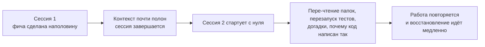
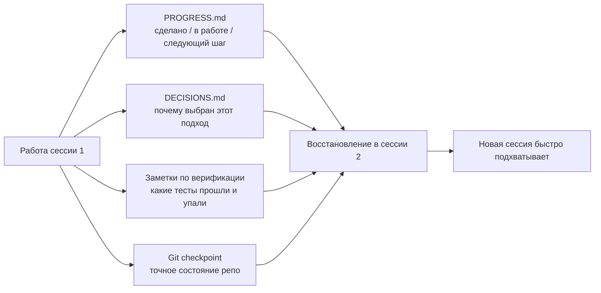

[中文版本 →](../../../zh/lectures/lecture-05-why-long-running-tasks-lose-continuity/)

> Примеры кода: [code/](https://github.com/walkinglabs/learn-harness-engineering/blob/main/docs/en/lectures/lecture-05-why-long-running-tasks-lose-continuity/code/)
> Практический проект: [Project 03. Multi-session continuity](./../../projects/project-03-multi-session-continuity/index.md)

# Лекция 05. Сохраняйте контекст между сессиями

Вы просите Claude Code реализовать целую фичу. Он работает 30 минут, делает большую часть работы, но контекст подходит к концу. Вы открываете новую сессию, чтобы продолжить, — и обнаруживаете, что он не помнит ни какие решения были приняты, ни почему вариант A был выбран вместо варианта B, ни какие файлы уже изменены, ни в каком состоянии находятся тесты. Он тратит 15 минут на повторное изучение проекта и может действовать вразрез с предыдущим подходом.

Представьте, что вы мастер, который каждое утро после пробуждения всё забывает. Вам пришлось бы заново знакомиться со всей стройкой — какая стена недостроена, почему выбрали красный кирпич вместо синего, докуда дошли с водопроводом. Хуже того, вы могли бы выломать окно, которое уже было установлено вчера, просто потому что не помнили об этом.

Именно в таком положении находятся AI-агенты при многосессионных задачах. Эта лекция объясняет, почему агенты «отключаются» во время длинных задач, и как структурированное сохранение состояния превращает их в мастера, который ведёт надёжный ежедневный журнал — всё ещё страдающего амнезией, но журнал помнит всё.

## Контекстные окна: не бесконечны

Контекстные окна конечны. Это не решается обновлением модели — даже если размер окна вырастет до 1M токенов, сложные задачи всё равно их исчерпают. Потому что агенты не просто генерируют код; они изучают кодовые базы, отслеживают историю собственных решений, обрабатывают вывод инструментов и поддерживают контекст разговора. Вся эта информация растёт быстрее, чем расширяется окно.

Более глубокая проблема: информация, которую производит агент, неравноценна по важности. Промежуточные шаги рассуждений содержат «почему» решений — почему вариант B был выбран вместо A, почему именно эта библиотека, а не другая, почему конкретная оптимизация была пропущена. Финальный вывод содержит только «что» — сам код. Стратегии компакции обычно сохраняют второе, но теряют первое. Следующая сессия видит код, но не знает, почему он написан именно так, и может «оптимизировать» осознанное проектное решение.

Anthropic в своём исследовании long-running агентов обнаружила любопытный эффект: когда агент чувствует, что контекст подходит к концу, он демонстрирует поведение «преждевременного схождения» — спешит закончить текущую работу, пропускает шаги верификации или выбирает простое решение вместо оптимального. Это похоже на то, как на экзамене, поняв, что время заканчивается, вы быстро гадаете в оставшихся вопросах с выбором ответа. Anthropic называет это «контекстной тревожностью».

## Поток непрерывности сессий

Без артефактов непрерывности каждая новая сессия — это катастрофа:



С артефактами непрерывности новые сессии могут быстро подхватить работу:



## Ключевые понятия

- **Контекстные окна конечны**: какой бы размер ни заявлялся (128K, 200K, 1M), длинные задачи рано или поздно их исчерпают. После исчерпания требуется либо компакция (с потерей информации), либо сброс (новая сессия). Оба варианта что-то теряют.
- **Артефакты непрерывности**: сохранённые файлы состояния, которые позволяют новой сессии однозначно продолжить с того места, где остановилась предыдущая. Базовая форма: лог прогресса + запись верификации + следующие действия. Тот самый журнал мастера.
- **Стоимость восстановления**: время, нужное новой сессии, чтобы выйти в рабочее состояние. Хорошие harness'ы сжимают её с 15 минут до 3 минут.
- **Дрейф (drift)**: разрыв между пониманием агента и реальным состоянием репозитория. Каждая граница сессии вносит дрейф; без контроля он накапливается.
- **Контекстная тревожность**: явление, наблюдаемое Anthropic, — агенты демонстрируют преждевременное схождение при приближении к воспринимаемому пределу контекста, преждевременно завершая задачи, чтобы избежать потери информации. Это иррациональная ресурсная тревожность.
- **Компакция против сброса**: компакция суммирует контекст внутри той же сессии (сохраняет «что», может потерять «почему»); сброс открывает новую сессию, восстанавливаясь из сохранённого состояния (чисто, но зависит от полноты артефактов).

## Что происходит, когда непрерывность ломается

Предыдущая сессия потратила значительный бюджет контекста на анализ трёх подходов и выбор варианта B. Текущая сессия не знает об этом анализе и может пере-решить вопрос на основе неполной информации — потенциально выбрав вариант A. Как мастер с амнезией, который не помнит, почему был выбран красный кирпич, смотрит сегодня на синий, думает, что он красивее, и сносит вчерашнюю стену, чтобы перестроить.

Ещё хуже — дублирование работы. Агент не уверен, была ли уже выполнена определённая работа, и делает её снова. Или, что хуже, делает её наполовину, обнаруживает конфликт с существующей реализацией и вынужден переделывать. На стройке две бригады не могут одновременно строить одну стену, но без записей о прогрессе новая бригада не знает, что кто-то уже над ней работает.

За несколько сессий направление реализации могло незаметно сместиться от исходных требований. Каждая новая сессия немного по-другому понимает цели проекта. Как в игре в «испорченный телефон»: после десяти передач «купи мне кофе» может превратиться в «купи мне кофемашину».

Есть и пробел в верификации. Результаты верификации предыдущей сессии (какие тесты проходят, какие падают, почему падают) не были записаны. Новая сессия вынуждена перезапускать всю верификацию, чтобы понять текущее состояние. Каждая сессия диагностирует с нуля, каждый раз тратя драгоценный контекст.

И OpenAI, и Anthropic подчёркивают в своей документации важность структурированного сохранения состояния. Статья OpenAI о harness engineering трактует репозиторий как «операционный журнал»: результаты каждой операции должны оставлять отслеживаемые следы в репо. Документация Anthropic по long-running агентам специально рекомендует «handoff-файлы» — структурированные документы, содержащие текущее состояние, известные проблемы и следующие действия.

## Журнал для мастера с амнезией

Основной подход: **относитесь к агенту как к гениальному инженеру с амнезией.** Прежде чем «уйти со смены», он должен записать критическую информацию, чтобы следующий «сменный» агент мог быстро подхватить работу.

**Инструмент 1: файл прогресса (PROGRESS.md).** Самый базовый артефакт непрерывности — ядро журнала:

```markdown
# Project Progress

## Current State
- Latest commit: abc1234 (feat: add user preferences endpoint)
- Test status: 42/43 passing (test_pagination_edge_case failing)
- Lint: passing

## Completed
- [x] User model and database migration
- [x] Basic CRUD endpoints
- [x] Auth middleware integration

## In Progress
- [ ] Pagination feature (90% - edge case test failing)

## Known Issues
- test_pagination_edge_case returns 500 on empty result sets
- Need to confirm whether deleted users should appear in listings

## Next Steps
1. Fix pagination edge case bug
2. Add "include deleted users" query parameter
3. Update API documentation
```

**Инструмент 2: лог решений (DECISIONS.md).** Записывайте важные проектные решения и причины. Не нужны подробные дизайн-документы — достаточно «какое решение, почему, когда» — это памятки в журнале:

```markdown
# Design Decisions

## 2024-01-15: Use Redis for user preferences caching
- Reason: High read frequency (every API call), small data size
- Rejected alternative: PostgreSQL materialized view (high change frequency makes maintenance cost not worthwhile)
- Constraint: Cache TTL of 5 minutes, active invalidation on write
```

**Инструмент 3: Git-коммиты как контрольные точки.** Коммитьте после завершения каждой атомарной единицы работы. Сообщения коммитов должны объяснять, что сделано и почему. Это бесплатные, автоматически версионируемые снимки состояния.

**Инструмент 4: init.sh или процедура инициализации harness'а.** В `AGENTS.md` опишите процедуры «прихода на смену» и «ухода со смены»:

```markdown
## At session start (clock in)
1. Read PROGRESS.md for current state
2. Read DECISIONS.md for important decisions
3. Run make check to confirm repo is in consistent state
4. Continue from PROGRESS.md "Next Steps" section

## Before session end (clock out)
1. Update PROGRESS.md
2. Run make check to confirm consistent state
3. Commit all completed work
```

**Смешанная стратегия**: не каждой задаче нужен сброс контекста. Короткие задачи (менее 30 минут) можно выполнить за одну сессию. Длинные задачи (на несколько сессий) обязаны использовать файлы прогресса и логи решений для непрерывности. Критерий: если задача требует более 60% окна, начинайте готовить handoff.

### Подробнее о контекстной тревожности

Исследование Anthropic в марте 2026 раскрыло конкретные проявления контекстной тревожности: на Sonnet 4.5, когда контекст приближается к пределу окна, агент демонстрирует выраженное поведение «преждевременного схождения». Это похоже на то, как на экзамене, увидев, что время почти вышло, вы быстро ставите случайные ответы.

Две стратегии решают эту проблему:

**Компакция**: суммирование раннего разговора внутри той же сессии. Преимущество: сохраняет непрерывность, агент видит «что». Недостаток: «почему» часто теряется в выжимках — почему вариант B был выбран вместо A, почему конкретная оптимизация была пропущена. Что критичнее, компакция не устраняет контекстную тревожность — агент знает, что контекст когда-то был большим, и психологически всё ещё стремится к скорейшему закрытию.

**Сброс контекста**: полная очистка контекста, открытие новой сессии, восстановление из сохранённых артефактов. Преимущество: чистое ментальное состояние — у новой сессии нет тревожности «у меня заканчивается время». Недостаток: зависит от полноты артефактов handoff. Если в журнале нет критической информации, новая сессия может потратить время, идя в неверном направлении.

Реальные данные Anthropic: для Sonnet 4.5 контекстная тревожность настолько серьёзна, что одной компакции недостаточно — сброс контекста становится критическим компонентом дизайна harness'а. Но для Opus 4.5 это поведение значительно ослаблено, и компакция может управлять контекстом без опоры на сбросы. Это значит: **дизайн harness'а должен учитывать конкретную целевую модель, а не использовать универсальный шаблон.**

> Источник: [Anthropic: Harness design for long-running application development](https://www.anthropic.com/engineering/harness-design-long-running-apps)

## Пример из реальной практики

Агенту поручили реализовать блог-систему с аутентификацией пользователей — 12 фич, по оценке нужно 5 сессий.

**Базовый случай без журнала**: сессия 1 реализовала модель пользователя и базовые маршруты. Сессия 2 началась без памяти о контракте интерфейса auth-middleware, потратив ~15 минут на восстановление прежнего проектного замысла. К сессии 3 накопленный дрейф привёл к тому, что агент начал переделывать уже готовые фичи. К сессии 5 в репо было много избыточного кода, но ключевая фича аутентификации всё ещё не проходила сквозные тесты. Завершено только 7 из 12 фич, у 3 — скрытые проблемы корректности. Как мастер, который никогда не пишет в журнале: к пятому дню стройка в хаосе, какие-то стены построены дважды, какие-то так и не начаты.

**С журналом**: использовались файлы прогресса, логи решений, записи верификации и git-чекпоинты. Отчёт о состоянии автоматически обновлялся в конце каждой сессии. Стоимость восстановления в сессии 2 упала до ~3 минут. К сессии 5 все 12 фич завершены и проверены.

Количественное сравнение: время восстановления сократилось на ~78%, доля завершённых фич — с 58% до 100%, доля скрытых дефектов — с 43% до 8%. Мастер по-прежнему страдает амнезией, но с журналом каждый день начинается с того места, где закончился вчерашний, а не с нуля.

## Главные выводы

- Контекстное окно — конечный ресурс. Длинные задачи будут охватывать несколько сессий, а сессии будут терять информацию — как мастер, забывающий каждый день, это объективная реальность.
- Решение не в больших окнах, а в лучшем сохранении состояния. Файлы прогресса + логи решений + git-чекпоинты — дайте мастеру с амнезией надёжный журнал.
- Относитесь к агенту как к инженеру с амнезией: перед «уходом со смены» запишите, что сделано, почему и что дальше.
- Стоимость восстановления — ключевая метрика. Хороший harness должен выводить новую сессию в рабочее состояние за 3 минуты.
- Смешанная стратегия: короткие задачи внутри сессии, длинные — через структурированные артефакты непрерывности.

## Дополнительное чтение

- [Anthropic: Effective Harnesses for Long-Running Agents](https://www.anthropic.com/engineering/effective-harnesses-for-long-running-agents)
- [OpenAI: Harness Engineering](https://openai.com/index/harness-engineering/)
- [Lost in the Middle: How Language Models Use Long Contexts](https://arxiv.org/abs/2307.03172)
- [Claude Code Documentation](https://docs.anthropic.com/en/docs/claude-code)
- [HumanLayer: Harness Engineering for Coding Agents](https://humanlayer.dev/articles/harness-engineering-for-coding-agents/)

## Упражнения

1. **Измерение потерь непрерывности**: выберите задачу разработки, требующую как минимум 3 сессий. Без артефактов непрерывности фиксируйте в начале каждой сессии, сколько контекста агент тратит на «понимание, что было в прошлый раз». В конце каждой сессии создавайте файл прогресса и пускайте следующую сессию с него. Сравните стоимость восстановления с файлами прогресса и без них.

2. **Проектирование шаблона handoff**: разработайте минимальный шаблон handoff с четырьмя полями: состояние репо (хеш коммита), состояние времени выполнения (доля проходящих тестов), блокеры, следующие действия. Дайте полностью свежей сессии агента восстановить состояние проекта, используя только этот шаблон. Записывайте неоднозначности, возникшие при восстановлении, и итеративно улучшайте шаблон.

3. **Эксперимент со смешанной стратегией**: в задаче на 5 сессий сравните три стратегии: (a) всегда новая сессия + файлы прогресса, (b) делать как можно больше за одну сессию (компакция контекста), (c) смешанная стратегия (короткие задачи внутри сессии, длинные — между сессиями + файлы прогресса). Сравните время восстановления, долю завершённых фич и согласованность решений.
