[中文版本 →](../../../zh/lectures/lecture-06-why-initialization-needs-its-own-phase/)

> Примеры кода: [code/](https://github.com/walkinglabs/learn-harness-engineering/blob/main/docs/en/lectures/lecture-06-why-initialization-needs-its-own-phase/code/)
> Практический проект: [Project 03. Multi-session continuity](./../../projects/project-03-multi-session-continuity/index.md)

# Лекция 06. Инициализируйте проект перед каждой сессией агента

Вы открываете новую сессию агента и говорите «добавь поиск». Он сразу бросается писать код — похвальный энтузиазм. Через 20 минут он обнаруживает, что тестовый фреймворк настроен неправильно, тратит ещё 10 минут на починку, потом оказывается, что формат скрипта миграции неверен, ещё возня. Поиск в итоге добавлен, но вся сессия прошла неэффективно — большая часть времени ушла на «разбирательство, как устроен этот проект», а не на саму фичу.

Лучший подход: прежде чем дать агенту начать работу, в отдельной фазе подготовьте базовое окружение, рабочие команды верификации и понимание структуры проекта. Это как строить дом — нельзя одновременно заливать фундамент и поднимать стены. Если так сделать, стены пойдут вверх, пока фундамент не схватился, и всё здание придётся сносить и начинать заново. Залейте фундамент, дайте ему встать, потом стройте стены — чисто и эффективно.

Эта лекция объясняет, почему инициализация должна быть отдельной фазой, а не смешанной с реализацией.

## Фундамент и стены: две принципиально разные задачи

У инициализации и реализации совершенно разные цели оптимизации. Фаза реализации оптимизирует: максимизацию количества и качества проверенных фич. Фаза инициализации оптимизирует: максимизацию надёжности и эффективности всех последующих фаз реализации.

Когда вы смешиваете инициализацию и реализацию, агент сталкивается с многоцелевой оптимизацией — одновременно строит инфраструктуру и пишет код фич. Без явной расстановки приоритетов агент естественным образом тяготеет к написанию кода (потому что это напрямую видимый результат), жертвуя инфраструктурой (потому что её ценность проявится только в последующих сессиях). Это как сказать строительной бригаде одновременно заливать фундамент и поднимать стены — они, скорее всего, бросятся возводить стены, потому что стены видны и их можно показать. Но дом с плохим фундаментом получит системные проблемы потом.

## Жизненный цикл инициализации

```mermaid
flowchart TB
    subgraph Wrong["Смешанная сессия (неправильно)"]
        W1["Сразу начинаем работу над фичей"] --> W2["По ходу обнаруживаем пробелы в окружении и тестах"]
        W2 --> W3["Накапливаем непроверенный код"]
        W3 --> W4["Следующая сессия должна заново выяснять состояние проекта"]
    end

    subgraph Right["Выделенная инициализация (правильно)"]
        R1["Сессия 1: окружение запускается"] --> R2["Пример теста проходит"]
        R2 --> R3["Bootstrap-контракт + список задач написаны"]
        R3 --> R4["Чистый чекпоинт закоммичен"]
        R4 --> R5["Последующие сессии сразу берут проверенные задачи"]
    end
```



## Что происходит, когда вы их смешиваете

Самая прямая проблема: фундамент не схватывается как следует. Агент тратит 80% усилий на код фич и 20% — на кое-как настроенную инфраструктуру. Тестовый фреймворк настроен, но не проверен; правила линтера выставлены, но слишком слабые; файл прогресса не создан. Эти дефекты не очевидны в первой сессии (агент ещё помнит, что делал), но проявляются во второй — новый агент не знает, как запускать, как тестировать и где сейчас находится проект. Хлипкий фундамент — шаткое здание.

Более скрытая стоимость — «непроверенное накопление»: код фич, написанный до настройки тестового фреймворка, — это код без верификации. Когда вы наконец возвращаетесь добавить тесты к этому коду, вы можете обнаружить, что архитектура была неверной с самого начала — знай вы это, реализовали бы иначе. Это как класть плитку на сырой бетон: когда обнаруживаете, что пол неровный, всю плитку приходится отдирать и переделывать.

Бюджет сессии тоже расходуется впустую. Работа по инициализации (настройка окружения, тестов, понимание структуры проекта) потребляет значительный бюджет, оставляя меньше на реальную реализацию фич. Результат: первая сессия выполняет только половину фич, а вторая вынуждена снова разбираться с проектом. Бюджет ушёл на фундамент, но и фундамент тоже не крепкий — ни одна цель не достигнута.

Самая легко упускаемая проблема — «мины» неявных предположений. Решения, принимаемые агентом во время инициализации (какой тестовый фреймворк, как организовать каталоги, как управлять зависимостями), — если их явно не записать, последующие сессии не смогут их понять. Хуже того, последующие сессии могут принять противоречащие решения. Первая бригада сделала бетонный фундамент, вторая бригада об этом не знала и забила в него деревянные сваи — фундамент трескается.

В исследовании long-running разработки приложений Anthropic явно рекомендует отделять инициализацию от реализации. Их экспериментальные данные: проекты с выделенной фазой инициализации показывали на 31% более высокую долю завершённых фич в многосессионных сценариях по сравнению со смешанным подходом. Ключевая мысль — время, вложенное в фазу инициализации, полностью окупается в следующих 3–4 сессиях. Чем крепче фундамент, тем быстрее идут стены.

Руководство OpenAI Codex по harness engineering тоже подчёркивает принцип «репозиторий как операционный журнал»: с первого запуска нужно установить ясную операционную структуру, иначе каждая новая сессия будет вынуждена заново выводить соглашения проекта.

## Ключевые понятия

- **Фаза инициализации**: первая фаза в жизненном цикле агента — никакой реализации фич, только подготовка предпосылок для всех последующих фаз реализации. На выходе не код, а инфраструктура.
- **Bootstrap Contract**: условия, при которых проект может быть однозначно использован свежей сессией агента — может запуститься, может тестироваться, может видеть прогресс, может подхватывать следующие шаги. Четыре условия, все обязательны.
- **Холодный старт против тёплого старта**: холодный старт — из пустого каталога, где агент должен угадывать структуру проекта; тёплый старт — из шаблона или существующего проекта, где инфраструктура уже на месте. Тёплый старт значительно превосходит холодный — как начинать стройку с водой и электричеством против начала с голой пустоши.
- **Готовность к handoff**: проект в любой момент находится в состоянии, когда свежий агент может его подхватить. Никаких устных пояснений — только содержимое репо.
- **Время до первой верификации**: время от старта проекта до момента, когда первая фича проходит верификацию. Это ключевая метрика эффективности инициализации.
- **Полезность для последующих этапов**: лучшая мера качества инициализации — доля последующих сессий, которые успешно выполняют задачи, не опираясь на неявные знания.

## Как делать инициализацию правильно

**Считайте инициализацию выделенной фазой.** Первая сессия делает только инициализацию — никакого бизнес-кода. Инициализация производит:

**1. Запускаемое окружение.** Проект стартует, зависимости установлены, проблем с окружением нет. Фундамент залит, без трещин.

**2. Проверяемый тестовый фреймворк.** Хотя бы один пример теста проходит. Это доказывает, что сам тестовый фреймворк настроен правильно — как поставить столб на фундамент, чтобы убедиться, что он держит вес.

**3. Документ bootstrap-контракта.** Чёткий документ, который сообщает последующим сессиям:
```markdown
# Initialization Contract

## Start Commands
- Install dependencies: `make setup`
- Start dev server: `make dev`
- Run tests: `make test`
- Full verification: `make check`

## Current State
- All dependencies installed and locked
- Test framework configured (Vitest + React Testing Library)
- Example test passing (1/1)
- Lint rules configured (ESLint + Prettier)

## Project Structure
- src/ — Source code
- src/components/ — React components
- src/api/ — API client
- tests/ — Test files
```

**4. Декомпозиция задач.** Разбейте весь проект на упорядоченный список задач, у каждой — чёткие критерии приёмки:
```markdown
# Task Breakdown

## Task 1: User Authentication Basics
- Implement JWT auth middleware
- Add login/register endpoints
- Acceptance: pytest tests/test_auth.py all passing

## Task 2: User Profile Page
- Implement user profile CRUD
- Add profile edit form
- Acceptance: pytest tests/test_profile.py all passing

## Task 3: Search Feature
- ...
```

**5. Git-коммит как чекпоинт.** После завершения инициализации закоммитьте чистый чекпоинт. Вся последующая работа стартует с него.

**Стратегия тёплого старта**: не начинайте с пустого каталога. Используйте шаблон проекта (create-react-app, fastapi-template и т. д.), чтобы предустановить стандартную структуру каталогов, конфигурацию зависимостей и тестовый фреймворк. Запекайте общие шаги инициализации в шаблон, оставляя только специфичную для проекта работу. Это как начинать стройку с водой и электричеством — в десять тысяч раз лучше, чем с голой пустоши.

**Критерии завершения инициализации**: не «сколько кода написано», а выполнены ли четыре условия bootstrap-контракта — может запуститься, может тестироваться, может видеть прогресс, может подхватывать следующие шаги. Используйте этот чеклист для валидации:

```markdown
## Initialization Acceptance Checklist
- [ ] `make setup` succeeds from scratch
- [ ] `make test` has at least one passing test
- [ ] A new agent session can answer "how to run" and "how to test" from repo contents alone
- [ ] Task breakdown file exists with at least 3 tasks
- [ ] Everything committed to git
```

## Пример из реальной практики

Два подхода к инициализации фронтенд-проекта на React:

**Смешанный подход (одновременно льём фундамент и строим стены)**: агент в сессии 1 параллельно создал каркас проекта и реализовал первую фичу. К концу сессии репо содержал работоспособный код, но: не было явной документации команд запуска и тестов, не было файла отслеживания прогресса, не было декомпозиции задач. Сессия 2 потратила ~20 минут на восстановление структуры, тестового фреймворка и процесса сборки — как новая бригада на стройке, не знающая, до куда дошёл фундамент и где идут трубы, копающая ямы одну за другой, чтобы это выяснить.

**Выделенная инициализация (сначала фундамент)**: сессия 1 занималась только инициализацией — создала структуру каталогов из шаблона, настроила тестовый фреймворк (Vitest + React Testing Library), написала и проверила один пример теста, создала документ bootstrap-контракта и файл декомпозиции задач, закоммитила начальный чекпоинт. Время восстановления в сессии 2 — менее 3 минут, и она сразу начала работать по списку задач — бригада приходит, бросает взгляд на чертёж и точно знает, где продолжать.

Сравнение полного цикла проекта: общее время восстановления (по всем сессиям) при смешанном подходе было примерно на 60% больше, чем при выделенной инициализации. Дополнительные 20 минут на инициализацию многократно окупились в последующих сессиях. Как крепкий фундамент ускоряет возведение стен — медленнее значит быстрее.

## Главные выводы

- Цели оптимизации у инициализации и реализации разные — смешивание тянет вниз обе. Сначала фундамент, потом стены.
- Результат инициализации — не код, а инфраструктура: запускаемое окружение, проверяемые тесты, bootstrap-контракт, декомпозиция задач.
- Валидируйте инициализацию по четырём условиям bootstrap-контракта: может запуститься, может тестироваться, может видеть прогресс, может подхватывать следующие шаги.
- Тёплый старт превосходит холодный. Используйте шаблоны проектов для предустановки стандартной инфраструктуры.
- Время, вложенное в инициализацию, полностью окупается в следующих 3–4 сессиях. Это не дополнительная стоимость, а инвестиция вперёд. Чем крепче фундамент, тем быстрее растёт здание.

## Дополнительное чтение

- [Anthropic: Effective Harnesses for Long-Running Agents](https://www.anthropic.com/engineering/effective-harnesses-for-long-running-agents)
- [OpenAI: Harness Engineering](https://openai.com/index/harness-engineering/)
- [HumanLayer: Harness Engineering for Coding Agents](https://humanlayer.dev/articles/harness-engineering-for-coding-agents/)
- [Infrastructure as Code — Martin Fowler](https://martinfowler.com/bliki/InfrastructureAsCode.html)
- [SWE-agent: Agent-Computer Interfaces](https://github.com/princeton-nlp/SWE-agent)

## Упражнения

1. **Проектирование bootstrap-контракта**: напишите полный bootstrap-контракт для проекта, который вы разрабатываете. Затем откройте полностью свежую сессию агента, покажите ей только содержимое репо (без устного контекста) и попросите запустить проект, прогнать тесты и понять текущий прогресс. Записывайте каждую возникшую проблему — каждая соответствует пробелу в вашем bootstrap-контракте.

2. **Сравнительный эксперимент**: возьмите умеренно сложный новый проект. Подход A: пусть агент инициализирует и сразу делает первую реализацию. Подход B: одна сессия на выделенную инициализацию, реализация — со второй сессии. После 4 сессий сравните: время до первой верификации, стоимость восстановления, долю завершённых фич.

3. **Чеклист приёмки инициализации**: разработайте чеклист приёмки инициализации для своего проекта. Дайте свежей сессии агента выполнить каждый пункт и фиксируйте, какие проходят, а какие падают. Падающие пункты — те места, где ваш harness нуждается в усилении.
