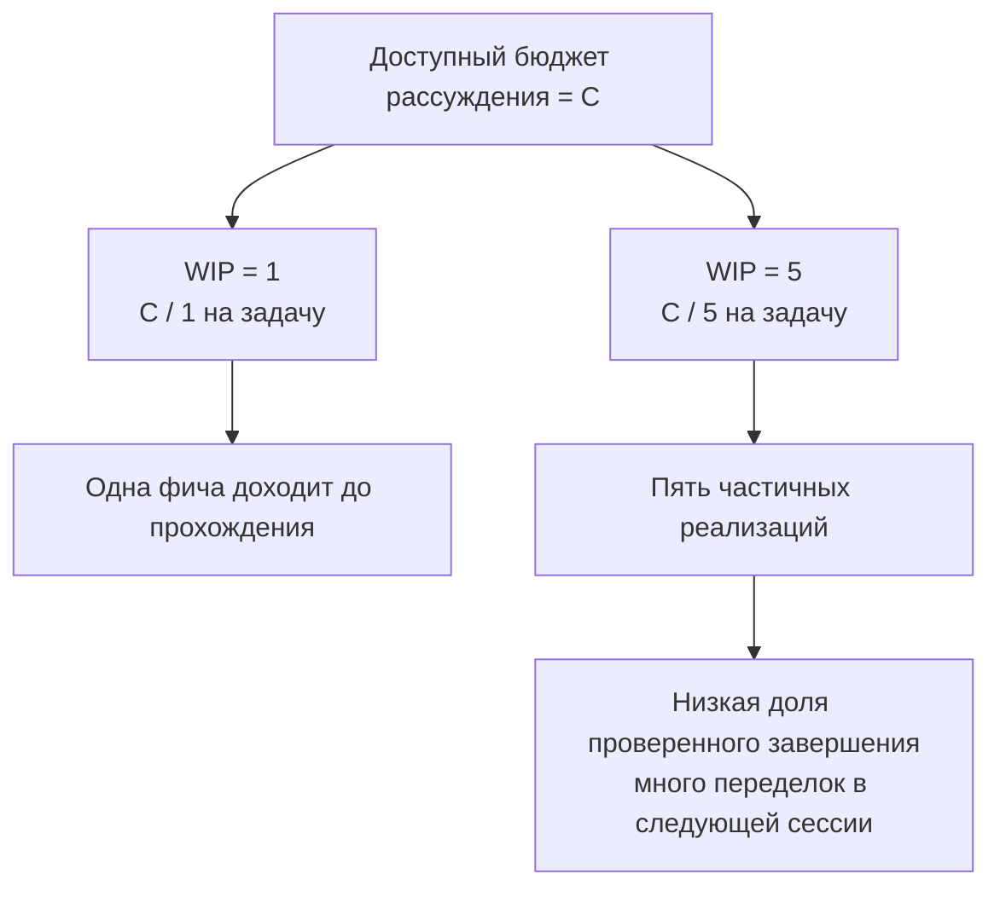

[中文版本 →](../../../zh/lectures/lecture-07-why-agents-overreach-and-under-finish/)

> Примеры кода: [code/](https://github.com/walkinglabs/learn-harness-engineering/blob/main/docs/en/lectures/lecture-07-why-agents-overreach-and-under-finish/code/)
> Практический проект: [Project 04. Runtime feedback and scope control](./../../projects/project-04-incremental-indexing/index.md)

# Лекция 07. Очерчивайте чёткие границы задач для агентов

Вы говорите Claude Code: «добавь в проект аутентификацию пользователей», и он начинает менять схему БД, писать маршруты, переделывать фронтенд-компоненты и заодно — рефакторить middleware обработки ошибок. Через два часа вы проверяете: 12 файлов изменено, 800 строк нового кода, и ни одна фича не работает сквозно.

Откусил больше, чем сможешь прожевать — эта поговорка отлично подходит к AI-агентам. У агентов врождённый импульс «сделать чуть больше» — они видят что-то связанное и заодно это правят, как тот, кто пошёл в магазин за бутылкой соевого соуса и вышел с полной тележкой. Проблема в том, что человек, который купил лишнего, всего лишь потратил деньги; агент, делающий слишком много дел одновременно, не доводит до конца ни одного.

Инженерный блог Anthropic «Effective harnesses for long-running agents» прямо говорит: когда промпты слишком широкие, агенты склонны «начинать сразу несколько дел», вместо того чтобы «сначала закончить одно». Инженерные практики OpenAI Codex показывают то же самое — у задач без явного контроля скоупа доля завершения обваливается. Это проблема не модели — это проблема harness'а. Вы не очертили границу.

## Внимание — конечный ресурс

Это не метафора, а математика. Допустим, ёмкость контекста агента — C, и он одновременно активирует k задач. Каждая задача получает в среднем C/k ресурсов рассуждения. Когда C/k опускается ниже минимального порога, нужного для завершения одной задачи, ни одна не доходит до конца. Желудок имеет свой объём — впихни десять пельменей разом, и ни один не переваришь, получишь десять расстройств желудка.

Реальное поведение Claude Code красноречиво. Попросите «добавить регистрацию пользователей», и он может:

1. Создать модель User
2. Написать маршрут регистрации
3. Заметить, что нужна верификация по email, и добавить почтовый сервис
4. Увидеть, что пароли надо хешировать, и подключить bcrypt
5. Заметить, что обработка ошибок непоследовательна, и отрефакторить глобальный error-middleware
6. Увидеть, что структура тестовых файлов неаккуратная, и переорганизовать каталог

Шесть шагов спустя — каждый сделан наполовину. Никакой сквозной верификации, сложная связанность между полу-готовыми кусками кода, и следующая сессия, которая попробует это разобрать, окончательно потеряется. Как тот, кто готовит шесть блюд одновременно: каждое в сковородке, но ни одно не выложено на тарелку. Все подгорают.

Экспериментальные данные Anthropic прямо это подтверждают: агенты, использующие стратегию «маленький следующий шаг» (эквивалентно WIP=1), показывают на 37% более высокую долю завершённых задач, чем агенты с широкими промптами. Что интереснее, число строк кода, генерируемых агентами, слабо отрицательно коррелирует с реальным завершением фич — больше написанного кода, меньше доведённых до конца фич. Откусил больше, чем прожуёшь — подтверждено данными.

## Рабочий процесс WIP=1




## Ключевые понятия

- **Overreach (переусердствование)**: агент активирует за одну сессию больше задач, чем оптимально. Это поддаётся измерению — 5 фич с 0 проходящими сквозными — это overreach.
- **Under-finish (недодел)**: доля задач, прошедших сквозную верификацию, среди всех активированных задач, опускается ниже порога. Код написан, но тесты не проходят — это under-finish.
- **WIP Limit (лимит работы в процессе)**: из методологии Канбан. Главная идея: ограничить количество задач, находящихся в работе одновременно. Для агентов WIP=1 — самое безопасное значение по умолчанию: закончи одно, потом начинай следующее. Как на шведском столе — не накладывай горой, доешь одну тарелку, потом иди за следующей.
- **Доказательство завершения**: проверяемое условие, которое задача обязана удовлетворить, чтобы перейти из «в работе» в «готово». Без него агенты подменяют «код выглядит нормально» на «поведение проходит тесты».
- **Поверхность скоупа (Scope Surface)**: DAG-структура, где каждый узел — единица работы, а рёбра — зависимости. Состояний всего четыре: not_started, active, blocked, passing.
- **Давление на завершение**: ограничивающая сила, которую harness прикладывает через WIP-лимиты и требования к доказательствам завершения, заставляя агента закончить текущую задачу перед началом новой.

## Overreach и under-finish — симбиоз

Эти две проблемы не независимы — они усиливают друг друга. Overreach размывает внимание, размытое внимание ведёт к under-finish, а оставшийся полу-готовый код увеличивает сложность системы, что дальше подталкивает к overreach в следующей задаче. Порочный круг.

В терминах Канбан: закон Литтла говорит L = lambda * W. Если объём работы в процессе L слишком велик (одновременно делается слишком много), время выполнения W каждой задачи неизбежно растёт. Для агентов это значит, что путь от старта до проверенного завершения каждой фичи становится длиннее, а вероятность отказа — выше.

Это и в человеческом мире давняя проблема — Стив Макконнелл в *Rapid Development* документировал, что расширение скоупа — главная причина провала проектов. Но у людей хотя бы есть интуиция «я уже сделал достаточно». У агентов её нет. Сгенерировать следующую идею модели стоит почти ничего по дополнительным токенам — написать «давайте заодно починим и это» едва заметно, — но каждое дополнительное изменение размывает внимание агента. Как на шведском столе: каждая лишняя тарелка имеет почти нулевую маржинальную стоимость, но желудок ограничен.

## Как делать правильно

### 1. Принудительный WIP=1

Самый прямой и эффективный способ. В вашем harness'е явно скажите агенту: **в любой момент в статусе «active» может быть только одна задача.** В CLAUDE.md (Claude Code) или AGENTS.md (Codex) напишите:

```
## Work Rules
- Work on one feature at a time
- Only start the next feature after the current one passes end-to-end verification
- Don't "also refactor" feature B while implementing feature A
```

Как на шведском столе — одна тарелка за раз, доешь, потом иди за следующей.

### 2. Определите явные доказательства завершения для каждой задачи

«Готово» — это не «код написан», а «верификация поведения проходит». В списке фич у каждой записи нужна команда верификации:

```
F01: User Registration
  Verification: curl -X POST /api/register -d '{"email":"test@example.com","password":"123456"}' | jq .status == 201
  State: passing
```

### 3. Вынесите поверхность скоупа наружу

Используйте машиночитаемый файл (JSON или Markdown) для записи всех состояний задач. Любая новая сессия читает этот файл и сразу знает: какая задача активна? Что считается «готово»? Какие верификации пройдены?

### 4. Отслеживайте долю проверенного завершения

Harness должен непрерывно отслеживать VCR (Verified Completion Rate) = проверенные задачи / активированные задачи. Блокируйте активацию новых задач, когда VCR < 1.0.

## Пример из реальной практики

Проект REST API с 8 фичами, сравниваются две стратегии:

**Режим шведского стола (без ограничений)**: агент в сессии 1 одновременно активирует 5 фич. Производит ~800 строк в 12 файлах. Доля прохождения сквозных тестов: 20% — работает только регистрация. Остальные 4 фичи: схема БД создана, но нет валидации; маршруты определены, но возвращают неверные форматы ответа. Как тот, кто готовит шесть блюд разом: только одно едва съедобно. К концу сессии 3 завершены только 3 из 8 фич.

**Режим одной тарелки (WIP=1)**: в сессии 1 агент работает только над регистрацией. Производит ~200 строк в 4 файлах. Сквозные тесты: 100% проходят. Коммитит чистую проверенную реализацию. К концу сессии 4 — 7 из 8 фич завершены (8-я заблокирована внешней зависимостью).

Итог: меньше кода в сумме (800 против 1200 строк), но больше эффективного кода. Доля завершения: 87,5% против 37,5%. Откусывай по чуть-чуть — и съешь больше.

## Главные выводы

- **WIP=1 — безопасное значение по умолчанию для harness'ов агентов** — закончи одно, потом начинай следующее; не пытайтесь распараллеливать. С одного укуса не растолстеешь.
- **Доказательство завершения должно быть исполняемым** — «код выглядит нормально» не считается; «curl возвращает 201» — считается.
- **Поверхность скоупа должна быть вынесена в файл** — не просто упомянута в разговоре, а записана в репо в машиночитаемом формате.
- **Overreach и under-finish — симбиоз** — решая одно, решаешь и второе.
- **«Меньше, но до конца» всегда побеждает «больше, но наполовину»** — строки кода агента и доля завершения фич отрицательно коррелируют. Качество всегда побеждает количество.

## Дополнительное чтение

- [Effective harnesses for long-running agents - Anthropic](https://www.anthropic.com/engineering/effective-harnesses-for-long-running-agents) — инженерный блог Anthropic, подробное обсуждение стратегии «маленький следующий шаг»
- [Harness Engineering - OpenAI](https://openai.com/index/harness-engineering/) — полное изложение OpenAI о harness engineering
- [Kanban: Successful Evolutionary Change - David Anderson](https://www.goodreads.com/book/show/1070822.Kanban) — классический источник о WIP-лимитах
- [Rapid Development - Steve McConnell](https://www.goodreads.com/book/show/125171.Rapid_Development) — эмпирические данные о расширении скоупа как главной причине провала проектов

## Упражнения

1. **Атомизация задач**: возьмите широкое требование (например, «реализовать систему управления пользователями») и разбейте на минимум 5 атомарных единиц работы. Для каждой укажите: (a) описание одного поведения, (b) исполняемую команду верификации, (c) зависимости. Проверьте, удовлетворяет ли декомпозиция ограничению WIP=1.

2. **Сравнительный эксперимент**: запустите один и тот же проект дважды — раз без ограничений, раз с принудительным WIP=1. Сравните: долю проверенного завершения, общее число строк, долю эффективного кода.

3. **Аудит доказательств завершения**: пересмотрите вывод недавнего прогона агента, классифицируя каждое изменение кода как «завершённое поведение», «незавершённое поведение» или «каркас». Для каждого незавершённого поведения добавьте недостающую команду верификации.
