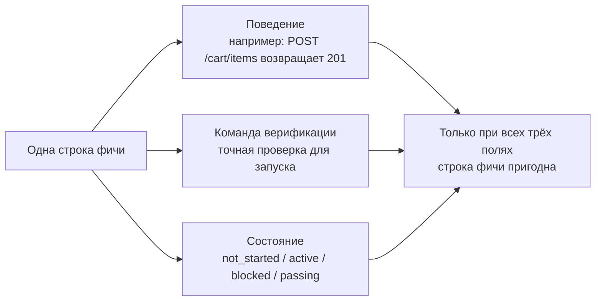
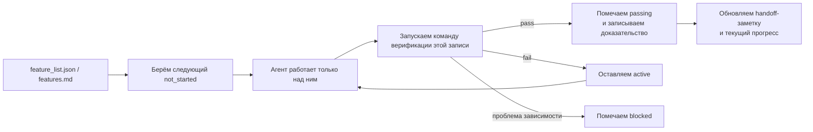

[中文版本 →](../../../zh/lectures/lecture-08-why-feature-lists-are-harness-primitives/)

> Примеры кода: [code/](https://github.com/walkinglabs/learn-harness-engineering/blob/main/docs/en/lectures/lecture-08-why-feature-lists-are-harness-primitives/code/)
> Практический проект: [Project 04. Runtime feedback and scope control](./../../projects/project-04-incremental-indexing/index.md)

# Лекция 08. Используйте списки фич, чтобы ограничивать поведение агента

Вы просите агента построить интернет-магазин. Когда он закончил, он говорит «готово». Вы смотрите код — аутентификация работает, но кнопка оформления заказа в корзине ничего не делает, а оплата вообще не подключена. Проблема: вы никогда не сказали, что значит «готово», поэтому он использовал свой собственный стандарт — «я написал много кода, и он выглядит достаточно полным».

Список фич, в глазах многих, — просто памятка: записал, чтобы не забыть, и отложил. Но в мире harness'а список фич — не памятка для людей, а позвоночник всего harness'а. Планировщик опирается на него, чтобы выбирать задачи; верификатор — чтобы судить о завершении; репортёр handoff — чтобы генерировать саммари. Сломайте позвоночник — и тело парализовано.

И Anthropic, и OpenAI подчёркивают: **артефакты должны быть вынесены наружу.** Состояние фич должно жить в машиночитаемом файле в репо, а не в неструктурированном тексте разговора.

## Агенты не знают, что значит «готово»

Ни Claude Code, ни Codex автоматически не знают, что вы понимаете под «готово». Вы говорите «добавь корзину», и интерпретация модели может быть «написать компонент Cart и метод addToCart». А вы имели в виду «пользователь может сквозно просмотреть товары, добавить в корзину и оформить покупку». Этот разрыв в понимании сохраняется без списка фич. Агент использует свой неявный стандарт — обычно «в коде нет очевидных синтаксических ошибок». А вам нужна сквозная верификация поведения. Это как попросить друга купить фрукты — вы говорите «купи фруктов», а он приносит лимоны. Ваши фрукты и его фрукты — не одни и те же фрукты.

Посмотрите на типичную заметку о прогрессе:

```
Did user auth, shopping cart mostly done, still need payments
```
Может ли новая сессия агента ответить по этой записи? Что значит «mostly done»? Какие тесты прошла корзина? Что блокирует оплату? Ответ на всё — «никто не знает». Это как сказать врачу «болит живот, в последнее время нормально» — какое лекарство он выпишет?

Результат: новая сессия тратит 20 минут на восстановление состояния и может пере-реализовать уже готовые фичи. Инженерные данные Anthropic показывают, что хорошие записи прогресса сокращают время диагностики при старте сессии на 60–80%.

## Конечный автомат фичи





## Ключевые понятия

- **Списки фич — примитивы harness'а**: не «опциональный инструмент планирования», а фундаментальная структура данных, от которой зависят все остальные компоненты harness'а. Как структура таблицы в БД — нельзя сказать «давайте обойдёмся без первичных ключей».
- **Тройственная структура**: каждая запись фичи — это тройка `(описание поведения, команда верификации, текущее состояние)`. Без любого элемента запись неполная.
- **Модель конечного автомата**: у каждой записи фичи четыре состояния — `not_started`, `active`, `blocked`, `passing`. Переходами управляет harness, а не агент по своему усмотрению.
- **Гейт по состоянию passing**: единственный способ перевести фичу из `active` в `passing` — успешный запуск команды верификации. Это необратимо: став `passing`, нельзя вернуться. Сдал экзамен — значит сдал, оценку задним числом не поменяешь.
- **Единственный источник истины**: вся информация «что нужно сделать» должна происходить из одного списка фич. Никаких противоречий между списком фич и историей разговора.
- **Обратное давление**: число фич, ещё не получивших passing, — это давление, которое harness прикладывает к агенту. Нулевое давление = проект завершён.

## Почему списки фич должны быть «примитивами»

Документы — для чтения людьми; примитивы — для исполнения системой. Документы можно проигнорировать, примитивы — нельзя обойти.

Это как ограничения через триггеры в БД против проверок на уровне приложения: первые обеспечиваются движком БД, никакой SQL их не пропустит; вторые зависят от корректности кода и могут быть случайно обойдены. Списки фич как примитивы harness'а конкретно обслуживают четыре компонента harness'а:

1. **Планировщик**: читает состояния, выбирает следующую `not_started` фичу. Как система производственного планирования на заводе.
2. **Верификатор**: исполняет команды верификации, решает, разрешить ли смену состояния. Как ОТК.
3. **Репортёр handoff**: автоматически генерирует саммари сессии из списка фич. Как автоматический отчёт о смене.
4. **Трекер прогресса**: суммирует распределение состояний, даёт метрики здоровья проекта. Как дашборд.

## Как делать правильно

### 1. Определите минимальный формат списка фич

Сложная система не нужна — подойдёт структурированный Markdown или JSON. Ключ в том, чтобы у каждой записи была тройка:

```json
{
  "id": "F03",
  "behavior": "POST /cart/items with {product_id, quantity} returns 201",
  "verification": "curl -X POST http://localhost:3000/api/cart/items -H 'Content-Type: application/json' -d '{\"product_id\":1,\"quantity\":2}' | jq .status == 201",
  "state": "passing",
  "evidence": "commit abc123, test output log"
}
```

### 2. Передайте управление состояниями harness'у

Агент не может напрямую перевести фичу в `passing`. Он может только подать запрос на верификацию; harness исполняет команду верификации и решает, разрешить ли переход. Это и есть «гейт по состоянию passing».

### 3. Запишите правила в CLAUDE.md

```
## Feature List Rules
- Feature list file: /docs/features.md
- Only one feature active at a time
- Verification command must pass before marking as passing
- Don't modify feature list states yourself — the verification script updates them automatically
```

### 4. Калибруйте гранулярность

Каждая запись фичи должна быть масштаба «можно завершить за одну сессию». Слишком широко — не закончится; слишком узко — растёт накладной расход на управление. «Пользователь может добавить товар в корзину» — хорошая гранулярность. «Реализовать корзину» — слишком широко. «Создать поле name в модели Cart» — слишком узко. Как нарезать стейк — не цельным куском и не фаршем.

## Пример из реальной практики

Платформа e-commerce с 10 фичами. Сравниваются два подхода к учёту:

**Режим памятки**: агент использует неструктурированные заметки. После 3 сессий заметки превращаются в «сделал auth и список товаров, корзина почти готова но баги, оплата не начата». Новая сессия тратит 20 минут на восстановление состояния и в итоге пере-реализует готовые фичи. Это как ваш список покупок гласит «молоко, хлеб и эта штука» — в магазине вы всё равно не знаете, что брать.

**Режим позвоночника**: у каждой фичи чёткое состояние и команда верификации. Новая сессия читает список фич и за 3 минуты знает: F01–F05 — `passing`, F06 — `active`, F07–F10 — `not_started`. Сразу подхватывает с F06, никаких переделок.

Количественно: проекты со структурированными списками фич показывают на 45% более высокую долю завершения по сравнению со свободной формой учёта, при нулевом дублировании реализаций.

## Главные выводы

- **Списки фич — позвоночник harness'а**, а не памятки для людей. Планировщик, верификатор и репортёр handoff все зависят от них.
- **У каждой записи фичи должна быть тройка**: описание поведения + команда верификации + текущее состояние. Без одного элемента она неполна — как трёхногий табурет с потерянной ногой.
- **Переходами состояний управляет harness** — агент не может менять состояния сам по себе. Прохождение верификации = единственный путь повышения статуса.
- **Список фич — единственный источник истины проекта** — вся информация «что делать» происходит из одного списка.
- **Калибруйте гранулярность под «выполнимо за одну сессию».**

## Дополнительное чтение

- [Building Effective Agents - Anthropic](https://www.anthropic.com/research/building-effective-agents) — явно называет список фич «ключевой структурой данных» для контроля скоупа агента
- [Harness Engineering - OpenAI](https://openai.com/index/harness-engineering/) — подчёркивает принцип «выноса артефактов наружу»
- [Design by Contract - Bertrand Meyer](https://www.goodreads.com/book/show/130439.Object_Oriented_Software_Construction) — принципы проектирования по контракту, теоретическая основа списков фич
- [How Google Tests Software](https://www.goodreads.com/book/show/13563030-how-google-tests-software) — пирамида тестирования и инженерные практики поведенческой спецификации

## Упражнения

1. **Проектирование списка фич**: определите минимальную JSON-схему списка фич. Включите: id, описание поведения, команду верификации, текущее состояние, ссылку на доказательство. Опишите ею реальный проект из 5 фич.

2. **Сравнение строгости верификации**: возьмите 3 фичи и спроектируйте «слабую» верификацию (например, «в коде нет синтаксических ошибок») и «строгую» (например, «сквозной тест проходит»). Сравните долю ложных срабатываний при каждом подходе.

3. **Аудит принципа единственного источника**: пересмотрите существующий проект с агентом и поищите информацию о скоупе, противоречащую списку фич (неявные требования в разговорах, TODO-комментарии в коде и т. д.). Спроектируйте план объединения всей информации в список фич.
