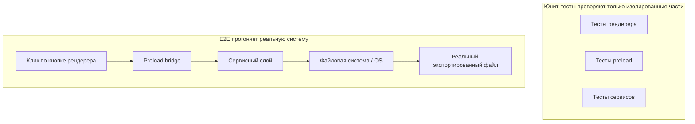

[中文版本 →](../../../zh/lectures/lecture-10-why-end-to-end-testing-changes-results/)

> Примеры кода: [code/](https://github.com/walkinglabs/learn-harness-engineering/blob/main/docs/en/lectures/lecture-10-why-end-to-end-testing-changes-results/code/)
> Практический проект: [Project 05. Let the agent verify its own work](./../../projects/project-05-grounded-qa-verification/index.md)

# Лекция 10. Только сквозное тестирование — настоящая верификация

Вы просите агента добавить функцию экспорта файлов в Electron-приложение. Он пишет компонент процесса рендеринга, preload-скрипт и логику сервисного слоя. Юнит-тесты каждого компонента проходят идеально. Агент говорит: «Готово». Когда вы реально нажимаете кнопку экспорта — формат файлового пути неправильный, прогресс-бар не обновляется, а экспорт больших файлов вызывает утечку памяти. Пять дефектов на границах компонентов, и юнит-тесты не поймали ни одного.

Это как репетиция хора — каждая партия звучит идеально по отдельности, но когда поют вместе, сопрано на полбита быстрее басов, а аккомпанемент на полтона расходится с основной мелодией. Каждая часть «правильна» сама по себе, но整体 — фальшиво.

Тест-пирамида Google говорит нам: большое количество юнит-тестов — это фундамент, но если остановиться на этом, вы систематически упустите проблемы взаимодействия компонентов. Для AI-агентов кодинга эта проблема ещё серьёзнее — агенты склонны запускать только самые быстрые тесты и затем заявлять о завершении. **Только сквозное тестирование может доказать, что системные дефекты отсутствуют.**

## Слепые зоны юнит-тестирования

Философия дизайна юнит-тестирования — изоляция: мокирование зависимостей и фокус исключительно на тестируемом модуле. Эта философия делает юнит-тесты быстрыми и точными, но также создаёт систематические слепые зоны. Это как репетировать хор в наушниках — каждому звучит нормально, но проблемы выявляются только при совместном пении:

**Несоответствие интерфейсов**: Файловый путь, переданный процессом рендеринга в preload-скрипт, является относительным путём, но preload-скрипт ожидает абсолютный путь. Их соответствующие юнит-тесты оба использовали моки и прошли. Проблема обнаруживается только при выполнении сквозного потока — как две вокальные партии, репетирующие отдельно и чувствующие себя прекрасно, но на совместной репетиции выясняется, что одна поёт в размере 4/4, а другая в 3/4.

**Ошибки распространения состояния**: Миграция базы данных изменяет схему таблицы, но слой кэширования ORM всё ещё содержит записи кэша для старой схемы. Юнит-тесты предоставляют полностью новую мок-среду каждый раз, что не выявляет эту кросс-слоевую несогласованность состояния. Как изменение текста песни, но кто-то всё ещё поёт старую версию.

**Проблемы жизненного цикла ресурсов**: Захват и освобождение файловых дескрипторов, подключений к БД и сетевых сокетов охватывают несколько компонентов. Юнит-тесты создают и уничтожают независимые ресурсы для каждого теста, не выявляя конкуренции за ресурсы или утечек. Как партия хора, по очереди пользующаяся микрофонами на репетиции, но когда все выходят на сцену вместе — микрофонов не хватает.

**Зависимость от окружения**: Код ведёт себя корректно в тестовой среде (где всё замокировано), но падает в реальной среде из-за различий в конфигурации, сетевых задержек или недоступности сервисов. Как идеальное пение в репетиционной комнате, но акустическая обратная связь и ветер на открытом фестивале.

## Сквозное тестирование не только меняет результаты, оно меняет поведение

Это то, чего многие не осознают: когда агент знает, что его работа будет подвергнута сквозному тестированию, его поведение при кодинге меняется.

1. **Учёт взаимодействия компонентов**: При написании кода он будет думать о «как этот интерфейс связывается с восходящим потоком», а не просто фокусироваться на одной функции. Как знать, что в итоге будете петь вместе — вы будете обращать внимание на другие партии во время репетиции.
2. **Уважение архитектурных границ**: В системах с архитектурными ограничениями сквозное тестирование заставляет агента соблюдать пограничные правила. Как ноты с пометкой «здесь крещендо» — приходится следовать.
3. **Обработка ошибочных путей**: Сквозные тесты обычно включают сценарии отказов, заставляя агента учитывать обработку исключений. Как симуляция «что если микрофон внезапно умрёт» на репетиции, чтобы знать, что делать.

## Тест-пирамида и продвижение review-обратной связи




В инженерных практиках Codex OpenAI подчёркивает: **сообщения об ошибках для агентов должны включать инструкции по исправлению.** Не просто пишите `"Direct filesystem access in renderer"`; напишите `"Прямой доступ к файловой системе в рендерере. Все файловые операции должны проходить через preload bridge. Перенесите этот вызов в preload/file-ops.ts и вызовите через window.api."` Это превращает архитектурные правила в цикл автокоррекции. Как дирижёр хора, который не просто говорит «ты спел неправильно», а говорит «здесь ты был на полбита быстрее, послушай ритм альтов и входи в такте 32».

## Ключевые концепции

- **Дефекты на границах компонентов**: Компонент A и B оба проходят свои юнит-тесты, но их взаимодействие производит некорректное поведение. Это именно тот тип проблем, который сквозное тестирование лучше всего ловит — как партии хора, individually правильные, но вместе фальшивые.
- **Градиент адекватности тестирования**: Дефекты, пойманные юнит-тестами <= дефекты, пойманные интеграционными тестами <= дефекты, пойманные сквозными тестами. Каждый слой вверх увеличивает способность обнаружения.
- **Правила обеспечения архитектурных границ**: Превращение правил из архитектурных документов (например, «процесс рендеринга не может напрямую обращаться к файловой системе») в выполнимые, автоматизированные проверки. От «написано на бумаге» к «работает в CI».
- **Продвижение review-обратной связи**: Конвертация повторяющихся комментариев code review в автоматизированные тесты. Каждый раз, когда обнаруживается повторяющаяся проблема, добавляется правило, и harness автоматически становится сильнее. Как дирижёр, превращающий типичные репетиционные ошибки в разминку — в следующий раз та же ошибка выявляется сама, без слов дирижёра.
- **Ориентированные на агентов сообщения об ошибках**: Сообщения о провале не должны просто констатировать «что пошло не так», но и точно говорить агенту, как это исправить. Это превращает тестовые провалы в самокорректирующиеся циклы обратной связи.

## Как это сделать

### 0. Сначала определите архитектурные границы, затем пишите E2E-тесты

Предпосылка сквозного тестирования — чёткие системные границы. Если архитектура — тарелка спагетти, сквозное тестирование только докажет «эта тарелка спагетти работает», но не скажет, где были нарушены проектные намерения. Как хор, который даже не разделился на партии — сколько ни репетируй, хорошо не зазвучит.

Опыт OpenAI: **для кодовых баз, генерируемых агентами, архитектурные ограничения должны быть ранними предпосылками, установленными с первого дня, а не чем-то, что учитывается, когда команда вырастет.** Причина проста — агенты копируют существующие паттерны в репозитории, даже если эти паттерны неровные или неоптимальные. Без архитектурных ограничений агент будет вносить больше отклонений в каждой сессии.

OpenAI приняла «Многослойную доменную архитектуру» — каждый бизнес-домен разделён на фиксированные слои: Types → Config → Repo → Service → Runtime → UI. Зависимости текут строго вперёд, а кросс-доменные вопросы входят через явные интерфейсы Providers. Любые другие зависимости запрещены и механически обеспечиваются через кастомный линтинг.

Ключевой принцип: **Обеспечивать инварианты, не микроменеджить реализацию.** Например, требовать «данные парсятся на границе», но не диктовать, какую библиотеку использовать. Сообщения об ошибках должны включать инструкции по исправлению — не просто говорить «нарушение», но точно говорить агенту, как это изменить.

> Источник: [OpenAI: Harness engineering: leveraging Codex in an agent-first world](https://openai.com/index/harness-engineering/)

### 1. Harness должен включать сквозной слой

Сделайте это явным в вашем процессе валидации: для задач, включающих кросс-компонентные изменения, прохождение сквозных тестов является предпосылкой для завершения:

```
## Иерархия валидации
- Уровень 1: Юнит-тесты (Должны пройти)
- Уровень 2: Интеграционные тесты (Должны пройти)
- Уровень 3: Сквозные тесты (Должны пройти при кросс-компонентных изменениях)
- Пропуск любого требуемого уровня = Не завершено
```

### 2. Превратите архитектурные правила в выполнимые проверки

Каждое архитектурное ограничение должно иметь соответствующий тест или правило линтинга:

```bash
# Проверить, не вызывает ли процесс рендеринга напрямую Node.js API
grep -r "require('fs')" src/renderer/ && exit 1 || echo "OK: no direct fs access in renderer"
```

### 3. Разработайте ориентированные на агентов сообщения об ошибках

Сообщения о провале должны содержать три элемента: что пошло не так, почему и как исправить:

```
ERROR: Найден прямой импорт 'fs' в src/renderer/App.tsx:12
WHY: Процесс рендеринга не имеет доступа к Node.js API по соображениям безопасности
FIX: Перенесите файловые операции в src/preload/file-ops.ts и вызовите через window.api.readFile()
```

### 4. Установите процесс продвижения review-обратной связи

Каждый раз, когда обнаруживается новый тип ошибки агента при code review, превратите его в автоматизированную проверку. Через месяц ваш harness будет значительно сильнее, чем в начале месяца. Как заметки к репетиции хора — запись проблем, найденных на каждой репетиции, для проверки перед следующей. Со временем типичные ошибки уменьшаются, и музыка становится гармоничнее.

## Реальный кейс

**Задача**: Реализовать функцию экспорта файлов в Electron-приложении. Включает UI процесса рендеринга, прокси файловой системы preload-скрипта и трансформацию данных сервисного слоя.

**Пение по частям (Юнит-тесты пройдены)**: Тесты компонента рендеринга (пройдены, файловые операции замокированы), тесты preload-скрипта (пройдены, файловая система замокирована), тесты сервисного слоя (пройдены, источник данных замокирован). Агент заявляет о завершении.

**Совместное пение (Дефекты, выявленные сквозными тестами)**:

| Дефект | Описание | Юнит-тест | E2E |
|--------|-------------|-----------|-----|
| Несоответствие интерфейсов | Несогласованный формат файлового пути | Пропущен | Пойман |
| Распространение состояния | Прогресс экспорта не отправляется обратно в UI через IPC | Пропущен | Пойман |
| Утечка ресурсов | Дескрипторы экспорта больших файлов не освобождаются | Пропущен | Пойман |
| Проблема разрешений | Различные разрешения в упакованном окружении | Пропущен | Пойман |
| Распространение ошибок | Исключения сервисного слоя не достигли слоя UI | Пропущен | Пойман |

Все 5 дефектов были пойманы сквозными тестами, в то время как юнит-тесты не поймали ни одного. Стоимость — увеличение времени тестирования с 2 секунд до 15 секунд — полностью приемлемо в workflow агента. Как бы хорошо каждая часть ни пела индивидуально, это не заменит полную совместную репетицию.

## Ключевые выводы

- **Юнит-тесты систематически слепы к дефектам на границах компонентов** — их дизайн изоляции именно то, что мешает им обнаруживать проблемы взаимодействия. Все поют правильно — не значит, что хор не фальшивит.
- **Сквозное тестирование не только обнаруживает дефекты, оно меняет поведение агента при кодинге** — заставляя его больше фокусироваться на интеграции и границах.
- **Архитектурные правила должны быть выполнимыми** — не написаны в документе в ожидании прочтения, а автоматически проверяться при каждом коммите.
- **Сообщения об ошибках должны быть разработаны для агентов** — включая конкретные шаги «как исправить» для формирования самокорректирующегося цикла.
- **Продвижение review-обратной связи делает harness автоматически сильнее** — каждая категория пойманных дефектов становится постоянной линией обороны.

## Дополнительное чтение

- [How Google Tests Software - Whittaker et al.](https://www.goodreads.com/book/show/13563030-how-google-tests-software) — Классический источник модели тест-пирамиды
- [Harness Engineering - OpenAI](https://openai.com/index/harness-engineering/) — Инженерные практики для автоматизированного выполнения архитектурных ограничений
- [Chaos Engineering - Netflix (Basiri et al.)](https://ieeexplore.ieee.org/document/7466237) — Проактивное внедрение отказов для проверки устойчивости системы
- [QuickCheck - Claessen & Hughes](https://www.cs.tufts.edu/~nr/cs257/archive/john-hughes/quick.pdf) — Методология property-тестирования, расположенная между примерным тестированием и формальной верификацией

## Упражнения

1. **Обнаружение кросс-компонентных дефектов**: Выберите задачу модификации, включающую как минимум три компонента. Сначала запустите только юнит-тесты и зафиксируйте результаты, затем запустите сквозные тесты. Проанализируйте, к какому типу кросс-слоевого взаимодействия относится каждый дополнительно обнаруженный дефект.

2. **Автоматизация архитектурных правил**: Выберите архитектурное ограничение из вашего проекта и превратите его в выполнимую проверку (с ориентированным на агента сообщением об ошибке). Интегрируйте её в harness и верифицируйте эффективность на базовой задаче.

3. **Продвижение review-обратной связи**: Найдите повторяющийся тип комментария из вашей истории code review и конвертируйте его в автоматизированную проверку, используя пятиступенчатый процесс. Сравните частоту появления проблемы до и после продвижения.
