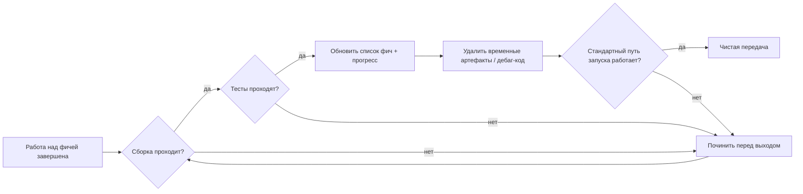
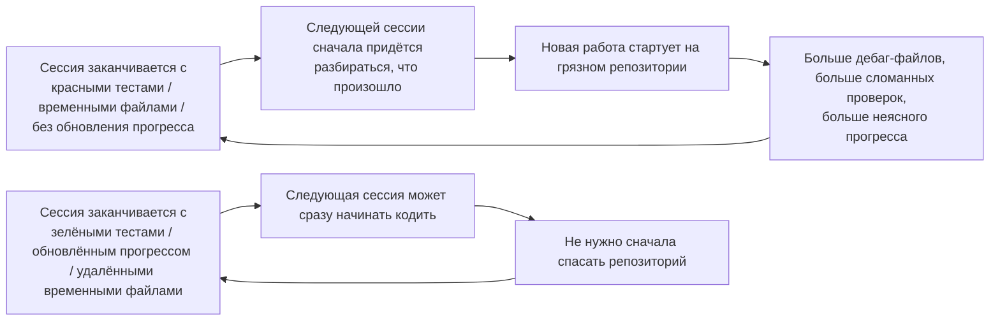

[中文版本 →](../../../zh/lectures/lecture-12-why-every-session-must-leave-a-clean-state/)

> Примеры кода: [code/](https://github.com/walkinglabs/learn-harness-engineering/blob/main/docs/en/lectures/lecture-12-why-every-session-must-leave-a-clean-state/code/)
> Практический проект: [Проект 06. Полноценный harness (Capstone)](./../../projects/project-06-runtime-observability-and-debugging/index.md)

# Лекция 12. Чистая передача в конце каждой сессии

## Какую проблему решает эта лекция?

Ваш агент работает весь день, меняет 20 файлов, коммитит код, сессия заканчивается. Следующая сессия агента стартует и сразу обнаруживает: сборка сломана, тесты красные, повсюду временные дебаг-файлы, список фич не обновлён, прогресс совершенно неясен. Новая сессия тратит первые 30 минут просто на выяснение «что вообще делала прошлая сессия».

И OpenAI, и Anthropic заявляют чётко: **долгосрочная надёжность зависит от операционной дисциплины, а не только от успеха одного запуска.** Качество состояния на выходе из сессии напрямую определяет эффективность следующей сессии. Думайте об этом как о лучших практиках Git — каждый коммит должен быть атомарным, компилируемым изменением, а не кучей полудоделанного кода.

## Ключевые понятия

- **Чистое состояние**: система удовлетворяет пяти условиям в конце сессии — сборка проходит, тесты проходят, прогресс зафиксирован, нет устаревших артефактов, доступен путь запуска. Если что-то одно отсутствует — сессия не «завершена».
- **Целостность сессии**: аналогично транзакциям БД — либо полностью коммитим и оставляем чистое состояние, либо откатываемся к последнему согласованному состоянию. Никакой золотой середины.
- **Документ качества**: активный артефакт, который непрерывно фиксирует рейтинги качества по каждому модулю. Не разовая оценка, а трекер, показывающий, становится ли кодовая база сильнее или слабее со временем.
- **Cleanup loop**: регулярная сессия обслуживания, направленная на систематическое снижение энтропии в кодовой базе. Не аварийный фикс, а рутинные операции.
- **Упрощение harness**: по мере роста возможностей моделей периодически удаляйте компоненты harness, которые больше не нужны. Ограничение, существенное сегодня, может оказаться ненужным оверхедом через три месяца.
- **Идемпотентная очистка**: операции очистки дают тот же результат независимо от того, сколько раз они выполняются. Гарантирует безопасность очистки даже в сценариях «сбой-ретрай».

## Пять измерений чистого состояния





## Почему так происходит

### Рост энтропии — это состояние по умолчанию

Законы эволюции ПО Лемана говорят нам: системы, подвергающиеся непрерывным изменениям, неизбежно усложняются, если ими активно не управлять. Это особенно верно для AI-агентов кодинга — каждая сессия вносит изменения, и без очистки на выходе технический долг накапливается экспоненциально.

Реальные данные красноречивы. Проект, разрабатывавшийся с агентами 12 недель без стратегии очистки:

- Неделя 1: успех сборки 100%, успех тестов 100%, запуск новой сессии 5 мин
- Неделя 4: сборка 95%, тесты 92%, запуск 15 мин
- Неделя 8: сборка 82%, тесты 78%, запуск 35 мин
- Неделя 12: сборка 68%, тесты 61%, запуск 60+ мин

Тот же проект со стратегией очистки:

- Неделя 1: 100%, 100%, 5 мин
- Неделя 12: 97%, 95%, 9 мин

После 12 недель: успех сборки отличается на 29 процентных пунктов, время запуска новой сессии — на 85%. Это не теория — это наблюдаемая разница.

### Пять измерений чистого состояния

Чистое состояние — это не просто «код собирается». Это пять измерений, оцениваемых вместе:

**Измерение сборки**: собирается ли код без ошибок? Это самое базовое — следующей сессии не должно приходиться сначала чинить ошибки сборки.

**Измерение тестов**: проходят ли все тесты? Включая тесты, существовавшие до сессии — сессия отвечает за то, чтобы не сломать существующую функциональность. И это должно быть проверено в CI, а не только «работает у меня на машине».

**Измерение прогресса**: зафиксирован ли текущий прогресс в машиночитаемом артефакте? Завершённые подзадачи с критериями их прохождения, начатые, но незавершённые подзадачи с текущим состоянием, ещё не начатые подзадачи. Хорошие записи прогресса сокращают 60–80% времени диагностики при старте сессии.

**Измерение артефактов**: есть ли устаревшие или неоднозначные временные артефакты? Дебаг-логи, временные файлы, закомментированный код, TODO-маркеры — всё это увеличивает когнитивную нагрузку для следующей сессии.

**Измерение запуска**: доступен ли стандартный путь запуска? Может ли следующая сессия начать работу без ручного вмешательства? Инициализация окружения, загрузка кодовой базы, получение контекста, выбор задачи — эти пути не должны быть сломаны.

### «Уберём потом» означает «никогда не убираем»

Самая распространённая ментальная ловушка — «нет времени убирать в этой сессии, сделаю в следующий раз». Но следующая сессия агента не знает, что вы оставили — она видит беспорядок кода и неопределённое состояние. Она потратит много времени, выясняя «какие части этого кода намеренные, а какие временные».

Хуже того, у каждой сессии свои цели. Новая сессия здесь, чтобы делать новую работу, а не убирать беспорядок предыдущей сессии. Она проигнорирует хаос и начнёт новую работу поверх него, добавляя ещё больше хаоса поверх хаоса. Это положительная обратная связь энтропии.

## Как делать правильно

### 1. Чистое состояние как требование к завершению

Явно определите в harness: **завершение сессии = задача проходит верификацию И проверка чистого состояния пройдена.** Если что-то одно не выполнено — сессия не завершена. Запишите в CLAUDE.md:

```
## Session Exit Checklist
- [ ] Build passes (npm run build)
- [ ] All tests pass (npm test)
- [ ] Feature list updated
- [ ] No debug code remaining (console.log, debugger, TODO)
- [ ] Standard startup path available (npm run dev)
```

### 2. Двухрежимная стратегия очистки

Совместите два режима очистки:

**Немедленная очистка (в конце каждой сессии)**: убрать временные артефакты, созданные за сессию, обновить состояние списка фич, убедиться, что сборка и тесты проходят. Это очистка по «подсчёту ссылок».

**Периодическая очистка (еженедельно)**: полное сканирование системы — обработать накопившиеся структурные проблемы, обновить документы качества, прогнать бенчмарк-тесты для выявления дрейфа. Это «трассирующая» очистка.

### 3. Поддерживайте документ качества

Документ качества — это активный артефакт, непрерывно оценивающий каждый модуль:

```markdown
# Quality Document

## User Authentication Module (Quality: A)
- Verification passing: Yes
- Agent understandable: Yes
- Test stability: Stable
- Architecture boundaries: Compliant
- Code conventions: Followed

## Payment Module (Quality: C)
- Verification passing: Partial (payment callback untested)
- Agent understandable: Difficult (logic spread across 3 files)
- Test stability: Unstable (2 flaky tests)
- Architecture boundaries: Violations present
- Code conventions: Partially followed
```

Новые сессии читают этот документ и сразу понимают, где приоритеты. Сначала чините модуль с самым низким баллом.

### 4. Периодически упрощайте harness

Важный инсайт от Anthropic: **каждый компонент harness существует, потому что модель не может надёжно делать что-то самостоятельно. Но по мере улучшения моделей эти предположения устаревают.** Ограничение, существенное три месяца назад, может сегодня оказаться ненужным оверхедом.

Рекомендуемая практика: каждый месяц выбирайте один компонент harness, временно отключайте его и прогоняйте бенчмарк-задачи. Если результаты не деградируют — удалите его навсегда. Если деградируют — восстановите или замените более лёгкой альтернативой.

### 5. Операции очистки должны быть идемпотентными

Скрипты очистки должны быть безопасны для повторного выполнения:

```bash
# Idempotent cleanup operations
rm -f /tmp/debug-*.log  # -f ensures no error when files don't exist
git checkout -- .env.local  # Restore to known state
npm run test  # Verify cleanup didn't break anything
```

## Реальный кейс

Electron-приложение, разрабатываемое с агентами 12 недель, сравнение двух подходов:

**Без стратегии очистки** (контрольная группа): неделя 12, успех сборки 68%, успех тестов 61%, запуск новой сессии 60+ мин, устаревших артефактов 103.

**Со стратегией очистки** (экспериментальная группа): полная проверка чистого состояния в конце каждой сессии + еженедельный cleanup loop. Неделя 12, успех сборки 97%, успех тестов 95%, запуск новой сессии 9 мин, устаревших артефактов 11.

К 12-й неделе у экспериментальной группы успех сборки выше на 29 процентных пунктов, успех тестов — на 34 пункта, время запуска новой сессии ниже на 85%.

## Ключевые выводы

- **Чистое состояние — необходимое условие завершения сессии** — не опциональная уборка, а часть «definition of done».
- **Все пять измерений обязательны** — сборка, тесты, прогресс, артефакты, запуск — каждое должно быть явно проверено.
- **Документы качества делают здоровье кодовой базы отслеживаемым** — починить можно только то, о чьей деградации вы знаете.
- **Периодически упрощайте harness** — по мере роста возможностей моделей удаляйте ограничения, которые больше не нужны.
- **«Уберём потом» равно «никогда не уберём»** — рост энтропии — это состояние по умолчанию; противодействует ей только активная очистка.

## Дополнительное чтение

- [Clean Code — Robert C. Martin](https://www.goodreads.com/book/show/3735293-clean-code) — систематические принципы чистоты кода
- [Harness Engineering — OpenAI](https://openai.com/index/harness-engineering/) — воспроизводимость как ключевое требование к проектированию harness
- [Effective Harnesses — Anthropic](https://www.anthropic.com/engineering/effective-harnesses-for-long-running-agents) — критическая роль чистых выходов из сессии для долгосрочной надёжности
- [Programs, Life Cycles, and Laws of Software Evolution — Lehman](https://ieeexplore.ieee.org/document/1702314) — законы эволюции ПО, доказывающие, что сложность системы неизбежно растёт без активного обслуживания

## Упражнения

1. **Чек-лист чистого состояния**: спроектируйте чек-лист выхода из сессии для вашей кодовой базы, охватывающий все пять измерений. Применяйте его на 5 последовательных сессиях и фиксируйте нарушения по каждому измерению.

2. **Сравнение бенчмарков**: используйте фиксированный набор задач с двумя вариантами harness (с требованиями чистого состояния и без). Сравните долю завершённых, число ретраев и долю просочившихся дефектов.

3. **Практика упрощения harness**: выберите один компонент harness, временно отключите его и прогоните бенчмарк-задачи. Сравните результаты с ним и без него. Решите, оставить, удалить или заменить.
 bash -c .textfile /Users/sanbu/Code/github/learn-harness-engineering/docs/en/lectures/lecture-12-why-every-session-must-leave-a-clean-state/index.md