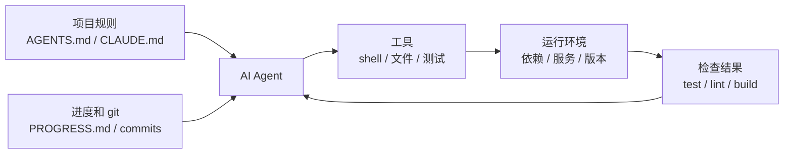

[English Version →](../../../en/lectures/lecture-02-what-a-harness-actually-is/)

> 本篇代码示例：[code/](https://github.com/walkinglabs/learn-harness-engineering/blob/main/docs/zh/lectures/lecture-02-what-a-harness-actually-is/code/)
> 实战练习：[Project 01. 只写提示词让 agent 做，和定好规则再让它做，差多少](./../../projects/project-01-baseline-vs-minimal-harness/index.md)

# 第二讲. Harness 到底是什么

"harness"这个词在 AI coding agent 的圈子里被用得越来越多了，但说实话，大部分人说的 harness 其实就只是"一个 prompt 文件"。这不是 harness。就像你开了一家餐厅，只有食材——没有灶台、没有刀具、没有菜谱、没有出菜流程——那不叫餐厅，那叫冰箱。

这节课要给你一个精确的、可操作的 harness 定义。不是学术论文里的抽象概念，而是你今天就能拿去用的框架：harness 由五个子系统组成，就像一个完整厨房里的五个功能区——菜谱架、刀具架、灶台、备菜台、和出菜检查口。每个子系统都有明确的职责和评判标准。

## 先讲一个类比

想象你是一个刚入职的工程师，被丢进一个没有任何文档的项目里。没有 README，代码里没有注释，没有人告诉你怎么跑测试，CI 配置文件藏在某个角落里。你能写出好代码吗？也许能——如果你足够聪明又足够有耐心。但你会花大量时间在"搞清楚这个项目是怎么回事"上，而不是在"解决问题"上。

AI agent 面对的困境一模一样。而且更糟——你至少可以问同事，agent 只能看到你放在它面前的文件和它能执行的命令。它不能拍拍同事的肩膀问"哎，这个项目的 ORM 用的是哪个版本？"

OpenAI 在他们的 harness engineering 文章里把 harness 的核心原则表述为"仓库即规范"——所有必要的上下文都应该在仓库里，通过结构化的指令文件、明确的验证命令和清晰的目录组织来呈现。Anthropic 的 long-running agents 文档则更侧重状态持久化、显式恢复路径和结构化的进度跟踪。两家公司的侧重点不同，但都在说同一件事：**模型之外的一切工程基础设施，决定了模型能力能被发挥多少。**

看看几个你熟悉的工具：

**Claude Code** 的设计就体现了 harness 思想。它会读你仓库里的 `CLAUDE.md`（菜谱架），能用 shell 跑命令（刀具架），在你的本地环境里执行（灶台），有会话历史（备菜台），能跑测试看结果（出菜检查口）。但如果你不告诉它怎么跑测试，出菜检查口就是断的——菜做没做熟谁也不知道。

**Cursor** 也是类似的逻辑。它的 `.cursorrules` 文件是菜谱架，终端是刀具架，它能读你的项目结构和 lint 配置是灶台。但 Cursor 的状态管理相对弱——你关掉 IDE 再打开，上次的上下文就没了。

**Codex**（OpenAI 的 coding agent）用 git worktree 隔离每个任务的运行环境，配合本地的可观测性栈（日志、指标、追踪），让每个变更都在独立的环境中验证。它在有 `AGENTS.md` 和清晰验证命令的仓库里，表现远超在"裸"仓库里。

**AutoGPT** 则是反面教材——缺乏结构化的状态管理导致长任务中上下文不断累积，缺乏精确的反馈机制导致 agent 陷入循环。很多人说 AutoGPT "不行"，但其实是它的 harness 不行——你给它一个破灶台，再好的食材也做不出菜来。

## 核心概念

- **什么是 harness**：模型权重之外的一切工程基础设施。OpenAI 把工程师的核心工作概括为三件事：设计环境、表达意图、构建反馈循环。Anthropic 直接把 Claude Agent SDK 称为"通用 agent harness"。
- **仓库是唯一事实来源**：agent 看不到的东西，对它来说就不存在。OpenAI 把仓库当作"记录系统"——所有必要的上下文都必须在仓库里，通过结构化的文件和清晰的目录组织来呈现。
- **给地图，不给说明书**：OpenAI 的经验——`AGENTS.md` 应该是目录页，不是百科全书。100 行左右就够了，放不下就拆分到 `docs/` 目录里，让 agent 按需去读。
- **约束而非微操**：好的 harness 用可执行的规则来约束 agent，而不是在指令里逐条叮嘱。OpenAI 说"执行不变量，不要微管实现"；Anthropic 发现 agent 会自信地夸赞自己的工作，解决方案是把"干活的人"和"检查的人"分开。
- **逐个组件拆除法**：想量化 harness 各组件的价值，就逐个移除，看哪个移除后性能下降最多。Anthropic 用这个方法发现：随着模型变强，某些组件不再关键，但总会有新的关键组件出现。

## Harness 五子系统模型

回到厨房的类比。一个完整的厨房有五个功能区，harness 也有五个子系统：



**指令子系统（菜谱架）**：创建 `AGENTS.md`（或 `CLAUDE.md`），内容包括项目概览和目的（一句话说清楚这是什么）、技术栈和版本（Python 3.11、FastAPI 0.100+、PostgreSQL 15）、首次运行命令（`make setup`、`make test`）、不可违反的硬约束（"所有 API 必须走 OAuth 2.0"）、指向更详细文档的链接。

**工具子系统（刀具架）**：确保 agent 有足够的工具访问权限。不要因为"安全考虑"把 shell 给禁了——agent 连 `pip install` 都跑不了，还怎么干活？但也别什么都开放，按最小权限原则来。

**环境子系统（灶台）**：让环境状态自描述。用 `pyproject.toml` 或 `package.json` 锁定依赖，用 `.nvmrc` 或 `.python-version` 指定运行时版本，用 Docker 或 devcontainer 让环境可重现。

**状态子系统（备菜台）**：长任务必须有进度跟踪。用一个简单的 `PROGRESS.md` 文件记录：哪些做完了，哪些在做，哪些被阻塞。每个会话结束前更新，下一个会话开始时读取。

**反馈子系统（出菜检查口）**：这是投入产出比最高的子系统。在 `AGENTS.md` 里显式列出验证命令：
```
验证命令：
- 测试：pytest tests/ -x
- 类型检查：mypy src/ --strict
- Lint：ruff check src/
- 完整验证：make check（包含以上全部）
```

五个子系统缺一个，就像厨房里少了一个功能区——菜还是能做，但总是别扭。

**诊断 harness 质量的方法**：用"等模型对照实验"。保持模型不变，逐个移除五个子系统，看哪个子系统缺失时性能下降最多。那个就是你的瓶颈——集中精力加强它。就像找厨房的瓶颈一样：把菜谱架拿走看看出菜速度降多少，把灶台关掉看看影响多大。

## 一个团队的真实经历

一个团队用 GPT-4o 开发一个 TypeScript + React 前端应用（约 20,000 行代码）。他们经历了四个阶段——其实就是在一件一件地添置厨具：

**阶段 1——空厨房**：只有 README 里的基本项目描述。5 次运行成功 1 次（20%）。主要失败：选错了包管理器（npm vs yarn）、没遵循组件命名约定、跑不了测试。

**阶段 2——装上菜谱架**：添加 `AGENTS.md`，写明技术栈版本、命名约定、关键架构决策。成功率升到 60%。剩余失败主要来自环境问题和验证缺失。

**阶段 3——开起出菜检查口**：在 `AGENTS.md` 里列出验证命令 `yarn test && yarn lint && yarn build`。成功率升到 80%。

**阶段 4——备菜台就位**：引入进度文件模板，agent 在每次运行中记录完成和未完成的工作。成功率稳定在 80-100%。

四次迭代，模型一个字没改，成功率从 20% 到接近 100%。这就是 harness 工程的力量。你没有换更贵的食材，你只是把厨房收拾利索了。

## 关键要点

- Harness = 指令 + 工具 + 环境 + 状态 + 反馈。五个子系统，就像厨房的五个功能区，缺一不可。
- 不是模型权重的部分全是 harness。你的 harness 决定了模型能力能被发挥多少。
- 五个子系统中，反馈子系统通常是投入最少、回报最高的。先把验证命令写清楚——出菜检查口是最值得先装的。
- 用"等模型对照实验"量化各子系统的边际贡献，别凭感觉。
- Harness 和代码一样会腐化。定期审计，像还技术债一样还 harness 债。

## 延伸阅读

- [OpenAI: Harness Engineering](https://openai.com/index/harness-engineering/)
- [Anthropic: Effective Harnesses for Long-Running Agents](https://www.anthropic.com/engineering/effective-harnesses-for-long-running-agents)
- [HumanLayer: Harness Engineering for Coding Agents](https://humanlayer.dev/articles/harness-engineering-for-coding-agents/)
- [SWE-agent: Agent-Computer Interfaces](https://github.com/princeton-nlp/SWE-agent)
- [Thoughtworks: Harness Engineering on Technology Radar](https://www.thoughtworks.com/radar)

## 练习

1. **Harness 五元组审计**：拿你正在用 AI agent 的项目，按五元组框架做一个完整审计。每个子系统打 1-5 分。找出最低分的那个子系统，花 30 分钟改进它，然后观察 agent 的表现变化。

2. **等模型对照实验**：选一个模型和一个有挑战性的任务。依次移除指令（删掉 AGENTS.md）、移除反馈（不给验证命令）、移除状态（不提供进度文件），每次只移除一个，测量性能下降幅度。基于结果，排出各子系统对你项目的重要性排名。

3. **可供性分析**：找一个 agent 在你的项目中"想做但做不了"的场景（比如知道要用参数化查询但不知道你项目的 ORM 怎么写）。分析这是执行鸿沟（不知道怎么操作）还是评估鸿沟（不知道做得对不对），然后设计 harness 改进来弥补。
