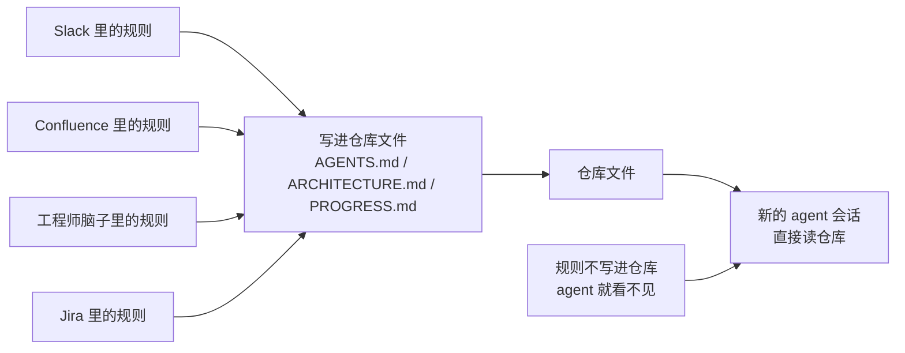
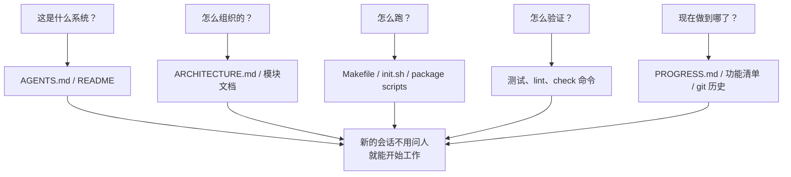

[English Version →](../../../en/lectures/lecture-03-why-the-repository-must-become-the-system-of-record/)

> 本篇代码示例：[code/](https://github.com/walkinglabs/learn-harness-engineering/blob/main/docs/zh/lectures/lecture-03-why-the-repository-must-become-the-system-of-record/code/)
> 实战练习：[Project 02. 让 agent 看懂项目、接住上次的工作](./../../projects/project-02-agent-readable-workspace/index.md)

# 第三讲. 让代码仓库成为唯一的事实来源

你团队的架构决策散落在 Confluence、Slack、Jira、和几个资深工程师的脑子里。对人类来说这勉强够用——你可以问同事、搜聊天记录、翻文档。实在不行还能去茶水间堵人。但对 AI agent 来说，不在仓库里的信息等于不存在。

这不是夸张。想想 agent 的输入都有什么：系统提示和任务描述、仓库里的文件内容、以及工具执行的输出。就这三样。你的 Slack 历史、Jira 工单、Confluence 页面、和周五下午跟同事在茶水间聊的架构决定——agent 全都看不到。它不能"去问一下"，也不能"搜一下聊天记录"。它就是一个被关在仓库里的工程师——仓库外面的事，它一概不知。

所以问题变成了：你给不给这个工程师一张好地图？

## 地图上该画什么

OpenAI 在他们的 harness engineering 文章里把这个问题说得非常直白：**仓库里不存在的信息，对 agent 来说等于不存在。** 他们把这称为"仓库即规范"原则——仓库本身就是最高权威的规范文档。

Anthropic 的 long-running agents 文档也强调了类似的观点：持久化状态是长任务连续性的必要条件。跨会话的知识可恢复性直接决定了任务成功率。而这些状态必须存在于仓库中——因为那是 agent 唯一稳定可访问的存储。

你可能会想："我们团队人少，知识都在大家脑子里，这不也工作得好好的吗？"没错，对人类来说确实可以。但你要用 agent，就得接受一个事实：agent 不能问人。所有它需要知道的东西，都必须写下来，放在它能找到的地方。

这不是"写更多文档"的问题。这是"把决策信息放到正确的位置"的问题。一份在 `src/api/` 目录下、50 行的 `ARCHITECTURE.md`，比一份在 Confluence 里、500 页但没人维护的设计文档有用一万倍。就好比一张贴在你工位上的、手画的办公室走法图，比一份精美的、放在档案室里的建筑蓝图实用得多——因为前者在你需要的时候就在手边。

## 知识可见性



怎么检验你的地图画得够不够好？做一个"冷启动测试"：开一个全新的 agent 会话，只看仓库内容，看它能不能回答五个基本问题：



如果它答不上来，说明地图上有空白。空白的地方，agent 就得自己猜——猜错了就是 bug，猜多了就浪费上下文。每个新会话都要猜一遍，猜的成本远高于一开始就把地图画好的成本。

## 核心概念

- **知识可见性缺口**：项目总知识中不在仓库里的比例。缺口越大，agent 失败的概率越高。你脑子里有多少关于这个项目的隐性知识？把它们全算上，再看有多少写进了仓库——两者的差距就是你的可见性缺口。
- **系统记录（System of Record）**：代码仓库作为项目决策、架构约束、执行状态和验证标准的权威信息源。仓库说了算，别的地方说了不算。就像地图上标注了"此路不通"，你就不会再往那条路走——但如果这个信息只在老张的脑子里，你每次都得问老张。
- **冷启动测试**：上一节说的五个问题。能回答几个，你的地图就画了几分。
- **发现成本**：agent 为了在仓库里找到一条关键信息需要消耗多少上下文。信息放得越隐蔽，发现成本越高，留给实际任务的预算越少。把关键信息藏在十层目录深处的 README 里，就像把灭火器锁在地下室的保险柜里——不是没有，是用的时候找不到。
- **知识衰减率**：仓库中单位时间内变得过时的知识条目比例。文档和代码脱节是最大的敌人——比没有文档更危险的是过时的文档。
- **ACID 类比**：把数据库的事务管理原则（原子性、一致性、隔离性、持久性）用到 agent 的状态管理上。后面会展开讲。

## 怎么画好这张地图

**原则 1：知识靠近代码。** 一条关于 API 端点认证的规则，应该放在 API 代码旁边，而不是藏在一个巨大的全局文档里。每个模块目录下放一个简短的文档，说清楚这个模块的职责、接口和特殊约束。就像图书馆的书架标签——你想找历史类书籍，直接去标着"历史"的书架，不用把整个图书馆翻一遍。

**原则 2：用标准化的入口文件。** `AGENTS.md`（或 `CLAUDE.md`）是 agent 的"着陆页"。它不需要包含所有信息，但必须能让 agent 快速回答"这是什么项目"、"怎么跑"、"怎么验证"这三个问题。50-100 行就够了。

**原则 3：最小但完备。** 每条知识都应该有明确的使用场景。如果你删掉某条规则不影响 agent 的决策质量，那这条规则就不应该存在。但冷启动测试中的每个问题都必须有答案。这是一个精妙的平衡——不多不少，刚好够用。

**原则 4：和代码一起更新。** 把知识更新跟代码变更绑定在一起。最简单的方法：把架构文档放在对应的模块目录里。改代码的时候自然会看到文档，改代码之后 CI 提醒你检查文档是否需要更新。

**具体的仓库结构**：

```
project/
├── AGENTS.md              # 入口：项目概览、运行命令、硬约束
├── src/
│   ├── api/
│   │   ├── ARCHITECTURE.md  # API 层的架构决策
│   │   └── ...
│   ├── db/
│   │   ├── CONSTRAINTS.md   # 数据库操作的硬约束
│   │   └── ...
│   └── ...
├── PROGRESS.md             # 当前进度：做了什么、在做什么、被什么阻塞
└── Makefile                # 标准化的操作命令：setup、test、lint、check
```

## 用 ACID 原则管理 agent 状态

这个类比来自数据库的事务管理——你可能觉得这是在把简单的事情搞复杂，但实际上它给了你一个非常实用的框架：

- **原子性**：每次"逻辑操作"（比如"添加新端点并更新测试"）用一个 git commit 原子化。中途挂了就 `git stash` 回滚。要么全做，要么不做，没有"做了一半"。
- **一致性**：定义"一致状态"的验证谓词——所有测试通过、lint 无报错。Agent 每次操作后跑验证，不一致的中间状态不要 commit。就像银行转账——你不能只扣款不入账。
- **隔离性**：多个 agent 并发工作时，状态文件要避免竞争条件。简单方案：每个 agent 用独立的进度文件，或者用 git 分支隔离。两个厨师不能同时往同一口锅里放盐——放重了谁负责？
- **持久性**：关键的项目知识用 git 跟踪的文件持久化。临时状态可以只在会话内存里，但跨会话必须的知识必须写到文件里。脑子里的不算，写在纸上的才算。

## 一个真实的改造故事

一个团队维护一个包含约 30 个微服务的电商平台。架构决策（服务间通信协议、数据一致性策略、API 版本化规则）散落在：Confluence（部分过时）、Slack（难以搜索）、几个资深工程师的脑子里（不可扩展）、以及零星的代码注释（不系统）。

引入 AI agent 后，70% 的任务需要人工干预。几乎每次失败都涉及 agent 违反了某个"所有人都知道但从未写入仓库"的隐性约束。这就像一个新来的员工，没人告诉他"中午点外卖要在群里接龙"——他自己猜，猜错了被骂，但骂完了还是没人告诉他规则。

团队执行了改造：
1. 仓库根目录创建 `AGENTS.md`，写明项目概览、技术栈版本、全局硬约束
2. 每个微服务目录下添加 `ARCHITECTURE.md`，描述该服务的职责、接口和依赖
3. 创建集中的 `CONSTRAINTS.md`，用"禁止/必须"的明确语言记录硬约束
4. 每个服务目录添加 `PROGRESS.md`，记录当前工作状态

改造后：同一 agent 能在冷启动时回答所有关键项目问题，任务完成质量显著提升。

## 关键要点

- 不在仓库里的知识对 agent 来说等于不存在。把关键决策信息放进仓库是最基本的 harness 投资——画好地图，才不会迷路。
- 用"冷启动测试"检验仓库质量：全新会话能不能只看仓库回答五个基本问题。
- 知识要靠近代码、最小但完备、跟代码一起更新。不是写更多文档，是把信息放到正确的位置。
- 用 ACID 原则管理 agent 状态：原子提交、一致性验证、隔离并发、持久化关键知识。
- 知识衰减是最大敌人。过时的文档比没有文档更危险——它会让 agent 走错方向还以为自己是对的。

## 延伸阅读

- [OpenAI: Harness Engineering](https://openai.com/index/harness-engineering/)
- [Anthropic: Effective Harnesses for Long-Running Agents](https://www.anthropic.com/engineering/effective-harnesses-for-long-running-agents)
- [Infrastructure as Code — Martin Fowler](https://martinfowler.com/bliki/InfrastructureAsCode.html)
- [ADR: Architecture Decision Records](https://adr.github.io/)
- [The Twelve-Factor App](https://12factor.net/)

## 练习

1. **冷启动测试**：在你的项目里开一个全新的 agent 会话（不提供任何口头上下文），只让它看仓库内容，然后问它五个问题：这是什么系统？怎么组织的？怎么运行？怎么验证？现在进度如何？记录它答不上来的问题，然后改进仓库让它能答上来。

2. **知识外置化量化**：列出你的项目中所有对开发工作重要的决策和约束。标注每个条目是在仓库内还是仓库外。算一下你的知识可见性缺口有多大（不在仓库里的占总数的比例）。制定计划把缺口降到 10% 以下。

3. **ACID 准则评估**：用本讲的 ACID 类比评估你的项目状态管理。原子性——agent 的操作能不能干净地回滚？一致性——仓库有没有"一致状态"的验证？隔离性——多 agent 并发时会不会互相踩脚？持久性——跨会话的知识是不是都持久化了？
