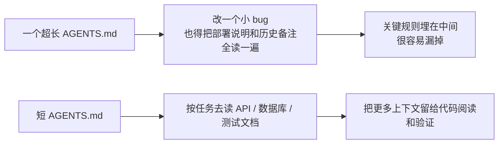
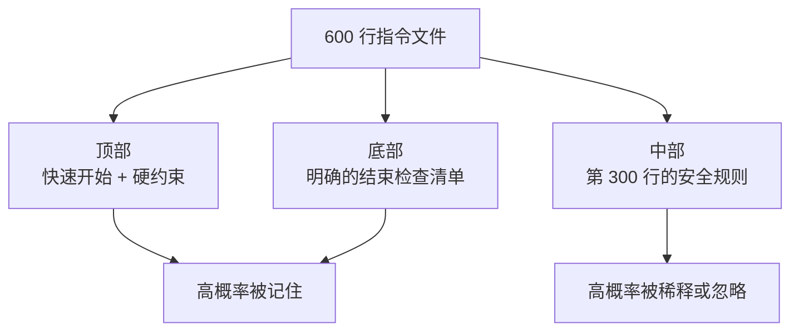

[English Version →](../../../en/lectures/lecture-04-why-one-giant-instruction-file-fails/)

> 本篇代码示例：[code/](https://github.com/walkinglabs/learn-harness-engineering/blob/main/docs/zh/lectures/lecture-04-why-one-giant-instruction-file-fails/code/)
> 实战练习：[Project 02. 让 agent 看懂项目、接住上次的工作](./../../projects/project-02-agent-readable-workspace/index.md)

# 第四讲. 把指令拆分到不同文件里

你开始认真对待 harness 了——好事。你建了个 `AGENTS.md`，把你能想到的所有规则、约束、历史教训都塞了进去。一个月后这个文件膨胀到了 300 行，两个月 450 行，三个月 600 行。然后你发现 agent 的表现反而变差了——改一个小 bug，agent 花大量上下文处理无关的部署指令；关键的安全约束埋在第 300 行，被直接忽略了；文件里有三条互相矛盾的代码风格规则，agent 每次随机选一条。

这就是"巨型指令文件"陷阱。就像你往行李箱里塞东西——觉得什么都有用，什么都往里装，结果拉链快崩了，想找换洗内衣得把整个箱子翻一遍。带了一箱子东西，但真正用上的可能只有三分之一。

## 问题的根源：一个恶性循环

最常见的恶性循环是这样的：agent 犯了个错 → 你说"加条规则防止这个" → 加到 AGENTS.md → 暂时管用 → agent 又犯了另一个错 → 再加一条 → 重复 → 文件膨胀到不可控。

这不是你的错。这是一个非常自然的反应——每次出问题就"加条规则"感觉很合理，就像每次出门忘带东西就往包里多塞一样。但累积效应是灾难性的。让我们看看具体出了什么问题。

**上下文预算被吃掉了。** Agent 的上下文窗口是有限的。假设你的 agent 有 200K tokens 的窗口（Claude 的标准），一个膨胀的指令文件可能占掉 10-20K。看起来还有不少余量？但一个复杂的任务可能需要读几十个源文件、工具执行的输出也占上下文、对话历史也在累积。到真正需要理解代码的时候，预算已经不够了——就像你的行李箱塞满了"万一用得着"的东西，结果放不下真正需要带的电脑了。

**中间迷失。** "Lost in the Middle"这篇论文（Liu et al., 2023）清楚地证明了：LLM 对长文本中间部分的信息利用效率显著低于两端。你的 AGENTS.md 有 600 行，第 300 行写的是"所有数据库查询必须用参数化查询"——这是安全硬约束。但它被埋在中间，agent 几乎一定会忽略它。就像你的行李箱里那瓶防晒霜——明明在最底层，但你翻三遍也找不到，最后又去买了一瓶。

**优先级冲突。** 文件里混合了不可违反的硬约束（"不得使用 eval()"）、重要的设计指导（"优先使用函数式风格"）、和某个特定场景的历史教训（"上周修了一个 WebSocket 内存泄漏，注意类似的模式"）。这三条规则的重要性完全不同，但在文件里看起来一模一样。Agent 没有可靠的信号来区分——就像行李箱里护照和充电线混在一起，看不出哪个更紧急。

**维护衰减。** 大文件天生难维护。指令过时了没人删——因为删除的后果不确定（"也许别的地方依赖这条规则？"），但加新指令是无成本的。结果文件只增不减，信噪比持续下降。这和软件里的技术债务积累一模一样。

**矛盾累积。** 不同时期加的指令之间开始出现矛盾——一条说"用 TypeScript 严格模式"，另一条说"某些遗留文件允许用 any"。Agent 每次随机选一条遵循。就像你妈说"穿厚点"，你爸说"别穿太多"，你站在门口不知道听谁的。

## 核心概念

- **指令膨胀**：当指令文件占用了超过上下文窗口 10-15% 的时候，它就开始挤占代码阅读和任务推理的预算。600 行的 `AGENTS.md` 可能占用 10,000-20,000 tokens——对 128K 的窗口来说，这就吃掉了 8-15%。
- **中间迷失效应**：Liu 等人 2023 年的研究证明，LLM 对长文本中间部分的信息利用效率显著低于两端。埋在 600 行文件中间第 300 行的关键约束，被有效忽略的概率非常高。
- **指令信噪比（SNR）**：文件中与当前任务相关的指令占总指令的比例。做 bug 修复时被要求读 50 行部署指令——SNR 很低。
- **路由文件**：短小的入口文件，核心功能是引导 agent 去找更详细的文档，而不是自己包含所有内容。50-200 行就够了。
- **渐进式披露**：先给概要信息，需要的时候再给详细信息。好的 harness 设计和好的 UI 设计一样，不把所有选项一次性砸到用户脸上。
- **优先级模糊度**：当所有指令以相同格式和位置呈现时，agent 分不清哪些是不可违反的硬约束，哪些是建议性的软约束。

## 指令文件架构





## 拆分思路

核心原则：常用信息放手边，偶尔用的收起来，用不上的别带。

入口文件 `AGENTS.md` 控制在 50-200 行，只放最常用的东西——项目概览（一两句话说清楚这是什么）、首次运行命令（`make setup && make test`）、全局硬约束（不超过 15 条不可违反的规则）、指向专题文档的链接（一行描述 + 适用条件）。

```markdown
# AGENTS.md

## 项目概览
Python 3.11 FastAPI 后端，PostgreSQL 15 数据库。

## 快速开始
- 安装：`make setup`
- 测试：`make test`
- 完整验证：`make check`

## 硬约束
- 所有 API 必须走 OAuth 2.0 认证
- 所有数据库查询必须用 SQLAlchemy 2.0 语法
- 所有 PR 必须通过 pytest + mypy --strict + ruff check

## 专题文档
- [API 设计规范](docs/api-patterns.md) — 添加新端点时必读
- [数据库操作约束](docs/database-rules.md) — 涉及数据库修改时必读
- [测试标准](docs/testing-standards.md) — 编写测试时参考
```

每个专题文档 50-150 行，按主题放在 `docs/` 目录下或对应模块目录旁。Agent 只在需要时才去读。就像行李箱里的收纳袋——内衣一个袋，洗漱一个袋，充电器一个袋。找东西不用翻整个箱子。

还有些信息直接放在代码里更合适——类型定义、接口注释、配置文件里的说明。Agent 读代码的时候自然能看到，不用再在指令里重复一遍。

每条指令都应该标明来源（"为什么加这条规则？"）、适用条件（"这条规则在什么时候需要？"）、过期条件（"什么情况下可以删掉这条规则？"）。定期审计，删掉过时的、冗余的、矛盾的条目。像管理代码依赖一样管理你的指令——用不上的依赖就该删掉，不然它们只会拖慢系统。

如果某条指令必须在入口文件里，放顶部或底部——不要放中间。"中间迷失"效应告诉我们，LLM 对长文本中间部分的信息利用效率显著低于两端。但更好的做法是把指令放到专题文档里，让 agent 按需加载。

OpenAI 和 Anthropic 都隐性支持拆分的做法。OpenAI 说入口文件应"短小且以路由为导向"，Anthropic 说长运行 agent 的控制信息应"简洁且高优先级"。两家都在说同一件事：别把什么都塞进一个文件里。行李箱得整理，不能只靠蛮力塞。

## 实际案例

一个 SaaS 团队的 `AGENTS.md` 从最初的 50 行膨胀到 600 行。内容混合了技术栈版本、编码规范、历史 bug 修复笔记、API 使用说明、部署流程、和团队成员的个人偏好——整个行李箱塞得满满当当，拉链都快崩了。

Agent 表现开始明显下降：简单 bug 修复任务中 agent 花大量上下文处理无关的部署指令；安全约束"所有数据库查询必须用参数化查询"埋在第 300 行，经常被忽略；三条矛盾的代码风格规则导致 agent 随机选择。

团队执行了"行李箱整理"：
1. `AGENTS.md` 裁剪到 80 行：只保留项目概览、运行命令、15 条全局硬约束
2. 创建专题文档：`docs/api-patterns.md`（120 行）、`docs/database-rules.md`（60 行）、`docs/testing-standards.md`（80 行）
3. 路由文件添加指向专题文档的链接
4. 历史笔记要么转成测试用例，要么删除

重构后：同一任务集的成功率从 45% 提升到 72%。安全约束遵循率从 60% 提升到 95%——因为从文件中间移到了路由文件顶部，不再被"中间迷失"了。

## 关键要点

- "加条规则"是短期的止痛药，长期的毒药。每次加规则前想想：这条规则放专题文档是不是更合适？——别什么都往行李箱里塞。
- 入口文件是路由器，不是百科全书。50-200 行，只放概览、硬约束、和链接。
- 利用"中间迷失"效应：重要信息放文件顶部或底部，不重要的移到专题文档。
- 像管理技术债一样管理指令膨胀。定期审计，每条指令要有来源、适用条件、和过期条件。
- 拆分之后信噪比提升，agent 把更多上下文预算花在实际任务上，而不是处理无关指令。

## 延伸阅读

- [OpenAI: Harness Engineering](https://openai.com/index/harness-engineering/)
- [Anthropic: Effective Harnesses for Long-Running Agents](https://www.anthropic.com/engineering/effective-harnesses-for-long-running-agents)
- [Lost in the Middle: How Language Models Use Long Contexts](https://arxiv.org/abs/2307.03172)
- [HumanLayer: Harness Engineering for Coding Agents](https://humanlayer.dev/articles/harness-engineering-for-coding-agents/)
- [Nielsen Norman Group: Progressive Disclosure](https://www.nngroup.com/articles/progressive-disclosure/)

## 练习

1. **信噪比审计**：拿你当前的入口指令文件，列出所有指令条目。选 5 个不同的常见任务类型，标注每条指令是否跟该任务相关。计算每个任务类型的 SNR。那些对大多数任务都是噪声的指令，移到专题文档里。

2. **渐进式披露重构**：如果你有一个超过 300 行的指令文件，把它拆成：(a) 不超过 100 行的路由文件，(b) 3-5 个专题文档。重构前后各跑同一组任务（至少 5 个），对比成功率。

3. **中间迷失验证**：在一个长指令文件里，把一条关键约束分别放在顶部、中间、底部各跑一组任务（每组至少 5 次），看遵循率有没有差别。你可能会惊讶于位置效应有多大。
