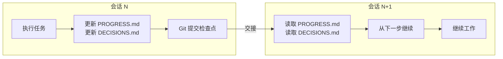
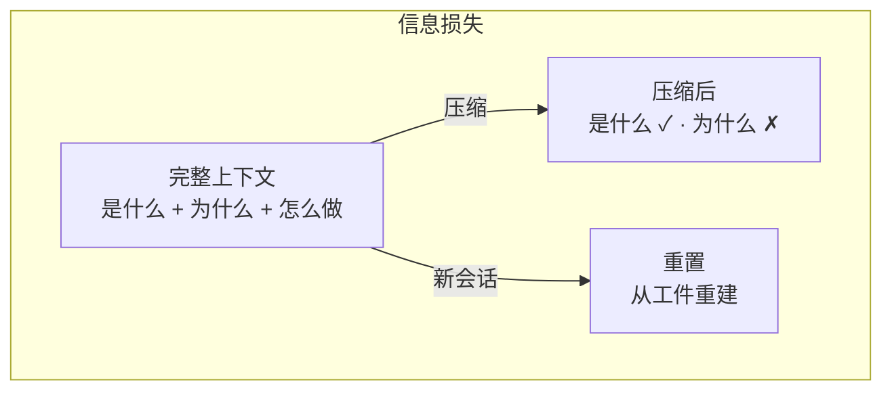

[English Version →](../../../en/lectures/lecture-05-why-long-running-tasks-lose-continuity/)

> 本篇代码示例：[code/](https://github.com/walkinglabs/learn-harness-engineering/blob/main/docs/zh/lectures/lecture-05-why-long-running-tasks-lose-continuity/code/)
> 实战练习：[Project 03. 让 agent 关掉再打开还能接着干](./../../projects/project-03-multi-session-continuity/index.md)

# 第五讲. 让跨会话的任务保持上下文连续

## 这节课要解决什么问题

你让 Claude Code 帮你实现一个完整的功能，它跑了 30 分钟，做了大部分工作，但上下文快满了。你开个新会话继续，然后发现：它不记得上次做了什么决策、为什么选了方案 A 而不是方案 B、哪些文件已经改过、测试跑到什么状态了。它得花 15 分钟重新探索一遍项目，而且可能跟上次的做法不一致。

这是 AI coding agent 最痛的问题之一：跨会话的上下文连续性。本节课讲为什么 agent 在长任务中会"断片"，以及如何通过结构化的状态持久化来保持连续性。

## 核心概念

- **上下文窗口是有限的**：不管模型吹多大的窗口（128K、200K、1M），长任务总会用完。用完之后要么压缩（丢信息），要么重置（开新会话）。两种方式都会丢东西。
- **连续性工件**：持久化的状态文件，让新会话能无歧义地恢复到上次离开的地方。最基本的形式：进度日志 + 验证记录 + 下一步行动。
- **重建成本**：新会话恢复到可执行状态所需的时间。好的 harness 能把重建成本从 15 分钟压到 3 分钟。
- **漂移（Drift）**：agent 的理解跟代码仓库实际状态之间的偏差。每次会话边界都会引入漂移，不加控制会越漂越远。
- **压缩 vs 重置**：压缩是在同一个会话里把上下文摘要化（保留"是什么"，可能丢了"为什么"）；重置是开新会话从持久化状态重建（干净但依赖工件完备性）。
- **上下文焦虑**：Anthropic 观察到的一个现象——agent 在接近上下文限制时表现异常，过早结束任务以避免信息丢失。这是一种非理性的资源焦虑。

## 会话连续性流程





## 为什么会这样

上下文窗口是有限的。这不是一个可以通过模型升级解决的问题——即使窗口大小增长到 1M tokens，复杂任务依然会用完。因为 agent 不只是在生成代码，它还要理解代码库、跟踪自己的决策历史、处理工具输出、维护对话上下文。这些信息加起来增长得比窗口扩容快得多。

更深层的问题：agent 产生的信息不是均匀重要的。中间推理步骤包含决策的"为什么"——为什么选了方案 A 而不是方案 B，为什么用了这个库而不是那个库，为什么跳过了某个优化。最终输出只包含"是什么"——代码本身。压缩策略通常保留后者但丢了前者。下一个会话看到代码但不知道为什么这么写，可能会"优化"掉一个有意为之的设计决策。

Anthropic 在他们的长运行 agent 研究中发现了一个很有意思的现象：当 agent 感觉上下文快满了，它们会表现出一种"过早收敛"的行为——匆忙结束当前工作，跳过验证步骤，或者选一个简单的方案而不是最优方案。这就像你考试时发现时间快到了，赶紧随便选几个选择题一样。Anthropic 把这叫"上下文焦虑"。

具体来说，跨会话连续性丧失有以下几种表现形式：

**决策上下文丢失。** 上个会话花了很多上下文预算分析了三种方案的优劣，最终选了方案 B。这个会话的 agent 不知道这个分析过程，可能基于不完整的信息重新做了决策——而且可能选了方案 A。

**重复工作。** Agent 不确定某项工作是否已完成，重新做了一遍。或者更糟——做了一半发现跟已有的实现冲突，需要返工。

**方向漂移。** 每个新会话对项目目标的理解略有偏差。几个会话累积下来，实现方向可能已经偏离了原始需求。

**验证缺口放大。** 上个会话的验证结果（哪些测试通过、哪些失败、为什么失败）没有记录。新会话得重新跑一遍验证才能了解当前状态。

OpenAI 和 Anthropic 都在他们的文档里强调了结构化状态持久化的重要性。OpenAI 的 harness engineering 文章把仓库当作"操作记录"——每次操作的结果都应该在仓库里留下可追溯的痕迹。Anthropic 的 long-running agents 文档则更具体地建议使用"交接文件"——包含当前状态、已知问题和下一步行动的结构化文档。

## 怎么做才对

核心思路：**把 agent 当成一个会失忆的超级工程师来管理。** 每次它要"下班"之前，必须把关键信息写下来，让下一个"接班"的 agent 能快速上手。

**工具 1：进度文件（PROGRESS.md）。** 这是最基本的连续性工件。格式很简单：

```markdown
# 项目进度

## 当前状态
- 最新 commit: abc1234 (feat: add user preferences endpoint)
- 测试状态: 42/43 通过 (test_pagination_edge_case 失败)
- Lint: 通过

## 已完成
- [x] 用户模型和数据库迁移
- [x] 基础 CRUD 端点
- [x] 认证中间件集成

## 进行中
- [ ] 分页功能 (90% - 边界条件测试失败)

## 已知问题
- test_pagination_edge_case 在空结果集时返回 500
- 需要确认是否要在列表中包含已删除用户

## 下一步
1. 修复分页边界条件 bug
2. 添加"是否包含已删除用户"的查询参数
3. 更新 API 文档
```

**工具 2：决策日志（DECISIONS.md）。** 记录重要的设计决策和原因。不需要详细的设计文档，只需要"什么决策、为什么、什么时候做的"：

```markdown
# 设计决策

## 2024-01-15: 使用 Redis 缓存用户偏好
- 原因: 读取频率高（每次 API 调用都需要），数据量小
- 否决方案: 用 PostgreSQL 物化视图（变更频率高，物化视图维护成本不划算）
- 约束: 缓存 TTL 设为 5 分钟，写入时主动失效
```

**工具 3：git 提交作为检查点。** 每完成一个原子工作单元就提交。commit message 要说清楚做了什么和为什么。这是免费的、自动版本化的状态快照。

**工具 4：init.sh 或 harness 的初始化流程。** 在 `AGENTS.md` 里写明：

```markdown
## 每次会话开始时
1. 读 PROGRESS.md 了解当前状态
2. 读 DECISIONS.md 了解重要决策
3. 跑 make check 确认仓库处于一致状态
4. 从 PROGRESS.md 的"下一步"部分继续工作

## 每次会话结束前
1. 更新 PROGRESS.md
2. 跑 make check 确认一致状态
3. 提交所有已完成的工作
```

**混合策略**：不需要每次都重置上下文。短任务（30 分钟以内）可以在同一个会话里完成。长任务（跨会话）必须用进度文件和决策日志来维持连续性。判断标准：如果任务需要的上下文超过窗口的 60%，就开始准备交接。

### 上下文焦虑的深层分析

Anthropic 在 2026 年 3 月发布的研究进一步揭示了上下文焦虑的具体表现：在 Sonnet 4.5 上，当上下文接近窗口限制时，agent 会表现出强烈的"过早收敛"行为——匆忙结束当前工作、跳过验证步骤、选简单方案而非最优方案。这就像考试时发现时间快到了，赶紧随便填选择题。

针对这个现象，有两种策略：

**压缩（Compaction）**：在同一个会话里把早期对话摘要化。优点是保留连续性，agent 能看到"是什么"。缺点是"为什么"经常在摘要中丢失——为什么选了方案 B 而非 A，为什么跳过了某个优化。更关键的是，压缩并不能消除上下文焦虑——agent 知道上下文曾经很大，心理上仍然倾向于加速收尾。

**重置（Context Reset）**：完全清空上下文，开一个新会话，从持久化工件重建。优点是干净的心理状态——新会话没有"我快没时间了"的焦虑。缺点是依赖交接工件的完备性。如果交接文件漏了关键信息，新会话可能在错误方向上浪费时间。

Anthropic 的实际数据：对于 Sonnet 4.5，上下文焦虑足够严重，以至于压缩单独不够用，上下文重置成为 harness 设计的关键组件。但对于 Opus 4.5，这种行为大幅减弱，可以不依赖重置而靠压缩管理上下文。这意味着：**harness 设计需要对目标模型有具体的理解，而不是套用通用模板。**

> 来源：[Anthropic: Harness design for long-running application development](https://www.anthropic.com/engineering/harness-design-long-running-apps)

## 实际案例

一个 agent 被要求实现一个带用户认证的博客系统，12 个功能点，预计需要 5 个会话。

**无连续性工件的基线**：会话 1 实现了用户模型和基础路由。会话 2 开始时，agent 不记得认证中间件的接口约定，花了约 15 分钟推断上次的设计意图。到会话 3，累积漂移导致 agent 开始重复已实现的功能。到会话 5，仓库有大量冗余代码，但核心认证功能仍未通过端到端测试。12 个功能点只完成了 7 个，其中 3 个有隐含的正确性问题。

**有结构化工件的对照**：使用进度文件、决策日志、验证记录和 git 检查点。每个会话结束时自动更新状态报告。会话 2 的重建成本降到约 3 分钟。到会话 5，所有 12 个功能点完成且通过验证。

定量对比：重建时间减少约 78%，功能完成率从 58% 提升到 100%，隐含缺陷率从 43% 降到 8%。

## 关键要点

- 上下文窗口是有限的资源。长任务一定会跨会话，跨会话一定会丢信息。
- 解决方案不是更大的窗口，而是更好的状态持久化。进度文件 + 决策日志 + git 检查点。
- 把 agent 当成会失忆的工程师来管理：每次"下班"前写清楚做了什么、为什么、下一步做什么。
- 重建成本是关键指标。好的 harness 应该让新会话在 3 分钟内恢复到可执行状态。
- 混合策略：短任务在会话内完成，长任务用结构化工件维持连续性。

## 延伸阅读

- [Anthropic: Effective Harnesses for Long-Running Agents](https://www.anthropic.com/engineering/effective-harnesses-for-long-running-agents)
- [OpenAI: Harness Engineering](https://openai.com/index/harness-engineering/)
- [Lost in the Middle: How Language Models Use Long Contexts](https://arxiv.org/abs/2307.03172)
- [Claude Code Documentation](https://docs.anthropic.com/en/docs/claude-code)
- [HumanLayer: Harness Engineering for Coding Agents](https://humanlayer.dev/articles/harness-engineering-for-coding-agents/)

## 练习

1. **连续性损耗度量**：选一个需要至少 3 个会话的开发任务。不提供任何连续性工件，在每个会话开始时记录 agent 花了多少上下文来"搞清楚上次做了什么"。会话结束后，创建进度文件，让下一个会话从进度文件开始。对比有进度文件和没有时的重建成本。

2. **交接模板设计**：设计一个最小化的交接模板，包含四个字段：仓库状态（commit hash）、运行时状态（测试通过率）、阻塞项、下一步行动。让一个全新的 agent 会话只凭这个模板恢复项目状态，记录恢复过程中出现的歧义点，迭代改进模板。

3. **混合策略实验**：在一个包含 5 个会话的开发任务中，对比三种策略：(a) 每次都开全新会话 + 进度文件，(b) 在同一个会话里尽可能多做（上下文压缩），(c) 混合策略（短任务在会话内，长任务跨会话 + 进度文件）。对比重建时间、功能完成率和决策一致性。
