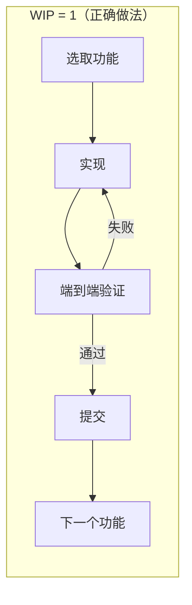
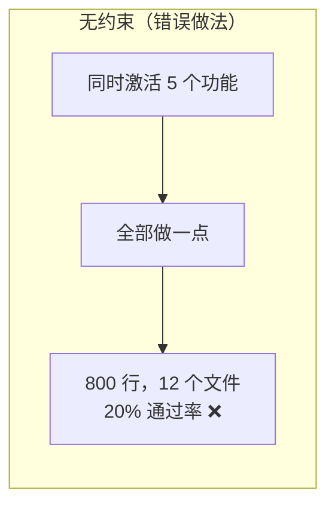

[English Version →](../../../en/lectures/lecture-07-why-agents-overreach-and-under-finish/)

> 本篇代码示例：[code/](https://github.com/walkinglabs/learn-harness-engineering/blob/main/docs/zh/lectures/lecture-07-why-agents-overreach-and-under-finish/code/)
> 实战练习：[Project 04. 用运行反馈修正 agent 的行为](./../../projects/project-04-incremental-indexing/index.md)

# 第七讲. 给 agent 划清每次任务的边界

## 这节课要解决什么问题

你让 Claude Code "给这个项目加上用户认证功能"，结果它同时开始改数据库 schema、写路由、改前端组件、还顺手重构了错误处理中间件。两个小时后你一看——12 个文件被修改，800 行新代码，但没有一个功能是端到端跑通的。这就是 AI 编码 agent 最典型的失败模式：**过度延伸（overreach）和不足完成（under-finish）同时发生**。

Anthropic 在 "Effective harnesses for long-running agents" 工程博客中明确指出：当提示太宽泛时，agent 倾向于"同时启动多件事"而非"先做完一件事"。OpenAI 在 Codex 工程实践中也发现，没有显式范围控制的任务，完成率会暴跌。这不是模型的问题——是你没有在 harness 里给它划清边界。

## 核心概念

- **过度延伸（Overreach）**：agent 在一次会话中激活的任务数量超过最优值。它不是主观判断，而是可量化的——同时做 5 个功能但 0 个跑通，就是 overreach。
- **不足完成（Under-finish）**：已启动的任务中，通过端到端验证的比例低于阈值。写了代码但没跑通测试，就是 under-finish。
- **WIP 限制（Work-in-Progress Limit）**：来自 Kanban 方法论。核心思想：限制同时在进行的任务数量。对于 agent，WIP=1 是最安全的默认值——做完一个再做下一个。
- **完成证据（Completion Evidence）**：一个任务从"进行中"变成"已完成"必须满足的可验证条件。没有这个，agent 会用"代码看起来没问题"代替"行为通过测试"。
- **范围表面（Scope Surface）**：一个 DAG 结构，每个节点是一个工作单元，边是依赖关系。状态只有四种：未开始、进行中、阻塞、已通过。
- **完成压力（Completion Pressure）**：harness 通过 WIP 限制和完成证据要求共同产生的约束力，迫使 agent 先完成当前任务再开始新任务。

## WIP=1 工作流





## 为什么会这样

### Agent 天生就想"多做一点"

大语言模型的训练数据里充满了"一个 PR 同时改多个东西"的代码模式。一个典型的 GitHub PR 可能同时包含功能实现、重构和文档更新。模型从这些数据中学到的默认行为就是"看到相关的事情就一起做了"。

这在人类世界也是问题——Steve McConnell 在《Rapid Development》中记录，范围蔓延是项目失败的首要原因。但人类至少有"我已经做得够多了"的直觉，agent 完全没有。生成下一个想法的成本对模型来说太低了——写一行"顺便把这个也改了"几乎不消耗额外 token，但每个额外的修改都会稀释 agent 的注意力。

Claude Code 的真实行为很说明问题。你让它"添加用户注册功能"，它很可能这样做：

1. 创建 User model
2. 写注册路由
3. 发现需要邮箱验证，于是加邮件服务
4. 看到密码需要加密，于是引入 bcrypt
5. 注意到错误处理不统一，于是重构全局错误中间件
6. 看到测试文件结构不清晰，于是重组目录结构

6 步之后，每一个都是半成品。没有端到端验证，代码之间耦合复杂，下一个会话来接手时会一脸懵。

### 注意力稀释的数学

这不是比喻，是数学。假设 agent 的上下文容量为 C，同时激活 k 个任务，每个任务平均获得 C/k 的推理资源。当 C/k 低于完成单个任务所需的最小阈值时，所有任务都做不完。

Anthropic 的实验数据直接支持这一点：使用"小下一步"策略（等价于 WIP=1）的 agent，任务完成率比使用宽泛提示的 agent 高 37%。更有意思的是，agent 生成的代码行数和实际完成的功能数量呈弱负相关——写得越多，完成得越少。

### Overreach 和 Under-finish 是共生关系

这两个问题不是独立的，而是互相加剧。overreach 导致注意力分散，注意力分散导致 under-finish，under-finish 留下的半成品代码又增加了系统复杂度，进一步导致下一个任务的 overreach。

用 Kanban 的语言说：Little 法则告诉我们 L = lambda * W。如果在制品数量 L 过大（同时做太多事），每个任务的前置时间 W 必然增加。对于 agent 来说，这意味着每个功能从开始到验证通过的时间被拉长，失败概率被放大。

## 怎么做才对

### 1. 强制 WIP=1

这是最直接有效的方法。在你的 harness 里，明确告诉 agent：**任何时刻只允许一个任务处于"进行中"状态。** 在 Claude Code 的 CLAUDE.md 或 Codex 的 AGENTS.md 里写：

```
## 工作规则
- 每次只做一个功能点
- 当前功能点端到端验证通过后，才能开始下一个
- 不要在实现功能 A 时"顺便"重构功能 B
```

### 2. 给每个任务定义显式的完成证据

完成不是"代码写完了"，而是"行为验证通过了"。在你的功能列表里，每个条目都要有验证命令：

```
F01: 用户注册
  验证: curl -X POST /api/register -d '{"email":"test@example.com","password":"123456"}' | jq .status == 201
  状态: passing
```

### 3. 把范围表面外部化

用一个机器可读的文件（JSON 或 Markdown）记录所有任务的状态。任何新会话都能直接读这个文件，知道：哪个任务在做？什么行为算完成？已经通过了什么验证？

### 4. 监控验证完成率

harness 应该持续跟踪 VCR（Verified Completion Rate）= 已通过验证的任务数 / 已启动的任务数。VCR < 1.0 时，阻止新任务启动。

## 实际案例

一个 8 个功能点的 REST API 项目，两种策略对比：

**无约束模式**：agent 在第一个会话同时启动 5 个功能。产出约 800 行代码，涉及 12 个文件。端到端测试通过率只有 20%——只有用户注册跑通了。其余 4 个功能：数据库 schema 建了但缺验证逻辑，路由定义了但返回格式错误。到第 3 个会话结束，8 个功能只完成 3 个。

**WIP=1 模式**：agent 在第一个会话只做用户注册。产出约 200 行代码，涉及 4 个文件。端到端测试 100% 通过。提交干净的、已验证的实现。到第 4 个会话结束，8 个功能完成 7 个（第 8 个因外部依赖被阻塞）。

结果：总代码量更少（800 行 vs 1200 行），但有效代码更多。完成率 87.5% vs 37.5%。

## 关键要点

- **WIP=1 是 agent harness 的默认安全设置**——做完一个再做下一个，不要试图并行。
- **完成证据必须是可执行的**——"代码看起来没问题"不算完成，"curl 返回 201"才算。
- **范围表面必须外部化为文件**——不能只在对话里说，必须在仓库里有机器可读的记录。
- **overreach 和 under-finish 是共生问题**——解决一个就解决了另一个。
- **"少做但做完"永远优于"多做但做半"**——agent 代码行数和功能完成率呈负相关。

## 延伸阅读

- [Effective harnesses for long-running agents - Anthropic](https://www.anthropic.com/engineering/effective-harnesses-for-long-running-agents) — Anthropic 工程博客，详细论述了"小下一步"策略
- [Harness Engineering - OpenAI](https://openai.com/index/harness-engineering/) — OpenAI 对 harness 工程的完整论述
- [Kanban: Successful Evolutionary Change - David Anderson](https://www.goodreads.com/book/show/1070822.Kanban) — WIP 限制的经典来源
- [Rapid Development - Steve McConnell](https://www.goodreads.com/book/show/125171.Rapid_Development) — 范围蔓延作为项目失败首要原因的实证数据

## 练习

1. **任务原子化练习**：选一个宽泛需求（如"实现用户管理系统"），把它拆成至少 5 个原子工作单元。每个单元写清楚：(a) 单一行为描述，(b) 可执行的验证命令，(c) 依赖关系。检查是否满足 WIP=1 的约束。

2. **对比实验**：在同一个项目上跑两次——一次不给约束，一次强制 WIP=1。比较：验证完成率、总代码行数、有效代码比例。

3. **完成证据审计**：回顾一个最近的 agent 运行结果，把每个代码变更分类为"已完成行为"、"未完成行为"或"脚手架"。给每个未完成行为补充缺失的验证命令。
