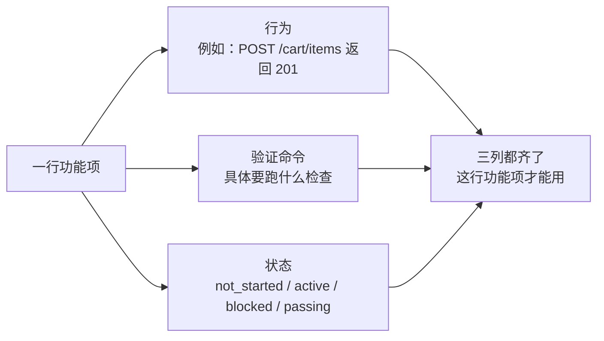
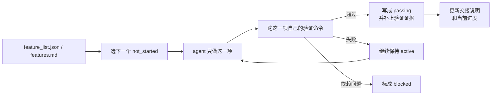

[English Version →](../../../en/lectures/lecture-08-why-feature-lists-are-harness-primitives/)

> 本篇代码示例：[code/](https://github.com/walkinglabs/learn-harness-engineering/blob/main/docs/zh/lectures/lecture-08-why-feature-lists-are-harness-primitives/code/)
> 实战练习：[Project 04. 用运行反馈修正 agent 的行为](./../../projects/project-04-incremental-indexing/index.md)

# 第八讲. 用功能清单约束 agent 该做什么

你让 agent 做一个电商网站，跑完之后它告诉你"做完了"。你打开代码一看——用户认证有了，但购物车的结算按钮点了没反应，支付流程根本没接上。问题是：你从来没告诉它"做完"的标准是什么，所以它用自己的标准——"代码写了不少，看起来挺完整"。

功能清单（feature list）在很多人眼里就是个备忘录——写下来怕忘了，写完扔在一边。但在 harness 的世界里，功能清单不是给人看的备忘录，而是整个 harness 的脊梁骨。调度器靠它选任务，验证器靠它判完成，交接器靠它生成报告。脊梁骨断了，全身都瘫。

Anthropic 和 OpenAI 都强调：**工件必须外部化**。功能状态必须是仓库里机器可读的文件，不能是对话里的非结构化描述。

## Agent 不知道"做完"是什么意思

Claude Code 和 Codex 都不会自动知道你心目中的"做完"是什么意思。你说"加一个购物车功能"，模型的理解可能是"写一个 Cart 组件和 addToCart 方法"。而你的意思是"用户能从浏览商品到下单支付完整走通"。

这个理解鸿沟在没有功能清单的情况下会持续存在。agent 用自己的隐式标准判断完成——通常是"代码没有明显的语法错误"。而你需要的是端到端的行为验证。就像你让朋友帮你买菜，说"买点水果"，他拎了一袋柠檬回来——他要的水果，你要的水果，不是一个水果。

看看这种常见的进度记录：

```
做了用户认证、购物车基本完成了、还需要做支付
```

新的 agent 会话看到这个记录，能回答以下问题吗？"基本完成"意味着什么？购物车通过了哪些测试？支付的阻塞条件是什么？答案都是"不知道"。就像你看病时跟医生说"我肚子疼，最近还行"，医生能开出什么药来？

结果是：新会话花 20 分钟推断项目状态，最终可能重复实现已完成的功能。Anthropic 的工程实践数据表明，好的进度记录可以减少 60-80% 的会话启动诊断时间。

## 功能状态机





## 核心概念

- **功能清单是 harness 原语**：它不是"可选的规划工具"，而是其他所有 harness 组件依赖的基础数据结构。就像数据库里的表结构——你不能说"要不我们省掉主键吧"，省掉了整个系统就散架了。
- **三元组结构**：每个功能项是 `(行为描述, 验证命令, 当前状态)` 的三元组。缺了任何一项，这个功能项就不完整。行为描述告诉 agent 做什么，验证命令告诉它怎么算做完，状态告诉它现在到哪了。
- **状态机模型**：每个功能项有四种状态——`not_started`、`active`、`blocked`、`passing`。状态转移由 harness 控制，不是 agent 想改就能改。
- **通过状态门控**：功能从 `active` 变成 `passing` 的唯一方式是验证命令执行成功。这是不可逆的——`passing` 了就不能退回去。就像考试及格了就是及格了，不能事后改成分数。
- **单一权威来源**：项目里关于"该做什么"的所有信息，必须从一个功能清单派生。不能出现功能清单和对话记录矛盾的情况。
- **反向压力**：还没通过的功能项数量就是 harness 对 agent 施加的压力。压力归零 = 项目完成。

## 为什么功能清单必须是"原语"

文档是给人看的，原语是给系统用的。文档可以被忽略，原语不能被绕过。

类比数据库的触发器约束和应用层的检查逻辑：前者由数据库引擎强制执行，任何 SQL 都无法跳过；后者依赖于应用代码的正确性，可能被意外绕过。功能清单作为 harness 原语，就是数据库级别的约束——agent 不能绕过它。

具体来说，功能清单服务四个 harness 组件：

1. **调度器**：读状态，选下一个 `not_started` 的功能。就像工厂的排产系统——看完订单才知道下一步做什么。
2. **验证器**：执行验证命令，判断是否允许状态转移。就像质检——不是你说合格就合格，得通过检验。
3. **交接报告器**：从功能清单自动生成会话交接摘要。就像换班时自动生成的交接表——不用手写，系统自己出。
4. **进度追踪器**：统计各状态分布，提供项目健康度指标。就像仪表盘——一眼看出项目走到哪了。

## 怎么做

### 1. 定义一个最小化的功能清单格式

不需要复杂的系统，一个结构化的 Markdown 或 JSON 文件就够了。关键是每个条目必须有三元组：

```json
{
  "id": "F03",
  "behavior": "POST /cart/items with {product_id, quantity} returns 201",
  "verification": "curl -X POST http://localhost:3000/api/cart/items -H 'Content-Type: application/json' -d '{\"product_id\":1,\"quantity\":2}' | jq .status == 201",
  "state": "passing",
  "evidence": "commit abc123, test output log"
}
```

### 2. 让 harness 控制状态转移

agent 不能直接把状态改成 `passing`。它只能提交验证请求，harness 执行验证命令，根据结果决定是否允许状态转移。这就是"通过状态门控"——不是你说考过了就考过了，得看成绩单。

### 3. 在 CLAUDE.md 里写清楚规则

```
## 功能清单规则
- 功能清单文件: /docs/features.md
- 每次只激活一个功能项
- 功能项验证命令必须通过才能标为 passing
- 不要修改功能清单的状态——由验证脚本自动更新
```

### 4. 粒度校准

每个功能项应该是"一次会话能完成"的范围。太粗了做不完，太细了管理开销大。"用户可以添加商品到购物车"是一个好粒度，"实现购物车"太粗了，"创建 Cart 模型的 name 字段"太细了。就像切牛排——不能整块啃，也不能切成肉沫。

## 实际案例

一个电商平台的开发任务，10 个功能项。对比两种追踪方式：

**备忘录模式**：agent 用非结构化笔记记录进度。3 个会话后，笔记变成了"做了用户认证和商品列表、购物车基本完成但还有 bug、支付没开始"。新会话需要 20 分钟推断状态，最终重复实现了已完成的功能。就像你的购物清单上写着"牛奶、面包、还有那个什么来着"——到超市了你还是不知道要买什么。

**脊梁骨模式**：每个功能项有明确的状态和验证命令。新会话读取功能清单，3 分钟内知道：F01-F05 是 `passing`，F06 是 `active`（正在做），F07-F10 是 `not_started`。直接从 F06 继续，零重复。

定量结果：使用结构化功能清单的项目，功能完成率比自由形式高 45%，零重复实现。

## 关键要点

- **功能清单是 harness 的脊梁骨**，不是给人看的备忘录。调度器、验证器、交接器都依赖它。
- **每个功能项必须有三元组**：行为描述 + 验证命令 + 当前状态。缺一项就不完整——就像三条腿的凳子少一条腿。
- **状态转移由 harness 控制**，agent 不能自己改状态。通过验证 = 唯一的升级路径。
- **功能清单是项目的单一权威来源**——任何关于"该做什么"的信息都从这里派生。
- **粒度控制在"一次会话能完成"的范围**。太粗做不完，太细管不过来。

## 延伸阅读

- [Building Effective Agents - Anthropic](https://www.anthropic.com/research/building-effective-agents) — 明确指出功能列表是控制 agent 执行范围的"核心数据结构"
- [Harness Engineering - OpenAI](https://openai.com/index/harness-engineering/) — 强调"将工件外部化"的原则
- [Design by Contract - Bertrand Meyer](https://www.goodreads.com/book/show/130439.Object_Oriented_Software_Construction) — 契约式设计原则，功能列表的理论基础
- [How Google Tests Software](https://www.goodreads.com/book/show/13563030-how-google-tests-software) — 测试金字塔和行为规格的工程实践

## 练习

1. **功能清单设计**：定义一个最小化的功能清单 JSON schema。包含：id、行为描述、验证命令、当前状态、证据引用。用它描述一个包含 5 个功能的真实项目。

2. **验证严格性对比**：选 3 个功能，分别设计"宽松"验证（如"代码无语法错误"）和"严格"验证（如"端到端测试通过"）。对比两种验证下的假阳性率。

3. **单一来源原则审查**：审查一个已有的 agent 项目，检查是否存在与功能清单矛盾的范围信息（对话里的隐式需求、代码里的 TODO 注释等）。设计一个方案，把所有信息统一到功能清单中。
