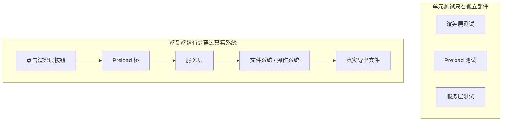
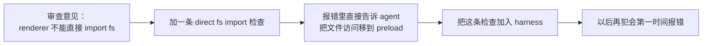

[English Version →](../../../en/lectures/lecture-10-why-end-to-end-testing-changes-results/)

> 本篇代码示例：[code/](https://github.com/walkinglabs/learn-harness-engineering/blob/main/docs/zh/lectures/lecture-10-why-end-to-end-testing-changes-results/code/)
> 实战练习：[Project 05. 让 agent 自己检查自己做的对不对](./../../projects/project-05-grounded-qa-verification/index.md)

# 第十讲. 跑通完整流程才算真正验证

你让 agent 给 Electron 应用加一个文件导出功能。它写了渲染进程组件、预加载脚本、服务层逻辑，每个组件的单元测试都通过了。agent 说"做完了"。你实际一点击导出按钮——文件路径格式不对、进度条没反应、大文件导出时内存泄漏。5 个组件边界缺陷，单元测试一个都没发现。

这就像一个合唱团排练——每个声部单独唱的时候都完美，但合在一起的时候，女高音比男低音快了半拍，伴奏的调子和主旋律差了半个音。每个部分都"对"了，但整体跑调了。

Google 的测试金字塔告诉我们：大量单元测试是基础，但如果你止步于此，就会系统性地漏掉组件交互问题。对于 AI 编码 agent 来说，这个问题更严重——agent 倾向于只跑最快的测试然后宣告完成。**只有端到端测试能证明系统级缺陷不存在**。

## 单元测试的盲区

单元测试的设计哲学是隔离——模拟依赖，专注被测单元。这个哲学使单元测试快速且精确，但也制造了系统性的盲区。就像合唱排练时每个声部戴着耳机对着伴奏唱——听着都挺好，但真正合在一起才发现问题：

**接口不匹配**：渲染进程传给预加载脚本的文件路径是相对路径，但预加载脚本期望绝对路径。各自的单元测试都用了 mock，都通过了。只有端到端跑通时才发现问题——就像两个声部各自练的时候都觉得节奏没问题，一合才发现一个用 4/4 拍一个用 3/4 拍。

**状态传播错误**：数据库迁移改了表结构，但 ORM 的缓存层还持有旧结构的缓存条目。单元测试每次都是全新的 mock 环境，不会暴露这种跨层状态不一致。就像换了一首歌的歌词，但有人还在唱旧版本。

**资源生命周期问题**：文件句柄、数据库连接、网络套接字的获取和释放跨越多个组件。单元测试为每个测试创建和销毁独立资源，不会暴露资源竞争或泄漏。就像排练时每个声部轮流用麦克风，但演出时所有声部同时上台——话筒不够用了。

**环境依赖性**：代码在测试环境（一切 mock）行为正确，在真实环境因配置差异、网络延迟、服务不可用而失败。就像排练厅里唱得好好的，到了户外音乐节风一吹话筒一啸叫就全乱了。

## 端到端测试不仅改变结果，还改变行为

这是很多人没意识到的一点：当 agent 知道它的工作要过端到端测试时，它的编码行为会改变。

1. **考虑组件交互**：写代码时会想"这个接口和上游怎么对接"，而不是只关注单个函数。就像知道最终要合在一起唱，练习的时候就会注意听其他声部。
2. **尊重架构边界**：有架构约束的系统里，端到端测试迫使 agent 遵守边界规则。就像乐谱上标注了"此处渐强"，你得跟着来。
3. **处理错误路径**：端到端测试通常包含故障场景，迫使 agent 考虑异常处理。就像排练时模拟了"话筒突然没声了"的情况，你知道该怎么做。

## 测试金字塔与审查反馈提升





OpenAI 在 Codex 工程实践中强调：**为 agent 写的错误消息必须包含修复指导**。不写 `"Direct filesystem access in renderer"`，而写 `"Direct filesystem access in renderer. All file operations must go through the preload bridge. Move this call to preload/file-ops.ts and invoke it via window.api."` 这把架构规则变成了自动修正的闭环。就像合唱排练时指挥不只说"你唱错了"，而是说"这里你快了半拍，听一下女低音的节奏，在第 32 小节进入"。

## 核心概念

- **组件边界缺陷**：组件 A 和 B 各自单元测试通过，但它们的交互产生了不正确的行为。这是端到端测试最擅长捕获的问题类型——合唱里各声部单独都对但合起来跑调的那种。
- **测试充分性梯度**：单元测试能检测的缺陷 <= 集成测试能检测的缺陷 <= 端到端测试能检测的缺陷。每往上一层，检测能力增强。
- **架构边界执行规则**：把架构文档里的规则（如"渲染进程不能直接访问文件系统"）变成可执行的自动化检查。从"写在纸上"变成"跑在 CI 里"。
- **审查反馈提升**：把重复出现的代码审查意见转化为自动化测试。每次发现重复问题就加一条规则，harness 会自动变强。就像合唱排练时指挥把常见的错误编成练习曲——下次再犯同样的错误，不用指挥说，练习曲自己就暴露了。
- **面向 agent 的错误消息**：失败信息不只是说"出了什么问题"，还要告诉 agent 具体怎么修。这把测试失败变成自我修正的反馈循环。

## 怎么做

### 0. 先定好架构边界，再写端到端测试

端到端测试的前提是系统有清晰的边界。如果架构是一团面条，端到端测试只会证明"这团面条整体能跑"，不会告诉你哪里违反了设计意图。就像合唱团如果连分声部都没分好，排练再多也是乱唱。

OpenAI 的经验：**对 agent 生成的代码库，架构约束必须是第一天就建立的早期前置条件，不是等团队规模大了再考虑的事。** 原因很直接——agent 会复制仓库中已有的模式，即使那些模式是不均匀的或次优的。没有架构约束，agent 会在每次会话中引入更多偏差。

OpenAI 采用了"分层领域架构"——每个业务领域被分成固定的层：Types → Config → Repo → Service → Runtime → UI。依赖方向严格向前，跨领域关注点通过显式的 Providers 接口进入。任何其他依赖都是禁止的，并且通过自定义 lint 机械执行。

关键原则：**执行不变量，不微管实现。** 比如要求"数据在边界解析"，但不规定用哪个库。错误消息要包含修复指导——不只是说"违规了"，而是告诉 agent 具体怎么改。

> 来源：[OpenAI: Harness engineering: leveraging Codex in an agent-first world](https://openai.com/index/harness-engineering/)

### 1. harness 必须包含端到端层

在你的验证流程里明确：对于涉及跨组件修改的任务，端到端测试通过是完成的前置条件：

```
## 验证层级
- 层级 1: 单元测试 (必须通过)
- 层级 2: 集成测试 (必须通过)
- 层级 3: 端到端测试 (涉及跨组件修改时必须通过)
- 跳过任何必须层级的任务 = 未完成
```

### 2. 把架构规则变成可执行检查

每条架构约束都应该有对应的测试或 lint 规则：

```bash
# 检查渲染进程是否直接调用 Node.js API
grep -r "require('fs')" src/renderer/ && exit 1 || echo "OK: no direct fs access in renderer"
```

### 3. 设计面向 agent 的错误消息

失败信息要包含三要素：什么出了问题、为什么、怎么修：

```
ERROR: Found direct import of 'fs' in src/renderer/App.tsx:12
WHY: Renderer process has no access to Node.js APIs for security
FIX: Move file operations to src/preload/file-ops.ts and call via window.api.readFile()
```

### 4. 建立审查反馈提升流程

每次在代码审查中发现新类型的 agent 错误，就把它变成自动化检查。一个月后你的 harness 会比月初强得多。就像合唱团的排练笔记——每次排练发现的问题都记下来，下次排练前先检查这些点。久而久之，常见错误越来越少，音乐越来越和谐。

## 实际案例

**任务**：在 Electron 应用中实现文件导出功能。涉及渲染进程 UI、预加载脚本文件系统代理、服务层数据转换。

**各声部单独唱（单元测试通过）**：渲染组件测试（通过，mock 文件操作）、预加载脚本测试（通过，mock 文件系统）、服务层测试（通过，mock 数据源）。agent 声明完成。

**合唱合在一起（端到端测试揭示的缺陷）**：

| 缺陷 | 描述 | 单元测试 | 端到端 |
|------|------|---------|--------|
| 接口不匹配 | 文件路径格式不一致 | 未检测 | 检测 |
| 状态传播 | 导出进度未通过 IPC 传回 UI | 未检测 | 检测 |
| 资源泄漏 | 大文件导出句柄未释放 | 未检测 | 检测 |
| 权限问题 | 打包环境权限不同 | 未检测 | 检测 |
| 错误传播 | 服务层异常未到 UI 层 | 未检测 | 检测 |

5 个缺陷全部被端到端测试捕获，单元测试一个都没发现。代价是测试时间从 2 秒增加到 15 秒——在 agent 工作流里完全可以接受。每个声部单独唱得再好，也比不上一次完整的合唱排练。

## 关键要点

- **单元测试对组件边界缺陷系统性盲视**——它们的隔离设计恰好使其无法检测交互问题。每个人唱得都对，不代表合唱不跑调。
- **端到端测试不仅检测缺陷，还改变 agent 的编码行为**——让它更关注集成和边界。
- **架构规则必须可执行**——不是写在文档里等人来看，而是每次提交自动检查。
- **错误消息要面向 agent 设计**——包含"怎么修"的具体步骤，形成自我修正闭环。
- **审查反馈提升让 harness 自动变强**——每个被捕获的缺陷类别都变成永久防线。

## 延伸阅读

- [How Google Tests Software - Whittaker et al.](https://www.goodreads.com/book/show/13563030-how-google-tests-software) — 测试金字塔模型的经典来源
- [Harness Engineering - OpenAI](https://openai.com/index/harness-engineering/) — 架构约束自动化执行的工程实践
- [Chaos Engineering - Netflix (Basiri et al.)](https://ieeexplore.ieee.org/document/7466237) — 主动注入故障验证系统弹性
- [QuickCheck - Claessen & Hughes](https://www.cs.tufts.edu/~nr/cs257/archive/john-hughes/quick.pdf) — 属性测试方法，介于示例测试和形式化验证之间

## 练习

1. **跨组件缺陷检测**：选一个涉及至少三个组件的修改任务。先只跑单元测试记录结果，再跑端到端测试。分析每个额外发现的缺陷属于哪种跨层交互问题。

2. **架构规则自动化**：选项目里的一条架构约束，把它变成可执行检查（含面向 agent 的错误消息）。集成到 harness 里，用基准任务验证效果。

3. **审查反馈提升**：从代码审查历史中找一个重复出现的意见类型，按五步流程转化为自动化检查。比较提升前后该类问题的出现频率。
