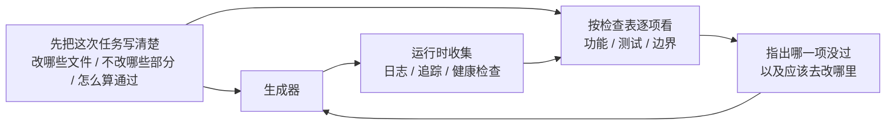

[English Version →](../../../en/lectures/lecture-11-why-observability-belongs-inside-the-harness/)

> 本篇代码示例：[code/](https://github.com/walkinglabs/learn-harness-engineering/blob/main/docs/zh/lectures/lecture-11-why-observability-belongs-inside-the-harness/code/)
> 实战练习：[Project 06. 搭建一套完整的 agent 工作环境](./../../projects/project-06-runtime-observability-and-debugging/index.md)

# 第十一讲. 让 agent 的运行过程可观测

你让 agent 做一个功能，它跑了 20 分钟，改了一堆文件，然后告诉你"做完了但有两个测试失败"。你问它为什么失败，它说"不太确定，可能是时序问题"。你问它改了哪些关键路径，它说"让我看看代码……"。

这不是 agent 能力不够，是你的 harness 没有给它装仪表盘。想象你在开一辆没有仪表盘的车——没有速度表、没有油量表、没有发动机故障灯。你能开，但你不知道开多快、还剩多少油、发动机是不是快爆了。技术再好的司机，蒙着眼也得出事。

**没有可观测性，agent 在不确定状态中做决策，评估变成主观判断，重试变成盲目摸索。** OpenAI 和 Anthropic 都将可靠性定义为证据问题——harness 必须以可指导下一步决策的形式暴露运行时行为和评估信号。

## 可观测性缺失的真实代价

当 harness 缺乏可观测性时，四类问题系统性出现：

**无法区分"正确"和"看似正确"**：一个函数在代码审查时看起来完全正确——语法对、逻辑通。但运行时因为边界条件处理错误，在特定输入下产生了不正确结果。只有运行时追踪能揭示实际执行路径偏离了预期。就像一个演员排练时台词全对了，但上台演出时灯光一打，表情和走位全都变了——你不看现场是发现不了的。

**评估变成玄学**：没有评分标准和验收条件时，评估者（人或 agent）依赖隐式假设。同一个输出，不同评估者可能给出截然不同的评价。质量评估不可复现。就像体操比赛没有评分标准——这个裁判觉得你的动作优雅，那个裁判觉得你落地不稳，谁说了算？

**重试变成盲猜**：agent 不知道为什么失败时，重试方向是随机的。它可能在错误的方向上反复尝试——修复了不相关的代码路径而忽略真正的故障根源。就像你开车发现车跑偏了，但你没有仪表盘——你猜是轮胎的问题换了轮胎，实际是方向盘的 alignment 出了问题。每次盲重试都消耗 token 和时间。

**会话交接信息断崖**：当未完成的工作移交给下一个会话时，缺乏可观测性意味着新会话必须从零诊断系统状态。Anthropic 的长期运行 agent 观察表明，这种重复诊断可能占会话总时间的 30-50%。就像换班司机上车发现没有交接记录——他得花半小时检查油量、胎压、发动机状态才能出发。

## Claude Code 的真实场景

想象一个使用"计划者-生成者-评估者"三角色工作流的 harness，执行"为应用添加暗色模式"任务。

**没有仪表盘**：计划者输出模糊描述。生成者根据模糊描述实现暗色模式，但和计划者的隐式预期不一致。评估者基于自己的隐式标准拒绝，但说不出具体哪里不对——"感觉不太对"。生成者基于模糊拒绝理由盲重试。循环 3-4 次，总耗时约 45 分钟，最终勉强产出。

**有完整仪表盘**：计划者输出冲刺合同——列明要改哪些组件、每个组件的验证标准、排除项（不处理打印样式）。生成者按合同实现。运行时可观测性记录每个组件的样式加载和应用过程。评估者用评分标准逐维度评估，附具体证据引用——"按钮颜色对比度不足（WCAG AA 标准 4.5:1，实测 2.1:1）"。一次迭代出高质量结果，总耗时约 15 分钟。

效率差 3 倍。区别只在可观测性——给车装上了仪表盘。

## 双层可观测性

可观测性不是"多打点日志"那么简单。它分两层，缺一不可：



**运行时可观测性**：系统层的信号——日志、追踪、进程事件、健康检查。回答"系统做了什么"。这是你车上的仪表盘——速度、油量、发动机温度。

**过程可观测性**：harness 决策工件的可见性——计划、评分标准、验收条件。回答"为什么这个变更应该被接受"。这是你的导航系统——不光知道现在在哪，还知道为什么走这条路。

## 核心概念

- **运行时可观测性**：系统层的信号——日志、追踪、进程事件、健康检查。回答"系统做了什么"。
- **过程可观测性**：harness 决策工件的可见性——计划、评分标准、验收条件。回答"为什么这个变更应该被接受"。
- **任务轨迹**：一个任务从开始到完成的完整决策路径记录，类似分布式系统中的请求追踪。agent 的每一步操作及其上下文都被记录。就像黑匣子——出了问题可以回放完整过程。
- **冲刺合同**：编码开始前协商的短期协议——明确任务范围、验证标准、排除项。是过程可观测性的核心工具。
- **评估评分标准**：把质量评估从主观判断变成基于证据的结构化评分。使不同评估者对同一输出产生相似结论。就像体操比赛的评分标准——有了它，十个裁判的分才不会差太远。
- **双层可观测性**：系统层和过程层同时设计、相互增强。运行时信号解释行为，过程工件解释意图。

## 为什么 agent 自己解决不了这个问题

你可能在想："agent 不能自己打日志吗？" 问题在于：

1. **agent 不知道它不知道什么**——它不会主动记录自己没意识到需要的信号。就像你不知道油箱快漏了的时候，你不会去看油量表——因为你压根不知道该看。
2. **日志格式不统一**——不同会话用不同的日志格式，无法做系统化分析。就像十个司机各写各的交接记录，格式都不一样，下一个司机看不懂。
3. **过程可观测性不是日志能解决的**——冲刺合同和评分标准是结构化的工件，需要 harness 层面的支持。不是多 print 几行就能搞定的。

## 怎么装仪表盘

### 1. 在 harness 里内置运行时信号采集

不要依赖 agent 自己打日志。harness 应该自动采集以下信号：

- **应用生命周期**：启动、就绪、运行、关闭各阶段状态
- **功能路径执行**：关键路径的执行记录，包括入口、检查点和出口
- **数据流**：数据在组件间的流转记录
- **资源利用**：异常的资源使用模式（如内存持续增长）
- **错误和异常**：完整的错误上下文，不只是错误消息

### 2. 实施冲刺合同

在每个任务开始前，生成者和评估者（可能是同一个 agent 的不同调用）协商一份合同——就像施工队开工前签的施工协议：

```markdown
# 冲刺合同: 暗色模式支持

## 范围
- 修改主题切换组件
- 更新全局 CSS 变量
- 添加暗色模式测试

## 验证标准
- 每个组件的视觉回归测试通过
- 主流程端到端测试通过
- 无样式闪烁 (FOUC)

## 排除项
- 不处理打印样式
- 不处理第三方组件暗色模式
```

### 3. 建立评估评分标准

把"好不好"变成可量化的评分——就像给体操比赛定评分标准：

```markdown
# 评分标准

| 维度 | A | B | C | D |
|------|---|---|---|---|
| 代码正确性 | 所有测试通过 | 主流程通过 | 部分通过 | 编译失败 |
| 架构合规 | 完全合规 | 轻微偏离 | 明显偏离 | 严重违反 |
| 测试覆盖 | 主流程+边缘 | 仅主流程 | 仅有骨架 | 无测试 |
```

### 4. 用 OpenTelemetry 标准化

为每个 harness 会话创建一个 trace，每个任务创建一个 span，每个验证步骤创建子 span。使用标准属性标注关键信息。这样可观测性数据可以和标准工具链（Jaeger、Zipkin）集成。

## Anthropic 的三 agent 架构实验

Anthropic 在 2026 年 3 月发布了一项系统性的 harness 实验。他们用三种架构跑同一个任务（"用 Web Audio API 做一个浏览器端 DAW"），记录了详细的阶段数据：

| Agent 和阶段 | 时长 | 成本 |
|------------|------|------|
| Planner（规划者） | 4.7 分钟 | $0.46 |
| Build 第 1 轮 | 2 小时 7 分钟 | $71.08 |
| QA 第 1 轮 | 8.8 分钟 | $3.24 |
| Build 第 2 轮 | 1 小时 2 分钟 | $36.89 |
| QA 第 2 轮 | 6.8 分钟 | $3.09 |
| Build 第 3 轮 | 10.9 分钟 | $5.88 |
| QA 第 3 轮 | 9.6 分钟 | $4.06 |
| **总计** | **3 小时 50 分钟** | **$124.70** |

三个 agent 各司其职，每个都有明确的可观测性角色：

**Planner（规划者）**：接收一段 1-4 句话的用户需求，扩展成完整产品规格。被要求"大胆设定范围"并且"专注于产品上下文和高层技术设计，而不是详细的技术实现"。原因是：如果 planner 过早指定了粒度技术细节且搞错了，错误会级联到下游实现。更好的做法是约束交付物，让 agent 在执行中自己找到路径。就像建筑设计师只画效果图和结构图，不规定每块砖怎么砌。

**Generator（生成者）**：按 sprint 逐个功能实现。每个 sprint 前和 evaluator 协商一份 sprint 合同——约定这个功能块"做完"的标准。然后按合同实现，自评后交给 QA。按合同施工，不按感觉施工。

**Evaluator（评估者）**：用 Playwright MCP 像用户一样点击运行中的应用，测试 UI 功能、API 端点和数据库状态。对每个 sprint 按四个维度评分——产品深度、功能性、视觉设计和代码质量。每个维度有硬性阈值，任一不达标则 sprint 失败，generator 收到详细反馈后修复。就像验收工程师拿着验收标准逐项检查——不达标就打回去重做。

QA 第 1 轮反馈的示例——"这是一个视觉上令人印象深刻的应用，AI 集成工作良好，但核心 DAW 功能有几个是展示性的，没有交互深度：剪辑不能拖拽/移动，没有乐器 UI 面板（合成器旋钮、鼓垫），没有视觉效果编辑器（EQ 曲线、压缩器仪表）"。这些不是边缘情况——它们是让 DAW 可用的核心交互。具体的、有证据的反馈，不是"感觉不对"。

Evaluator 不是一开始就这么强。早期版本会识别出合理的问题，然后说服自己这些问题不严重，最终批准工作。调校方式是：读 evaluator 的日志，找到它的判断和人类判断分叉的地方，更新 QA 的 prompt 解决那些问题。经过几轮这种开发循环，evaluator 的评分才变得合理。就像训练一个新验收工程师——一开始他太宽容，出了几次事故后学会了严格。

> 来源：[Anthropic: Harness design for long-running application development](https://www.anthropic.com/engineering/harness-design-long-running-apps)

## 关键要点

- **可观测性是 harness 的架构属性**——不是事后添加的功能，而是设计时必须考虑的核心能力。仪表盘不是可选配件，是出厂标配。
- **双层可观测性缺一不可**——运行时信号解释"发生了什么"，过程工件解释"为什么这样做"。速度表和导航系统各有各的用处。
- **冲刺合同前置对齐工作**——防止"生成者做了评估者因可预见原因立即拒绝的东西"。施工协议要在开工前签，不是完工后补。
- **评分标准让评估可复现**——不同评估者对同一输出产生相似评分。有了评分标准，十个裁判的分才不会差太远。
- **可观测性缺失导致 30-50% 的会话时间浪费在重复诊断上**。

## 延伸阅读

- [Observability Engineering - Charity Majors](https://www.honeycomb.io/blog/observability-engineering-book) — 现代可观测性工程的理论和实践框架
- [Dapper - Google (Sigelman et al.)](https://research.google/pubs/pub36356/) — 大规模分布式追踪的开创性实践
- [Harness Design - Anthropic](https://www.anthropic.com/engineering/harness-design-long-running-apps) — 引入冲刺合同和评估评分标准
- [Site Reliability Engineering - Google](https://sre.google/sre-book/table-of-contents/) — 可观测性在生产系统中的系统化应用

## 练习

1. **可观测性差距分析**：审查你当前的 harness，评估系统层和过程层可观测性。找出无法从现有信号区分的系统状态，提出补充方案。

2. **冲刺合同实践**：为一个真实任务写冲刺合同。让 agent 按合同执行，对比没有合同时的效率和质量差异。

3. **任务轨迹构建**：记录一个完整编码任务中 agent 的每一步操作。用 OpenTelemetry 语义约定标注。分析轨迹中的信息瓶颈——哪些步骤的决策缺乏足够的信号支持。
