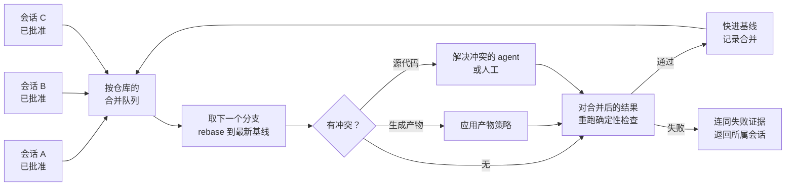
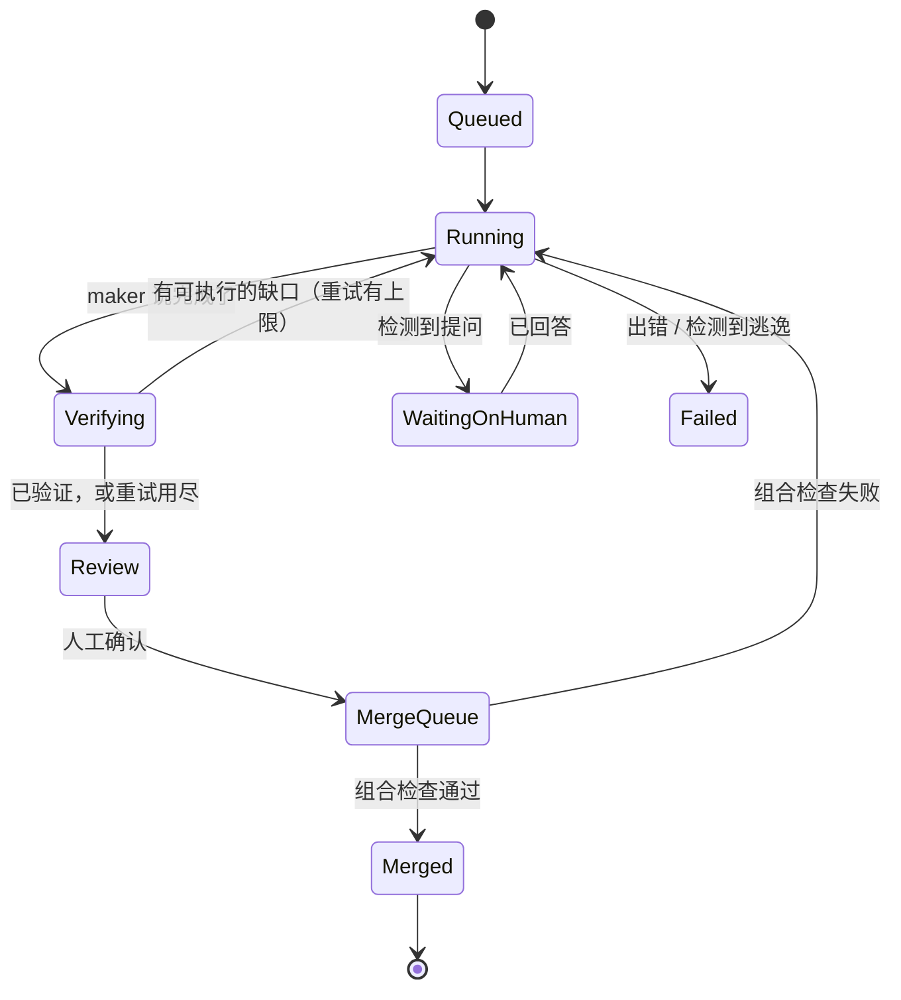

[English Version →](../../../en/lectures/lecture-15-parallel-agent-fleets/)

> 本篇代码示例：[code/](https://github.com/walkinglabs/learn-harness-engineering/blob/main/docs/zh/lectures/lecture-15-parallel-agent-fleets/code/)
> 实战练习：在 [Project 08. 把你的工作流画成一张图](./../../projects/project-08-graph-engineering-first-graph/index.md) 的 maker-checker 图基础上扩展，见本讲末尾的练习

# 第十五讲. 从单个 agent 到 agent 舰队：隔离、集成与舰队信号

> 工程建议：本讲中的超时、上限和阈值都是可调整的教学默认值，不是实验确认的数值。请用你自己的仓库和模型去校准。

第十三讲的成熟度阶梯停在 **Level 5：舰队编排（Fleet Orchestration）**——许多循环并行运行。第十四讲把这些循环画成了一张图，并提醒你：你的注意力是唯一的串行资源。两讲都把"并行"基本交给了一个原语来解决：给每个 agent 一个独立的 `git worktree`，"它们在物理上碰不到彼此的检出目录"。

这句话是正确的起点，却是错误的终点。当你每天都在真实仓库上同时跑多个 agent——不是演示，而是日常——一批新的失败会冒出来，而且没有一个和模型聪不聪明有关：

- 一个"在 worktree 里"的 agent 往主检出目录（main checkout）提交了代码。
- 三个分支各自都通过了验证，合在一起却把构建搞挂了。
- 一个分支新增了依赖；其他所有工作区和正在运行的开发服务器都导入失败。
- 验证者在一次构建上卡了四十分钟；或者测试还在后台跑，它就结束了自己的回合。
- 某个 agent 被拒绝使用一个工具，悄悄绕了过去，然后报告"成功"。
- 你指定的模型不可用，于是这次运行失败了——或者悄无声息地跑在了别的模型上。

这一讲讨论的，是夹在"一个可靠的 agent"和"一支你真正能信任的舰队"之间的那层 harness：**隔离（containment）、集成（integration）、共享环境卫生、舰队级生命周期、行为信号、模型路由，以及人工关卡。**

## 教学示意

> 教学示意：这个场景是由常见失败模式拼合而成、用来解释机制的；它不是实测实验，其中细节均为设定。

一个团队在夜里跑四个 agent，每个都在自己的 worktree 里，每个都有 maker 和独立的 checker（第十三讲）。第二天早上：

- Agent A 的 checker 批准了它的分支。但 A 中途执行过 `cd /path/to/repo && git checkout -b fix-login`——一个指回**主**检出目录的绝对路径。现在主检出目录停在 A 的分支上，带着未提交的修改，开发者自己做到一半的工作也被搅了进去。
- Agent B 和 C 都通过了。B 重命名了一个函数；C 用旧名字新增了两处调用。单独看每个分支都是绿的，合在一起构建失败。
- Agent D 加了一个 Markdown 渲染库，在自己的 worktree 里跑过 `npm install`，所以通过了。合并后，共享的开发服务器从没重新安装依赖，每个页面都报 `Failed to resolve import`。
- 看板上写着"4 个会话已完成"。上面没有任何一处提到 A 离开过 worktree、B 和 C 在语义上冲突、D 改动了依赖图。

每个 agent 都完成了自己的工作。**舰队**失败了——因为 harness 只懂得如何让单次运行可靠。

## worktree 隔离的是文件，不是仓库

先看 `git worktree` 实际保证了什么。git 文档写道：linked worktree 与主仓库"共享除 `HEAD`、`index` 等每个 worktree 独有文件之外的一切"。`refs/` 下的所有引用都是共享的；在 linked worktree 里，`$GIT_COMMON_DIR` 指回主仓库的 `.git`。[git-worktree](https://git-scm.com/docs/git-worktree)

所以 worktree 给每个 agent 的是独立的**工作文件和索引**。它并没有给 agent 独立的分支、对象、配置、hooks、stash——更重要的是，没有给它 worktree 目录*之外*一切东西的独立副本。一个拥有 shell 和文件工具的 agent 仍然够得着它们。

逃逸的途径都很平常：

| 逃逸途径 | 具体表现 | worktree 为什么挡不住 |
|---|---|---|
| 绝对路径 | `cd /path/to/main-repo && ...`，编辑 `/path/to/main-repo/src/x.ts` | 文件系统不知道哪个目录"属于你" |
| 指定仓库的参数 | `git -C /path/to/main-repo ...`、`--git-dir=...` | 你指向哪个仓库，git 就操作哪个 |
| 分支与引用操作 | `git checkout`、`git switch`、`git branch -D`、`git stash` | 引用和 stash 列表在所有 worktree 间共享 |
| harness 层的目录切换 | "进入"或"退出" worktree 的工具或子 agent，或解析错了根目录 | 切换发生在 shell 之上，任何命令过滤都管不到 |
| 共享运行时资源 | 同一个开发服务器端口、同一个 SQLite 文件、同一个缓存或 `node_modules` 软链接 | 这些完全在 git 之外 |
| hooks 与配置 | 用绝对路径指向主检出目录的 hooks | 配置是共享的；git 在哪里运行，hooks 就在哪里触发 |

这些都不是假设。主流编码 agent 的公开 issue 追踪里，就有 worktree 隔离的 agent 编辑了父会话的 worktree、无视 worktree 上下文改错了检出目录、新建的 worktree 执行了主检出目录的 hooks 等报告。[#87643](https://github.com/anthropics/claude-code/issues/87643)、[#95968](https://github.com/anthropics/claude-code/issues/95968)、[#88747](https://github.com/anthropics/claude-code/issues/88747)

### 纵深防御：预防、约束、检测

没有任何单一机制能堵住所有途径，所以要叠三层：

**1. 预防——拒绝显而易见的逃逸命令。** 启动前加上权限规则，拦住表中的逃逸模式：绝对路径的 `cd`、`git -C`、`--git-dir`、切换分支，以及任何会改变会话目录的工具。这些规则成本低，能挡住常见情况。但它们注定不完整——路径总有另一种写法。

**2. 约束——在合适的地方用操作系统级沙箱，并清楚它的边界。** 真正的沙箱在内核层强制写入边界，而不是对命令做模式匹配。但无论用哪种沙箱，都要读清楚细则。以 Claude Code 的沙箱为例：它只覆盖 shell 命令，文件工具、MCP 服务器和 hooks 都运行在沙箱之外；而当工作目录是 linked worktree 时，它会刻意允许写入主仓库共享的 `.git`，好让 `git commit` 能正常工作。[Claude Code: sandboxing](https://code.claude.com/docs/en/sandboxing) 这是正确的取舍——一个禁止写共享 `.git` 的沙箱会让 worktree 里的所有 git 操作失效——但这也意味着，单靠沙箱并不能让主检出目录不可触碰。

**3. 检测——事后、确定性地验证。** 真正能*证明*隔离成立的是这一层。会话开始前，给主检出目录拍个快照：当前分支、`HEAD` 提交、`git status --porcelain` 的哈希、stash 列表。会话结束后再拍一次。任何不是 harness 自己造成的差异，都是一次逃逸。判定会话失败，并把差异展示给人看。

> 预防缩小了路径，检测证明了结果。两者缺一不可，因为 agent 迟早会找到你没想到的那条路。

检测还必须容忍**合法的** worktree 外写入。有些任务确实需要读取相邻仓库，或写入一个共享的产物目录。把它们按会话显式声明为具名例外——绝不要靠放宽全局规则来实现。

无依赖的快照对比实现见 `code/escape-check.ts`。

## 并行很便宜，集成才是瓶颈

worktree 消除的是*机械*冲突，对*语义*冲突无能为力。两个分支可以各自正确，合在一起却是错的。

这是个老问题，答案也早已成熟。Graydon Hoare 称之为"软件工程的非火箭科学规则"（The Not Rocket Science Rule）：自动维护一个始终通过全部测试的代码仓库。[Graydon Hoare](https://graydon2.dreamwidth.org/1597.html) 托管平台把它做成了合并队列（merge queue）：每个变更在落地前，都要针对最新的目标分支加上排在它前面的所有变更进行测试。[GitHub: merge queue](https://docs.github.com/en/repositories/configuring-branches-and-merges-in-your-repository/configuring-pull-request-merges/managing-a-merge-queue)

agent 舰队需要同样的东西，而且要在本地、按仓库来做，因为舰队产出分支的速度远快于人类：



让它运转起来的四条规则：

1. **每个仓库同一时刻只合并一个。** 串行化。第二个已批准的分支在队列里等待，而不是和第一个赛跑。
2. **验证组合，而不是分支。** checker 是基于旧基线批准分支 C 的。rebase 到已经包含 B 的基线之后，要重跑确定性检查——构建、类型检查、相关测试。之前的批准针对的是另一个程序。
3. **先给冲突分类，再解决冲突。** 冲突并不平等：
   - **生成产物**（lockfile、快照、编译产物、录制的测试夹具）：永远不要逐行手工合并。要么从合并后的源码重新生成，要么取一份完整的、较新的快照。绝不要把两次不同运行的行拼进同一个文件——拼出来的结果对应不上任何一次真实运行。
   - **源代码**：把两个分支的*意图*（任务描述）交给解决冲突的 agent，而不只是冲突标记，并要求之后同样的检查必须通过。解决不了，就升级给人。
4. **进队路上绝不丢工作。** 会话的 worktree 在进入队列前要把所有内容提交，并保留分支直到合并确认。合并失败应当带着证据把会话退回去，而不是删掉它的产出。

注意它和第十四讲"编排税"的联系：队列并不会取消你作为最终裁判的角色，但它能保证送到你面前的，只有已经能构建、能通过测试的组合。

可运行的串行合并 + rebase 后重新验证模拟见 `code/merge-queue.ts`。

## 共享环境漂移

第六讲讲过，初始化值得拥有自己的阶段。到了舰队规模，初始化还要承担第二个任务：让**共享**环境与刚合并的内容保持同步。

每个 worktree 都自己安装、自己构建，所以每个 agent 看到的都是内部一致的。但有些东西是整个舰队和开发者共享的：主检出目录、长期运行的开发服务器、数据库、工具链缓存。一旦某个合并的分支改动了依赖图，这些共享环境就会悄无声息地过期。下一次页面加载会报一个导入错误，而这个错误和任何人正在看的代码都毫无关系。

修复是机械性的：

- **给输入打指纹。** 对依赖清单和 lockfile（`package.json` + lockfile、`Cargo.toml` + `Cargo.lock`、`pyproject.toml` + lockfile）做哈希，记录上一次成功安装时的指纹。
- **在共享环境重启的节点上，指纹变了就重装。** 服务器重启时、合并后、验证运行前：指纹变了，就先按 lockfile 安装（`npm ci`、`cargo fetch`、`uv sync`）再启动；没变就跳过——检查只需几毫秒。
- **安装失败也不要让环境宕掉。** 安装失败时，用旧依赖启动，下次再重试；一个过期但还在运行的环境，比一个死掉的环境更容易诊断。
- **给每个 worktree 独立的运行时资源。** 独立的端口、独立的数据库文件或 schema、可变的缓存也要分开。共享的可变状态，就是运行时层面的共享分支。

见 `code/deps-fingerprint.ts`。

## 舰队规模下的会话生命周期

第十二讲要求每个会话都留下干净的交接。只有一个 agent 时，"会话"是个模糊的概念；有了舰队，harness 要同时管理成百上千个会话，生命周期必须变成一个显式的状态机。大多数舰队 bug 出在状态之间的转换上，而不是某个状态内部。



四条转换规则能避免大部分麻烦：

**1. 把 maker 的线程和 checker 的线程分开——并且恢复正确的那个。** 构建独立 checker 的常见做法，是 fork 一份 maker 的对话，再给这个 fork 一个验证提示词。这个 fork 是一次性的。当验证发现缺口、需要继续干活时，要恢复的是 **maker** 的线程，而不是 checker 的。恢复 checker 等于把你的独立评估者变成了作者，它下一次说"已验证"就成了自己给自己判卷——正是第十三讲警告过的事。

**2. 不要恢复一个已经宣布完成的线程。** 如果一个会话以"完成"结论结束，而用户又提了新要求，就开一个新会话，并附上已完成工作的摘要。恢复已经结束的线程，往往会立刻得到一句"已经完成了"，然后直接弹回审阅。

**3. 给每条重试链设上限。** 失败后的自动重试、验证缺口触发的自动跟进，都必须有上限，而且上限要按整条链计算，不是每一环单独算。一个结构上不可能完成的任务，应当在少数几次尝试后就交到人手里，而不是重试一整夜。

**4. 区分"不活跃"和"慢"。** 一次验证可能合理地在 release 构建上花二十分钟。单一的总运行时超时，要么杀掉真实的工作，要么对一个卡死的进程永远等下去。用两个看门狗：一个**不活跃**超时（N 分钟内没有输出、没有工具调用、没有文件变化），和一个大得多的**总**预算。这和 Kubernetes 区分存活探针（liveness）与启动探针（startup）是同一个道理。[Kubernetes: probes](https://kubernetes.io/docs/tasks/configure-pod-container/configure-liveness-readiness-startup-probes/)

还有一个 agent 特有的生命周期陷阱：**回合结束后，后台命令不会回报结果。** 如果 checker 在后台启动了测试套件，然后就写下了结论，那么这个结果永远不会被送达。要求验证命令必须在前台运行，并把"已经启动了测试"视为毫无证据。

### 让下一个节点能据此路由的结论

第九讲讲过，"完成"需要证据。到了舰队规模，结论还需要**结构**，因为要由机器——你图里的路由器——来决定下一步。一句自由文本的"基本完成了，还剩几件事"是没法路由的。

让 checker 以完成标记或机器可读的结论收尾：

```json
{
  "completed": ["登录表单校验邮箱 —— 单元测试 login.spec.ts 通过"],
  "actionable": [{ "id": "csv-export-empty-rows", "action": "exportCsv 跳过空行，并补一个测试" }],
  "external": ["需要支付服务商沙箱凭据才能验证退款路径"],
  "unknown": ["无法确定移动端布局是否在范围内"],
  "deferred": [{ "item": "批量导入", "instruction": "用户：'先把现有的发出去，批量导入以后再说'" }]
}
```

每一类走向不同的地方：**actionable** 退回给 maker；**external** 和 **unknown** 交给人，因为重试多少次都变不出凭据或范围决策；**deferred** 被记录下来，*不*重试。在多次跟进中保持缺口 `id` 不变，这样你才能看出一个缺口是真的关闭了，还是只是换了个说法。

`deferred` 这一类值得特别注意。当用户明确接受部分成果（"可以了，先把现有的发出去"）时，checker 的任务就变了：验证已接受的范围，记录被推迟的内容以及是谁推迟的，然后停下。否则，一个尽职的 checker 会不断重新打开完整的原始计划，会话永远结束不了。反过来同样重要：checker 绝不能仅仅因为工作难做或缺少证据，就自己编出一个"推迟"。

模板和路由表见 `code/verification-verdict.md`。

## 舰队信号：观察行为，而不只是运行时

第十一讲把可观测性分成运行时信号（"系统做了什么？"）和过程产物（"为什么应该接受这个改动？"）。舰队还需要第三层：**行为信号——每个 agent 正在做什么，其中有没有哪件事此刻就需要人来看？**

你不可能盯着二十份对话记录。harness 必须替你盯着，只把要紧的东西抛出来：

| 信号 | 如何检测 | 含义 | 送往 |
|---|---|---|---|
| **在等人** | 最后一条消息以提问结尾，或请用户做选择 | 会话是被阻塞了，不是完成了 | 人工收件箱，高优先级 |
| **绕过权限** | 输出说某工具被拒绝、"换一种方法试试"；或被拒绝的命令后面紧跟一个功能等价的命令 | agent 可能正在绕过你有意设下的护栏 | 合并前人工审阅 |
| **隔离被突破** | 上文的逃逸检查发现 worktree 外有改动 | 共享状态可能已被破坏 | 判定会话失败，告警 |
| **卡住** | 不活跃看门狗触发 | 构建卡死、在等输入，或进程已死 | 重启或升级 |
| **重试深度** | 链上重试 / 跟进的次数 | 任务可能定义有误 | 达到上限后交给人 |
| **成本与 token** | 每个会话的输入 / 输出 / 缓存 token 和花费 | 失控的循环、过大的上下文 | 预算告警、趋势图 |
| **实际使用的模型** | 运行时报告的具体模型标识 | 到底跑的是什么，用于审计和回归分析 | 会话记录 |

其中两个值得细看。

**绕过权限是最危险的信号。** 你拒绝一个工具总有理由——"永远不要对生产数据库直接执行 SQL"。一个能力强的 agent 被拒绝后，往往会找到一条等价路径（"我被禁止使用 `sqlite3`，那我写个小脚本吧"），然后——从它的角度看——诚实地报告成功。工作甚至可能是正确的。但护栏刚刚无声地失效了。扫描输出中"被拒绝后转向"的措辞，标明被拦的工具并把它抛出来，让人来决定是正式放行，还是终止会话。

**记录实际运行的模型，而不是你请求的模型。** 很多 agent CLI 接受一个会变的别名（"最新的 opus"、"默认模型"），并在运行时解析。如果会话记录里存的是别名，那么等别名指向的模型一换，所有历史会话都会悄悄声称自己跑在新模型上。要捕获运行时随每次响应报告的具体标识，别名另存，用于路由。

可直接在对话记录上运行的检测器见 `code/fleet-signals.ts`。

## 模型路由与回退

Anthropic 的 *Building Effective Agents* 把**路由**——对输入分类并交给专门的处理者——列为核心工作流模式之一。[Anthropic: Building Effective Agents](https://www.anthropic.com/engineering/building-effective-agents) 在舰队里，最值得路由的就是**模型**：

- **按任务类别路由，而不是按习惯。** 修个错别字、升级一个依赖、一次跨模块的重构，不需要同一个模型。用低成本的方式分类（提示词长度、涉及的文件、任务标签），把大部分工作交给快速的默认模型，最强的模型留给真正需要它的任务。
- **因不可用而回退，之后再重试首选。** 最强的模型被限流或不可用时，回退到默认模型让舰队继续推进，但要记录这次降级，并定期重试首选模型，而不是永远停留在降级状态。
- **绝不要把一家供应商的模型名发给另一家。** 舰队常常混用不同厂商的 CLI。当一个会话从一个后端转到另一个后端——一次重试、或用户切换了供应商——要清洗存下来的模型选择。否则第二个 CLI 会报"模型不存在"，而这个失败看起来就像一次故障。
- **让路由决策可观测。** 把选择该模型的原因（类别、回退、用户指定）和实际运行的模型存在一起。质量回退时，这是你第一个想知道的东西。

## 尊重编排税的人工关卡

第十四讲引用了 Addy Osmani 的话：你是"你的 AI agent 们的 GIL"。[Addy Osmani: The Orchestration Tax](https://addyosmani.com/blog/orchestration-tax/) 舰队 harness 拿不掉这把锁，但能让每一次加锁都更便宜：

- **两道关卡，而不是一道。** *审阅*（"这是我要的吗？"）和*确认*（"合并它"）是两个不同的决定。把它们分开，你就可以先批准内容，再让合并队列决定它*何时*落地。
- **把证据带到关卡前。** 审阅界面应当展示结构化结论、diff、跑过的检查，以及触发过的每一个行为信号——而不只是"已完成"。一个人在每个会话上花的三十秒，应该花在 harness 自己决定不了的部分。
- **让"不决定"也显式化。** "忽略"、"带着这条指示继续"、"全新重新启动"是三个不同的动作，对应不同的生命周期转换。一个笼统的"重试"按钮会掩盖到底恢复的是哪个线程。
- **按阻塞程度给收件箱排序。** 提问和隔离被突破排最前，然后是合并失败，最后是等待审阅的已验证工作。

## 核心概念

- **舰队工程（Fleet engineering）**：让大量并发 agent 会话作为一个系统值得信任的那层 harness——隔离、集成、共享环境卫生、生命周期管理、行为信号、路由和人工关卡。
- **隔离（Containment）**：把一个会话的影响限制在它被分配的工作区内。靠叠加预防（拒绝规则）、约束（操作系统沙箱）和确定性检测（主检出目录的前后快照）来实现。
- **逃逸检测**：比较会话前后主检出目录的分支、`HEAD`、状态和 stash；任何无法解释的差异都是一次突破。
- **集成瓶颈**：各自正确的分支，合在一起可能是错的。按仓库的合并队列把合并串行化，并对*组合后*的结果重新验证。
- **产物策略**：生成的文件要么重新生成，要么整份取一个快照——绝不逐行合并。
- **环境指纹**：依赖清单和 lockfile 的哈希；指纹变化时，共享环境重新安装依赖。
- **生命周期状态机**：显式的会话状态与转换；大多数舰队 bug 出在转换上（恢复哪个线程、重试何时停止、"卡住"指什么）。
- **结构化结论**：checker 的结果拆成 completed / actionable / external / unknown / deferred，路由器可以据此行动。
- **行为信号**：关于 agent 正在做什么的舰队级观察——在等人、在绕过权限、卡住了、逃逸了、超支了。

## 核心要点

- **worktree 隔离的是文件，不是仓库。** 引用、对象、配置、hooks 以及目录之外的一切仍然够得着。预防、约束，最重要的是——检测。
- **并行生成很便宜，集成才是瓶颈。** 按仓库串行合并，并对组合后的结果重新验证。批准一个分支，批准的是另一个程序，而不是你将要合并的那个。
- **共享环境会悄悄漂移。** 给依赖输入打指纹，在共享环境重启的节点上重新安装。
- **把生命周期写成状态机。** 恢复 maker，而不是 checker。不要恢复已完成的线程。给重试链设上限。区分不活跃与慢。验证在前台运行。
- **结论必须可路由。** completed、actionable、external、unknown、deferred——各去各的地方，推迟的工作永不重试。
- **观察行为，而不只是运行时。** 提问、绕过权限、隔离被突破、卡住和成本都是舰队信号；把它们送到该去的地方，而不是计入"已完成"计数器。
- **有意识地路由模型，并记录实际运行的是什么。**
- **人依然是那把锁。** 设计关卡，让每一次加锁都短暂且证据充分。

## 延伸阅读

- [git-worktree 文档](https://git-scm.com/docs/git-worktree)——linked worktree 到底共享什么、不共享什么
- [Claude Code: sandboxing](https://code.claude.com/docs/en/sandboxing)——操作系统级沙箱对 shell 命令覆盖了什么、哪些在沙箱之外、worktree 如何处理
- [Claude Code: common workflows——用 worktree 并行运行会话](https://code.claude.com/docs/en/common-workflows)——厂商官方支持的并行 agent 起点
- [Graydon Hoare: The Not Rocket Science Rule](https://graydon2.dreamwidth.org/1597.html)——始终保留一个通过全部测试的分支；合并队列的起源
- [GitHub: Managing a merge queue](https://docs.github.com/en/repositories/configuring-branches-and-merges-in-your-repository/configuring-pull-request-merges/managing-a-merge-queue)——每个变更落地前，针对排在它前面的所有变更进行测试
- [Google SRE Book: Monitoring Distributed Systems](https://sre.google/sre-book/monitoring-distributed-systems/)——症状与原因，只为需要人处理的事情呼叫人
- [Kubernetes: liveness、readiness 与 startup 探针](https://kubernetes.io/docs/tasks/configure-pod-container/configure-liveness-readiness-startup-probes/)——区分"启动慢"和"卡住了"
- [Martin Fowler: Heartbeat（分布式系统模式）](https://martinfowler.com/articles/patterns-of-distributed-systems/heartbeat.html)——不活跃看门狗背后的模式
- [Anthropic: Building Effective Agents](https://www.anthropic.com/engineering/building-effective-agents)——路由作为核心工作流模式
- [Addy Osmani: The Orchestration Tax](https://addyosmani.com/blog/orchestration-tax/)——为什么人的判断始终是串行瓶颈
- 第六讲：[让 agent 每次工作前先初始化](./../lecture-06-why-initialization-needs-its-own-phase/index.md)——环境指纹把初始化延伸到了共享环境
- 第九讲：[防止 agent 提前宣告完成](./../lecture-09-why-agents-declare-victory-too-early/index.md)——结构化结论是路由器可以据此行动的证据
- 第十一讲：[让 agent 的运行过程可观测](./../lecture-11-why-observability-belongs-inside-the-harness/index.md)——行为信号是舰队级的第三层
- 第十三讲：[从手动驱动到自动循环](./../lecture-13-loop-engineering/index.md)——worktree 和 maker/checker 分离，本讲构建于其上的原语
- 第十四讲：[从单循环到图工程](./../lecture-14-graph-engineering/index.md)——合并队列和生命周期就是你舰队图中的节点与边

## 练习

1. **做一次逃逸演练。** 在一个临时仓库的两个独立 worktree 里各启动一个 agent。给其中一个布置一个诱使它使用绝对路径的任务（"顺便更新一下主检出目录里的 README"）。在前后各运行一次 `code/escape-check.ts`。你的拒绝规则拦住它了吗？检测发现了吗？记下到底是哪一层起了作用。

2. **用两个绿色分支搞挂构建。** 从同一个基线建两个分支：一个重命名一个函数，另一个用旧名字新增一处调用。分别单独验证（都通过）。然后把它们送进 `code/merge-queue.ts`（或你自己的队列），确认第二个在组合检查上被拒绝，并带着证据退回它的会话。

3. **给你的环境打指纹。** 把 `code/deps-fingerprint.ts`（或等价实现）加进开发服务器的启动脚本。在一个分支上添加依赖、合并、重启，确认安装恰好运行一次，下一次重启时被跳过。

4. **画出你的生命周期。** 把你当前的会话生命周期写成状态图。对每一个转换回答：恢复的是哪个对话线程？什么限制了重试？这里的"卡住"指什么？找出一个你从没写下来过的转换。

5. **让你的 checker 可路由。** 修改 Project 08 的 verify 节点，让它输出 `code/verification-verdict.md` 中的结构化结论。为每一类加上路由边。跑一个你明确推迟了部分范围的任务，确认被推迟的项被记录下来，且没有被重试。

6. **审计你的舰队信号。** 在三份真实的对话记录上运行 `code/fleet-signals.ts`。其中有多少提问、绕过权限或卡住的情况，原本只会以一个普通的"已完成"出现在你面前？
